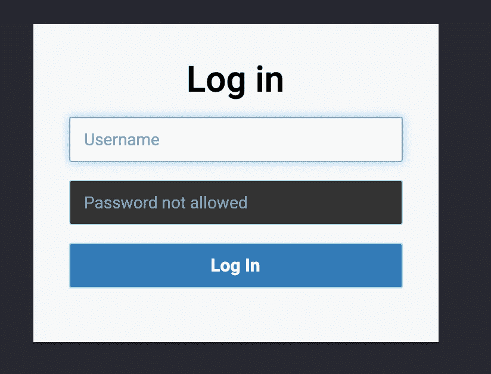
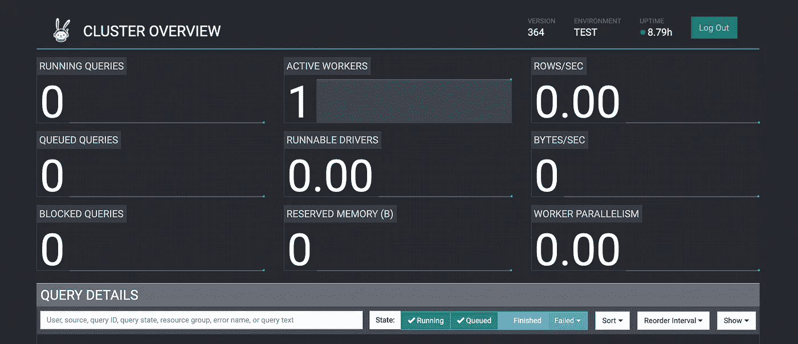
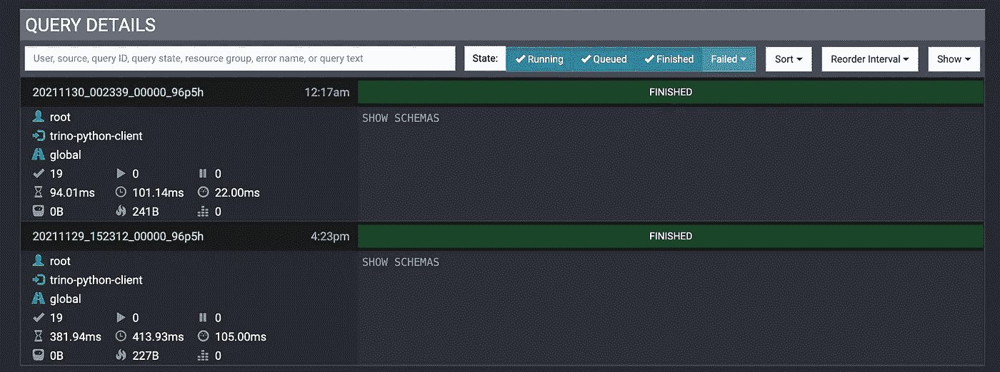

# Trino 查询引擎入门

> 原文：<https://towardsdatascience.com/getting-started-with-trino-query-engine-dc6a2d027d5?source=collection_archive---------4----------------------->

## 数据库ˌ资料库

## 关于如何安装 Trino、将其连接到 SQL server 以及编写简单 Python 客户端的分步教程。


赫耳墨斯·里维拉在 [Unsplash](https://unsplash.com?utm_source=medium&utm_medium=referral) 上拍摄的照片

[Trino](https://trino.io/) 是一款用于大数据分析的分布式开源 SQL 查询引擎。它可以运行分布式和并行查询，因此速度非常快。Trino 可以在内部和云环境中运行，如 Google、Azure 和 Amazon。

在本教程中，我描述了如何在本地安装 Trino，将其连接到 MySQL 数据库(由 XAMPP 提供)，并连接一个简单的 Python 客户端。Trino 官方文档可在[此链接](https://trino.io/docs/current/index.html)找到。

# 1 配置 Trino 搜索引擎

Trino 通常由一群机器组成，有一个协调者和许多工人。所有工作人员都连接到协调器，协调器为客户机提供访问点。

在安装 Trino 之前，我应该确保运行 64 位机器。然后我可以继续安装 Python 和 Java:

*   Python ≥ 2.6
*   JDK，由 [Azul Zulu](https://www.azul.com/) 发行(推荐)

一旦我安装了前面的需求，我就可以下载 [Trino 搜索引擎](https://repo1.maven.org/maven2/io/trino/trino-server/364/trino-server-364.tar.gz)并将其解包。在使用 Trino 之前，我必须对它进行配置。

在解压后的目录中，我创建了另一个名为`etc`的目录，它将包含所有的配置文件。有三个主要的配置文件:

*   `config.properties`—Trino 服务器的配置文件
*   `jvm.config` —用于启动 Java 虚拟机的命令行选项
*   `node.properties` —每个节点的具体配置。

`etc`文件夹还应该包含另一个名为`catalog`的文件夹，其中包含所有数据源(即连接器)的列表。所有可用连接器的列表可在[此链接](https://trino.io/docs/current/connector.html)获得。

## 1.1 配置属性

服务器的最低配置如下:

```
coordinator=true
node-scheduler.include-coordinator=true
http-server.http.port=8080
query.max-memory=5GB
query.max-memory-per-node=1GB
query.max-total-memory-per-node=2GB
discovery.uri=http://127.0.0.1:8080
```

在前面的例子中，参数`node-scheduler.include-coordinator=true`指定同一个主机既充当协调者又充当工作者。如果我想为协调者和工作者使用不同的机器，我不会使用前面的参数，而是为协调者使用`coordinator=true`，为每个工作者使用`coordinator=false`。

在前面的示例中，我还指定了发现 URI，即 HTTP 服务器可用的地址。在我的例子中，我利用了本地地址。

其他参数指定最大内存使用量。

## 1.2 jvm .配置

该文件包含用于运行 Java 虚拟机的命令行选项。此文件的一个很好的例子可能是下面这个:

```
-server
-Xmx16G
-XX:-UseBiasedLocking
-XX:+UseG1GC
-XX:G1HeapRegionSize=32M
-XX:+ExplicitGCInvokesConcurrent
-XX:+ExitOnOutOfMemoryError
-XX:+HeapDumpOnOutOfMemoryError
-XX:-OmitStackTraceInFastThrow
-XX:ReservedCodeCacheSize=512M
-XX:PerMethodRecompilationCutoff=10000
-XX:PerBytecodeRecompilationCutoff=10000
-Djdk.attach.allowAttachSelf=true
-Djdk.nio.maxCachedBufferSize=2000000
```

## 1.3 节点.属性

该文件包含每个节点的基本配置，包括机器集群的名称(`node.environment`)、存储数据的目录(`node.data`)和节点 id ( `node.id`)

```
node.environment=name_of_cluster
node.id=ffffffff-ffff-ffff-ffff-ffffffffffff
node.data-dir=/path/to/data/folder
```

## 1.4 目录

该文件夹包含 Trino 开发的所有连接器。连接器包含连接外部存储引擎所需的所有信息，比如 MySQL 服务器、MongoDB、Elastic Search 等等。每个连接器应该与一个单独的配置文件相关联，名为`connector_name.properties`(例如`mysql.properties`)。有关每个连接器的详细信息，请查看[文档](https://trino.io/docs/current/connector.html)。

在本文中，我配置了一个 MySQL 连接器。我创建了一个名为`mysql.properties`的文件，其最小配置如下:

```
connector.name=mysql
connection-url=jdbc:mysql://localhost:3306
connection-user=root
connection-password=my_password
```

在我的例子中，我利用了 XAMPP 提供的 MariaDB 服务器。效果非常好！😄

# 2 运行 Trino 搜索引擎

现在，一切都准备好运行了。假设 MySQL 服务器已经在运行，Trino 服务器可以以两种方式启动，后台，作为一个单独的守护进程，或者前台。

要在后台运行服务器，请进入 trino 主目录并运行以下命令:

```
bin/launcher start
```

要在前台运行服务器，请从 trino 主目录运行以下命令:

```
bin/launcher run
```

这种最后启动方式的好处是，如果有一些问题，我可以很容易地识别出来。出于这个原因，我更喜欢在前台启动服务器。

现在可以查询服务器了。

我可以从浏览器访问一些服务器信息，地址如下:

```
[http://127.0.0.1:8080](http://127.0.0.1:8080/ui/login.html)
```

浏览器显示以下登录页面:



作者图片

我可以输入在`mysql.properties`文件中定义的用户名和密码。

然后，我应该能够看到下面的控制台，它显示了集群概述，以及关于查询和工作者的信息:



作者图片

# 3 Python 客户端

可以编写不同的 Trino 客户端来查询 Trino DB，如[官方文档](https://trino.io/docs/current/client.html)中所述。在本教程中，我将描述如何为 Trino 实现一个简单的 Python 客户端。

我利用了`trino`包，它可以如下安装:

```
pip3 install trino
```

这个包的官方文档可以在[这个链接](https://github.com/trinodb/trino-python-client)找到。

客户端的代码非常简单:

首先，我通过`trino.dbapi.connect()`函数定义连接参数，其中我还指定了要使用的目录(在我的例子中是`mysql`)。然后，我连接并执行一个简单的查询，它显示了我的 SQL server 中包含的所有表。

作为要传递给`cur.execute()`函数的字符串，我可以编写任何 SQL 查询。

运行脚本后，我可以在浏览器中返回 Trino 控制台。如果我单击底部菜单的 Finished 按钮，我会得到一些关于上一个查询的信息:



作者图片

# 摘要

在本文中，我描述了如何配置和运行 Trino 搜索引擎的基本配置，以及连接到它的简单 Python 脚本。

Trino 的主要优势是可以运行分布式查询，从而使得非常快速地查询大数据成为可能。

如果你已经走了这么远来阅读，对我来说今天已经很多了。谢谢！你可以在[这篇文章](https://alod83.medium.com/which-topics-would-you-like-to-read-c68314dc6813)里读到更多关于我的内容。

# 参考

*   [什么是分层数据](https://www.tibco.com/reference-center/what-is-hierarchical-data)？
*   [修改前序树遍历](https://gist.github.com/tmilos/f2f999b5839e2d42d751)
*   [递归公用表表达式概述](https://mariadb.com/kb/en/recursive-common-table-expressions-overview/)

# 相关文章

<https://alod83.medium.com/how-to-represent-and-query-hierarchical-data-in-sql-69b6b77577e8>  </an-overview-of-versatile-data-kit-a812cfb26de7>  </a-deep-dive-into-neuton-dab72db4b2d0>  

# 奖金

**您知道 Trino 还允许运行机器学习功能，包括支持向量机(SVM)分类器和回归器来解决监督问题吗？**

如果你对这个话题感兴趣，可以在这里阅读[。](https://trino.io/docs/current/functions/ml.html)