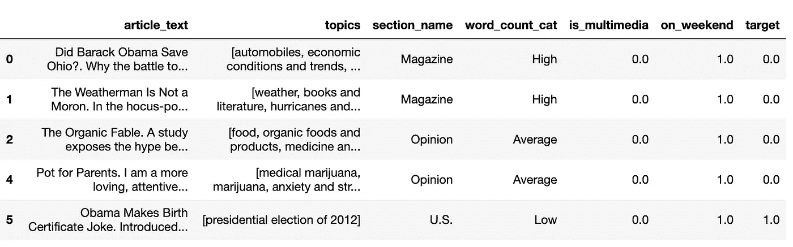
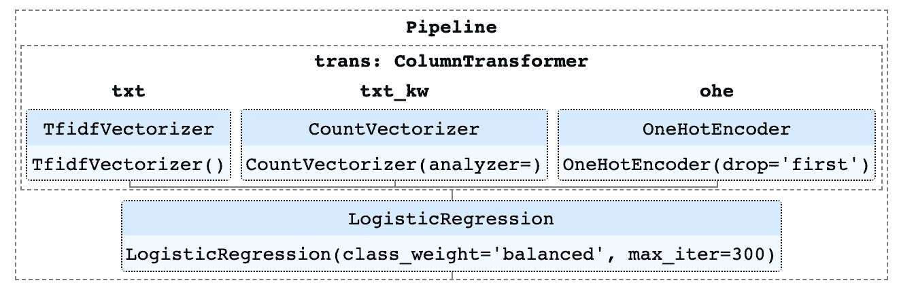
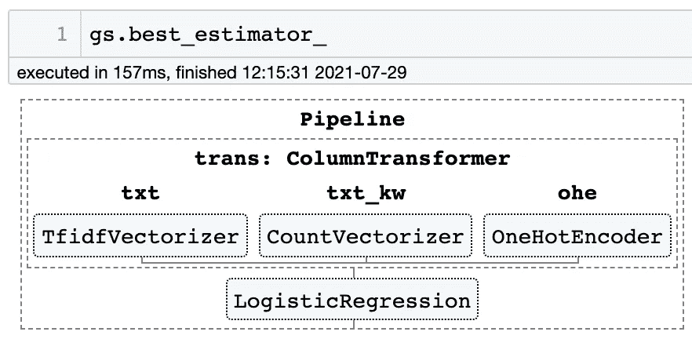

# 充分利用 scikit-learn 管道

> 原文：<https://towardsdatascience.com/getting-the-most-out-of-scikit-learn-pipelines-c2afc4410f1a?source=collection_archive---------4----------------------->

## 帮助您在单个网格搜索中组合转换和建模参数的高级技术


照片由 [SpaceX](https://www.pexels.com/@spacex?utm_content=attributionCopyText&utm_medium=referral&utm_source=pexels) 从 [Pexels](https://www.pexels.com/photo/gray-steel-tubes-586019/?utm_content=attributionCopyText&utm_medium=referral&utm_source=pexels) 拍摄

`Pipelines`是 [scikit-learn](https://scikit-learn.org/stable/index.html) 包中极其有用和通用的对象。它们可以与其他 sklearn 对象嵌套和组合，以创建可重复且易于定制的数据转换和建模工作流。

使用`Pipeline`可以做的最有用的事情之一是将数据转换步骤与最后的估计器(模型)联系在一起。然后，您可以将这个复合估计器传递给一个`GridSearchCV`对象，并在一个镜头中搜索转换参数和模型超参数。但是学习如何构造这些对象，以及如何在不同的级别获取和设置属性需要一些实践。

这篇文章将使用一个 NLP 分类示例来演示如何将一个`ColumnTransformer`与一个`Pipeline`和`GridSearchCV`结合起来。我们将介绍一些具体的技术和技巧，比如如何:

*   使用`ColumnTransformer`作为`Pipeline`步骤，以不同的方式转换不同类型的数据列
*   构建一个复合管道，可用于同时为数据转换和建模进行网格搜索参数
*   指定要一起应用的复杂网格搜索参数集(例如二进制文本矢量化或 Tf-Idf 规范化，但不能同时应用两者)
*   使用`passthrough`绕过或跳过`Pipeline`中的一个步骤
*   使用`set_params()`动态设置`Pipeline`中的单个参数，以便在`GridSearchCV`之外进行测试
*   从最佳估计器的深度检索特征名称，用于解释

# 示例数据介绍

我将使用我为之前的项目收集的示例[数据，包括《纽约时报》发布到脸书的一组文章的文本和元数据。](https://github.com/thetriggestcove/nyt-engagement)

数据已经被清理，但是仍然需要在建模之前进行转换。这对我们来说是一个很好的例子，因为有几种不同类型的功能需要以不同的方式进行转换:

*   `article_text`:要进行标记化和矢量化的文本
*   `topics`:包含每篇文章的适用主题列表的列，将被转换为每个主题的单独特性
*   其余的是我们需要一次性编码的分类特征



我们的示例数据集中的列存储在数据帧中

这里的`target`已经被二进制化了，0 表示读者对《脸书邮报》的参与度低，1 表示参与度高。此示例分类问题的目标是预测敬业度。

为了做好准备，我们将灵活地为变量分配不同的列名集，并将数据分成训练集和测试集。

执行训练-测试-分割，并为不同组的列创建变量

# 为转换生成 ColumnTransformer

首先，我们将创建一个`ColumnTransformer`来转换用于建模的数据。我们将使用`ColumnTransformer`来代替`Pipeline`，因为它允许我们为不同的列指定不同的转换步骤，但是会产生一个单一的特性矩阵。

提醒一下(或者介绍一下，如果你以前没有用过的话)regular `Pipelines`将一个元组列表作为输入，其中每个元组中的第一个值是步骤名，第二个值是估计器对象。

```
pipe = Pipeline([
    ('vect', CountVectorizer()),
    ('clf', LogisticRegression())
])
```

`ColumnTransformers`的构建与`Pipelines`相似，除了**在每个元组中包含第三个值，表示在步骤**中要转换的列。因为我们的数据在 DataFrame 中，所以我们可以传递表示 DataFrame 列名的字符串和字符串列表。如果数据存储在数组中，可以传递列索引或列索引数组。

我已经将不同类别的列的名称存储为变量，所以它们可以像这样动态地传递给`ColumnTransformer`:

```
cols_trans = ColumnTransformer([
    ('txt', TfidfVectorizer(), **text_col**),
    ('txt_kw', CountVectorizer(), **topic_col**),
    ('ohe', OneHotEncoder(drop='first'), **cat_cols**), 
    remainder='drop'
])
```

`Pipeline`步骤是连续执行的，第一步的输出传递给第二步，依此类推。`**ColumnTransformers**` **的不同之处在于，每一步都是单独执行的，转换后的特征在最后**连接在一起。这使我们不必自己做连接，并且当我们准备好解释我们的最佳模型时，可以很容易地获得特性名称的完整列表。

默认情况下，传递到`ColumnTransformer`中的任何没有被指定转换的列都将被删除(`remainder='drop'`)。**如果您有想要包含但不需要转换的列，请指定** `remainder='passthrough'`。稍后我们将再次看到`passthrough`参数，因为它可以在 sklearn 的其他上下文中使用，以跳过或绕过一个处理步骤。

以下是我们示例工作流中该步骤的完整代码，解释如下:

创建 ColumnTransformer 来转换我们拥有的不同类型的数据列

*   `text_col`将使用`TfidfVectorizer`进行转换，T5 将标记每个文档的文本并创建向量以形成文档术语矩阵。我们将能够为这种转换指定许多不同的选项，这些选项将影响最终的模型性能，例如要删除的停用词、要生成的 n 元语法的大小、要包含的最大特征数量，以及如何标准化文档术语矩阵中的标记计数。然而，由于我们将为网格搜索中要尝试的那些参数指定不同的选项，我们现在将只创建 transformer 的一个普通实例。
*   `topic_col`已经是一个单列的主题列表，我们想从中创建一个二进制文档术语矩阵。我们将使用`CountVectorizer`，并给它一个不做任何事情的自定义`analyzer`。默认的`analyzer`通常执行预处理、标记化和 n 元语法生成，并输出一个标记列表，但是因为我们已经有了一个标记列表，我们将按原样传递它们，并且`CountVectorizer`将返回一个现有主题的文档术语矩阵，而不进一步标记它们。
*   `cat_cols`由我们的分类列组成，我们将使用`OneHotEncoder`对其进行一次性编码。我们将指定的唯一参数是删除每一列中的第一个类别，因为我们将使用回归模型。

> **提示:**`TfidfVectorizer`和`CountVectorizer`都期望一个**一维数组**，所以列名需要作为字符串而不是列表传递给`ColumnTransformer`，即使列表只有一个条目。如果您给这些变压器中的任何一个一个列表，您将得到一个关于`incompatible row dimensions`的错误。大多数其他 sklearn 变形器期望一个 2-D 数组(比如`OneHotEncoder`)，所以即使你只变形一列，你也需要传递一个列表。

很好，现在我们有了`cols_trans`，一个`ColumnTransformer`对象，它将输出一个带有我们转换后的数据的特征矩阵。

# 使用 ColumnTransformer 和模型创建管道

接下来，我们将创建一个`Pipeline`，其中`cols_trans`是第一步，逻辑回归分类器是第二步。

```
from sklearn.pipeline import Pipeline
from sklearn.linear_model import LogisticRegressionpipe = Pipeline([
    ('trans', cols_trans),
    ('clf', LogisticRegression(max_iter=300, class_weight='balanced'))
])
```

如果我们调用`pipe.fit(X_train, y_train)`，我们将转换我们的`X_train`数据，并在一个单一的步骤中拟合逻辑回归模型。注意，我们可以简单地使用`fit()`，并且不需要做任何特殊的事情来指定我们想要在第一步中拟合和转换数据；管道会知道该做什么。

一旦你开始嵌套`Pipelines`和其他对象，你想要刷新你自己关于如何执行这些步骤。一种方法是将 sklearn 的`display`参数设置为`'diagram'`，以便在调用管道对象本身的`display()`时显示一个 HTML 表示。HTML 将在 Jupyter 笔记本中进行交互，您可以点击每一步来展开它，并查看其当前参数。

```
from sklearn import set_configset_config(display='diagram')# with display='diagram', simply use display() to see the diagram
display(pipe)# if desired, set display back to the default
set_config(display='text')
```



管道的 HTML 显示示例，显示了参数

# 准备网格搜索参数

我们将能够把我们的`pipe`对象传递给`GridSearchCV`来同时搜索转换和分类器模型的参数。`GridSearchCV`将需要一个搜索参数字典来尝试，其中键是管道步骤/参数名，值是要搜索的参数列表。

像我们这样将一个`ColumnTransformer`嵌套在一个`Pipeline`中，可能很难得到这个字典的正确键，因为它们是以每个步骤的标签命名的，用邓德尔斯`__`作为分隔符。获得所有可用选项列表的最简单方法是使用`pipe.get_params()`。

您应该会看到类似这样的内容:

```
{'memory': None,
 'steps': [('trans',
   ColumnTransformer(transformers=[('txt', TfidfVectorizer(), 'article_text'),
                                   ('txt_kw',
                                    CountVectorizer(analyzer=<function no_analyzer at 0x7fbc5f4bac10>),
                                    'topics'),
                                   ('ohe', OneHotEncoder(drop='first'),
                                    ['section_name', 'word_count_cat',
                                     'is_multimedia', 'on_weekend'])])),
  ('clf', LogisticRegression(class_weight='balanced', max_iter=300))],
 'verbose': False,
 'trans': ColumnTransformer(transformers=[('txt', TfidfVectorizer(), 'article_text'),
                                 ('txt_kw',
                                  CountVectorizer(analyzer=<function no_analyzer at 0x7fbc5f4bac10>),
                                  'topics'),
                                 ('ohe', OneHotEncoder(drop='first'),
                                  ['section_name', 'word_count_cat',
                                   'is_multimedia', 'on_weekend'])]),
 'clf': LogisticRegression(class_weight='balanced', max_iter=300),
 'trans__n_jobs': None,
 'trans__remainder': 'drop',
 'trans__sparse_threshold': 0.3,
 'trans__transformer_weights': None,
 'trans__transformers': [('txt', TfidfVectorizer(), 'article_text'),
  ('txt_kw',
   CountVectorizer(analyzer=<function no_analyzer at 0x7fbc5f4bac10>),
   'topics'),
  ('ohe',
   OneHotEncoder(drop='first'),
   ['section_name', 'word_count_cat', 'is_multimedia', 'on_weekend'])],
 'trans__verbose': False,
 'trans__txt': TfidfVectorizer(),
 'trans__txt_kw': CountVectorizer(analyzer=<function no_analyzer at 0x7fbc5f4bac10>),
 'trans__ohe': OneHotEncoder(drop='first'),
 'trans__txt__analyzer': 'word',
 'trans__txt__binary': False,
 'trans__txt__decode_error': 'strict',
 'trans__txt__dtype': numpy.float64,
 'trans__txt__encoding': 'utf-8',
 'trans__txt__input': 'content',
 'trans__txt__lowercase': True,
 'trans__txt__max_df': 1.0,
 'trans__txt__max_features': None,
 'trans__txt__min_df': 1,
 'trans__txt__ngram_range': (1, 1),
 'trans__txt__norm': 'l2',
 'trans__txt__preprocessor': None,
 'trans__txt__smooth_idf': True,
 'trans__txt__stop_words': None,
 'trans__txt__strip_accents': None,
 'trans__txt__sublinear_tf': False,
 'trans__txt__token_pattern': '(?u)\\b\\w\\w+\\b',
 'trans__txt__tokenizer': None,
 'trans__txt__use_idf': True,
 'trans__txt__vocabulary': None,
 'trans__txt_kw__analyzer': <function __main__.no_analyzer(doc)>,
 'trans__txt_kw__binary': False,
 'trans__txt_kw__decode_error': 'strict',
 'trans__txt_kw__dtype': numpy.int64,
 'trans__txt_kw__encoding': 'utf-8',
 'trans__txt_kw__input': 'content',
 'trans__txt_kw__lowercase': True,
 'trans__txt_kw__max_df': 1.0,
 'trans__txt_kw__max_features': None,
 'trans__txt_kw__min_df': 1,
 'trans__txt_kw__ngram_range': (1, 1),
 'trans__txt_kw__preprocessor': None,
 'trans__txt_kw__stop_words': None,
 'trans__txt_kw__strip_accents': None,
 'trans__txt_kw__token_pattern': '(?u)\\b\\w\\w+\\b',
 'trans__txt_kw__tokenizer': None,
 'trans__txt_kw__vocabulary': None,
 'trans__ohe__categories': 'auto',
 'trans__ohe__drop': 'first',
 'trans__ohe__dtype': numpy.float64,
 'trans__ohe__handle_unknown': 'error',
 'trans__ohe__sparse': True,
 'clf__C': 1.0,
 'clf__class_weight': 'balanced',
 'clf__dual': False,
 'clf__fit_intercept': True,
 'clf__intercept_scaling': 1,
 'clf__l1_ratio': None,
 'clf__max_iter': 300,
 'clf__multi_class': 'auto',
 'clf__n_jobs': None,
 'clf__penalty': 'l2',
 'clf__random_state': None,
 'clf__solver': 'lbfgs',
 'clf__tol': 0.0001,
 'clf__verbose': 0,
 'clf__warm_start': False}
```

向下滚动到输出的底部，您将看到以您需要传递给`GridSearchCV`的精确格式列出的每一步的参数。将只列出每个参数的当前值，因此您可能需要查看每个估计器的文档，以了解还支持哪些其他值。

假设我决定搜索以下文本矢量化参数和我的逻辑回归模型:

```
grid_params = {
    'trans__txt__binary': [True, False],
    'trans__txt__use_idf': [True, False],
    'trans__txt__max_features': [None, 100000, 10000],
    'trans__txt__ngram_range': [(1, 1), (1, 2), (1, 3)],
    'trans__txt__stop_words': [None, nltk_stopwords],
    'clf__C': [1.0, 0.1, 0.01],
    'clf__fit_intercept': [True, False],
    'clf__penalty': ['l2', 'l1'],
    'clf__solver': ['lbfgs','saga']
}
```

但是如果我想把`'trans__txt__binary': True`只和`'trans__txt__use_idf': False`一起用，这样真的得到二进制的 0 或者 1 输出呢？而我想单独尝试一个正则项频率，还有 TF + IDF，但那样的话我只希望 binary 为 False？

如果我用上面写的参数运行搜索，`GridSearchCV`将尝试每种组合，甚至是那些可能没有意义的组合。

事实证明， **GridSearchCV 也将接受一个参数字典列表，并且足够聪明地尝试列表中所有字典的唯一组合。**我们需要将公共参数放在两个字典中，二进制的参数放在一个字典中，常规令牌计数的参数放在另一个字典中。

创建搜索参数，说明我想要测试的特定组合

请注意，如果您只有几个要搜索的参数，这可能是不必要的，但当您想要尝试许多参数时，就像我们在这里做的那样，这真的变得很重要。每个组合都需要一定的计算能力和时间，所以我们不想运行任何不必要的组合。

# 如何绕过或跳过整个步骤

如果您想在不使用该选项的情况下测试结果，许多实际参数都有一个`None`值。然而，如果您有一个想要**绕过或跳过管道中整个步骤的工作流，这就行不通了。**

例如，如果您有连续的数据，并且想要同时使用`MinMaxScaler`和`StandardScaler`来评估线性回归模型的性能，以查看哪一个效果更好。你可以在你的`Pipeline`中添加每一个单独的步骤，并使用上述技术的一个版本来创建一个 gris 参数列表，以尝试`MinMax`或`Standard`缩放器，但不能同时尝试两者。您可以将`'passthrough'`作为参数值提供给指定的流水线步骤来绕过它，这样就只使用另一个缩放器。

使用“通过”跳过最小最大或标准缩放器，这样我们可以在单个网格搜索中单独测试它们

请注意，如果您只是想尝试应用和不应用给定的步骤(而不是用一个步骤替换另一个步骤，就像我们上面所做的那样)，您可以将 transformer 对象本身的一个实例与`'passthrough'`一起包含在参数列表中。例如，在 sklearn 文档的[示例中，如果您有一个用于主成分分析的标注为`'pca'`的降维步骤，您可以在网格搜索参数中包含`'pca': ['passthrough', PCA(5), PCA(10)]`来测试不使用 PCA、使用具有 5 个成分的 PCA 以及使用具有 10 个成分的 PCA。](https://scikit-learn.org/stable/modules/compose.html#pipeline-nested-parameters)

# 单独设置管道参数

好了，假设我们的网格搜索完成了，`gs`对象将会自动被安装上最佳估计器，我们可以使用`gs.best_estimator_`来访问它(不要忘记最后的下划线；很有必要！).

由于我们给了`gs`我们的`pipe`对象作为估计器，拟合的最佳估计器是`pipe`的副本，应用了最佳参数，并且已经在当前 X_train 上拟合。我们可以做这样的事情:

*   调用`gs.best_estimator_.get_params()`获取性能最佳的流水线的参数
*   使用 pickle 或 joblib 将`gs.best_estimator_`导出到文件，以备份最佳管道及其参数和 X_train 上的当前拟合
*   调用`gs.best_estimator_.predict(X_test)`获得对未知测试数据的预测
*   使用`set_params()`以防我们想要单独测试调整任何单个参数

例如，我们在网格搜索中测试了`[10000, 5000, 2000]`中的`max_features`，其中`2000`表现最好。因为它是最低的，也许我想只用`1000`来评估性能，看看更低是否真的会更好。

我可以使用`set_params()`和我们在指定网格搜索参数时使用的类似语法，手动将参数值设置为其他值:

`gs.best_estimator_.set_params(**{'trans__txt__max_features': 1000})`

注意，我将参数作为字典传递，如果需要，可以包含多个参数。我还需要字典前的`**`来解包它，这样`set_params()`就会接受它。

# 从 ColumnTransformer 访问功能名称

让我们假设`1000`中的`max_features`没有帮助，所以我已经将它设置回`2000`，在看不见的测试数据上评估性能，现在我准备对模型系数做一些解释。

要做到这一点，在我们对文章文本进行标记化、拆分主题并对分类特征进行一次性编码之后，我需要获得最终转换的特征名称。我们可以很容易地做到这一点，但我们必须使用正确的语法来深入嵌套层次。

首先，让我们使用 HTML 显示技巧来提醒自己这些步骤是什么以及它们的标签是什么:



GridSearch 最佳估计值的 HTML 显示

请记住，尽管我们将`ColumnTransformer`对象命名为`cols_trans`，但在我们提供给`gs`的最终管道中，我们只将其标记为`trans`。**所以** `**trans**` **是我们这里需要处理的第一个标签。**

虽然这里显示的转换步骤是并行的，但是它们实际上是按照连接的顺序进行的。**如果我们希望我们的特性名称列表的完整列表是准确的，我们需要按照最初应用的顺序从每个转换器中获取特性名称，然后将它们连接起来**。在图中，该层的正确顺序可以从左到右阅读。

我们将使用`named_steps()`属性来访问转换层，然后从该层的每个`named_transformers_()`中依次获取`get_feature_names()`属性。

按顺序从每个转换器获取特征名称，用于模型解释

注意，对于`ohe`转换器，我将`cat_cols`传递给了`get_feature_names()`，这是在这一步中被转换的原始列名的列表。将原始列名作为列前缀传递到此处；否则它们将是通用的。

# 结论

希望这是一个有用的例子，说明如何构建嵌套的`Pipeline`来处理转换和建模。虽然构建需要一些额外的工作，但是如果您想在网格搜索中尝试不同的转换和模型参数，这样做是非常有益的。

欢迎反馈和提问！