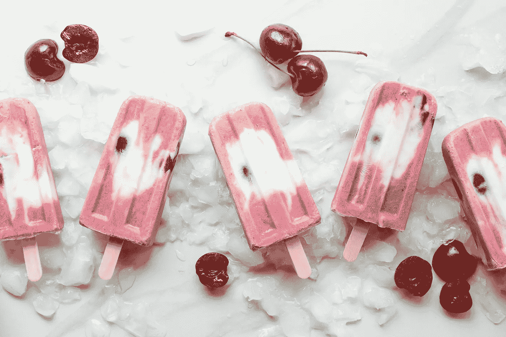
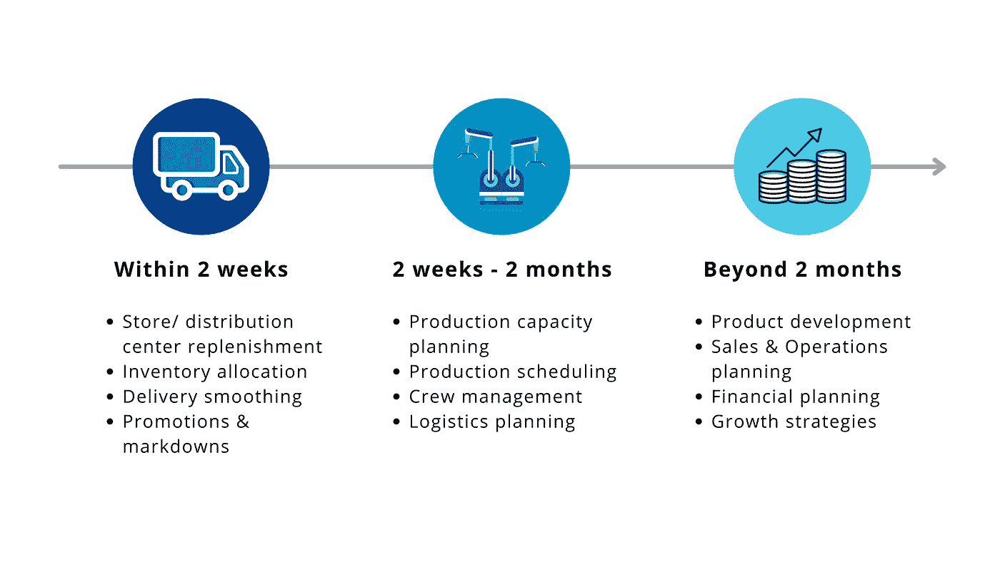
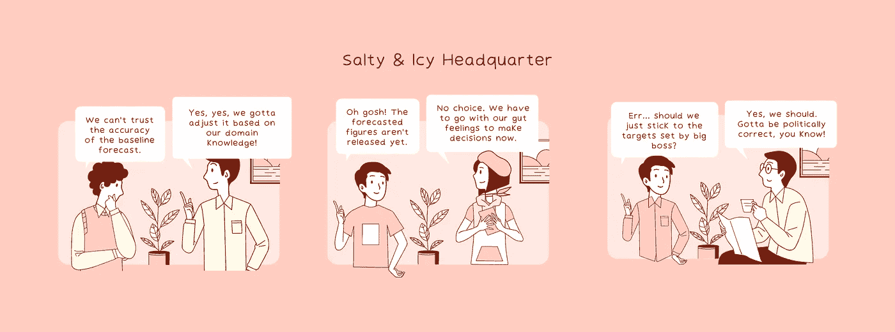

# 了解需求预测

> 原文：<https://towardsdatascience.com/getting-to-know-demand-forecasting-54e43c563a3e?source=collection_archive---------28----------------------->

## 要理解需求预测是如何工作的，需要的不仅仅是统计学和机器学习。

*照片由* [*林赛萌*](https://unsplash.com/@lindsaymoe?utm_source=unsplash&utm_medium=referral&utm_content=creditCopyText) *上* [*下*](https://unsplash.com/s/photos/ice-cream?utm_source=unsplash&utm_medium=referral&utm_content=creditCopyText)

# 见见朱莉。她在月球上卖冰淇淋

这是朱莉。从六岁起，她想做的一切就是在每个夏天卖美味的冰淇淋，给人们带来欢乐。她相信她能做到，所以她做到了。

朱莉现在是 Salty & Icy 的老板，这是月球上最好的冰淇淋品牌之一。最初是一架小型航天飞机，现在向渴望探索环形山、爱上美丽的月球景观并最终像朱莉一样在月球上定居的太空游客分发了数百万个冰淇淋桶。

听起来像一个梦，但经营一家企业不仅仅是知道如何制作美味的冰淇淋！

制作冰淇淋，然后把它送到全月球的商店需要很多时间。然而，当顾客想要冰淇淋时，他们不会满足于超过 10 分钟的等待或任何其他口味，除非是他们渴望的口味。

简单地说，在顾客知道他们想买冰淇淋之前，冰淇淋必须提前做好。但是朱莉应该生产多少呢？每天 1000 还是 2000 桶？巧克力或草莓或以咸冰闻名的 20 多种异国风味？单杯还是 16 盎司的容器？

生产太多顾客不想买的东西将会带来巨大的损失，因为两周内卖不出去的产品将会被扔掉。对高需求产品生产过少会迫使她宝贵的客户选择其他竞争对手，并永远失去他们。

信不信由你，这项任务可以归结为一个问题:**客户将来可能会购买每种产品的多少？找到这个问题的答案就叫做需求预测。**

# 需求预测使 Julie 能够更好地进行业务规划和决策

作者图片

总的来说，这就是为什么需求预测对 Salty & Icy(以及其他企业)如此重要。

能够预测未来两周内的需求可以帮助 Salty & Icy 团队减少缺货，同时及时执行促销和降价以推动销售。

长达 2 个月的稍长的预测范围可以实现更好的生产计划，以保持冰淇淋搅拌，以满足客户的需求。

超过 2 个月之后，对预测需求的合理看法可以指导 Julie 和她的团队更好地开发产品和制定未来增长的业务战略。

从更广阔的角度来看，预测的时间越长，Julie 就能更好地规划、安排和提供原材料、劳动力和生产能力，以满足客户需求并执行增长战略。

要是朱莉有一个水晶球能告诉她未来的生意会怎么样就好了！

# 模式和无法解释的差异:需求预测的两个组成部分

没有所有辉煌的统计方法或人工智能炒作，**需求预测的唯一目标是根据现有数据预测未来要消费的产品或服务的数量**。就是这样！

关于从过去到现在影响产品需求的因素的数据越多，就越容易发现潜在的模式和关系，并对未来业务的发展做出合理的预测。

但是什么构成了需求预测呢？以下是对小查尔斯·w·蔡斯在书中所写内容的简短而甜蜜的总结。

> 预测=模式+未解释的差异
> 
> ——出自小查尔斯·w·蔡斯

## 模式

模式通常有以下三种形式:趋势、季节性和周期性因素。

*   **趋势:**由于在过去的五年中，对纯素冰淇淋的历史需求每年增长 x %, Julie 预计未来纯素冰淇淋的销量将增长 x%。
*   **季节性:**当太阳照射到月球表面时，温度上升。这时，太空旅行者会疯狂地吃冰淇淋来缓解酷热。反之亦然，当太阳下山时，温度会降到零度以下。很少有人喜欢在冰淇淋桶里冷冻大脑。
*   **周期性:**月球一侧的白天和极热持续约 13.5 天，随后是 13.5 夜的黑暗和冰冻温度。月球每一面对冰淇淋的需求也随着月球自转而起伏。

**这里的基本假设是，客户未来想要购买的东西会模仿他们过去购买的东西。因此，如果 Julie 能够确定过去影响其产品需求的趋势、季节性或周期因素，她就能预测未来的需求。**

听起来好得难以置信？

我同意。未来不会像过去一样。这就是第二个组成部分出现的地方。

## 不可解释的变异数

无法解释的差异表示历史需求和未来需求之间的差异，无法用趋势、季节性或周期性因素来解释。

但这可能是什么呢？嗯，很多很多不同的事情。

[Firmbee.com](https://unsplash.com/@firmbee?utm_source=unsplash&utm_medium=referral&utm_content=creditCopyText)在 [Unsplash](https://unsplash.com/s/photos/marketing?utm_source=unsplash&utm_medium=referral&utm_content=creditCopyText) 上拍照

这可能是一个买一送一的促销活动，或者是其他冰淇淋品牌为了与 Salty & Icy 竞争而降价 5%。在月球上举办的星际杯可能会看到对大尺寸多口味冰淇淋桶的需求增加，因为朋友和家人往往会一起观看足球比赛。与航天飞机有关的不幸事故可能会使人们对太空旅行变得谨慎，从而影响月球上的整体贸易和经济。

这些现象都在不同程度上影响着朱莉冰淇淋的需求。只有上帝知道还有多少因素会推动销售上升或下降。

但是**因为很难 100%准确地预测未来，并不意味着朱莉应该完全放弃它。**事实上，**目标和期望应该是在合理的时间和成本限制内，尽可能基于数据量化无法解释的差异。**

但是怎么做呢？好吧，让我们探索一下人们一直在做些什么来实现合理准确的需求预测！

# 预测未来需求的方法不止一种

我无意列出天底下所有预测方法的清单。这会让你直接进入深度睡眠。

但让我简要介绍 3 大类需求预测方法。每一类都代表了现实生活中经营企业的人的一种潜在信念或行为，值得了解。所以听我说完！

## 时间序列:历史会重演

你听说过移动平均线吗？指数平滑怎么样？哦，我怎么能省略时间序列预测的全能 ARIMA 模型呢？

如果你需要快速回顾一下这些是什么，看看这篇文章。但是下面是你需要知道的最重要的一点。

使用这些统计方法，人们有意或无意地假设历史会重演。因此**用时间序列模型外推历史数据似乎足以预测需求。**

例如，朱莉本月销售的冰淇淋数量将表明下个月对咸冰产品的需求。朱莉自创业以来观察到的基于月球自转的冰淇淋需求的周期性波动或纯素食冰淇淋越来越受欢迎，会告诉她下一季度、明年和未来许多年她应该生产多少冰淇淋。

但是过去的历史真的会在几个月甚至几周内保持不变吗？让我们看看。

## 个人判断:相信你的直觉

你见过基线预测是如何在委员会中传阅以收集反馈和批准的吗？

每个季度，Julie 通常会根据时间序列建模来准备基线预测。然后，她将基线预测发送给整个管理团队。

每个人都根据自己的判断、经验或直觉在预测中加入自己的想法，因为每个人都知道历史不会完全重演。一些人会高兴地上调预测需求，而另一些人似乎对未来几个月的需求过于悲观。

那么谁是对的呢？谁错了？更重要的是，为什么人们会选择依靠直觉呢？

许多研究人员研究了这种有趣的行为。简单来说，这里有三个主要的信念可以解释地面上正在发生的事情。

作者图片

当做出决策的时间紧迫，而时间序列预测不可用或不足以捕捉复杂的市场行为时，人们会依赖领域知识、个人判断或两者兼而有之。

不幸的是，无论判断是由一位高管还是整个委员会做出的，领域知识和个人偏见之间都有一条非常细微的界限。[研究](https://www.sciencedirect.com/science/article/pii/S037722171500497X)表明，大多数时候，**当数字反映某人的愿望或有缺陷的推理，而不是对市场和客户行为的真正理解时，基于直觉的调整可能产生非常不准确的预测。**

嗯，一定有别的办法，对吧？

## 回归:首先，给我看数据

照片由[弗兰基·查马基](https://unsplash.com/@franki?utm_source=unsplash&utm_medium=referral&utm_content=creditCopyText)在 [Unsplash](https://unsplash.com/s/photos/data?utm_source=unsplash&utm_medium=referral&utm_content=creditCopyText) 上拍摄

除了趋势、季节性和周期性因素，还有什么可以帮助解释与未来需求相关的任何无法解释的差异？随着朱莉对过去记录的深入挖掘，她观察到了几种关系。

*   花更多的钱把她的产品陈列在超市冷冻通道的中央与眼睛齐平的位置，销售量将是其他区域的两倍。
*   在去年 5 月的“冷冻价格战”期间，月球上大多数冰淇淋品牌的售价都是 Salty & Icy 的一半。销售量下降了 25%。

虽然相关性并不意味着因果关系，外部和内部因素之间的相互关系可以用来预测未来的需求。例如，炎热的天气与比平均销量高 5%相关，而比其他品牌高 5%的价格可能会使企业损失 20%的周需求。

量化这种关系，并定义一个数学函数，根据目前对这些因素的了解来预测未来的需求，这就是所谓的回归。

还记得我们讨论过需求预测的两个组成部分吗？**虽然时间序列方法有助于揭示与时间相关的模式，但回归在量化无法解释的差异方面极具价值。**

# 包扎

将我们的讨论引向 Julie，以及她对预测未来咸冰产品需求的需求，以下是她需要牢记的内容。

首先，**做出那些判断性的调整来提高定量预测模型的准确性是绝对不允许的。一个更好的方法是通过假设测试用现有数据验证领域知识。**

其次，**历史会重演的时间序列方法只有在产品多年来有相当稳定的销量**，随机波动非常小的情况下才有效。然而，由于市场变化如此之快，新的进入者到处涌现，很少有公司能够继续享有稳定的销量。

第三，**代表不同来源的产品需求的各种影响因素的数据越多，提高业务洞察力和预测准确性的可能性就越大。但是用 Excel 对许多潜在因素进行回归分析很快就会变成一场噩梦。**

最后，除了人工智能宣传之外，**生成可用于决策的准确需求预测需要的不仅仅是机器学习**，因为:

1.  机器学习并不能解决数据问题。如果历史数据缺失或质量差，单靠机器学习无法生成具有精度和准确度的需求预测模型。
2.  当人们不相信预测数字的准确性或不理解这些数字是如何产生的，很难说服他们少依赖一点直觉，多依赖一点数据。因此，机器学习之旅可能需要时间、大量的试点项目和文化转变，才能达到“足够准确”的模型和“可解释”的模型之间的最佳平衡点，以便理解和采用。

这就是我这篇博文的全部内容。感谢您的阅读。对我如何能做得更好有反馈，或者只是想聊天？在评论里告诉我或者在 [LinkedIn](https://www.linkedin.com/in/skyetran/) 上找到我。祝大家度过美好的一周！

# 参考

1.  [对统计预测进行判断性调整的“重大损失”会影响专家的行为吗？](https://www.sciencedirect.com/science/article/pii/S037722171500497X)作者彼得罗保罗斯等人。
2.  [需求驱动的预测:一种结构化的预测方法](https://learning.oreilly.com/library/view/demand-driven-forecasting-a/9781118735572/)
3.  Nick T. Thomopoulos 的库存控制需求预测

*原载于 2021 年 5 月 23 日 http://thedigitalskye.com**的* [*。*](http://thedigitalskye.com/2021/05/24/getting-to-know-demand-forecasting/)