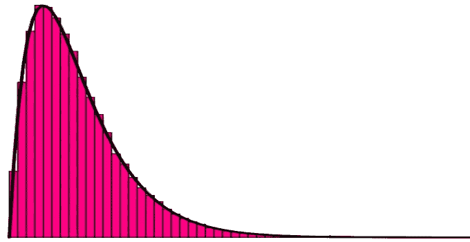
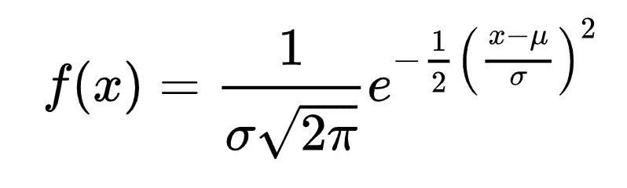
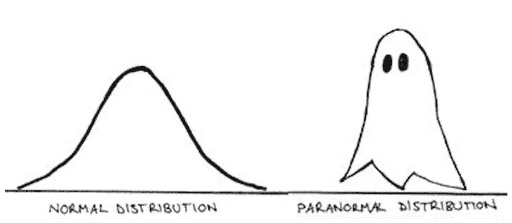
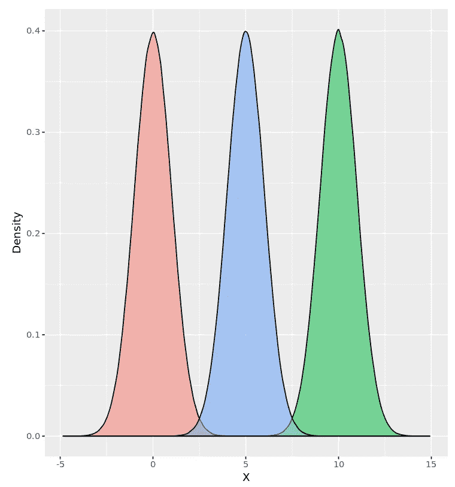
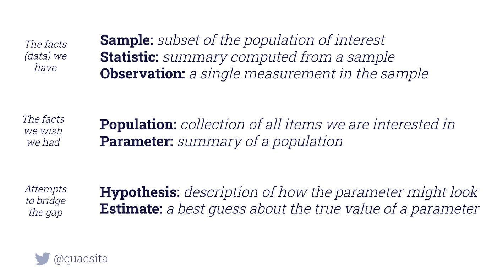

# 了解概率分布

> 原文：<https://towardsdatascience.com/getting-to-know-probability-distributions-cc1dd1e2f22b?source=collection_archive---------1----------------------->

## 数据科学基础知识的回归

考考自己！你能解释这些核心统计概念中的多少？

**CLT、CDF、分布、估计、期望值、直方图、峰度、MAD、均值、中值、MGF、众数、矩、参数、概率、PDF、随机变量、随机变量、偏度、标准差、尾部、方差**

你的知识有缺口吗？请继续阅读！

***注:*** *如果你在下面看到一个不熟悉的术语，请点击链接查看解释。*

# **随机变量**

随机变量(R.V .)是一种将现实转化为数字的数学函数。可以把它想成一条规则，在真实世界的事件发生后，决定你应该在你的[数据集](http://bit.ly/quaesita_hist)中记录什么数字。

> 随机变量是简化现实的规则。

例如，如果我们对六面骰子的滚动感兴趣，我们可以将 *X* 定义为随机变量，它将您对真实世界骰子滚动的感性体验映射到这些数字之一:{1，2，3，4，5，6}。或者我们可能只记录奇数/偶数的{0，1}。这完全取决于我们选择如何定义我们的简历。

图片:[来源](https://pixabay.com/photos/cube-four-roll-the-dice-949116/)。

(如果这太专业了，就把随机变量想象成一种表示结果的方式:如果 X 是关于掷骰子的，那么 *X* =4 就是说我们掷出了一个 4。如果这还不够专业，你几乎可以肯定*爱上一堂[衡量理论](https://en.wikipedia.org/wiki/Measure_(mathematics))课。)*

# *随机变量*

*许多学生混淆了随机变量和随机变量。如果你是一个普通读者，跳过这一点，但爱好者会注意到:随机变量是像{1，2，3，4，5，6}这样的结果值**,而随机变量是将现实映射到数字上的函数**。你课本公式中的小 *x* 对大 *X* 。*

# ***概率***

**P(X=4)* 在英语中读作*“我的骰子 4 朝上着地的概率。”*如果我有一个公平的六面骰子， *P(X=4)* =1/6。但是…但是…但是…概率是什么，那 1/6 从何而来？很高兴你问了！在这里，我已经为你介绍了一些概率基础知识，组合学是额外的收获。*

# ***分销***

*分布是一种表达 X 可能取的整组值的概率的方式。*

> *发行版以图形的形式向您提供受欢迎程度竞赛的结果。*

# *概率密度函数*

*召唤分布的最好方法是说出它的真名:它的概率密度函数。这样的功能意味着什么？如果我们把 X 放在*X*-轴上(没错)，那么 *y* 轴上的高度显示了每个结果的概率。*

**

*一个概率密度函数给你整个[人口](http://bit.ly/quaesita_popwrong)的受欢迎度竞赛结果。基本上就是人口直方图。横轴:人口数据值。纵轴:相对知名度。要了解更多关于这张图和我省略的细节，请点击这里的。*

*正如我在这里[详细解释的那样](http://bit.ly/quaesita_hist)，分布本质上是一个想象的理想化[条形图(对于离散的 R.V.s)或直方图(对于连续的 R.V.s)](http://bit.ly/quaesita_hist) 。*换句话说， *X 的更可能值的分布更高。*对于所有结果，公平骰子的分布具有相同的高度([离散](http://bit.ly/quaesita_datatypes)均匀”)；对于加重的芯片来说并非如此。*

**

**和分布图一样，你可以把条形图和直方图想象成流行度竞赛。或者小费罐。那也行得通。**

# *累积密度函数*

*这是概率密度函数的积分**。用英语？该函数不是显示 X 的每个值的可能性，而是显示 X 及以下所有值的累积概率。如果你在考虑百分位数，那太棒了。百分位数是在 *x* 轴上的数值，百分比是在 *y* 轴上的数值。*

*概率:在六面骰子上得到 3？1/6
累计:获得 3 分或更低？3/6
第 50 百分位是 3。3 在 x 轴，50%在 y 轴。*

# *选择您的发行版*

*你怎么知道什么分布适合你的 *X* ？[统计学家](http://bit.ly/quaesita_statistics)有两种最喜欢的方法。他们或者(1) [从他们的数据中估计](http://bit.ly/quaesita_vocab) [经验](https://en.wikipedia.org/wiki/Empirical_distribution_function)分布——使用，你猜对了，直方图！—或者他们(2)做出理论上的[假设](http://bit.ly/quaesita_saddest)关于[流行发行目录](https://bit.ly/distplushies)的哪个成员看起来最像他们认为他们的数据源的行为方式。(如果你有数据，用[假设检验](http://bit.ly/quaesita_fisher)来检查那些分布假设是个好主意。)*

**

*选择分布的标准方法包括绘制直方图，并将其形状与目录中的理论分布形状进行比较，例如维基百科上的[分布列表、教科书中的分布列表或上述分布图的销售页面。(现在你开始怀疑我到底是在开玩笑。)作者个人 plushie 系列图片。](https://en.wikipedia.org/wiki/List_of_probability_distributions)*

*当我们查看我们的[目录](https://bit.ly/distplushies)时，我们注意到各种分布都有类似“正态”或“卡方”或“柯西”的名称……这给学生一个错误的印象，以为这些是唯一的选项。他们不是。他们只是有名的。就像人一样，发行版可能因为所有错误的原因而出名。*

> *就像人一样，发行版可能因为所有错误的原因而出名。*

*从好的方面来说，命名发行版附带了整洁的 pdf 和一堆为您预先做好的计算。*

*不利的一面是，您的应用程序可能不适合目录中的任何内容。感谢上帝的[经验](https://en.wikipedia.org/wiki/Empirical_distribution_function)选择。*

# *因素*

*这是一个非常流行的分布的概率密度函数，正态分布(也称为高斯或钟形曲线):*

**

*实话实说吧，这些见解并没有跃然纸上。这就是为什么我们倾向于询问我们感兴趣的特定参数的问题。在[统计](http://bit.ly/quaesita_statistics)中，参数概括了[总体](http://bit.ly/quaesita_vocab)或分布。例如，如果您要问分布是否在零处达到峰值，您要问的是其众数(一个参数)的位置。如果你在问分布有多胖，你是在问它的方差(另一个参数)。在[时刻](http://bit.ly/quaesita_lemur)，我将带你参观几个我最喜欢的参数。*

*但在此之前，让我来回答这个问题:与其计算汇总测量，我们为什么不画出这个函数并注视它？我们还没准备好。*

*如果你看上面的函数，你会注意到里面有一些希腊字母:μ和𝜎.***这些是该分布的特殊参数；在我们用数字代替它们之前，我们还没准备好绘制任何东西。没有它们，我们所能做的只是对分布的抽象形状有一个模糊的感觉，就像这样:*

**

*图片:[来源](https://images.slideplayer.com/19/5850296/slides/slide_20.jpg)。*

*想要斧子吗？把数字放在希腊字母所在的地方。例如，μ= 0 vs . 5 vs . 10 和𝜎 = 1 的结果如下:*

**

*粉色μ = 0，蓝色μ = 5，绿色μ = 10*

*还有更多希腊语可以享受，因为其他发行版使用其他字符来表示它们的特殊数量。最终，你会厌倦它，开始使用 *θ₁、θ₂、θ₃、*等。对他们所有人来说。*

*还值得记住的是，分布及其参数是理论对象，涉及关于人口总数的假设，而直方图是一个更实用的对象——你拥有的样本数据的汇总。如果你把与样本和总体相关的概念分开，你会避免很多混乱，所以在这里有必要重温一下这些概念。*

**

*你可以在这里找到我的解释。*

*现在我们已经准备好参观我最喜欢的参数，在[第二部分](http://bit.ly/quaesita_lemur)中继续。*

# *感谢阅读！人工智能课程怎么样？*

*如果你在这里玩得开心，并且你正在寻找一个为初学者和专家设计的有趣的应用人工智能课程，这里有一个我为你制作的娱乐课程:*

*在这里欣赏整个课程播放列表:[bit.ly/machinefriend](http://bit.ly/machinefriend)*

# *与凯西·科兹尔科夫联系*

*让我们做朋友吧！你可以在 [Twitter](https://twitter.com/quaesita) 、 [YouTube](https://www.youtube.com/channel/UCbOX--VOebPe-MMRkatFRxw) 、 [Substack](http://decision.substack.com) 和 [LinkedIn](https://www.linkedin.com/in/kozyrkov/) 上找到我。有兴趣让我在你的活动上发言吗？使用[表格](http://bit.ly/makecassietalk)取得联系。*

# *脚注*

**从技术上讲，一个离散的 R.V .函数被称为概率**质量**函数，而不是概率密度函数，但我还没见过有人[在乎你是否把一个 PMF 叫做 PDF](http://bit.ly/quaesita_noclassification) 。*

** *如果你有一个离散的 R.V .，那么它是和而不是积分。*

** * *那个π没什么特别的。这只是我们在 3 月 14 日庆祝的常规节日。*