# 用于更好绘图的 ggplot2 扩展

> 原文：<https://towardsdatascience.com/ggplot2-extensions-for-better-plotting-1734f62c160c?source=collection_archive---------28----------------------->

## 帮助您更高效地创建更好的地块的扩展

# 拼凑—排列您的图表

`patchwork`的目标是让将独立的 gg 图组合成同一个图形变得简单得可笑。要开始使用这个伟大的库，你需要记住三个基本操作符:`+ /`和`|`。首先，让我们安装`patchwork`并创建一些情节。

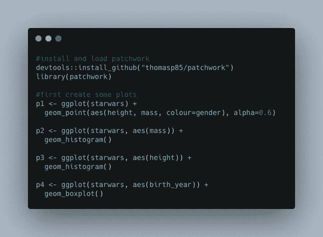

## 基本用法

让我们将我们的图合并成一个大图，使用`+`操作符再简单不过了:

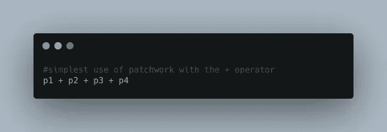

默认情况下，patchwork 会尝试保持网格为方形，并按行顺序填充它:

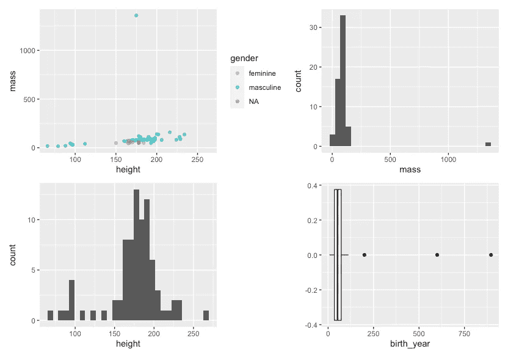

作者使用+运算符的拼凑式 ggplot2 排列-图像

## 定制安排

`/`和`|`操作符使您能够超越这种自动排列。`|`会将图并排放置，而`/`会将它们堆叠起来:

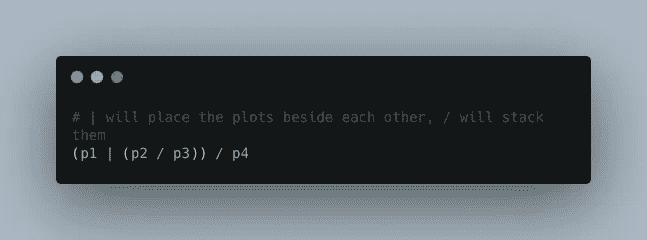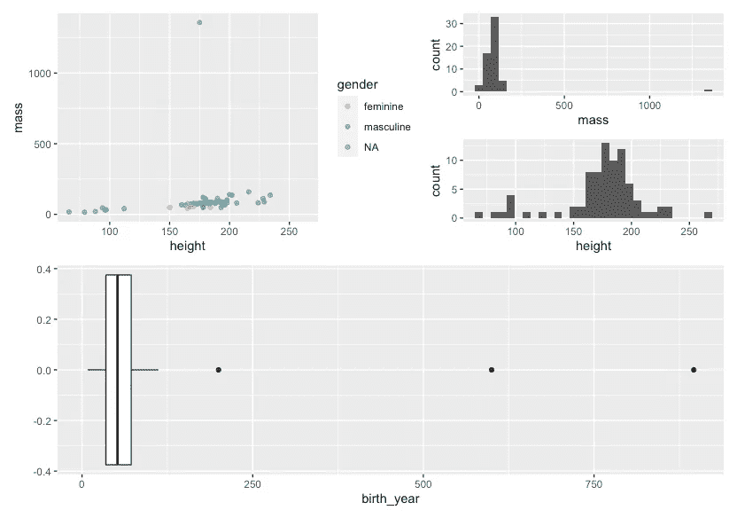

使用/和|运算符的拼凑式 ggplot2 排列-作者图片

还有很多其他功能，如添加注释，字幕和其他安排选项。如果你想了解更多关于这个了不起的包，你应该访问它的伟大的[文档页面。](https://patchwork.data-imaginist.com/index.html)

# esquisse 通过用户界面交互式创建图表

该扩展允许您通过使用带有拖放界面的 ggplot2 包来可视化数据，从而以交互方式浏览数据。可以导出创建和样式化的图形，也可以检索它们的代码以获得再现性。要开始使用这个包，您只需要两行代码。

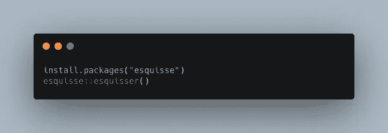

执行后，将会打开一个新窗口，这实际上是不言自明的:首先会要求您从指定的环境中打开一个数据框，随后，您可以简单地将数据框的特征拖放到 x、y、填充、颜色和大小的相应区域。底部的菜单使您能够进一步设计和调整您的绘图。

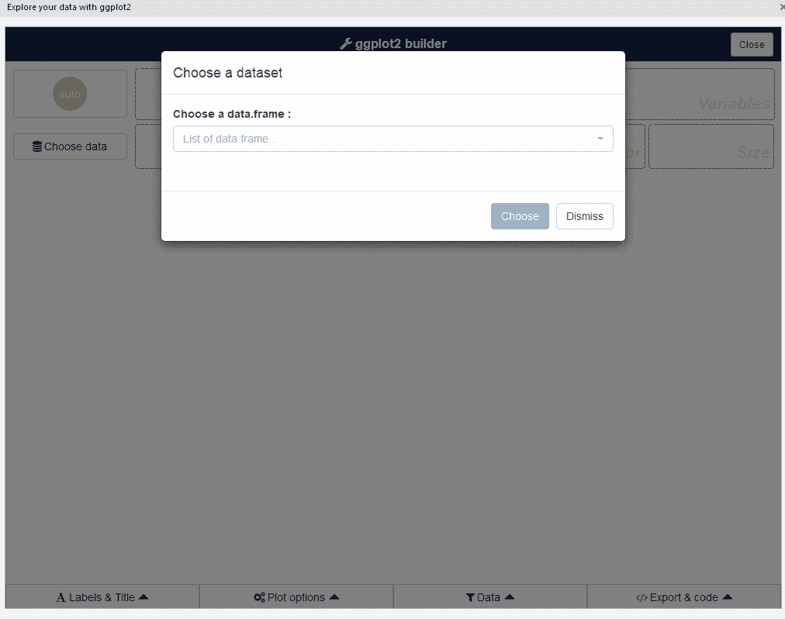

来自[https://github.com/dreamRs/esquisse](https://github.com/dreamRs/esquisse)的 esquisse 可视化

要了解关于这个伟大的软件包的更多信息，它使创建令人惊叹的 ggplots 变得超级容易(特别是对于初学者)，请访问[官方文档页面](https://dreamrs.github.io/esquisse/articles/get-started.html)。

# gganimate 为您的绘图制作动画

您是否厌倦了静态图表，并希望在演示文稿或 web 上的图表中添加一些额外的内容？使用 **gganimate** 您可以使用一个易于 ggplot2 用户学习的 API 来创建动画。要开始，您首先需要安装两个软件包:

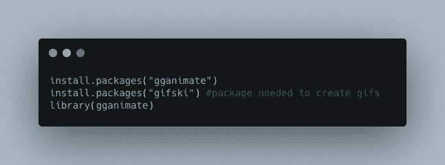

不错！现在让我们创建一个动画。例如，如果您想要绘制著名的虹膜数据的花瓣宽度和长度，并创建一个过渡到物种的动画图(分别绘制它们)，您可以执行以下操作:

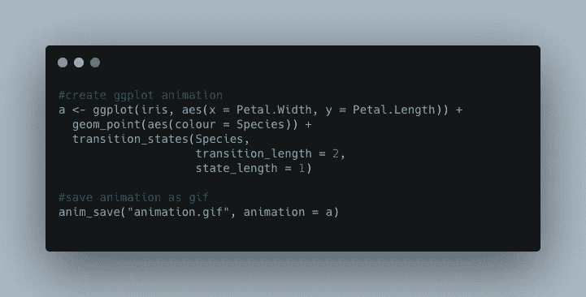

您可以看到创建绘图的标准 ggplot2 命令，随后是 **transition_states()** 函数，该函数通过声明动画的状态(您可以将其视为电影或动画中的帧)、两个状态之间的长度(延迟)以及状态长度来创建动画。

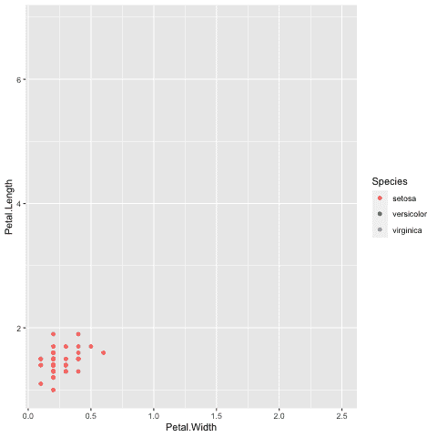

带 gganimate 的动画虹膜数据集—图片由作者提供

这个软件包的文档非常优秀，因此，如果你想更深入地了解 **ggplot2** 的动画，请访问[https://gganimate.com/](https://gganimate.com/articles/gganimate.html)

# ggplot 主题—为您的绘图添加一些风格

默认情况下 ggplots 看起来很棒，但有时我们希望创建符合某个主题的时尚剧情。以下是 ggplot 扩展的概述，它使您能够轻松地更改默认主题:

## 考普特

> “ [cowplot 包](https://github.com/wilkelab/cowplot)是 ggplot 的一个简单附件。它提供了各种有助于创建出版物质量的图形的功能，例如一组主题、对齐图形并将它们排列成复杂复合图形的功能，以及便于注释图形和/或将图形与图像混合的功能。”—来自[https://github.com/wilkelab/cowplot](https://github.com/wilkelab/cowplot)

Cowplot 创造了一个看起来很棒的独特的最小视觉化。您可以通过简单地添加 **theme_cowlplot()将任何图转换为 cowplot。**如果你想给主题添加一个网格，你可以使用 **theme_minimal_hgrid()** 作为水平线。

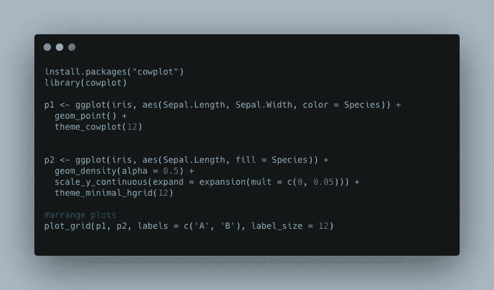

另请注意，cowplot 包括用于排列图的函数，例如用于创建以下可视化的 plot_grid()函数:

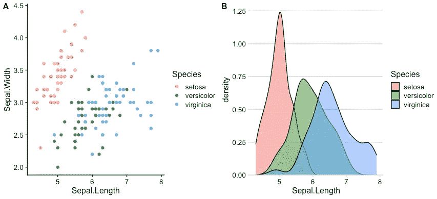

典型的 cowplot 主题—作者图片

## ggpubr

> “ggpubr”包提供了一些易于使用的功能，用于创建和定制基于“ggplot2”的出版就绪图。—来自[https://rpkgs.datanovia.com/ggpubr/](https://rpkgs.datanovia.com/ggpubr/)

该软件包提供了创建时尚图形的自定义功能，接下来，我想向您展示我最喜欢的三个:

*   gg 密度
*   ggviolin
*   ggdotchart

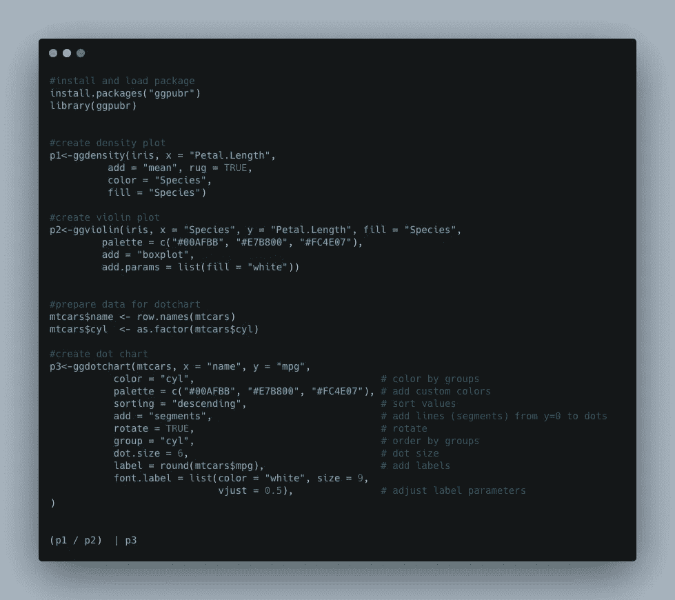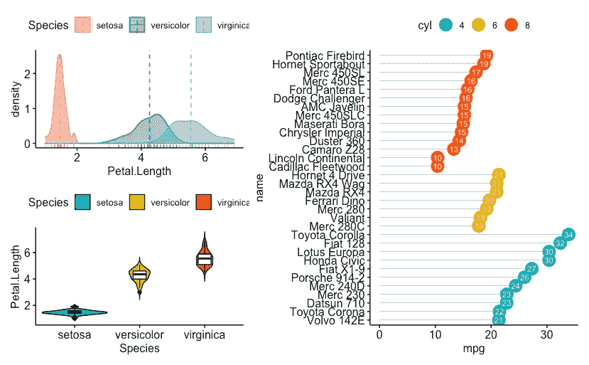

ggpubr 包中的密度、小提琴和点阵图—图片由作者提供

## 更多主题

ggplot 主题的世界似乎是无穷无尽的，不可能在本文中介绍所有的主题。然而，如果你没有足够的，这里有几个参考，希望能帮助你找到适合你的主题:

*   **可用 ggplot 主题的详细列表:**[https://yutannihilation . github . io/allyourfigurearebelongtus/1/](https://yutannihilation.github.io/allYourFigureAreBelongToUs/1/)
*   `ggtech`**——包含基于 AirBnb、脸书和谷歌等大型科技公司的主题的包:**[https://github.com/ricardo-bion/ggtech](https://github.com/ricardo-bion/ggtech)
*   `hrbrthemes` **-为 gg plot 2:**https://github.com/hrbrmstr/hrbrthemes 提供以排版为中心的主题和主题组件的包
*   `tvthemes` - **根据《辛普森一家》、《权力的游戏》或《海绵宝宝》等人人喜爱的电视剧，收集各种 ggplot 主题:**[https://github.com/Ryo-N7/tvthemes](https://github.com/Ryo-N7/tvthemes)

## 更好的情节的相关材料

**[1]gg plot 2 扩展列表:**[https://exts.ggplot2.tidyverse.org/gallery/](https://exts.ggplot2.tidyverse.org/gallery/)

【https://davidgohel.github.io/ggiraph/】用图形**创建交互式 ggplots**

**【3】**卡森·西沃特，**基于网络的交互式数据可视化与 R，plotly，和 shiny:**[https://plotly-r.com/index.html](https://plotly-r.com/index.html)