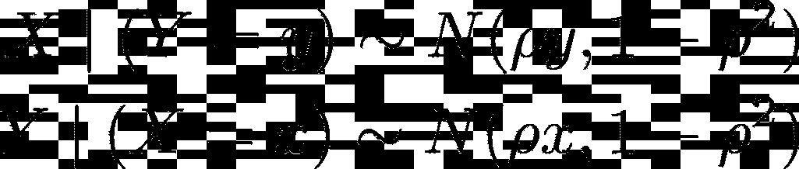
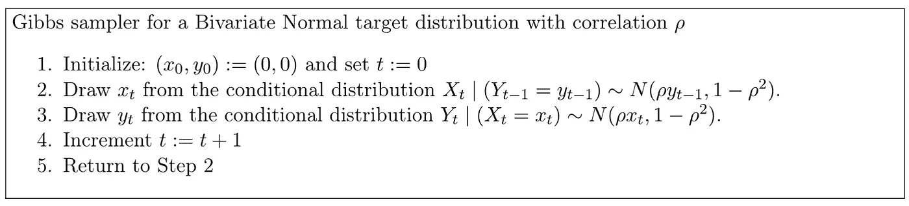
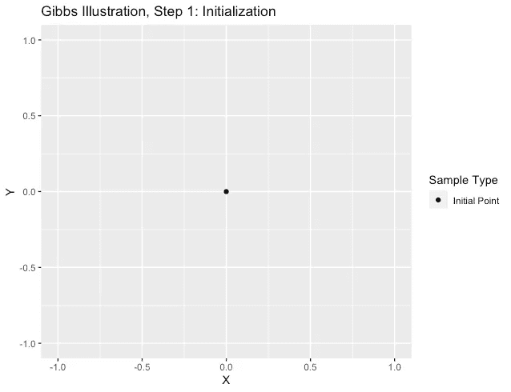
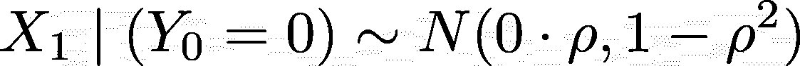
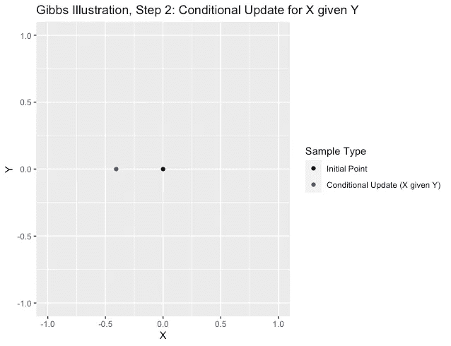
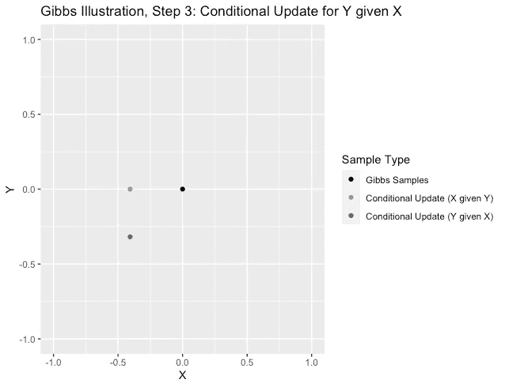
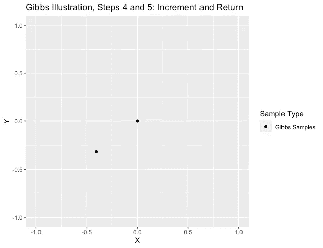
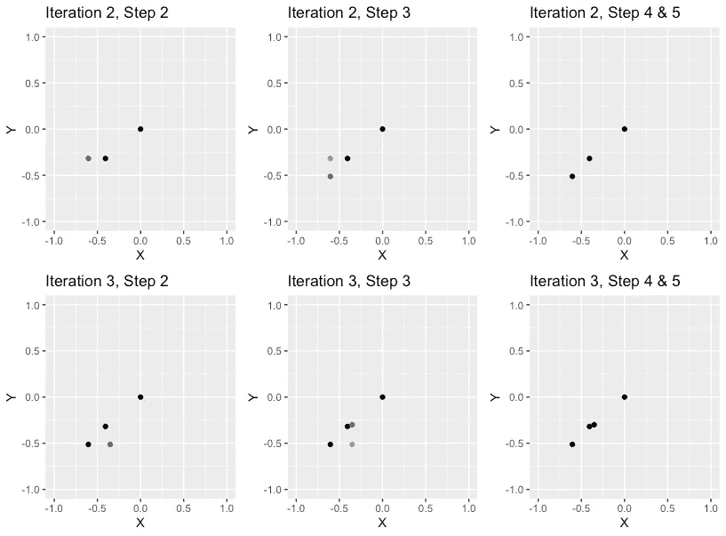
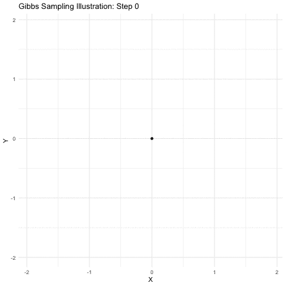

# 吉布斯采样解释

> 原文：<https://towardsdatascience.com/gibbs-sampling-explained-b271f332ed8d?source=collection_archive---------15----------------------->

## [实践教程](https://towardsdatascience.com/tagged/hands-on-tutorials)

## 通过视觉化建立直觉

# 介绍

从[政治学](https://imai.fas.harvard.edu/research/SMCredist.html)到[癌症基因组学](https://journals.plos.org/plosone/article?id=10.1371/journal.pone.0221764)，马尔可夫链蒙特卡罗(MCMC)已经被证明是各种不同领域统计分析的一个有价值的工具。在高层次上，MCMC 描述了一组迭代算法，这些算法从难以直接采样的分布中获取样本。这些基于马尔可夫链的算法与过去 30 年计算能力的惊人增长相结合，使研究人员能够从极其复杂的理论分布中进行采样。在软件中实现，如 [BUGS](https://www.mrc-bsu.cam.ac.uk/software/bugs/) (使用吉布斯采样的贝叶斯推理)和 [JAGS](https://mcmc-jags.sourceforge.io/) (只是另一个吉布斯采样器)，吉布斯采样是最流行的 MCMC 算法之一，应用于贝叶斯统计、计算语言学等领域。

**在本文中，我们将通过一系列可视化来揭示吉布斯采样的工作原理，**通过一个二元正态目标分布的简单示例进行追踪。

# 设置问题

假设有一个 m 分量感兴趣的联合分布，很难从中采样。即使我不知道如何从联合分布中抽样，假设我知道如何从完全条件分布中抽样。也就是说，我可以很容易地从 m 个分量的每一个中取样，条件是另一个 m-1。**在这些条件下，吉布斯采样基于全条件迭代地更新每个分量，以从联合分布中获得样本。**

为了确切了解这是如何工作的，让我们考虑一个简单的例子。假设我只能访问基 R，它可以很容易地对单变量法线进行采样，但不能对多变量法线进行采样。假设目标分布是二元正态分布，其中边际是具有相关性 *ρ的标准正态分布。*

目标分布

[利用多元正态分布](https://en.wikipedia.org/wiki/Multivariate_normal_distribution#Conditional_distributions)的性质，我们得到以下全条件分布。

完全条件分布

由于这些条件只是单变量法线，我可以很容易地从中取样。那么，用于联合分布的吉布斯采样算法将如下:

吉布斯采样算法

这个算法起初看起来有点吓人，所以让我们用一些可视化的方法来分解它。

# 遍历算法的一次迭代

让我们一步一步地完成吉布斯采样器的第一次迭代，其中 *ρ* 等于 0.9。

## *第一步:初始化*

这里没什么要做的，将(xₒ，yₒ)初始化为(0，0)并将迭代计数器 t 设置为 0。这是我们最初观点的一个非常无趣的情节。

步骤 1:初始化

## **步骤 2:给定 Y 的 X 的条件更新**

现在，我们从给定 Y 等于 0 的 X 的条件分布中得出。

给定 Y 的 X 的条件更新

在我的模拟中，这个平局的结果是-0.4。这是我们第一次条件更新的图表。请注意，我们新点的 Y 坐标没有改变。

步骤 2:给定 Y 的 X 的条件更新

## 步骤 3:给定 X，有条件地更新 Y

现在，我们从给定 X 等于-0.4 的 Y 的条件分布中得出。请注意，在进行第 3 步的绘制时，我们使用了刚刚在第 2 步中绘制的 X 值。

给定 X 的 Y 的条件更新

在我们的情况下，这个平局的结果是-0.32。这一次，我们的新点的 X 坐标与步骤 2 中的点的 X 坐标相同。

步骤 3:给定 X 的 Y 的条件更新

## 第 4 步和第 5 步

增加迭代计数器 *t* 并返回步骤 2。吉布斯采样器的这个迭代的最终点是(-0.4，-0.32)。我们现在有两个吉布斯样本。一个来自我们的初始化，一个来自我们的第一次迭代。

第 4 步和第 5 步:增量和返回

# 更多迭代

如果我们继续运行我们的算法(即运行步骤 2 到 5)，我们将继续生成样本。让我们运行迭代 2 和 3，并绘制结果，以确保我们已经得到了模式。

迭代 2 和 3

放下条件更新的中间图，我们可以绘制吉布斯采样器的前 100 次和 10，000 次迭代。

吉布斯采样图，前 100 次迭代

吉布斯采样图，前 10，000 次迭代

上面图上的蓝线是目标二元正态分布的等高线。我们的样本似乎是根据需要从目标分布中抽取的！我们的 Gibbs 抽样器确实从联合分布中提取数据。

*注意:为了方便起见，我没有在动画中使用真实的理论密度，而是使用了来自 MASS 包的 100，000 MVN 绘图的经验密度。*

# **总结**

本文展示了当我们能够访问完整的条件时，如何使用 Gibbs 抽样从复杂的联合分布中提取数据——从分层贝叶斯建模到计算集成，统计分析中的场景无时无刻不在出现。通过追踪一个二元正态目标分布的例子，我们对 Gibbs 抽样实际上是如何工作的建立了直觉。

*延伸阅读:*

[1]马克林，科里。“吉布斯采样”*中【2020 年 10 月 2 日【https://towardsdatascience.com/gibbs-sampling-8e4844560ae5】T4。*

*【2】马尔可夫链蒙特卡罗(MCMC)抽样介绍，第二部分:吉布斯抽样*。[https://www.tweag.io/blog/2020-01-09-mcmc-intro2/](https://www.tweag.io/blog/2020-01-09-mcmc-intro2/)。2021 年 5 月 23 日访问。

*来源:*

[1]:罗伯特·p·多布罗(2016)。随机过程导论。

*鸣谢:这篇文章的想法来自于我辅导哈佛统计学课程“Stat 171:随机过程介绍”我的学生让我帮助他们理解多布罗书中的例子 5.6，所以我创建了这篇文章中的 R 脚本。我为本文创建的算法和采样器来自 Dobrow 的例子。*