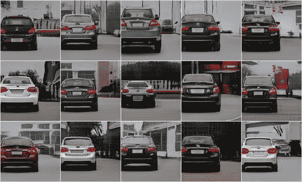
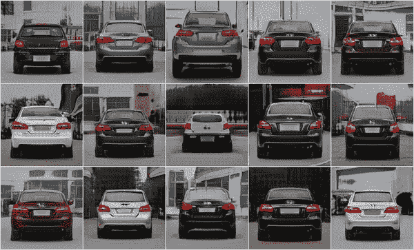
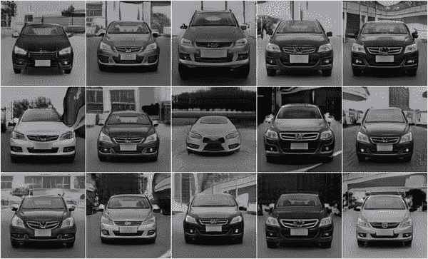
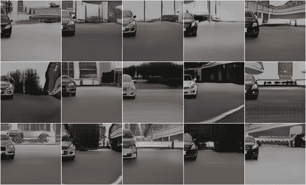

# 长颈鹿:仔细看看 CVPR 2021 最佳论文的代码

> 原文：<https://towardsdatascience.com/giraffe-a-closer-look-at-cvpr-2021s-best-paper-1ec81f593fa9?source=collection_archive---------12----------------------->

## GIRAFFE 是一个基于学习的、完全可区分的渲染引擎，用于将场景合成为多个“特征字段”的总和

使用 GIRAFFE 旋转和平移 GAN 生成的汽车(作者使用[https://github.com/autonomousvision/giraffe](https://github.com/autonomousvision/giraffe)创建，麻省理工学院许可)。

CVPR 2021 已经结束了，多么棒的论文选择！深度学习继续主导计算机视觉领域，有 SLAM、姿势估计、深度估计、新数据集、GANs 的新方法，以及对去年的[神经辐射场](https://www.matthewtancik.com/nerf) [ [1](https://arxiv.org/abs/2003.08934) ]，或 NeRFs 的许多改进，仅举几例。

到现在为止，你可能已经听说过一篇名为“[长颈鹿:将场景表示为合成生成神经特征场的论文。](https://m-niemeyer.github.io/project-pages/giraffe/index.html) [ [2](http://www.cvlibs.net/publications/Niemeyer2021CVPR.pdf) ]“这篇论文获得了今年最佳论文奖的大奖，它将 GANs、NeRFs 和可微分渲染结合在一起，生成了新颖的图像。然而，更重要的是，它提供了一个模块化的框架，以完全可区分和可学习的方式从对象构建和合成 3D 场景，让我们更接近神经 3D 设计的世界。在这篇文章中，我仔细查看了长颈鹿[的源代码](https://github.com/autonomousvision/giraffe)，并生成了一些快速的可视化示例。

# 神经辐射场

NeRF (YouTube)的可视化解释和演示。

简要回顾一下 NeRFs ，它们是一种根据 3D 体积中任何给定点的密度和亮度来描述和渲染 3D 场景的方法。它与[光场](https://en.wikipedia.org/wiki/Light_field)的概念密切相关，光场是表达光如何穿过给定空间的函数。对于空间中给定的 *(x，y，z)* 视点，图片将方向为 *(θ，φ)* 的光线投射到场景中。对于沿着这条线的每个点，我们收集它的密度和*视点相关的发射辐射*，并以类似于传统[光线追踪](https://en.wikipedia.org/wiki/Ray_tracing_(graphics))的方式将这些光线合成为单个像素值。这些 NeRF 场景是从各种姿势拍摄的图像集合中学习来的，就像你在[结构来自运动](https://en.wikipedia.org/wiki/Structure_from_motion)应用中使用的那样。

# 长颈鹿

长颈鹿的视觉解释和演示(YouTube)。

## 概观

本质上，GIRAFFE 是一个基于学习的完全可区分的渲染引擎，它允许您将场景合成为多个“特征场”的总和，这是 NeRFs 中辐射场的概括。这些特征场是 3D 体积，其中每个体素包含一个特征向量。通过合成由接受潜在代码作为 3D 场景输入的 GANs 产生的学习表示来构建特征场。由于特征字段应用于 3D 体积，因此您可以应用相似性变换，如旋转、平移和缩放。您甚至可以将整个场景合成为单个特征字段的总和。该方法对 NeRFs 进行了以下改进:

*   可以用独立的变换表示多个对象(和一个背景)(最初的 NeRF 只能支持一个“场景”,不能分解单个对象)。
*   可以对单个对象应用姿势和相似性变换，如旋转、平移和缩放。
*   产生特征字段的 gan 可以独立学习并像组件一样重用。
*   拥有经过端到端培训的独特渲染引擎。
*   颜色值不仅仅支持 RGB，还可以扩展到其他材质属性。
*   使用位置编码(如转换器)来编码位置，这也“引入了感应偏差来学习规范方向上的 3D 形状表示，否则这些表示将是任意的。”

长颈鹿项目包括[源代码](https://github.com/autonomousvision/giraffe)，你可以用它来复制它们的形象，甚至组成你自己的场景。我简要介绍了它们的源代码，并展示了我们如何使用 GIRAFFE 来构建一些简单的神经 3D 场景。

## 源代码

[GIRAFFE repo](https://github.com/autonomousvision/giraffe)的结构考虑了配置。`configs/default.yaml`文件指定了应用程序的默认配置。其他配置文件如`configs/256res/cars_256/pretrained.yaml`使用`inherit_from`键继承这个配置文件，并通过指定其他键-值对覆盖默认值。这使我们能够用`python render.py <CONFIG.yaml>`渲染图像，用`python train.py <CONFIG.yaml>`通过自文档化的配置文件进行训练，而不是编写输入参数。

要自己尝试一些渲染，首先运行`README.md`文件中的[快速启动指令](https://github.com/autonomousvision/giraffe#tl-dr---quick-start)。这将下载一个预训练的模型，并将一系列输出可视化(如下图所示)写入文件夹`out`。

对象随 Cars 数据集旋转(由作者使用[https://github.com/autonomousvision/giraffe](https://github.com/autonomousvision/giraffe)，麻省理工学院许可创建)。

配置文件只是采用默认值，并在 [Cars 数据集](http://ai.stanford.edu/~jkrause/cars/car_dataset.html)上插入一个预训练模型。它提供了很多可视化的方法来操作底层渲染，比如外观插值、形状插值、背景插值、旋转和平移。这些可视化在`render_program`键下的`configs/default.yaml`中指定，其值是指定这些可视化的字符串列表。这些指定了长颈鹿渲染器在调用`render.py`时将调用的“渲染程序”。在`im2scene.giraffe.rendering.Renderer`的`render_full_visualization`方法中，你会看到一系列的`if`语句，寻找更多渲染程序的名字，比如‘object _ translation _ circle’、‘render _ camera _ elevation’和‘render _ add _ cars’。

为什么我们不试试这些呢？创建一个名为`cars_256_pretrained_more.yaml`的新配置文件，并添加以下内容:

这只是我们用默认配置文件的`render_program`键使用的先前的配置文件，它被我们想要的新渲染程序覆盖了。现在执行`python render.py configs/256res/cars_256_pretrained_more.yaml`来产生更多的可视化效果。您应该会得到这样的结果:

Cars 数据集的摄像机仰角。请注意相机视角在背景和汽车侧面上是如何变化的，就好像相机从上向下绕着汽车旋转一样(作者使用[https://github.com/autonomousvision/giraffe](https://github.com/autonomousvision/giraffe)，麻省理工学院许可创建)。

…还有这个:

使用汽车数据集添加汽车(由作者使用[https://github.com/autonomousvision/giraffe](https://github.com/autonomousvision/giraffe)，麻省理工学院许可创建)。

这些渲染程序实际上是如何放置、平移和旋转这些汽车的？要回答这个问题，我们需要仔细看看`Renderer`类。对于上面的`'object_rotation'`示例，调用了`Renderer.render_object_rotation`方法。

该函数为给定批次的成员生成一系列旋转矩阵`r`。然后，它迭代地将这个范围的成员(以及一些默认的缩放和平移)传递给生成器网络的`forward`方法，该方法由`default.yaml`中的`generator`键指定。如果你现在看`im2scene.giraffe.models.__init__.py`，你会看到这个键映射到`im2scene.giraffe.models.generator.Generator`。

现在，在我们看`Generator.forward`的时候，请耐心等待。它接受各种可选的输入参数，比如`transformations`、`bg_rotation`和`camera_matrices`，然后将它们传递给它的`volume_render_image`方法。这里是合成魔法发生的地方。场景中所有物体的潜在代码，包括我们的背景，被分离成它们的形状和外观部分。

在本例中，这些潜在代码是使用`torch.randn`函数随机生成的:

这是解码器正向传递将 3D 点和摄像机观察方向映射到每个对象的*和 RGB(特征)值的地方。一个不同的发生器被应用于背景(为了可读性，省略了细节)。*

*然后，这些图由 *σ* max 或使用`composite_function`的平均值合成。*

*最后，通过沿着射线向量用 *σ* 体积对特征图进行加权来创建最终图像。最终结果是你在上面看到的那些动画之一的单个窗口中的单个帧(关于如何构造`di`和`ray_vector`的细节，见`generator.py`)。*

*现在总结一下，让我们试着创建自己的渲染程序。这个将简单地结合深度平移和旋转来创建一个汽车从左向右旋转和滑动的效果。为此，我们对`rendering.py`中的`Renderer`类做了一些简单的添加。*

*将这些添加内容复制粘贴到`rendering.py`中，然后创建如下配置文件`configs/256res/cars_256_pretrained_wipeout.yaml`:*

*现在，如果您执行`python render.py configs/256res/cars_256_pretrained_wipeout.yaml`,您应该能够产生如下所示的结果:*

**

*对象与汽车数据集“相消”。注意汽车从左向右移动时是如何旋转的(作者使用[https://github.com/autonomousvision/giraffe](https://github.com/autonomousvision/giraffe)，麻省理工学院许可创建)。*

# *结论*

*长颈鹿是最近对神经纤维和甘的大量研究中令人兴奋的新发现。辐射场表示描述了一个强大且可扩展的框架，利用该框架我们可以以可区分且可学习的方式构建 3D 场景。我希望对代码的深入研究对您有所帮助。如果是这样的话，我鼓励你自己去看一看源代码和作者的论文。*

# *参考*

*[1] Ben Mildenhall，Pratul P. Srinivasan，Matthew Tancik，Jonathan T. Barron，Ravi Ramamoorthi，Ren Ng — [NeRF:将场景表示为用于视图合成的神经辐射场(2020)](https://arxiv.org/abs/2003.08934) ，ECCV 2020*

*[2] Michael Niemeyer，Andreas Geiger — [长颈鹿:将场景表示为合成生成神经特征场(2021)](https://arxiv.org/abs/2011.12100) ，CVPR 2021*