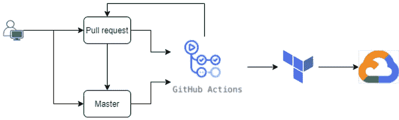
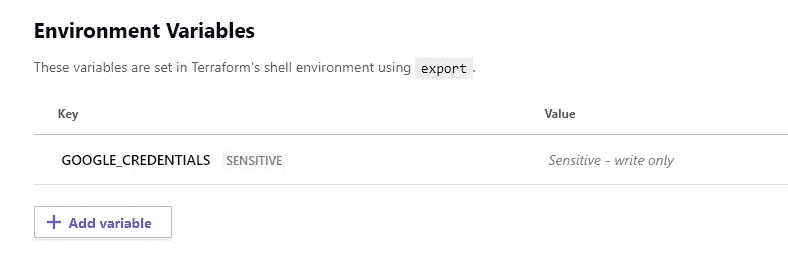
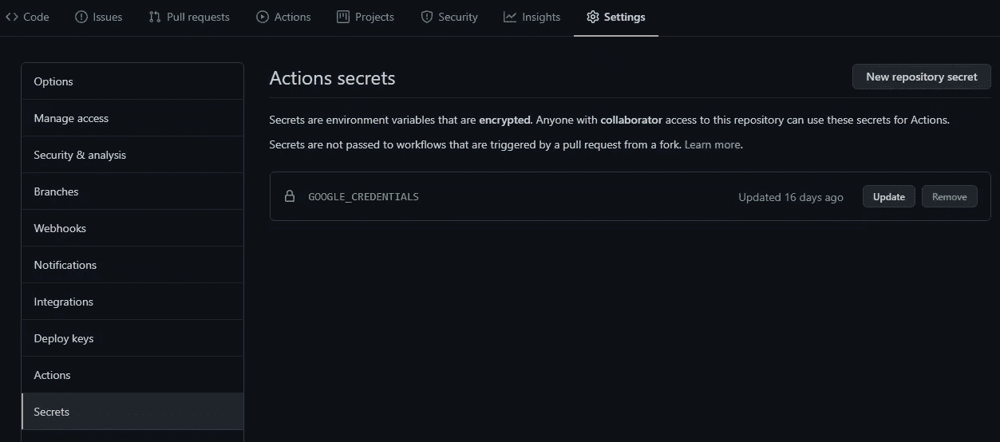
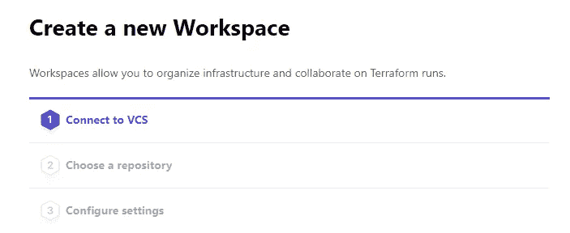
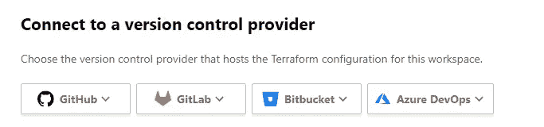
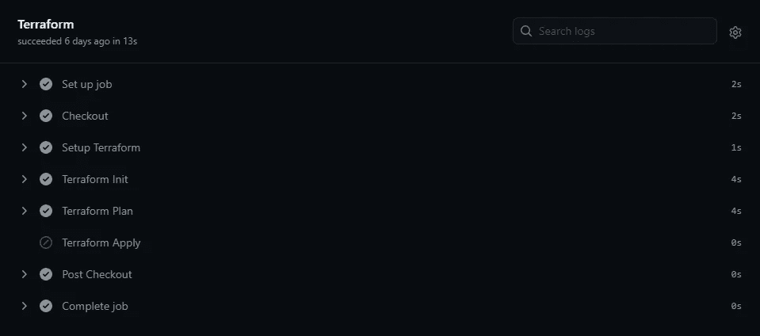
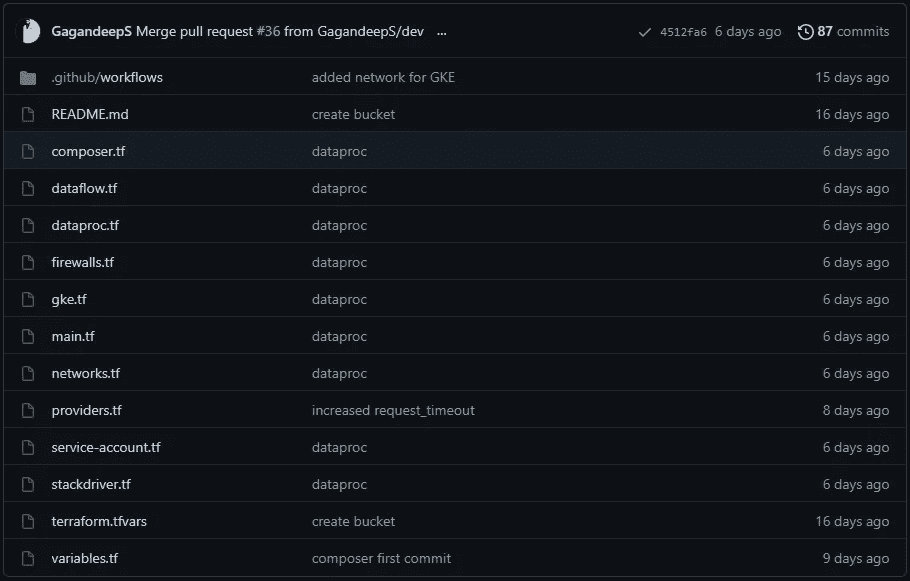

# 数据运营—为数据工程师和科学家提供 Git 行动和平台— GCP/AWS/Azure

> 原文：<https://towardsdatascience.com/git-actions-terraform-for-data-engineers-scientists-gcp-aws-azure-448dc7c60fcc?source=collection_archive---------14----------------------->

## 在接下来的 10 分钟内，您将学到一些东西，从而丰富您的数据之旅。有了这个职位，数据工程师和科学家可以轻松地 CICD 基础设施。

我坚信，在 POC 一个新的设计或代码模板，并得到其他工程师的审查，因为你永远不知道你错过了什么有效的细微差别，它总是好的有一套新的眼睛审查代码。我倾向于使 POC 尽可能接近 MVP(最小可行产品),以使我自己和团队对设计更有信心，并且不会在以后的回归测试中浪费任何时间。这也有助于更好、更准确地评估我的交付任务。但是当我不得不依赖 DevOps 团队在开发环境中‘基础设施即代码’(IAC)我的项目时，问题就出现了。在生产环境中，最好让他们参与到基于他们所学的最佳实践的基础架构开发中，但是在开发环境中，只需等待他们对您的任务进行优先级排序，就可以让您的 MVP 脱轨。

因此，几年前我开始学习 DevOps/DataOps，并从 Cloudformation (CFN)和 Atlassian Bamboo 开始，因为我主要从事 AWS 工作，该组织正在使用 Bamboo。但是最近，我有机会接触 Terraform (TF)和 Github Actions，因为我被要求在 GCP 上工作，亲爱的，哦，亲爱的，它太容易掌握和学习了，因为有了 TF 和 Actions，你可以在任何云中部署。对于数据工程师、科学家或分析师来说，如果您知道 IAC 工具，它会变得非常方便。由于 Github 动作离你的代码更近，对我来说变得更加方便。

因此，我将把它分成三个简单的部分:

1.  将 TF cloud 集成到 Github
2.  运行 TF 步骤的 Github 操作工作流
3.  基于最佳实践的 TF 文件概述

# 将 Terraform 云集成到 Github

首先，TF 有一个社区版本，所以继续在那里创建一个帐户。下面是链接:【https://www.terraform.io/cloud[。它会要求您确认您的电子邮件地址和一切，所以我假设这一步结束时已经完成。此外，为了完成这些步骤，如果您在 GCP 或任何云中有自己的帐户，那就太好了。还有你自己的 Github 账号。](https://www.terraform.io/cloud)

**步骤 2:** TF 有其层次结构，其中每个组织有多个工作区，每个工作区与 repo 中的 IAC Github 分支有一对一的映射，您将在其中推送更新的 Terraform 文件(最佳实践)。文件是用哈希公司的配置语言(HCL)编写的，这有点类似于 YAML。因此，这个想法是，每当你将一个新的更新(或合并一个 PR)推送到 Github 分支时，Github-actions 将在 TF cloud 上执行并运行带有新变更集的计划。由于 TF cloud 链接到 GCP(稍后)，它将更新 GCP 的资源。



CICD 工艺流程

在您的 Terraform 社区帐户中创建一个组织和其中的工作空间。

**第三步:**假设您有自己的 GCP 帐户，在您希望部署资源的项目中创建一个服务帐户，复制它的密钥并将其作为 GOOGLE_CREDENTIALS 放入环境变量 Terraform 变量中。如果您使用 AWS，那么您需要输入 AWS_ACCESS_KEY_ID 和 AWS_SECRET_ACCESS_KEY。



此变量包含 JSON 中服务帐户机密的内容

此 GCP 服务帐户将用于部署资源，因此它应该具有编辑角色或有权部署资源的访问级别。

您也可以在 Github secrets 中创建一个秘密，如下所示，并使用${{ secrets 从那里传递凭证。Github 中的 GOOGLE_CREDENTIALS }}操作如下。



**步骤 4:** 在创建工作空间时，它会让你选择 github repo，这样它就可以在内部进行身份验证，否则你必须在 Terraform 中生成一个令牌，并将其保存在 Github secrets 中，以便在 Github actions 中的' *Setup Terraform'* 步骤中使用。



通过选择其中的任何一个，它将在需要时自动进行身份验证

# 运行 TF 步骤的 Github 操作工作流

需要放入以下 Github 操作脚本。github/workflow/ folder 作为 anyname.yml。这是一个特定作业中的连续步骤，当有人在 repo 中推出新的更改时该做什么。下面，github actions 将使用 ubuntu-latest 中的 bash 来检查代码、设置 terraform 并运行 terraform init、plan 和 apply。

```
name: 'Terraform CI'on:
  push:
    branches:
    - main
  pull_request:jobs:
  terraform:
    name: 'Terraform'
    runs-on: ubuntu-latest# Use the Bash shell regardless whether the GitHub Actions runner is ubuntu-latest, macos-latest, or windows-latest
    defaults:
      run:
        shell: bashsteps:
    # Checkout the repository to the GitHub Actions runner
    - name: Checkout
      uses: actions/checkout@v2# Install the latest version of Terraform CLI and configure the Terraform CLI configuration file with a Terraform Cloud user API token
    - name: Setup Terraform
      uses: hashicorp/setup-terraform@v1# Initialize a new or existing Terraform working directory by creating initial files, loading any remote state, downloading modules, etc.
    - name: Terraform Init
      run: terraform init
      env:
        GOOGLE_CREDENTIALS: ${{ secrets.GOOGLE_CREDENTIALS }}# Checks that all Terraform configuration files adhere to a canonical format
#    - name: Terraform Format
#      run: terraform fmt -check# Generates an execution plan for Terraform
    - name: Terraform Plan
      run: terraform plan
      env:
        GOOGLE_CREDENTIALS: ${{ secrets.GOOGLE_CREDENTIALS }}# On push to main, build or change infrastructure according to Terraform configuration files # && github.event_name == 'push'
      # Note: It is recommended to set up a required "strict" status check in your repository for "Terraform Cloud". See the documentation on "strict" required status checks for more information: [https://help.github.com/en/github/administering-a-repository/types-of-required-status-checks](https://help.github.com/en/github/administering-a-repository/types-of-required-status-checks)
    - name: Terraform Apply
      if: github.ref == 'refs/heads/master'
      run: terraform apply -auto-approve
      env:
        GOOGLE_CREDENTIALS: ${{ secrets.GOOGLE_CREDENTIALS }}
```



# Terraform 文件概述

现在 terraform 只读取那些有。tf 扩展到它或。但是有一些文件需要按原样命名，而其他文件只是资源抽象，将按无序执行，除非您使用 *depends_on 提到依赖关系。Main.tf、variables.tf* 和 *terraform.tfvars* 是需要创建的同名文件。



数据工程项目的地形文件

main.tf:所有的资源及其适当的配置值都可以在这里提到。例如，如果您想要创建一个存储桶，则可以用 HCL 编写，如下所示:

```
resource “google_storage_bucket” “bucket” { 
    name = “dev-bucket-random-12345”
}
```

variables.tf:顾名思义，它有如下带有默认值的变量，您希望在其他资源或。类似 *${var.region}的 tf 文件。*这更像是把变量放在不同的 variables.tf 文件中的惯例，但是你也可以把它放在 main.tf 中。

```
variable “region” { 
    type = string 
    default = “australia-southeast1”
}
```

terraform.tfvars:这将包含上面定义的变量的实际值。本质上，如果下面没有提到 region，那么它将采用上面的默认值。

```
project_id = “bstate-xxxx-yyyy”
region = “australia-southeast1”
```

其余的文件将不同类型的资源抽象到不同的文件中。例如，networks.tf 将拥有 VPC 和子网资源，stackdriver.tf 将拥有警报和监控仪表板，dataproc.tf 将拥有集群和节点资源，类似的还有防火墙、GKE 等。

对于那些不知道的人，TF 和 CFN 都有文档，这些预定义的*功能*或资源配置可以帮助我们理解选项的含义。以下是 GCP:[https://registry . terraform . io/providers/hashi corp/Google/latest/docs](https://registry.terraform.io/providers/hashicorp/google/latest/docs)

# 示例监控通道

在以下示例中，为 Stackdriver 警报创建了一个监视通道。所有字段都是自解释的，来自 GCP Terraform 文档，在输出变量“gsingh_id”的帮助下，您可以在任何中直接使用它。tf 文件或者不想指定输出，可以直接这样用:*Google _ monitoring _ notification _ channel . gsingh*

```
resource "google_monitoring_notification_channel" "gsingh" {
  display_name = "xxxx@yyyy.com"
  type = "email"
  labels = {
    email_address = "xxxx@yyyy.com"
  }
}

output "gsingh_id" {
  value = "${google_monitoring_notification_channel.gsingh.name}"
}
```

下面创建了一个子网，VPC 以类似的方式被指定为该子网的依赖项。

```
resource "google_compute_subnetwork" "vpc_subnetwork" {
  name          = "subnet-01"
  network       = google_compute_network.vpc_network.self_link
  private_ip_google_access = true
  ip_cidr_range = "10.xx.xx.xx/19"
  region        = "australia-southeast1"
  depends_on = [
    google_compute_network.vpc_network,
  ]
}
```

# 结论

如前所述，每当您向这个 repo 推送新的变更时，Git actions 将从主分支签出代码，并运行 Terraform Init、Plan 和 Apply 以在云中部署变更。在接下来的几天里，我将发表一系列文章，介绍如何通过 Git 操作在 GKE 集群上部署 Flink 应用程序，这也将让您了解如何使用 Git 操作构建 Scala 应用程序。敬请关注。