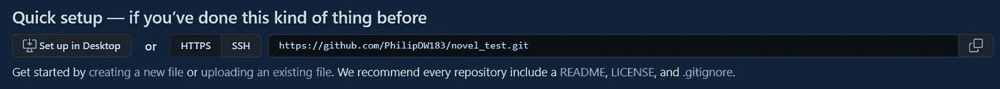

# 面向数据科学家的 Git 和 GitHub 基础知识

> 原文：<https://towardsdatascience.com/git-and-github-basics-for-data-scientists-b9fd96f8a02a?source=collection_archive---------3----------------------->

## UCL 数据科学研讨会 8:什么是 Git，创建本地存储库，提交第一批文件，链接到远程存储库


照片由[扬西·敏](https://unsplash.com/@yancymin?utm_source=medium&utm_medium=referral)在 [Unsplash](https://unsplash.com?utm_source=medium&utm_medium=referral) 上拍摄

今年，作为 UCL 数据科学学会的科学负责人，该学会将在整个学年举办一系列 20 场研讨会，涵盖的主题包括数据科学家工具包 Python 和机器学习方法简介。每一篇文章的目标都是创建一系列的小博客，这些小博客将概述要点，并为任何希望跟进的人提供完整研讨会的链接。所有这些都可以在我们的 [GitHub](https://github.com/UCL-DSS) 资源库中找到，并将在全年更新新的研讨会和挑战。

本系列的第八个研讨会是 Git 和 GitHub 简介，我们将介绍什么是 Git 和 GitHub，创建您的第一个存储库，进行第一次提交，然后将其链接到远程存储库。关于分支、秘密文件和返回到先前提交的更多细节也可以在我们的 [GitHub 页面](https://github.com/UCL-DSS/git-workshop)上找到。

如果您错过了我们之前的任何研讨会，您可以在以下链接中找到最后三个:

</an-introduction-to-plotting-with-matplotlib-in-python-6d983b9ba081>  </ucl-data-science-society-pandas-8ad28c2b22e5>  </ucl-data-science-society-introduction-to-numpy-7d962d63f47d>  

## Git 是什么，为什么？

据 [Git 网站](/ucl-data-science-society-introduction-to-numpy-7d962d63f47d)报道:

> *Git 是一款* [*免费开源*](https://git-scm.com/about/free-and-open-source) *分布式版本控制系统，旨在快速高效地处理从小到大的各种项目。*

包括:

*   充当工业生产标准
*   在黑客马拉松中使用
*   用于写书
*   用于保存讲义和实用笔记
*   任何其他用途…

Git 本身与 GitHub 的区别在于，Git 是一个管理项目版本控制的系统，而 GitHub 是一个使用 Git 托管项目的远程平台。这意味着，虽然可以使用 Git 系统，但不一定必须使用 GitHub，除非您希望在另一个平台上备份您的存储库。

## 你的第一个 Git 回购

为了与 Git 和 GitHub 进行交互，我们将不再使用我们已经拥有的 Jupyter 笔记本，而是使用命令线/终端进行交互。为此，特别是与 GitHub 操作相关的，我倾向于使用 GitBash，它允许我与 GitHub 很好很容易地交互，但是你可以在 Mac 上使用你自己的术语，或者在 Windows 上使用 Bash。

为了创建项目，我们需要为您的项目创建一个目录/文件夹。在命令行中，我们可以使用`mkdir`命令，后跟文件夹的名称，这将在您的机器上创建一个文件夹。

```
 mkdir my-novel
```

然后，我们使用`cd`命令通过命令行导航到该文件夹，这将允许我们按如下方式更改目录:

```
cd my-novel
```

一旦我们进入那个目录，我们就可以用 Git 初始化项目，这样 Git 就可以使用`git init`命令来管理项目的版本:

```
git init
```

现在，您的目录中应该有一个`.git`文件夹，它现在应该是不可见的。您刚刚创建的项目应该被称为*本地工作区*。

## 承诺回购

当然，现在我们已经创建了存储库，然后我们需要实际填充它！我们可以继续使用命令行创建我们小说的开头，使用`nano`命令打开一个文本编辑器开始创建一个文件。在我们的例子中，我们可以将这个 intro.txt 称为:

```
nano intro.txt
```

你可以继续写你自己的小说介绍。完成后，您可以使用命令`ctrl o`保存文件，然后使用`ctrl x`退出文件。

在我们提交我们的变更之前，为了确保我们在最初的工作过程中有一个记录，我们需要将我们的变更添加到阶段中(或者称为阶段化变更)。这是使用`git add`命令完成的，通过该命令，您可以指定您想要添加的文件名，也可以使用`.`来指定任何更改，如下所示:

```
git add intro.txt
```

然后，我们可以使用`status`命令检查我们的阶段，如下所示:

```
git status
```

我们将会看到

```
On branch master

No commits yet

Changes to be committed:
  (use "git rm --cached <file>..." to unstage)

	new file:   intro.txt
```

对我们来说关键的事情是，这告诉我们有新的文件`intro.txt`要提交，但是到目前为止我们还没有提交。

记住这一点，然后我们可以使用`commit`命令提交我们的更改。这里的关键是我们可以使用`-m`参数，在此之后，我们指定一个注释字符串来解释您正在提交的内容、您所做的任何更改以及为什么会这样。这只是确保你记住你所做的任何重要的改变，这样如果你的代码终止了，或者在我们的例子中，我们想要撤销我们小说的一个章节，我们知道根据消息返回哪个提交。这里我们可以这样做:

```
git commit -m "Initialise the novel with an intro chapter"
```

我们已经为这个项目做出了我们的第一份贡献！

## 促成远程回购

当然，在我们的本地机器上进行所有的修改对于版本控制来说是非常好的(不再有最终的最终版本 27.txt 文件！)，但是如果我们希望与其他人协作，或者我们希望有一个远程备份以防出现问题，该怎么办呢？为此，我们可以使用 GitHub 的魔力。

为此，我们需要创建一个 GitHub 帐户并初始化一个新的存储库。为此，一旦你建立了你的帐户，你需要创建一个新的存储库，但要确保你不要用自述文件、许可证或`gitignore`文件来初始化它，因为这会产生错误。不过不要担心，您可以在推送到远程存储库之后创建这些文件。

因为我们已经提交了我们自己的本地存储库，所以我们需要做的就是将远程存储库链接到我们自己的存储库。为此，我们需要使用存储库 url，它位于以下位置:



作者图片

在您的项目中，我们可以通过我们的终端使用`git remote add origin`链接该项目，如下所示:

```
git remote add origin <REMOTE_URL>
```

确保你使用的是你自己的网址。

然后，我们可以使用`git remote -v`来验证这个连接，它将打印出您指定的远程 url。现在我们已经连接到了我们的远程存储库！

然而，这里的一个问题是，我们没有设置推送到远程原点的确切位置。虽然我们有本地存储库，但在我们的远程存储库中还没有分支。为此，我们可以指定:

```
git push --set-upstream origin HEAD:master
```

这将告诉存储库的当前负责人将其推送到我们存储库中的主分支。

然后，我们可以通过指定按如下方式推送`HEAD`来首次推送我们的远程存储库:

```
git push origin HEAD
```

这意味着在我们添加并提交所有文件后，我们需要做的就是在将来使用`git push`，这很简单！您可以通过访问 GitHub 帐户中的存储库来检查以确保您的文件在远程存储库中，并且文件应该在那里。这将允许你不仅将你的工作存储在一个远程存储库上，还可以与其他程序员协同工作！

现在，您已经创建了您的第一个本地存储库，提交了您的文件，然后将它们推送到远程存储库。在实践本身中，提供了关于分支的更多细节。gitignore 文件(为了保密！)以及返回到以前的提交，这些都可以在这里 **找到 [**。**](https://github.com/UCL-DSS/git-workshop)**

如果您想了解我们协会的更多信息，请随时关注我们的社交网站:

https://www.facebook.com/ucldata:[脸书](https://www.facebook.com/ucldata)

insta gram:[https://www.instagram.com/ucl.datasci/](https://www.instagram.com/ucl.datasci/)

领英:[https://www.linkedin.com/company/ucldata/](https://www.linkedin.com/company/ucldata/)

如果你想了解 UCL 数据科学协会和其他优秀作者的最新信息，请使用我下面的推荐代码注册 medium。

<https://philip-wilkinson.medium.com/membership>  

我的其他媒体文章可在以下网址找到:

</introduction-to-random-forest-classifiers-9a3b8d8d3fa7>  </introduction-to-decision-tree-classifiers-from-scikit-learn-32cd5d23f4d> [## scikit-learn 决策树分类器简介

towardsdatascience.com](/introduction-to-decision-tree-classifiers-from-scikit-learn-32cd5d23f4d) </multi-variate-outlier-detection-in-python-e900a338da10> 