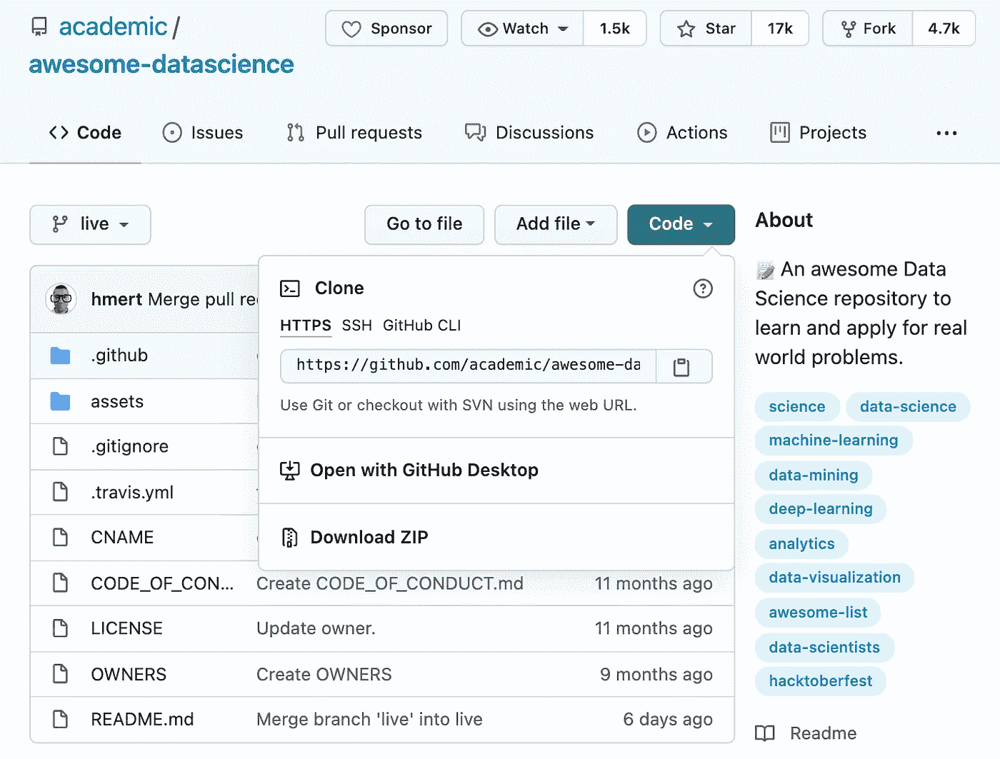
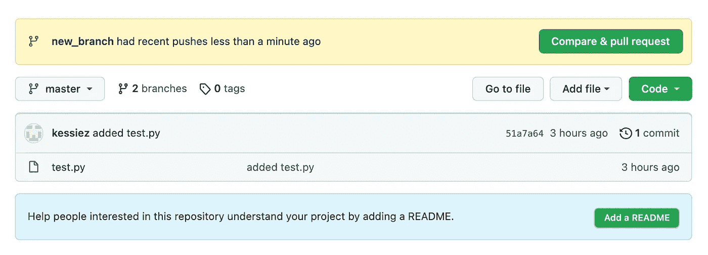
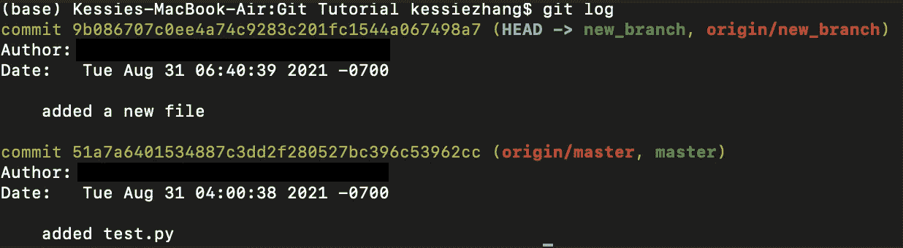

# 数据科学家 Git 备忘单

> 原文：<https://towardsdatascience.com/git-cheat-sheet-for-data-scientists-fa0bfdd3690c?source=collection_archive---------28----------------------->

## 入门指南


由 [Roman Synkevych](https://unsplash.com/@synkevych?utm_source=unsplash&utm_medium=referral&utm_content=creditCopyText) 在 [Unsplash](https://unsplash.com/s/photos/git?utm_source=unsplash&utm_medium=referral&utm_content=creditCopyText) 上拍摄

Git 是一个免费的开源版本控制系统。大多数程序员和数据科学家每天都与 git 进行交互。那么什么是版本控制呢？版本控制是我们作为程序员跟踪代码变更的一种方式，也是与其他程序员合作的一种方式。这允许我们回顾我们随着时间的推移所做的所有更改，这有助于我们了解我们在何时做了什么，以及如果需要的话，转换回先前的代码版本。你可能之前听说过 Github，可能想知道 Git 和 Github 有什么区别。需要注意的是，Git 和 Github 并不相同。Github 是一个基于云的托管服务，托管和管理 Git 存储库，它扩展了 Git 的基本功能。除了 Github，还有 Bitbucket、GitLab、Codebase、Launchpad 等很多其他服务。在本文中，我将分享一些常见的 Git 命令以及一些比较和它们的用例。

## Git 如何工作的基本概述:

1.  用 git 托管工具(比如 Github)创建一个“存储库”(项目)

```
git init
```

当你输入`git init`的时候，确保你在你的项目的一个根文件夹中，否则，git 将会跟踪你电脑上的所有文件并且减慢所有的速度。如果你不小心在错误的地方输入了`git init`，你可以通过输入`rm -rf .git`来撤销。

2.添加远程存储库/将存储库复制(或克隆)到本地机器

```
//add the remote repository
▶️ git remote add origin <HTTPS/SSH>// clone the repository
▶️ git clone <HTTPS/SSH>
```



使用代码下拉列表查找 HTTPS/SSH URL。(作者截图)。参考:[https://github.com/academic/awesome-datascience](https://github.com/academic/awesome-datascience)

3.创建一个“分支”(可选，但推荐)

```
//create a new branch and switch to it at the same time
▶️ git checkout -b <branch-name>
▶️ git switch -c <branch-name>//simply switch to an existing branch
▶️ git checkout <branch-name>
▶️ git switch <branch-name>
```

`git switch`不是一个新特性，而是重载的`git checkout`命令的附加命令。`git checkout`可以用来切换分支，恢复工作树文件，也可以混淆。为了分离功能，GIT 社区引入了这个`git switch`命令。

4.要使特征分支保持新鲜，并与主分支中的最新更改保持同步，请使用 rebase

```
▶️ git pull
▶️ git pull --rebase origin master
```

我们经常看到冲突发生在这一步。在此步骤中解决冲突有助于保持要素分支历史的整洁，并使最终合并更加容易。

虽然`git pull`和`git rebase`紧密相连，但它们不可互换。`git pull`从远程获取当前分支的最新变更，并将这些变更应用到分支的本地副本。一般来说，这是通过 git [merge](https://www.atlassian.com/git/tutorials/using-branches/git-merge) 完成的，即本地变更被合并到远程变更中。所以 git 拉同时类似于`git fetch` + `git merge`。

`git rebase`允许我们在远程主分支上应用我们的更改，这给了我们一个更清晰的历史。这是合并的替代方案。使用此命令，您所做的本地更改将基于远程更改之上，而不是与远程更改合并。

5.将文件添加到本地存储库中或对文件进行一些更改，然后在准备好保存更改时将其放入暂存区

```
//Add one file
▶️ git add <file-name>//Add all the new/modified/deleted files to the staging area
▶️ git add -A (note: -A is shorthand for --all)//Stages files in the current directory and not any subdirectories, whereas git add -A will stage files in subdirectories as well.
▶️ git add .//Stage all new and modified files. The previous commands will also remove a file from your repository if it no longer exists in the project. 
▶️ git add --ignore-removal//Stage all modified and deleted files
▶️ git add -u (note: -u is shorthand for --update)
```

5.“提交”(保存)更改

`git commit -m “message about the changes you've made”`

6.将您的更改“推”到您的分支

`git push origin <branch-name>`

git set-upstream 允许您为当前的本地分支设置默认的远程分支。您可以通过添加`-u`、`git push -u origin <branch-name>`来设置上游。这个命令将把`<branch-name>`分支设置为默认分支，这允许您推送更改，而不需要指定您正在推送的分支。设置了上游之后，下次当您将一些更改推送到远程服务器时，您可以简单地键入`git push`。

8.打开一个“拉请求”(又名“PR”)，请求将变更合并到主分支

拉式请求是一个让开发者更容易协作的特性。一旦开发人员创建了一个拉请求，团队的其他成员就可以检查代码，然后将新的变更合并到主分支中。



一旦您在特性分支中推送了新的变更，您现在就可以创建一个拉请求了(作者截图)

9.将你的分支“合并”到主分支


然后，主分支机构的管理员会看到这一点，他或她将合并您的拉请求，一旦代码已被审查。(作者截图)

## 有用的 Git 命令

1.  `git status` —显示已暂存、未暂存和未跟踪的文件。
2.  `git log` —显示整个提交历史。这里需要注意的一点是，黄色突出显示的数字是提交 ID。提交 ID 是提交中所有数据的 sha1 散列。两次提交具有相同的提交 ID 是非常罕见的，但这是可能的。



git 日志(作者截图)

3.`git diff` —比较变化。`git diff`可用于比较提交、分支、文件等。您可以从提交 ID 中复制前几个字符(> 4)，Git 将能够判断出您指的是哪个提交。利用上图，我们可以用 9b0867 和 51a7a。

```
//Show difference between working directory and last commit.
▶️ git diff HEAD//Show difference between staged changes and last commit
▶️ git diff --cached//Show difference between 2 commits
//To see what new changes I’ve made after the first 51a7a commit: 
▶️ git diff 51a7a 9b0867
```

4.`git branch` —列出您的回购中的所有分支。记得在按下代码之前检查这个。我肯定你不想不小心把你的代码推到主分支或者其他分支。

5.`git branch -m <new-branch-name>` —重命名分支机构名称

```
//Checkout to the branch you need to rename
▶️ git checkout <old-branch-name>//Rename branch name locally
▶️ git branch -m <new-branch-name>//Delete old branch from remote
▶️ git push origin :<old-name> <new-branch-name>//Reset the upstream (optional) branch for the new branch name
▶️ git push origin -u (optional) <new-name>
```

6.`git revert` —创建一个新的提交，撤销在<提交>中所做的所有更改，然后将其应用到当前分支。这必须在“提交级别”完成。

7.`git reset` —这可以在“提交”或“文件”级别完成。在提交级别，`git reset`丢弃私有分支中的提交或丢弃未提交的更改。在文件级，`git reset`可以从暂存文件中删除文件。

```
//Reset staging area to match most recent commit, but leave the working directory unchanged.
▶️ git reset//Move the current branch tip backward to <commit>, reset the staging area to match, but leave the working directory alone.▶️ git reset <commit>//Same as previous, but resets both the staging area & working directory to match. Deletes uncommitted changes, and all commits after <commit>. 
▶️ git reset --hard <commit>//Reset staging area and working directory to match most recent commit and overwrites all changes in the working directory. ▶️ git reset --hard
```

8.`git stash` —获取您未提交的更改(暂存的和未暂存的)，保存它们以备后用，然后从您的工作副本中恢复它们。默认情况下，Git 不会隐藏对未被跟踪或忽略的文件所做的更改。这意味着 git 不会隐藏未暂存的文件(即没有运行`git add`)和已经被[忽略的文件](https://www.atlassian.com/git/tutorials/saving-changes/gitignore)。

```
//Stash your work: once you've stashed your work, you're free to make changes, create new commits, switch branches, and perform any other Git operations; then come back and re-apply your stash when you're ready.
▶️ git stash// re-apply stashed changes
▶️ git stash pop// list stack-order of stashed file changes
▶️ git stash list//discard the changes from top of stash stack
▶️ git stash drop
```

9.`git fetch <remote> <branch>` —从远程存储库中获取特定的<分支>。关闭<分支>以获取所有远程参考。

10.`git rm <file>` —删除文件。当使用此`git rm`命令删除一个文件时，并不意味着该文件从历史中删除。该文件将在存储库历史中保持“存活”，直到该文件将被[完全删除](https://help.github.com/en/articles/removing-sensitive-data-from-a-repository)。

## 摘要

现在，您已经理解了基本的 Git 命令，是时候使用它们并开始用 Github 构建您的数据科学组合了！

## 资源:

1.  [https://www.youtube.com/watch?v=RGOj5yH7evk](https://www.youtube.com/watch?v=RGOj5yH7evk)
2.  https://git-scm.com/
3.  【https://www.atlassian.com/git/tutorials 
4.  [https://learngitbranching.js.org/](https://learngitbranching.js.org/)
5.  [https://bluecast.tech/blog/git-stash/](https://bluecast.tech/blog/git-stash/)
6.  [https://www.atlassian.com/git/tutorials/cherry-pick](https://www.atlassian.com/git/tutorials/cherry-pick)

如果你觉得这很有帮助，请关注我，看看我的其他博客。敬请关注更多内容！❤

</how-to-communicate-more-effectively-as-a-data-scientist-de7dfc361b4f>  </10-tips-to-land-your-first-data-science-job-as-a-new-grad-87ecc06c17f7>  </how-to-prepare-for-business-case-interview-as-an-analyst-6e9d68ce2fd8> 