# 我作为软件开发人员的第一年学到的 18 个 Git 命令

> 原文：<https://towardsdatascience.com/git-commands-cheat-sheet-software-developer-54f6aedc1c46?source=collection_archive---------0----------------------->

## 初级软件开发人员的实用 Git 备忘单


蒂姆·范德奎普在 [Unsplash](https://unsplash.com/?utm_source=unsplash&utm_medium=referral&utm_content=creditCopyText) 上拍摄的照片

G 它是使用最广泛的免费开源分布式版本控制系统(VCS)。在过去的几年里，Git 已经从开发人员的首选技能转变为必备技能。很难想象一个没有 VCS 的项目，它简化了开发过程。

回到 2018 年，我开始了作为软件开发人员的职业旅程。我对软件开发很熟悉，但是 Git 是未知的领域。令人困惑和恐惧。后来我发现一些资深开发者还是很怕它。我很幸运有一个好的导师指导我每一步。

在我培训期间，我的经理让我从头开始做一个 web 开发项目。他给了我一个模糊的需求列表，并让我找出其余的。这是我第一次感到自己脱离了舒适区。也是我第一次用 Git。

以下是我作为软件开发人员第一年学到的 18 个 Git 命令。从技术上来说，有 18 个以上，但我把相关的命令放在一个标题下。你可以在这里找到完整的 Git 指南。

## 1)创建新的存储库

建立我的第一个职业发展项目既令人兴奋又令人恐惧。如果你不知道自己在做什么，这并不夸张。我被要求在 [Gitlab](https://about.gitlab.com/) 上添加这个项目。IT 团队已经在我的 Linux 系统上设置了 Git。是时候创建一个新的 Git 存储库了。

```
***git init***
```


Git 命令初始化或创建新的存储库——按作者排列的图像

执行该命令将创建一个带有默认*主*(或*主*)分支的本地存储库。

要将这个本地存储库连接到 Github，我们需要在 Github 上创建一个远程存储库。并将远程存储库的源与本地存储库连接起来。

```
***git remote add origin https://github.com/******YOUR-USERNAME/YOUR-REPOSITORY***
```

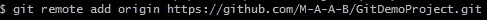

Git 命令将远程源添加到本地存储库——图片由作者提供

最后在 Github 上推主分支。

```
***git push -u REMOTE-NAME BRANCH-NAME***
```

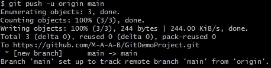

Git 命令推送本地主分支——按作者排序的图像

**注意:**在项目工作目录下，通过终端(Linux)或 Git Bash(Windows)执行所有 Git 命令。

## 2)创建新的分支

实现一个新特性的黄金标准是创建一个新的分支，并将所有代码放入其中。这使得现有代码不会出现糟糕的实现。

```
***git checkout -b NEW-BRANCH-NAME***
```

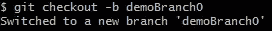

Git 命令创建一个新的分支——作者的图像

如果存储库中不存在新分支，checkout 命令会创建新分支。而`-b`选项从当前分支切换或检出到新创建的分支。在创建新分支之前，最好先切换到主分支。主分支通常拥有最新的代码。

一旦我们创建了一个新的本地分支，它应该被推送到远程存储库——就像前面所做的那样。

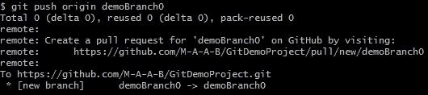

Git 命令来推送新创建的分支——作者的图像

## 3)开关支路

当您开始处理一个新项目时，最好对存储库中的分支有一个大致的了解。

```
***git branch***
```

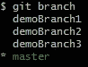

Git 命令列出存储库中的所有分支——按作者排序的图像

列出所有分支后，使用以下命令切换到所需的分支:

```
***git checkout BRANCH-NAME***
```

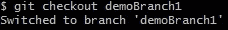

Git 命令切换分支——作者图像

如果在当前分支中没有未提交的更新文件，checkout 命令可以很好地工作。否则，这些未提交的更改将导致错误。在切换到另一个分支之前，最好提交或保存当前分支中的更改。


由于未提交的更改而导致签出错误—按作者排序的图像

## 4)隐藏/取消隐藏文件

解决签出错误的方法之一是隐藏更改。如果您还没有准备好提交这些变更，这通常是为了保存您在当前分支中已经完成的工作。

```
***git stash***
```

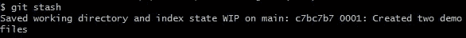

Git 命令隐藏未提交的更改—作者图片

要恢复或撤销隐藏的更改，我们可以回到我们隐藏更改的分支并弹出它们。

```
***git stash pop***
```

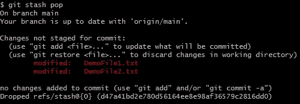

Git 命令恢复隐藏的更改—作者图片

## 5)检查分支状态

我有一个奇怪的习惯，经常检查分行的状态。它给出了关于分支机构当前状态的所有必要信息。我们可以检查所有已实施或未实施的变更。

```
***git status***
```

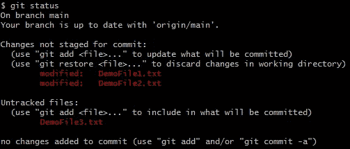

Git 命令检查分支的状态——作者的图像

## 6)重命名本地分支

分支重命名并不是最常用的 Git 命令之一，但是如果有输入错误，它会很方便。或者在我的例子中，重命名分支以形成一致的 Git 目录结构。

```
***git branch -m OLD-BRANCH-NAME*** ***NEW-BRANCH-NAME***
```

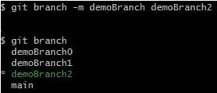

Git 命令重命名一个分支——作者图像

## 7)重命名远程分支

重命名本地分支后，就应该更改相应远程分支的名称了。

```
***git push origin :OLD-BRANCH-NAME NEW-BRANCH-NAME***
```

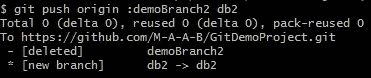

Git 命令重命名远程分支——作者图像

该命令删除旧名称的分支，并创建一个具有相同代码库的新分支。

## 8)同步分支变化

一旦在您的项目中创建了一个新文件或者更新了一个现有文件，我们就必须将这些文件添加到下一次提交中。

```
***# To add all changes
git add .
# To add a specific file
git add FILE-PATH***
```

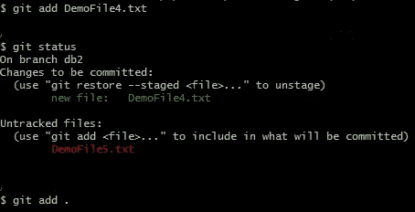

Git 命令添加单个文件或所有文件——按作者分类的图像

当所有必需的更改都已添加到提交中时，就该提交这些更改并编写唯一的提交消息了。提交消息可以是任何可以用几句话描述您的工作的字符串。

```
***git commit -m "COMMIT-MESSAGE"***
```

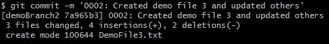

Git 命令提交更改—作者图片

最后，使用`*git push*`命令将这个提交推送到远程存储库。您还可以更新或修改您的提交。

```
***git add*** ***FILE-PATH
git commit --amend -m "CHANGE-COMMIT-MESSAGE"***
```

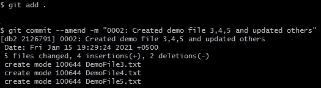

Git 命令修改以前提交的图像(由作者提供)

这是我最喜欢的 Git 命令之一。当你在团队中工作时，代码审查是非常重要的。高级开发人员或团队领导经常指出代码中的重要问题。我们没有创建一个新的提交来解决这些问题，而是遵循了每个分支一个提交的惯例——`*git amend*`被证明是方便的。

## 9)克隆存储库

我为我的第一个实时项目执行的第一个 git 命令是`*git clone*` ***。我被要求在我的本地系统上克隆项目，以理解代码，添加一些功能，并通过合并请求将代码推回。***

```
***git clone*** ***https://github.com/YOUR-USERNAME/YOUR-REPOSITORY***
```

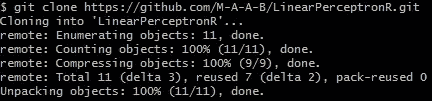

Git 命令克隆一个存储库——按作者的图像

## 10)检查提交日志

日志是软件开发的重要组成部分。软件维护日志文件来记录其生命周期中的所有步骤。Git 还提供了一个日志来跟踪所有的提交。

```
***git log***
```

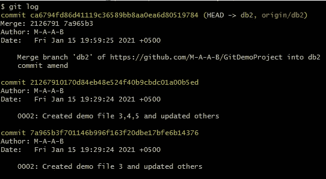

显示提交日志的 Git 命令—按作者显示图像

## 11)重置到最后一次提交

拥有重置或撤销任务的权力是救命稻草。在我作为一名开发人员的早期，我曾经犯过一个错误，那就是更改实时生产代码。这是一个错误。令我惊讶的是，我没有被解雇。让我免于造成更多伤害的是重置命令。它允许我在一瞬间将所有更改恢复到最后一次工作提交。

```
***git reset --hard origin/BRANCH-NAME***
```

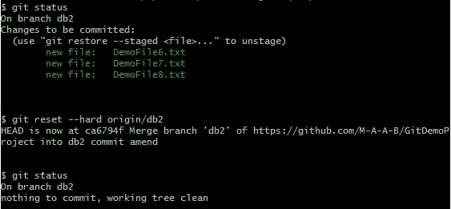

Git 命令将代码库重置为上一次工作提交—作者图像

## 12)将本地存储库与远程存储库合并

这就是奇迹发生的地方。当我们在开发软件时，我们通常会维护代码库的三个副本。

一个是本地副本，开发人员在其上工作并执行所需的任务。第二个是暂存副本或暂存服务器，在这里部署这些任务并与客户端共享。客户对软件的所有新变化给出反馈。然后，开发团队处理这些更改，并将它们部署回临时服务器。这个循环会一直持续到客户批准将这些更改部署到第三台也是最后一台生产服务器上。

每次部署新功能或更新现有功能时，我们都会执行合并操作。来自 Github 远程存储库的更新代码文件与这三台服务器上的本地存储库合并。

合并存储库时最常见的问题是合并冲突。必须解决这些冲突才能完成合并操作。

```
***# Fetch remote from github
git fetch REMOTE-NAME
# Merge remote branch with local branch
git merge REMOTE-NAME/BRANCH-NAME***
```


Git 命令将远程分支与本地分支合并——图片由作者提供

合并操作分两步执行。我们从 Github 获取或下载包含所需代码库的遥控器。然后合并远程和本地分支历史。

另一种执行合并的方法是`*git pull*`。拉取和合并的工作方式是一样的，还有取取的好处。`*git pull*`执行 *fetch* 和 *merge —* 合并两个或更多分支，而不是如上所示分别执行这两个操作。

```
***git pull REMOTE-NAME BRANCH-NAME***
```

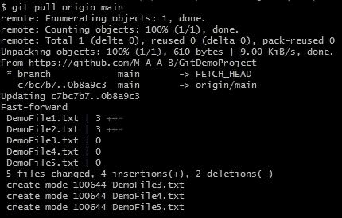

Git 命令从远程分支提取变更，并将它们与本地分支合并——按作者排序

## 13)将提交从一个分支移动到另一个分支

当你在一个项目上合作时，最好是每个开发人员从事一个单独的特性——好得难以置信。根据任务的复杂程度，它被分配给多个开发人员。

高内聚和低耦合经常被忽略或不切实际。这在开发过程中产生了许多问题。

我做过几个这样的功能。在大多数情况下，我被要求从其他分支获取未完成的代码，并试图在牢记未完成部分的同时对其进行扩展。`*git cherry-pick*`起了重要作用。

```
***git cherry-pick COMMIT-HASH***
```

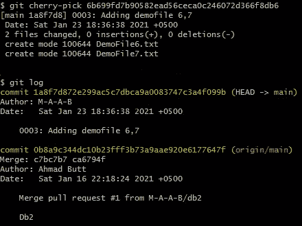

Git 命令将提交从一个分支移动到另一个分支——作者图片

这个命令在当前分支上应用所选择的提交，这在 bug 修复期间也非常方便。尽管精心挑选很有用，但并不总是最佳实践。这可能会导致重复提交，这就是为什么在大多数情况下首选*合并*的原因。

## 14)删除未被跟踪的文件和目录

使用`*git clean*` *可以很容易地从工作目录中删除尚未提交的文件和目录。我用它来删除我的 IDE 创建的不需要的文件和目录。*

```
# To remove untracked files
***git clean -f***
# TO remove untracked directories
***git clean -fd***
```

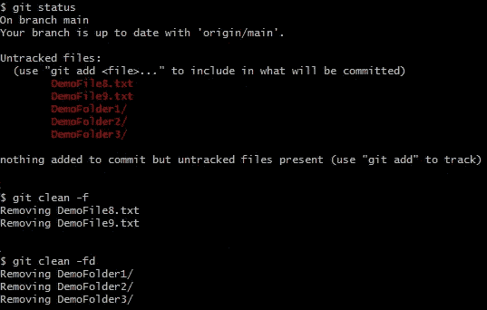

Git 命令删除不需要的文件和文件夹-图片作者

## **15)删除本地存储库的一个分支**

如果不再需要某个分支，最好通过删除该分支来清理存储库。要删除本地存储库中的分支，使用带有`*-d*`选项的`*git branch*`。

```
***git branch -d BRANCH-NAME*** # To forcefully delete a local branch. Be careful
***git branch -D BRANCH-NAME***
```

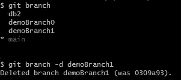

Git 命令删除本地分支——作者图片

## **16)删除远程仓库上的分支**

删除远程存储库上的分支类似于使用相同的带有`*--delete*`选项的`*git push*`命令在远程上推送更新。

```
***git push REMOTE-NAME --delete BRANCH-NAME***
```

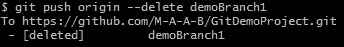

Git 命令删除远程分支——作者图片

## 17)忽略 Git 权限更改

我在一个基于 Linux 的系统上工作，在那里使用`*chmod*`设置文件权限对于安全性非常重要。在开发过程中，我们通常会将文件的模式更改为 *777* 以使其可执行。Git 获取这些权限变更，并在`*git status*`中将它们显示为更新的文件。

```
***git config core.fileMode false***
```

Git 允许我们通过将配置中的`*fileMode*`改为*假*来忽略这些变化。

## 18)修复。gitignore

。gitignore file 是一个福音，它帮助我们忽略将不需要的文件提交到存储库中。但是如果文件已经被 Git 跟踪了，那就麻烦了。

谢天谢地，有一个简单的解决办法。它需要移除缓存的。gitignore 索引并再次将其添加到存储库中。

```
# To create a new .gitignore file ***touch .gitignore***# To untrack the unnecessary tracked files in your gitignore which removes everything from its index. Specific filenames can also be used instead of dot(.).
***git rm -r --cached .
git add .
git commit -m "gitignore fixed untracked files"***
```

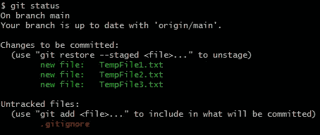

Git 命令检查状态——按作者分类的图像

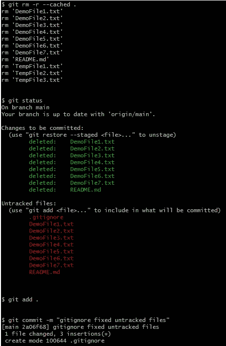

要修复的 Git 命令。gitignore —作者图片

## 总结想法

这是冰山一角。像其他任何事情一样，Git 需要实践和实验。掌握 Git 要难得多。一年之内，我只能学会它的基础。

对于初级开发人员来说，还需要克服学习新事物的恐惧。没有 Git，开发人员的投资组合是不完整的——就像不带任何武器去打仗一样。