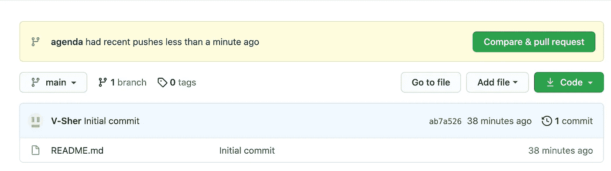

# Git 命令科学家日常使用的数据

> 原文：<https://towardsdatascience.com/git-commands-data-scientists-use-on-a-day-to-day-basis-40d588cd63f7?source=collection_archive---------4----------------------->

## 面向数据科学家的 GIT

## 适用于查看本地 PR 副本、带回混乱的文件或删除 PR 中的文件等情况。

在你问我为什么在 2021 年还在使用命令行 Git 之前，*等等*，我可以解释！所以你真的不喜欢使用命令行，尤其是当有这么多完美的图形用户界面存在的时候。

最近，我的大部分工作转移到了 Linux 机器上，我正在寻找一个 git 扩展或 GUI 来支持 Jupyterlab 远程服务器。在这个问题[这里](https://github.com/shiftkey/desktop/issues/281)浪费了许多宝贵的时间之后，我最终决定系好安全带，作为一名数据科学家，学习一些可能对任何给定场景都有用的命令。同样，我希望在无法使用 GUI 并且 Git 命令行是唯一选择的服务器环境中工作时，学习这些知识会派上用场。

不仅仅是一个备忘单，我更愿意把这篇文章看作是一个假设的*你会做什么*的场景列表，一个我可能会比你们中的任何人使用得更多的场景(尽管如果它确实对你有帮助，嗯…越多越好！:) ).有些场景是基本的，我相信你知道如何通过它们，其他的场景更具体，尽管我相信你能理解它们。

这绝不是一个详尽的列表，而是一些在我日常工作环境中经常出现的主题。

*免责声明:本文是为具有一些 Git 基础知识的读者而写的。我的基本意思是，如果你拥有一个 Github 账户，并且当我说“检查一个分支”和“提交一个更改”时，你不认为我在说某种外星语言，那么你就一切就绪了！*

## 术语和术语

在整篇文章中，每当我提到**本地**变更时，我指的是您在本地对您计算机上的项目副本所做的变更。**远程**变更意味着您正在对存在于 Github 服务器上的项目副本进行变更。

作为一个经验法则，在本地拷贝上玩你想玩的，但是在用你的本地改变修改远程拷贝时要非常小心。

考虑到所有这些，让我们浏览一下初学者可能面临的一些常见场景以及如何解决它们。

*附言:这些场景没有特定的顺序。*

## 场景 1

> 公司开始了一个新项目，你想参与其中，这样你就可以开始为之做出贡献。

一旦某个团队成员将您添加为协作者，您所要做的就是转到 Git bash 或 Mac 终端，根据您是想在桌面上还是下载文件夹中创建这个本地 repo 来执行`cd Desktop`或`cd Downloads`，然后执行以下操作:

```
git clone https://github.com/V-Sher/medium_demo.git
```

在这里，我试图克隆我为这篇文章创建的一个(私人)回购，但请随意用您自己的远程 URL 替换它。您感兴趣的 repo 的远程 URL 可以在该项目的 Github 页面上找到(参见下图中用蓝色突出显示的文本)。


图 1:蓝色突出显示的文本是 repo 的远程 URL。

## 场景 2

> 创建你自己的分支，开始工作并与同事分享。

创建一个分支并开始工作总是比搞乱`main`分支好。在这样做之前，最好先检查所有可用的本地分支:

```
git branch
```


您当前所在的分支旁边会有一个`*`。在我的例子中，我好像在`main`上，我想从这个分支创建一个名为`agenda`的分支。

```
git checkout -b agenda
```

这里的`agenda`是我的分支的名字，但是你可以随意选择你喜欢的名字。运行该命令将使`agenda`成为当前工作分支，如果再次运行`git branch`命令，您将看到`*`已经转移。


从这里开始，我将把两个文件添加到本地机器上的`medium_demo`文件夹中，分别名为`agenda.py`和`fake_agenda.py`，然后执行一个`git add .`操作，把这两个文件都添加到暂存区，然后使用`git commit -m "Adding a real and fake agenda"`提交这些更改。

现在，我的本地回购副本有两个额外的文件，我必须将它们推送到远程使用:

```
git push -u origin agenda
```

这里的`origin`是远程 Github 的名称(附注，我们将在文章末尾更详细地讨论这个问题),`-u`表示在“本地”`agenda`分支和“远程”`agenda`分支之间建立了跟踪连接。

现在回到您的回购的 Github 页面，您可以看到已经准备好成为拉取请求(PR)的一部分的更改:



您可以点击*比较&拉动式请求*按钮来创建一个 PR，并将您的同事/上司指定为其审核人。

一旦你的同事审阅了简历，他们可能会在简历上留下自己的评论，如下所示:


如你所见，审查员告诉我们必须删除不必要的`fake_agenda.py`文件。让我们在场景 3 中看看如何做到这一点。

**场景 3**

> 删除您作为拉请求的一部分错误添加的文件。

显然，我们不想让经理看到我们为这个项目创建的虚假议程。要解决这个问题，我们需要从 PR 中删除文件`fake_agenda.py`。

如果我们这样做:

```
git rm fake_agenda.py
```

您会注意到它会将文件从您的工作目录中完全删除。这不是我们想要的(或者至少不是我想要的)。我们想从 PR **中删除它，但**不是从我们的本地回购中。

相反，让我们先把文件带回来:

```
git reset -- fake_agenda.py
git checkout -- fake_agenda.py
```

现在将它作为我们 PR 的一部分删除，使其成为一个未跟踪的文件:

```
git rm --cached fake_agenda.py
```

要提交此更改:

```
git commit -m "the file fake_agenda is gone from the repository"
```

最后，像上次一样提交:

```
git push -u origin agenda
```

如果您返回到 PR 的 Github 页面，您将看到添加了另一个 commit，描述如何删除不必要的文件。


此外，要确认该文件不再是 PR 的一部分，请查看“文件已更改”选项卡，它应该显示 1(之前是 2，因为有额外的`fake_agenda.py`文件)。


## 场景 4

> 当您在其他分支上工作时，将远程更改放到您的本地机器上。

当你忙于自己的分支(从`main`分支分出)*本地*时，在*远程*回购中的`main`分支，事情可能会发生变化。随着越来越多的人在一个项目上工作——每个人都在他们自己的分支上——过一段时间，他们的分支将开始与`main`分支合并(当然，一旦它通过了所有的检查和评审)。

例如，您团队中的高级数据科学家决定更新`main`“远程”分支中的自述文件。


但是这些变化不会出现在你的‘local’`main`分支中。因此，您应该掌握这些变更，以保持您的本地`main`分支是最新的(毕竟，这是您将来创建新分支的地方)。为此，我们首先检出`main`分支，然后引入变更。

```
git checkout main
git pull
```

现在，如果您打开自述文件，您将会看到附加行。这意味着你当地的`main`分支机构全部被赶上了。

然而，如果你回到你在本地工作的分支，即`agenda`

```
git checkout agenda
```

并打开自述文件，它仍将和以前一样，即没有变化。理想情况下，我希望将本地`main`中的所有变更合并为我正在处理的分支的一部分，这样我就知道我拥有项目的最新文件。

更一般地说，要使本地分支 **X** 达到本地分支 **Y** 的速度，请确保您已经首先检出了 **X** (在我们的示例中， **X** 将是本地`agenda`分支， **Y** 将是`main`)，然后进行合并:

```
git checkout agenda
git merge main
```

您之前在`agenda`分支中的所有文件将保持不变(以确认转到并手动检查文件)，并添加了一些由高级数据科学家引入的新内容。

有时，合并过程可能不像您希望的那样顺利。*那到底是什么意思？这意味着在合并过程完成之前，可能会有一些问题需要解决——这是由两个人在完全相同的行上更改相同的文件引起的。让我们看看如何在下一个场景中修复它们。*

## 场景 5

> 如何解决合并冲突？

从场景 4 继续，让我们假设您和高级数据科学家都在完全相同的行上更改了同一个文件。在这种情况下，从最后一个场景合并将会提示如下错误:


这条消息不言自明，告诉我们它不能合并 README.md，因为我和我的学长都试图修改完全相同的行。因此，我必须在合并之前解决这个错误。为此，在编辑器中打开文件(我个人偏好 VScode)，你会看到需要在`<<<<<<<`和`>>>>>>`之间解决的问题。


似乎我们都在试图修改最后一行(我想说苹果，她想说橙色)。此时，您可以接受即将到来的更改，或者坚持当前的更改，或者做其他事情。一旦您对更改感到满意，保存并关闭文件。回到终端，添加并提交此更改，最后推送它:

```
git add README.md
git commit -m "Apples and oranges issue averted"
git push
```

回到 PR 的 Github 页面，您可以看到新的提交已经作为 PR 的一部分被添加。


一旦你的评审者对所有的改变感到满意，她会将 remote 上的`agenda`分支与 remote 上的`main`分支合并，你可以在 Github 页面上看到。


一旦合并，您不再需要`agenda`分支——您甚至可以删除它。从现在开始，我强烈建议任何时候你想在项目的其他方面工作，在确保你已经将远程`main`分支的最新版本拉到你的本地`main`分支之后，你应该从本地`main`分支创建一个新的分支。

## 场景 6

> 把一个被你搞砸的同事的文件带回来，恢复原状。

有时，在您的分支机构工作时，您可能会弄乱您或您的同事创建的现有文件。例如，假设我错误地修改了`agenda.py`文件中的打印语句

从这个

```
print(“The agenda for this demo is as follows: Do A then B and finally C.”)
```

对此

```
print(“The agenda for this demo is as follows: Do A and finally C.”)
```

还使用提交了这些更改

```
git add agenda.py
git commit -m "Messing up the file by removing B's info"
```

要将其恢复到原始形式(即，它在上次提交时的样子)，只需执行`git checkout <commit_id> — filename`。在这里，如果您在 Github Web UI 上找到相关文件并选择其最新的提交号，就可以快速检索到`commit_id`。


为 Github 上的文件选择最新的提交 id(在“最新提交”之后的右边)

在我们的例子中，`agenda.py`文件的提交 id 是`3c8ebf0`。因此，要使它看起来就像上一次提交一样，只需

```
git checkout 3c8ebf0 -- agenda.py
```

其次是:

```
git add agenda.py
git commit -m "Restoring B's info in the agenda"
```

## 场景 7

> 一位同事邀请您在她现有的远程分支机构工作。

通常，你的一个已经在做某个分支的同事，比如说`featureB`，会邀请你去做这个分支。现在让我们假设这个分支除了 Readme 文件之外，还包含一个文件`featureB.py`。

要开始协作，您需要创建一个*本地* `featureB`分支，并在远程和本地`featureB` 分支之间建立某种跟踪连接，以便您可以推送提交并对它们进行更改。

首先，确保同事的分支存在于远程服务器上——这意味着你的同事已经将她的分支推送到 origin 上——并且你可以访问它。要检查您有权访问的所有远程分支，请执行`git fetch`，然后执行:

```
git branch -r
```


看到我的同事希望我插话的分支，即`origin/featureB`，我们将简单地做:

```
git checkout --track origin/featureB
```

这将创建一个名为`featureB`的本地分支，您现在应该看到由文件`featureB.py`组成的本地回购。接下来，我将继续对该文件进行一些简单的更改(基本上添加我作为初级数据科学家的想法)，并使用`git push origin featureB`将其推送到*远程*分支。这是添加我的更改后文件在 remote 上的样子:


因为你们可以同时处理文件并对其进行修改，所以我强烈建议每次在开始处理`featureB`分支之前先做`git fetch`再做`git pull`。一如既往，您可能需要解决一些冲突，一旦解决完毕:

```
git add featureB.py
git commit -m "Resolved conflict"
git push origin featureB 
```

或者，如果您不希望在您同事的分支`featureB`的本地和远程副本之间建立跟踪连接，而是希望将其与您当前工作的分支(即`<branch-name>`)合并:

```
git checkout <branch-name>
git merge origin/featureB
```

## 场景 8

> 如何将采购申请提取到本地回购进行审查？

有些情况下，你会被指派为公关的“审查者”，这意味着你的工作是通过分析同事的分支来确保一切正常。作为审查过程的一部分，人们可以简单地在 Github Web UI 上浏览代码，但我通常更喜欢制作 PR 的本地只读副本，并在我的终端运行它。

*附注:只读副本意味着您不能将变更推送到该 PR，这是理想的，因为我们不应该将变更推送到由其他人创建的 PR，只有 PR 的* ***作者*** *应该进行变更。*

为此，先使用`git fetch origin pull/PULL_REQUEST_ID/head:NEW-BRANCH-NAME`，再使用`git checkout BRANCH_NAME`。

附言:您在上面的命令中看到的所有内容都是您需要提供的:

*   PULL_REQUEST_ID 可以从 PR 的 Github 页面检索。它通常是#符号后面的一个数字。对我们来说，是 4。


图 Github Web UI 上的 PR 页面。它包含有关拉取请求 id 的信息，以及创建 PR 的分支。

*   NEW-BRANCH_NAME 可以是您想称为 PR 的只读副本的任何名称。我喜欢叫我的`review_***`。

一旦你的猫咪里有了这两样东西，就去做吧:

```
git fetch origin pull/4/head:review_featureb1
git checkout review_featureb1
```

在`review_featureb1`分支上，你想怎么复习就怎么复习。一旦你完成了，你可以通过在 PR 的 Github 页面上留下评论来告诉作者需要做什么改变，或者你可以自己做这些改变，并使用`git push -u origin patch-test_featureb1`将它们推送到一个新创建的分支。

尽管我提到除了 PR 作者之外，任何人都不应该对 PR 进行更改，但有时您会希望直接对某人的 PR 进行一些更改——例如，一个非常小的打字错误需要修复——并将这些更改作为 PR 的一部分。

在这种情况下，您需要首先获得创建 PR 的分支的名称(让我们称之为`<PR-branch-name>`)。它通常会出现在 Github Web UI 的 PR 页面上，内容如下:`<repo-author> wants to merge X commits into main from <PR-branch_name>`(参见上面的图 2)。

在我们的例子中，公关似乎是从`featureb1`创建的。让我们使用以下方法之一来检查这个分支:

(a) `git checkout featureb1`(如果你在本地跟踪`featureb1`

运筹学

(b)情景 7 中描述的步骤(如果您没有在本地跟踪该分支机构)。

之后，您进行所需的更改，最后使用`git push origin featureb1`推送到遥控器上同名的分支，使其成为 PR 的一部分。

*注意:在解释了两种评审方法之后，我强烈建议创建一个新的分支(而不是修改现有的 PR ),因为它给了某人一个评审你的工作(在合并之前)的机会，这样你就不会在不知不觉中弄乱某人的 PR。*

## 场景 9

> 如何将我的本地更改推送到远程回购？

简而言之，这取决于你的场景。

如果您处于类似场景 2 的情况，即在本地创建的分支上工作，(这意味着它在远程还不存在)，您可以

```
git push -u origin <my_branch_name>
```

它会自动在遥控器上创建同名的分支，其中的`<my_branch_name>`会被您在本地创建的分支的名称所替换。

或者，如果您在场景 7 中，即在本地工作于远程跟踪的分支机构，则您可以:

```
git push origin <remote_branch_name>
```

其中`<remote_branch_name>`应该替换为远程 repo 上存在的分支名称，并且在运行命令`git branch -r`时可见。

## 场景 10

> 如何在 Github 上推送空目录？

要了解 Git 如何处理空目录，让我们做一个快速设置。

使用`git checkout`签出任何分支，并尝试在本地 repo 中创建一个空文件夹`e_folder`。


接下来，在终端中尝试:

```
git status
```

在理想的情况下，git 应该会提示您将这个新创建的文件夹添加到 staging area，但是没有发生类似的事情。现在继续向`e_folder`添加任何文件，使其不再为空:


如果您现在要做一个`git status`，您会看到一个提示，告诉您使用`git add`命令添加文件夹


简而言之，默认情况下，Git 只会跟踪非空目录——这在大多数情况下对我们来说不成问题。然而，有时我们会希望推送一个空目录。例如，我喜欢有一个空的目录作为占位符，告诉人们在使用我的模型时可以上传他们的自定义图像。

为了明确地通知 Git 跟踪我们的空目录`e_folder`，首先，让我们继续手动删除其中的`img.jpeg`文件。然后转到 Git 命令行:

```
cd e_folder
touch .gitignore
vi .gitignore
```

一旦进入可视化编辑器，

*   按下键盘上的`i`
*   将下面几行粘贴(或 Ctrl+V)在那里[Credits:[stack overflow](https://stackoverflow.com/questions/115983/how-can-i-add-an-empty-directory-to-a-git-repository)

```
# Ignore everything in this directory
*
# Except this file
!.gitignore
```

*   按下键盘上的`esc`
*   类型`:wq`

在 git 终端上，使用`cd ..`返回到`medium_repo`目录，然后

```
git status
```

您将看到现在 git 已经准备好将您的空文件夹添加到临时区域


继续添加它，提交它并推动它:

```
git add e_folder
git commit -m "placeholder for images"
git push
```

## 奖金方案 1

> 我检查了一个分支 X，在那里做了一些更改，使用 File -> Save 保存了这些更改。然后我继续检查另一个分支 Y，我可以看到与我在 x 中所做的相同的更改。为什么在一个分支中进行更改，git 会更改所有其他分支？

查看 [Stackoverflow](https://stackoverflow.com/questions/59415116/why-if-i-make-changes-in-one-of-my-branches-git-changes-every-branch) 上的长答案。

简而言之，如果您没有使用`git commit`提交您在一个分支中所做的变更，那么当您切换分支时，变更也会随之而来。这意味着当您签出其他分支时，您有无意中破坏它们的风险。所以尽可能多的提交，尽可能多的提交，尤其是在对代码做一些重大修改的时候！

## 奖金方案 2

> 在推送到远程之前，如何检查我提交(即更改)了哪些文件？

通常，我们会在几周甚至几个月的时间里在几个文件中提交大量的变更，而不需要将它们推送到远程。因此，当最终*推送*变更(以便您的同事可以查看您的工作)的时候，我们不确定我们将要推送什么文件！

要获得自上次推送以来修改过的文件名列表(并避免任何不必要的意外)，这个命令很有用:

```
git diff --name-only <local_branch_name> origin/<remote_branch>
```

将`<local_branch_name>`替换为您正在处理的本地分支的名称，将`<remote_branch>`替换为远程服务器上的分支的名称，您希望将您的更改推进到该分支中。`--name-only`标签将确保只列举文件名，并保留每个文件中更改的细节(例如，添加或删除了哪些特定的行)。

## 奖金方案 3

> 我的同事正在进行 Git 回购，我想推送/拉取/查看他们回购中的一些文件。

还记得我说的关于*的来历*吗？这是我们的远程 Github repo 的名称。要检查您可以访问哪些远程 Github repos:

```
git remote -v
```


到目前为止，我们主要在一个名为`origin`的 repo 上工作，但假设我也想在 GitHub 上托管的其他一些远程存储库上工作。*添加我的同事* `*ABC*` *为他的一篇媒体文章创建的 Github repo 怎么样？我确信我能帮她复习一些内容。它的远程 URL 是`[https://github.com/ABC/coworker_medium_repo.git](https://github.com/V-Sher/GANs_Pytorch.git.)`。*

首先要做的是添加这个远程存储库，即建立某种连接，并为它设置一个名称。我也不能命名我同事的 repo `origin`,因为它可能会混淆 Git 并导致致命错误。因此，最好使用与回购相对应的名称——我倾向于将它们命名为`origin_***`。

```
git remote add origin_medium [https://github.com/ABC/coworker_medium_repo.git](https://github.com/V-Sher/GANs_Pytorch.git.)
```

现在，如果您在终端中执行`git remote -v`命令，您将看到您可以访问的所有遥控器:


同样，你可以继续使用同事的回购 URL 创建对他们回购的引用。

*注意:如果您需要复习如何定位回购 URL，请看图 1。*

```
git remote add project1_origin http:github.com/XYZ/project1.gitgit remote add project2_origin http:github.com/MNO/project2.gitgit remote add project3_origin http:github.com/PQR/project3.git
```

现在，假设你的同事在 Github 上为项目 2 制作了一份 PR，你必须审阅它。场景 8 中已经讨论了这样做的步骤(确保您有适当的 PULL_REQUEST_ID)。这次您需要做的唯一更改是指向正确的来源，即正确的回购名称:

```
git fetch **origin_medium** pull/PULL_REQUEST_ID/head:REVIEW_FEATURENAME
git checkout REVIEW_FEATURENAME
```

您甚至可以获取它们的一个分支，并使用以下命令在本地跟踪它们:

```
git fetch **origin_medium** new_agenda
git checkout new_agenda
```

其中`new_agenda`是我同事的回购协议中的一个远程分支。接下来，进行一些更改——添加、提交和推送。你现在知道规矩了:

```
git commit -a -m "Some input from V-Sher's end as well"
git push
```


*注意:请记住，在我们的示例中，存在一个由来自* `*new_agenda*` *分支的同事创建的 PR，我们刚刚推送到该分支的任何更改也将是 PR 的一部分(见下图)。如果这不是故意的，请制作 PR 的本地副本，创建一个新分支，并将其推送到同事的 repo。*


您甚至可以将同事的一个远程分支机构拉入您自己的本地分支机构。也就是说，我将检查**我的**本地分支`agenda`，并尝试将我的**同事的**T2 分支拉入其中:

*注意:坦白地说，我不知道我什么时候会用到它，因为这两个项目的提交历史是不相关的。如果你有想法，让我知道！*

```
git checkout agenda
git pull **origin_medium** second_agenda --allow-unrelated-histories
```


使用场景 5 中的步骤可以解决一些冲突，但没有什么是我们不能解决的。

## 至理名言

*   你永远做不够`git fetch`和`git status`——前者通知你远程回购的新进展，后者提醒你本地回购中未提交的文件。
*   一旦你对你的代码做了一些重要的改变，就养成`git commit`的习惯。(*不，文件- >保存不充分*)
*   如果远程跟踪被启用*, `git push`(和`git pull`)将从当前检出的**分支向远程上的相应分支推送(和拉取)变更。如果未启用，将会引发一个错误，您必须通过显式声明 repo 名称和您希望拉入/推送的分支名称来修复该错误。
    注意:我比大多数人更偏执，所以你会发现我总是明确地说出回购协议名称和分行名称。例如`git push origin_name branch_name`。
    *:要检查分支机构是否启用远程跟踪，请尝试`git remote show origin`。这将显示每个本地分支及其链接的远程分支。**

## 恭喜你走到这一步…

我真的相信您能够在日常生活中使用这些 Git 命令。对于那些想要学习更复杂的命令的人(为了有一天可能在你的工作场所出现的场景)，我会说建立两个虚拟的 Github 帐户——你需要扮演两个合作者的角色——并开始练习你的疯狂的一生一次的场景。

一如既往，如果有更简单的方法来做我在本文中提到的一些事情，请让我知道。

直到下次:)

</step-by-step-guide-to-explaining-your-ml-project-during-a-data-science-interview-81dfaaa408bf>  <https://medium.com/swlh/how-i-would-explain-gans-from-scratch-to-a-5-year-old-part-1-ce6a6bccebbb>  </recreating-keras-code-in-pytorch-an-introductory-tutorial-8db11084c60c> 