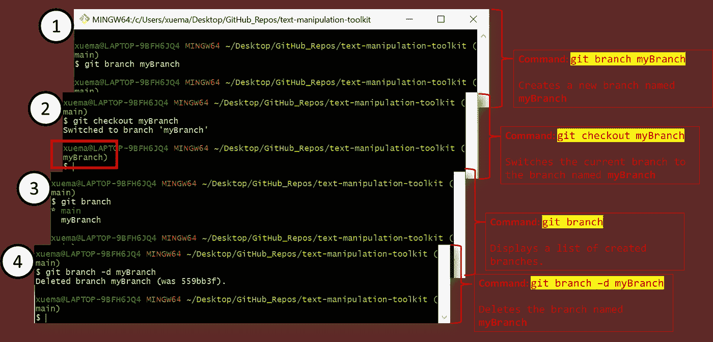
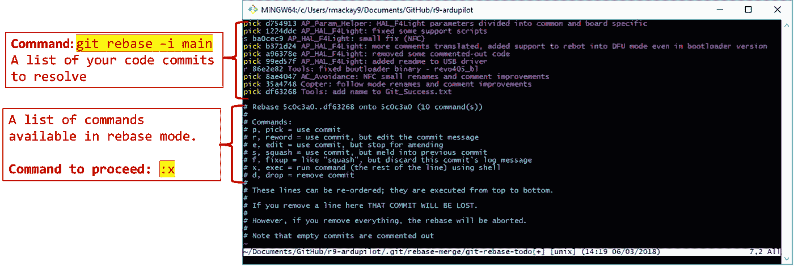
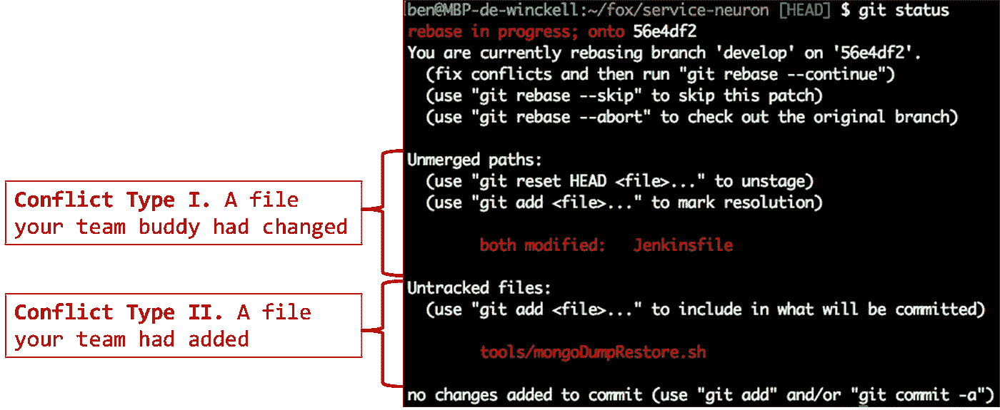
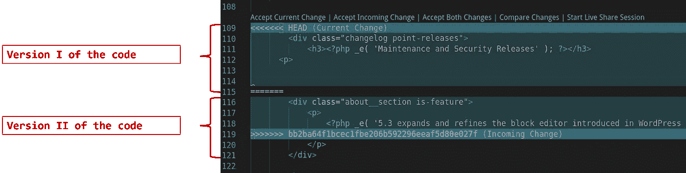
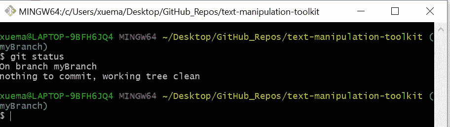
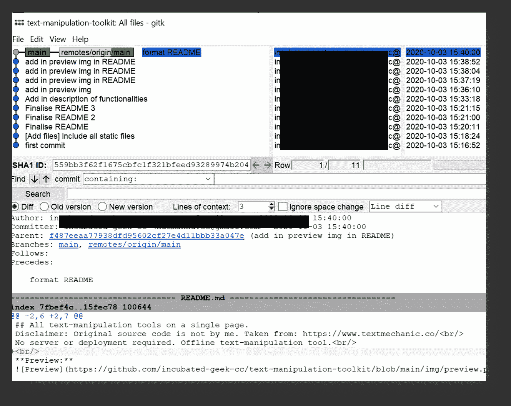

# 在协作工作空间中为数据科学家提供 Git 命令

> 原文：<https://towardsdatascience.com/git-commands-for-data-scientists-in-a-collaborative-workspace-b528cfa5b235?source=collection_archive---------30----------------------->

## 简约 Git 生存指南——解释每个 Git 命令的基本原理和情况

是的，每个程序员最可怕的噩梦。虽然这个问题没有完美的答案，但我认为，与其靠蛮力记住每个 Git 命令，不如分享一个 Git 命令的**紧凑列表**和**每天使用**的情况*对其他数据伙伴来说可能更本能🙃*

# *注:总分行=总分行。基本上，它是部署在服务器上的代码库。为了避免混淆，在本文中我将把它称为主要分支。*

# ***I.** git 分支& git 结帐*

**

*作者截图|来自 **(1) — (4)** ，“git branch”在您的本地机器上创建主代码库的快照。要切换到这个分支，使用“git checkout”切换到这个分支。这从终端中表示的“(myBranch)”中可以明显看出。*

***(3)** 如果您忘记了您创建的分支的名称，只需运行`git branch`列出您本地机器上当前已创建的分支。*

***(4)** 相反，如果你创建了过多的冗余分支，命令`git branch -d <your branch name>`会删除你指定的一个分支。*

# *二。git 添加和 git 提交*

```
*git add <file 1> <file 2>
git commit -m <your commit message>*
```

*当你对代码库进行后续修改时，明智的做法是**记录下你所做的每一个重要的代码编辑。随着一个项目经历多次迭代，评审 git 提交给团队一个项目进展的清晰画面。另一方面，`git add`允许您指定将哪个(些)文件存放到部署中。如果您希望**暂存所有变更**，请使用:***

```
*git add .*
```

*而是让你的生活更轻松。*

# *三。git rebase*

```
*git rebase -i main*
```

*长话短说，上面的命令旨在**解决您与主分支的代码冲突**。*

> *在协作环境中，期望至少有一个其他同事在同一个代码库工作。*

*回想一下，您正在处理代码库的快照。从你“分支”到你准备好部署你的代码的时候，其他的**同事可能已经做了其他的改变**，这些改变并没有反映在你的本地代码库中。因此，运行`git rebase -i main`将会运行你的代码库，通过你的团队所做的每一次代码提交，直到最后一次提交到最近部署中的主分支**。有两种可能的情况—***

## ***场景(1) —代码完全自行解析，无需任何操作***

*这一部分不言自明。允许 Git 将您的代码提交与之前的代码提交自动合并。不幸的是，虽然 Git 相当聪明，但是当某些代码行与您当前的代码直接冲突时，我们更经常遇到:*

## ***场景(2)——发生代码冲突。进行手动更改的时间。***

**

*作者图片|运行 git rebase -i master 后的示例视图。|“I”代表交互，意味着 git 进入交互模式，这正是上面发生的情况。*

*虽然乍一看 Git 终端的输出似乎令人生畏，但是请注意这里输出的意图是 **Git 用信号通知两件事情的方式— (1)它当前处于交互模式；(2)下面是您已经提交的代码列表** *(需要解决)*。*

> *继续键入 **:x** (冒号(:)，然后是字母‘x’)，并选择**【Enter/Return】**键，让 Git 完成它的工作。*

*在某个时刻，预期会显示以下类似的输出:*

**

*Image by Author | **对于冲突类型 I** ，Git 将继续陈述在您从主分支分支出来之后被其他人修改的文件列表*

*在您的 IDE/文本编辑器上，对于**冲突类型 I** ，Git 将通过以下标记指定哪些代码行是直接冲突的:*

**

*作者插图| Git 输出上面的标记，以便将代码的替代版本与您的当前代码并排进行比较*

***说明:****【头】****>>>>>>>**之间的代码行属于另一版本的代码行。**要将这些与您的更改结合起来，请修改代码以保留先前的特性，同时实现您的新更改。***

***⚠非常重要:请运行应用程序至少一次，以确保代码得到解决，没有问题。如果你的手动修改破坏了代码，那么当你退出重定基础模式时，修复这个小故障(“调试”)会困难得多。***

*最后，完成更改后，继续运行:*

```
*git rebase --continue*
```

*根据需要解决的代码提交的数量，上述迭代将继续，直到所有的代码提交与团队中其他人的代码提交同步🤗*

# *四。git 合并*

```
*git checkout main
git merge <your branch name>*
```

*所以，如果你已经走到了这一步，给自己一个鼓励，因为你刚刚度过了最艰难的阶段。在通过运行`git checkout main`切换到主分支后，`git merge myBranch`会覆盖主分支上的代码库，以与您的重新基础代码同步。*

# *动词 （verb 的缩写）git 推送*

*要在主分支上部署最新的代码，请运行以下命令:*

```
*git push origin main*
```

*此时，我们刚刚用 Git 完成了一轮代码版本控制😀*

# *用于代码检查的两个基本 Git 命令*

## *命令 1 — git 状态*

```
*git status*
```

***经验法则:**当您感到困惑时，为了了解大多数情况下您的代码版本的当前状态，您应该首先运行上面的命令。*

**

*作者截图|使用 git 状态的例子。该命令总结了代码版本控制的最新状况。*

## *命令 2 — gitk*

*要获得直观的概述，请运行:*

```
*gitk*
```

*令人惊讶的是，这是社区中提到最少的 Git 命令之一。*

**

*作者截图|在终端中运行 gitk 后显示的 UI 弹出窗口*

# *Git 命令结束—*

## *仅供参考和免责声明:虽然这些是我个人认为至关重要的最低限度的 Git 命令，但没有完美的答案，所以请记住，这个列表仅够日常使用(强调“日常”)。*

## *最终，这一切都是为了找到与您的设置最相关的 Git 流！*

*非常感谢您的阅读，如果您发现这篇文章对您有帮助，请关注我的媒体**❤***

***<https://geek-cc.medium.com/membership>  

如果上面的 Git 命令不太适用，那么这里有一些其他的文章可供参考😀：

作者:Soner Yildirim

</8-must-have-git-commands-for-data-scientists-ee6564e4631d>  

作者瓦什塔·谢尔博士:

</git-commands-data-scientists-use-on-a-day-to-day-basis-40d588cd63f7> ***