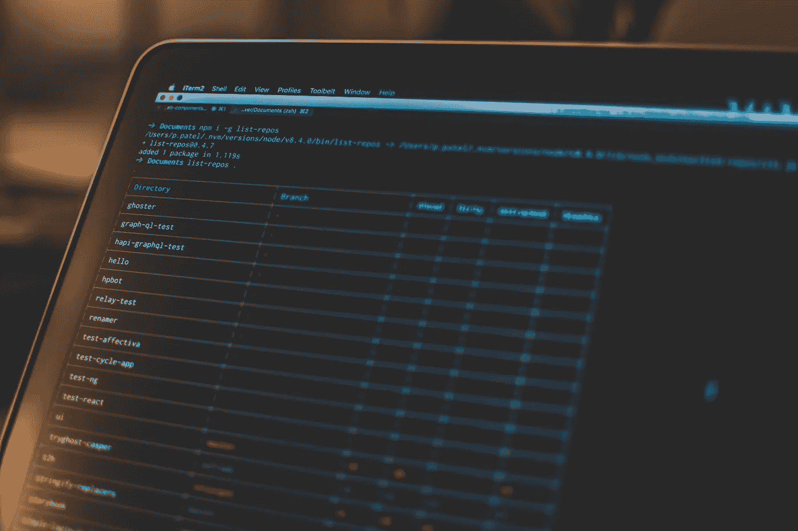

# 面向数据工程师的 Git

> 原文：<https://towardsdatascience.com/git-for-data-engineers-a8b979d8b2ab?source=collection_archive---------10----------------------->

潘卡杰·帕特尔在 [Unsplash](https://unsplash.com/s/photos/git?utm_source=unsplash&utm_medium=referral&utm_content=creditCopyText) 上的照片

## 数据工程

## 面向数据工程师、数据分析师和数据科学家的简短源代码控制指南

在以前的生活中，我有时会发现自己丢失了正在进行的工作，因为它只发生在我的本地。Excel 表格、SQL 查询、Python 脚本，我已经在某个时候丢失了这些东西。尽管我在 [Subversion](https://subversion.apache.org/) 的职业生涯一开始就知道源代码控制，但我并没有在我的数据分析和数据工程项目中使用它。

这些年来，我意识到 Git 的应用不仅仅局限于编写后端代码、前端代码，甚至是数据库相关的东西；您可以将 git 用于任何基于提交的协作工作空间。人们可以有效地使用 Git 来模拟电视剧或超级英雄电影的编剧室。

如果 Git 本质上可以用于任何基于文本的工作，为什么你看不到人们提交 SQL 查询、数据库注释、技术文档等。，在他们的 Git 仓库里？在本文中，我将讨论你(和我——如果我不遵循我的建议，我的文章将毫无用处)应该致力于 Git 的事情。它还将讨论与 Git 相关的摩擦点和问题，这些问题使得团队很难采用它。

# 对一切都使用 Git(除了秘密和密钥)

## SQL —查询、DDL、DML、DCL 等。

首先，使用 Git 存储数据库对象的 DDL 表、视图、存储过程等等。从结构上讲，您的数据库在任何给定的时间点都应该是可重构的。如果您将一切都提交给 Git 存储库，您将确保*可重构性*。然而，这并不意味着您也必须将数据存储在 Git 中。数据库结构和数据应该是分开的。无论是否使用 DDL，您的数据都应该单独备份。

其次，如果您使用数据库运行查询来进行分析和报告，那么您应该将查询推送到 Git。这主要是问题发生的地方。能够访问数据库的业务、营销、运营、分析团队通常不太了解 Git。他们将查询存储在基于浏览器的查询编辑器、文本编辑器或 SQL 客户端中。通常，这些东西都不直接与 Git 回购相关。人们可以将 Oracle SQL Developer 等 SQL 客户端和 VSCode 等代码编辑器直接与数据库引擎连接，以确保顺利开发和将代码推入 Git。尽管如此，这通常是产生摩擦的原因。

 [## SQL 的 Git 最佳实践

### 使用 GitHub、GitLab、BitBucket 等来存储和组织 SQL 查询，以实现发现和重用

towardsdatascience.com](/git-best-practices-for-sql-5366ab4abb50) 

## 工作流/编排者

在数据工程领域，如果没有工作流引擎来协调工作，什么也做不成。无论是 [AWS Step 函数和 Lambda 函数](https://aws.amazon.com/blogs/developer/deploying-aws-step-functions-using-github-actions/)、 [AWS Glue job](https://kzn.io/blog/2019/07/24/automating_data_workflows_in_aws/) s、 [Airflow DAG](https://docs.bitnami.com/azure-templates/infrastructure/apache-airflow/configuration/sync-dags/) s 的组合，你都需要确保底层代码被提交给一个存储库。这有两个简单的原因。首先，您将需要与其他人合作完成您的工作，如果您丢失了本地副本，请进行备份。其次，您需要它易于部署。

## CI/CD 管道

在上一节中，我谈到了 ETL 作业的易部署性。CI/CD 管道，顾名思义，确保代码的持续集成和部署。除了为 ETL 管道部署代码，数据库结构的改变等。，您还需要将管道代码提交给 Git。这意味着您需要存储 Jenkins、Bamboo 和其他 CI/CD 工具的管道配置，并将其提交给 Git。

有关管理 GitHub 组织或 GitLab 团队下的多个存储库和分支的更多信息，请阅读 Jenkins 的 [Pipeline-as-Code](https://www.jenkins.io/doc/book/pipeline-as-code/) 。许多其他基于云的管道工具也内置了这些特性。

## 数据基础设施(Terraform/CF)

我们需要向 Git 承诺的一个更新的东西是基础设施。[基础设施即代码不再是未来的事情](/state-of-the-art-infrastructure-as-code-4fbd59d92462)。企业使用 CloudFormation、HashiCrop Terraform、Pulumi 等。，在内部和云中部署基础架构。使用像 Chef、Puppet 和 Ansible 这样的工具进行配置管理在很多年前就已经很流行了，但是 IaC 还是一个相对较新的东西。

[莫希特·戈亚尔关于 Terraform 和 Azure DevOps 的 7 部分系列](https://mohitgoyal.co/2020/09/09/using-terraform-to-manage-azure-devops-index/?blogsub=flooded#blog_subscription-3)的最后一部分对使用 Git 库提交和管理基础设施代码的主题有许多很好的见解。

## 注释和文档

最后，在协作环境中，更多的时候，信息分布在聊天群、电子邮件、群呼(无处可去)，天知道还有哪里。它是杂乱无章的。你应该把笔记和文件集中起来。如果你使用的是像 Atlassian 的 Confluence 这样的集中式文档产品，那就没问题；另外，我发现在 Git 上编写文档很方便。

在将代码提交到您的分支之前，您倾向于在编写代码时编写更准确的信息。此外，当您在 Git 上编写文档时，文档感觉是代码的一部分，实际上也是，但是没有多少人认为是这样。如果你和一个团队一起工作，没有文档的代码不是一个好主意，尤其是一个没有 Shekher Kirani 所热衷的那些 10 倍工程师的[的团队。](https://twitter.com/skirani/status/1149302828420067328?lang=en)

# 使用 Git 进行数据工程的经验法则

既然我们已经了解了向存储库提交什么，我们需要了解一些要遵循的基本规则和要避免的反模式。

## 提交代码，而不是数据

一个前同事正在做一个项目。尽管他作为数据分析师非常有经验，但他从未向 Git 提交过代码。因为笔记本电脑崩溃或操作系统损坏而丢失工作，这让他开始使用 Git。一旦他开始使用 Git，他立刻意识到了它的好处。他第一次向 Git 提交代码时，也在存储库中提交了巨大的 CSV 文件。显然，[很多人都会犯这个错误](https://docs.github.com/en/github/managing-large-files/working-with-large-files/removing-files-from-a-repositorys-history)。

数据文件不应该提交给 Git，原因有三

*   **文件会变得非常非常大——例如** GitHub 对大于 50 MB 的文件有规定。这些规则是经过深思熟虑的。对于大多数用例来说，这是有意义的。记住，[一个 50 MB 的文本文件大概相当于一百万行代码](https://www.quora.com/How-much-storage-does-a-million-lines-of-code-take)。
*   **Git 是为了存储代码，而不是数据——***不在 Git 中存储*数据背后的想法很简单——你应该隔离代码和数据。只要数据集符合特定的模式并遵循格式化和数据类型化的预期，代码就应该不管数据集中的确切数据如何都能正常工作。
*   **数据可能包含 PII(个人身份信息)数据—** 尽管 Git 存储代码是安全的，但了解许多开发人员、测试人员、数据工程师和数据分析师都可以访问代码库是至关重要的。如果您提交包含 PII 数据的哪怕是最小的文件，他们都能够看到，从而违反了数据隐私和治理规则。

## 永远不要保守秘密

将秘密提交给 Git 源于一个做`**git add .**`的坏习惯，它甚至将您的本地开发文件提交给 Git——这些文件中存储了 API 密钥、密码和用于开发目的的秘密。请务必将此类文件放在`**.gitignore**`中。

如果你没有制衡机制来防止这种情况发生，很有可能有人会这么做。您可以使用各种方法[从 Git 存储库中移除敏感数据](https://docs.github.com/en/github/authenticating-to-github/keeping-your-account-and-data-secure/removing-sensitive-data-from-a-repository)。像`**git filter-branch**`和`**bfg repo-cleaner**`这样的工具是一些受欢迎的选择。最好不要将凭证存储在文件中，即使是出于开发目的。您可以使用像 [HashiCorp Vault、AWS Secrets Manager 和其他](https://snyk.io/blog/ten-git-hub-security-best-practices/)这样的工具来标记和回收机密。如果你想研究企业工具，有许多选项，如 [Honeybadger](https://www.honeybadger.io/blog/git-security/) 、[夜幕](https://nightfall.ai/nightfall-for-github-dlp)和 [GitGuardian](https://www.gitguardian.com/) ，它们可以帮助你防止 Git 灾难。

## 遵循分支策略

我之前写过关于菜鸟 Git 的错误。不遵循分支策略就是其中一个错误。当你在一个团队中工作时，你需要确定一个将代码拉入、开发、合并和推进到你的存储库中的过程。这就是代码升级如何从较低的环境到较高的环境发生(读取开发→测试，测试→生产前，生产前→生产，等等)。).

 [## 要避免的菜鸟饭桶错误

### 使用 Git 时，做一些简单的事情来避免沮丧和浪费时间

towardsdatascience.com](/rookie-git-mistakes-to-avoid-45919c0058f8) 

有效地使用 Git 是一项技能，您需要在前进的过程中不断努力。从最普通的拉取、推送提交和合并，您还应该了解精选、过滤分支、恢复等等。

# 离别的思绪

一直有人问我，如果想成为工程师，应该学习哪些技术，了解哪些概念。我通常的回答是，一个人必须真正了解 SQL 和一种用于编写脚本的编程语言(最好是 Python)。工具和技术的清单不断增加。下一次有人向我寻求建议时，在继续告诉他们学习 Airflow 或 Databricks 或 Kubernetes 之前，我一定会让他们先在 Git 中*入门*(`**git init**`——我是多么有趣，这几乎令人难过)。

如果你有兴趣阅读更多我的作品，请访问[我的写作作品集](http://linktree.com/kovid)。如果你想讨论数据库、仓库、基础设施或云计算，请通过 LinkedIn 联系我。