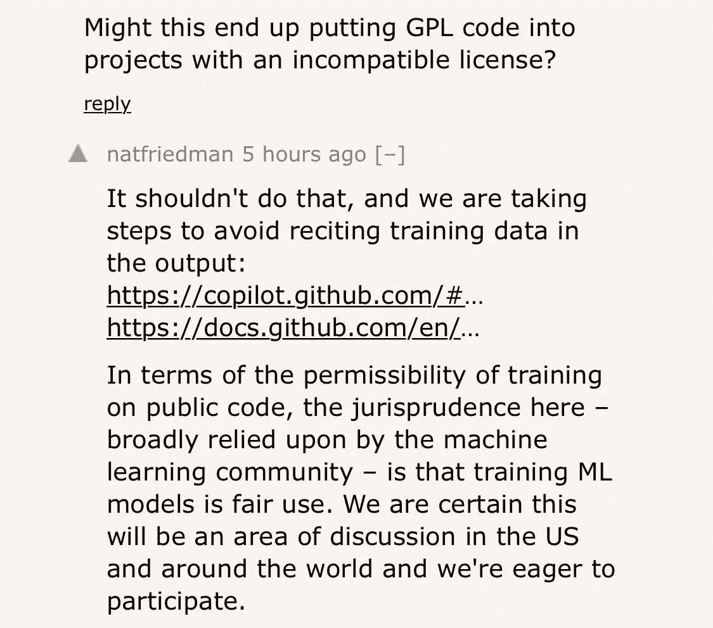

# GitHub 副驾驶。软件工程行业的兴衰故事

> 原文：<https://towardsdatascience.com/github-copilot-a-rise-and-fall-story-for-the-software-engineering-industry-524c83694136?source=collection_archive---------10----------------------->

## GitHub 和 OpenAI 已经宣布了 Copilot，这是一个人工智能助手，可以通过为他们的软件解决方案生成或自动完成代码来协助编码人员。这对软件工程行业意味着什么？

[qubodup](https://www.flickr.com/photos/21051491@N02) 的[【编程代码宏】](https://www.flickr.com/photos/21051491@N02/20196956264)由[CC 2.0](https://creativecommons.org/licenses/by/2.0/?ref=ccsearch&atype=rich)授权

2021 年 6 月中旬，OpenAI 的首席执行官萨姆·奥尔特曼(Sam Altman)发布了一条推文，他在推文中声称，人工智能将对电脑前的工作产生更大的影响，比现实世界中的工作快得多:

山姆·奥特曼关于人工智能在计算机辅助工作中的破坏的推文

17 天之后，GitHub 和 OpenAI 宣布了与那条推文相关的[副驾驶](https://copilot.github.com/)的技术预览。Copilot 是一个人工智能驱动的代码助手，它使用 OpenAI 的新解决方案 Codex，此前它接受了从公开来源(包括 GitHub 的公共资源库)中选择的英语文本和源代码的训练。

Copilot 对软件工程行业的颠覆性有多大？一年前，GPT-3 宣布后，我写了一篇介绍 OpeanAI 最新自然语言处理模型的文章，其中我分析了一些测试人员创建的第一批应用程序，这些应用程序允许基于 GPT-3 的语言能力生成代码。当时，我问自己是不是到了恐慌的时候了，对此我回答如下:

> 作为一个在 IT 服务市场工作的人，当看到所有这些令人难以置信的基于 GPT 3 的应用程序时，首先想到的问题很明显:软件工程师会因为像这样的人工智能改进而失业吗？这里我首先想到的是，软件工程和写代码是不一样的。软件工程是一项意义深远的任务，它意味着解决问题、创造性，当然，还包括编写实际解决问题的代码。也就是说，我真的认为，由于启动，这将对我们通过软件解决问题的方式产生影响。

我在一年后肯定了袖手旁观的说法，同时我也认为 Copilot 将对软件工程行业产生深远的影响。我预计，这种颠覆会加速一些起伏:

**上升中**

*   软件架构:现在，软件架构师的角色比以往任何时候都更加重要，以确保软件工程原则:可靠性、可用性、可维护性、性能(RAMP)。虽然生成有效解决特定问题的代码几乎是零成本问题，但如果没有强大的软件架构原则，正确设计所有代码如何在一个通用和一致的软件架构下组合在一起将变得更加复杂。
*   **漏洞发现工具:**对高质量数据的培训将是 Copilot 这样的工具被大规模采用的关键。这就是为什么像亚马逊这样的公司已经押注于 Bug 修正全球挑战( [BugBust](https://aws.amazon.com/bugbust/) )来改善他们的智能软件开发助理( [CodeGuru](https://aws.amazon.com/codeguru/?nc1=h_ls) )的表现。
*   **Lowcode/ Nocode —企业架构集成:**我预计 Copilot 和其他 Lowcode 和 Nocode 工具都将保持快速发展，这强化了如何集成和正确维护这些工具生成的软件代码的问题。Copilot 或任何其他类似的工具如何确保稍微改变功能或技术需求不会导致生成的代码发生巨大变化？请记住，Copilot(或任何其他类似的模型)是在海量数据上训练的，因此该模型的未来版本可能会生成完全不同的最终代码。在这种情况下，这种工具集成到可扩展企业架构中的可能性将成为无代码/低代码供应商的明显竞争优势。当被理解为代码生成工具的特定训练时，这种集成将考虑到用于编码目的的灵活性和成本降低的益处，同时确保生成的代码与预定义的软件架构及其原理一致。
*   **软件启动/提示工程:**正如我在 GPT-3 的文章中提到的，**[启动](https://productsolving.substack.com/p/openais-gpt-3-will-change-how-we)的概念将是使 Copilot 这样的技术有用的关键，为模型提供我们想要解决的问题的良好定义，等等。一些作者已经写了关于“ [prompt engineering](https://medium.com/swlh/openai-gpt-3-and-prompt-engineering-dcdc2c5fcd29) ”的概念，作为一种通过人工智能解决问题的新方法。同样，一个工程过程仍然需要比目前 Copilot 所展示的更多的东西，但它肯定会改变我们作为它的一部分处理编码的方式。**
*   ****软件许可管理:**Copilot 发布后， [Hackernews](https://news.ycombinator.com/item?id=27676266) 开始充斥着关于使用 Copilot 或类似工具时如何管理软件许可的评论。我还预计，专门从事软件许可模式的知识产权律师将会越来越多，来处理这个问题。**

****

**hackernews 上的 Copilot 线程，提到 GPL 软件的潜在含义**

****在秋天****

*   **软件编码员和测试员:为了寻找(我会说是可疑的)效率，许多公司将编程任务外包/外包给缺乏软件工程技能和商业理解的编码员。正如我们所提到的，通过正确定义业务和技术需求，快速工程将成为基于 Copilot 生成高质量代码的关键。因此，没有深厚业务和技术能力的编码人员和测试人员将很难为软件工程过程增加价值(正如解决方案本身的名称所暗示的那样，是副驾驶)。**

**根据这第一个兴衰列表，像 Copilot 这样的工具似乎将在软件开发行业创造/推动新的角色，同时破坏那些不会给软件创造过程增加真正价值的角色。你有什么想法？你会将哪些角色添加到这个兴衰列表中？**

***如果你喜欢阅读这篇文章，请* [*考虑成为会员*](https://dpereirapaz.medium.com/membership) *以便在支持我和媒体上的其他作者的同时，获得上的所有故事。***