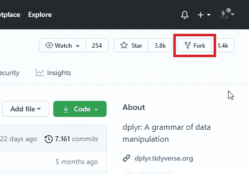
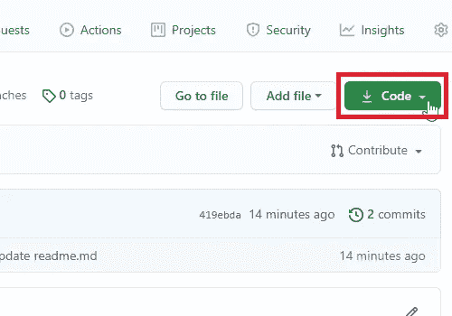

# 面向数据科学家的 GitHub 桌面

> 原文：<https://towardsdatascience.com/github-desktop-for-data-scientists-b9d8a3afc5ea?source=collection_archive---------18----------------------->

## [实践教程](https://towardsdatascience.com/tagged/hands-on-tutorials)，教程|版本控制| GitHub 桌面

## 没有命令行中的版本控制可怕

放松，你不必在 [Unsplash](https://unsplash.com?utm_source=medium&utm_medium=referral) 上使用命令行|照片由[丹尼斯·范达伦](https://unsplash.com/@dennisvandalen?utm_source=medium&utm_medium=referral)

版本控制对于代码协作、与他人共享代码、能够查看代码的旧版本，甚至自动部署代码都很重要。一开始可能会有点混乱，但是非常值得花时间，特别是如果您在开放源代码领域工作或者在一个经常使用项目版本控制的团队中工作。以下是一些值得使用的最大特性:

*   存储带有注释的文件更改历史
*   组织多个用户同时编辑同一个项目
*   简化代码审查程序
*   自动化工作流以报告问题、请求改进和部署代码

## 版本控制功能

版本控制的主要特性之一是存储库中每个文件的文件更改历史。这可以作为每个文件的变更日志，因此总是可以看到过去任何时候运行的代码。每当有人更新一个文件并将新版本推送到存储库时，他们都必须添加一个简短的注释。在一个完美的世界中，这详细描述了变化是什么以及为什么要进行这些变化。如果有任何关于为什么更改或为什么更改的问题，负责人将在提交中被标记，以及他们提供的附加信息。

版本控制的另一个特性是创建分支的能力。分支是保持独立的代码的新版本。这有助于对代码进行修改和测试，因为它不会改变主分支，那里是最新的工作版本。不同的用户也可以使用分支来同时处理不同的代码或特性。当这些分支准备好时，可以合并回主分支，并且在合并时有一个过程来协调它们之间的差异。

在与团队合作时，代码审查是最佳实践。一个人可能在一个新的分支中做一个新特性的所有工作，但是在盲目地将其合并到主分支之前，应该由团队进行评审。当创建一个 pull 请求来将代码移动到主分支时，它还会启动一个讨论，团队成员可以在代码合并到主分支之前讨论代码并请求更改。这个过程应该有助于改进投入生产的代码，以防止错误和中断，提高代码的效率，甚至使代码符合格式化代码的标准。

使用 GitHub 进行版本控制的最后一个值得注意的好处是它提供的自动化选项。如果有一个标准的代码审查清单，它可以作为一个模板被添加，当一个拉请求被创建时，它将是可用的，当审查任务被完成时，它可以被填写。当人们创建问题时，也可以使用模板，以便他们在创建问题时记住需要输入的所有详细信息。GitHub 还提供了支持自动化的动作。这些可以由不同的事件触发，比如将代码合并到主分支中。一个动作可以运行单元测试，构建/编译包组件，甚至将代码部署到生产环境中。

## 版本控制风格

有几个大名鼎鼎的版本控制你可能听说过。一些最流行的是 Git 和 GitHub。 [Git](https://git-scm.com/about) 是版本控制的底层技术， [GitHub](https://github.com/features) 是简化版本控制工作流程的软件。

Git 可以在本地使用，不需要任何外部存储库。您可以在计算机硬盘上执行所有版本控制任务。本地 Git 存储库非常适合个人项目，或者当您还没有准备好与整个团队共享您的代码，但是仍然想要版本控制的好处时。

GitHub 网站是一个存储代码的仓库。GitHub 网站上托管了很多开源项目，比如 Python 和 R 包。对于公共存储库，任何人都可以查看修订历史、包的问题以及与之相关的文档。

要连接到 GitHub 网站上的存储库，我们可以使用 Git 或 GitHub Desktop。对于那些喜欢命令行界面(CLI)的人来说， [Rebecca Vickery](https://rebecca-vickery.medium.com/) 有一篇关于[使用 Git CLI 进行数据科学](/introduction-to-github-for-data-scientists-2cf8b9b25fba)的精彩文章。那么你为什么要继续读书呢？**命令行可能会令人生畏**。想要一个图形用户界面(GUI)来管理您的版本控制并没有错。GitHub Desktop 为您的存储库提供了一个清晰简单的界面。

# GitHub 桌面流程

虽然每个人对于他们的存储库都有一个稍微不同的流程，但是有一些通用的步骤来修改 GitHub 上的代码:

1.  创建分支
2.  添加提交
3.  创建新的拉式请求
4.  完成代码审查
5.  合并拉取请求

创建一个分支会复制当前的生产代码。开发人员将对文件进行更改，将任何更改提交到新的分支。接下来，pull 请求将打开讨论，将新分支的变更添加到生产代码中，通常是在 master 或 main 分支中。代码评审者可以添加注释，并请求对拉请求所做的更改进行澄清。一旦审查完成并做出任何必要的更改，就可以将拉请求合并到主分支或主要分支并关闭。

让我们更详细地浏览这些步骤，看看如何使用 GitHub Desktop 完成每一步。

## 创建分支(将新代码与旧代码分开)

要进行更改，首先创建一个新分支。如果您拥有对存储库的完全访问权限，那么您可以简单地在存储库的 GitHub 站点上创建一个新的分支。

1a。点击分支:主

作者图片

2a。在文本框中键入新分支的名称。为了组织有序，您的组织可能需要考虑一些分支命名约定

作者图片

3a。点击创建分支

作者图片

现在将选择新的分支。

作者图片

如果您没有对存储库的完全访问权，这在公共项目中很常见，那么您将不得不分叉存储库。新分支和分叉是同义词。fork 将在一个新的存储库中创建，而不是与生产代码相同的存储库，通常在您的个人配置文件下。要分叉:

1b。在右上角，单击 Fork

作者图片

2b。等待文件复制

作者图片

3b。将选择新的分叉

作者图片

## 添加提交(增强代码/添加特性)

要提交代码，您需要将存储库克隆到您的本地计算机上。在将更新发送回存储库之前，这将为您复制要处理的代码。要将存储库克隆到您的本地计算机，请执行以下操作:

单击克隆或下载。

作者图片

点击用 GitHub 桌面打开。

作者图片

如果你没有 GitHub 桌面，点击下载 GitHub 桌面。

作者图片

GitHub desktop 会询问将存储库克隆到本地机器的哪个位置。这是本地路径字段。

作者图片

单击分支并选择新创建的分支。这将使用该分支上的任何更新来更新本地机器上的文件，并使其成为要添加提交的活动分支。

作者图片

要进行更改，请打开您在克隆时选择的目录，并像往常一样使用文本编辑器或集成开发环境(IDE)进行更改。保存文件。

返回 GitHub 桌面。GitHub Desktop 会不断扫描存储库文件夹树，并会看到您所做的任何更改。这些更改将显示在左侧窗格中。右窗格将预览对所选文件的更改(某些文件类型不会预览)。

作者图片

每当您做出一组相关的变更时，将这些变更提交到您的存储库中。记得在提交中添加注释，这样人们就可以很容易地识别出什么被改变了。上面的文本框用于快速描述，但是如果您有更多关于提交的注释，请将它们放在更大的描述文本框中。

做出更改并添加注释后，提交更改。

作者图片

提交更改只会将它们保存在本地文件中。要将更改推回 GitHub 服务器，请点按“推回原点”。如果有尚未推回服务器的提交，右窗格中将出现一条消息，说明**将 xx 提交推送到源远程**。origin 只是存储库被克隆的地方的名称。

作者图片

## 打开拉取请求

导航到 GitHub 服务器上的存储库。确保你在正确的分支上。如果您在原始存储库上创建了一个新分支，请导航到那里。如果您必须派生存储库，请在您的个人资料中导航到该存储库。

在**拉动请求**选项卡上，点击**新拉动请求**。

作者图片

选择新的分支作为要比较的分支，点击**创建拉式请求**。在我们的例子中，pull 请求会自动填充我们的 commit 注释。

作者图片

## 代码审查

代码审查有助于确保我们添加或更改的代码是正确的，并且已经过多人的审查和批准。无论您是否有权访问存储库，您都应该让审阅者检查变更。如果有任何问题，作为一个团队检查它们。

“拉”请求显示在存储库的“拉”请求选项卡下。每个“拉”请求都有一个“对话”、“提交”和“文件已更改”选项卡。

对话是人们可以添加关于代码的问题或评论的地方。您可以格式化您的评论，并在您的评论中标记人物和问题。

提交显示拉请求中的所有提交和注释

“更改的文件”显示了哪些文件被更改、添加或删除，并对可用的代码进行了逐行比较

作者图片

## 合并拉取请求

在我的例子中，当我在新的分支上工作时，我的主分支被改变了。这就是为什么有消息说有冲突要解决。单击解决冲突按钮将打开一个编辑器。它将显示来自每个分支的文件版本，允许您删除一个并保留另一个，或者创建两者的某个版本。

作者图片

在这种情况下，主分支的版本是正确的。可以删除来自其他分支和分隔符的更改。冲突可被标记为已解决，并提交给合并。

作者图片

随着代码审查和冲突的消除，拉请求可以被合并。这里将再次出现一个选项，对合并完成的内容给出一个注释。合并后，代码将成为主分支或主分支的一部分！

作者图片

现在你知道如何使用 GitHub 和 GitHub Desktop 完成最基本的版本控制任务了！

<https://realdrewdata.medium.com/membership>  

# 进一步阅读

     