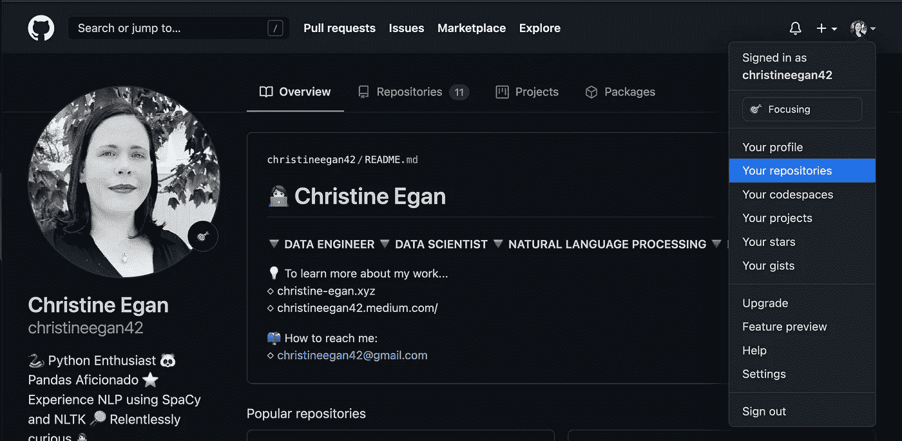
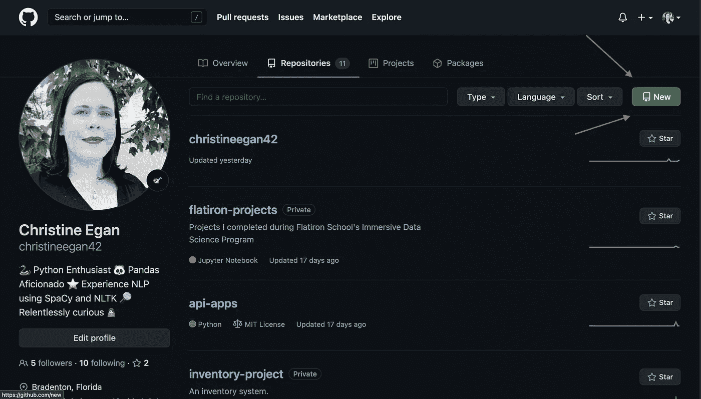
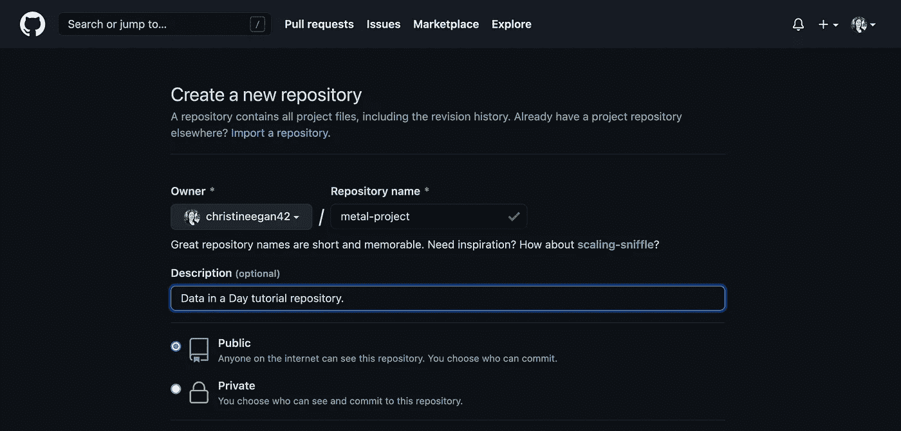
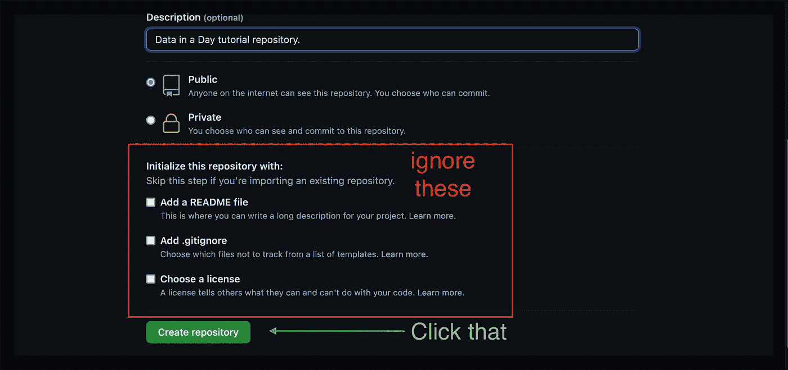
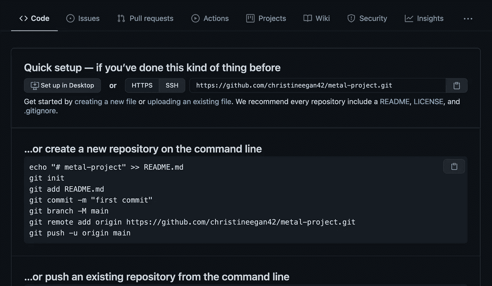

# 如何为 Python 数据科学项目创建 GitHub 存储库

> 原文：<https://towardsdatascience.com/github-i-getting-started-with-github-272255c5f11f?source=collection_archive---------16----------------------->

## 了解如何使用 GitHub 存储库来共享和协作数据科学项目


克里斯蒂娜·莫里洛在 Pexels 上的照片

# **一、什么是 Git？**

**Git** 是一个 ***版本控制系统***——一个软件工具，允许开发者在一种特殊的数据库中跟踪和管理代码的变化。自从 2005 年由 Linus Torvalds 开发以来，Git 已经成为使用最广泛的版本控制系统之一。[**GitHub**](https://github.com/)**是一个 ***代码库托管服务*** ，你可以免费使用它来分享和协作代码。**

**在协作项目中使用 GitHub 的一些优势是:**

1.  **当代码中断时，开发人员可以返回到代码的早期版本，以识别孤立分支中的问题，从而最大限度地减少对项目其他方面的干扰。**
2.  **独立的分支允许团队成员处理同一项目的不同方面，从而在不影响其他团队的情况下进行更改。**
3.  **当变更完成时，它们可以被合并到主分支中。任何有冲突的变更都会被标记出来，以便能够解决。**

**GitHub 会记录您向 GitHub 贡献(或上传)文件的频率。这是向潜在雇主展示你对编程认真的好方法。**

# ****二。在 GitHub 上创建项目存储库****

1.  **如果你是从零开始，看看[用 Python 进行数据科学项目的一般设置](/general-setup-for-data-science-projects-in-python-with-macos-big-sur-65784fc20231)、[虚拟环境 I:用自制软件安装 Pyenv】和](https://christineegan42.medium.com/virtual-environments-for-python-data-science-projects-on-mac-os-big-sur-with-pyenv-and-virtualenv-60db5516bf06) [Jupyter 笔记本 I:Jupyter 笔记本入门](https://christineegan42.medium.com/jupyter-notebooks-i-getting-started-with-jupyter-notebooks-f529449797d2)。正确的数据科学项目设置对于本教程非常重要。**
2.  **确保您遵循了本教程前四部分中概述的步骤，并且您已经:**

*   **创建了项目文件夹**
*   **激活了项目文件夹中的新虚拟环境**

**3.导航到 GitHub.com。如果您没有帐户，请创建一个帐户。前往右上角靠近您个人资料图片的下拉菜单中的**您的存储库**选项卡**

****

**突出显示您的存储库的 GitHub 配置文件屏幕**

**4.在那里，点击右上角的绿色按钮，上面写着**新**。**

****

**新按钮在右上角。**

**5.输入唯一的存储库名称和简短描述。如果你愿意，你可以以后再改。存储库的[命名约定](https://github.community/t/organisation-and-repository-capitalisation-standard/580)建议使用由破折号分隔的小写名称(例如“my-project”)是最好的。将存储库设置为公共或私有。**

*****注意:如果你正在跟随*** [***日***](https://christineegan42.medium.com/data-in-a-day-complete-your-first-data-science-project-with-python-in-just-one-day-2e4202fb0ae6) ***教程中的数据，你现在可以将这个项目命名为“metal-project”并带有“日教程数据仓库”的描述。*****

****

**创建具有名称、描述和隐私设置的新存储库。**

**6.当您到达页面底部时，不要选择“**使用“**初始化此存储库”部分中的任何项目。点击**创建存储库**。**

****

**完成创建您的存储库。**

**7.将出现一个新屏幕，上面有一些说明。下面，我将提供相同的说明，并为初学者提供一些额外的细节。**

****

**GitHub.com 上的说明截图**

# ****三。在本地初始化您的存储库****

**既然您已经在 GitHub.com 上创建了一个存储库，那么是时候通过将您在 GitHub.com 上创建的存储库初始化到您的项目文件夹中来将您的项目文件夹与您的存储库同步了。**

**1.打开终端并输入:**

```
$ cd my-project
```

**2.进入该页面后，您可以通过输入以下内容来初始化存储库(确保替换您的用户名):**

```
git remote add origin https://github.com/username/my-project.git
git branch -M main
git push -u origin main
```

**现在，存储库在您的本地项目文件夹中初始化。这就是我们将本地文件连接到在线存储库的方式。一旦连接上，我们就可以使用命令来推送(或上传)我们项目的新版本。GitHub 将跟踪变化和不同的版本。**

# **动词 （verb 的缩写）下一步是什么？**

*   **在[使用 Python 进行数据科学项目的一般设置](https://christineegan42.medium.com/general-setup-for-data-science-projects-in-python-with-macos-big-sur-65784fc20231)中，您通过安装 CLT、Xcode、Hombrew、Python 和 Pip 安装了入门所需的基础包。**
*   **在[Virtual Environments I:Installing Pyenv with home brew](https://christineegan42.medium.com/virtual-environments-for-python-data-science-projects-on-mac-os-big-sur-with-pyenv-and-virtualenv-60db5516bf06)中，您学习了如何在 Mac OS Big Sur 上使用 Pyenv、Virtualenv 和 Pip 为您的 Python 数据科学项目创建虚拟环境。**
*   **在[Jupyter Notebooks I:Jupyter Notebooks Getting Started with Jupyter Notebooks](/jupyter-notebooks-i-getting-started-with-jupyter-notebooks-f529449797d2)中，您通过创建一个内核规范将 Jupyter Notebooks 链接到您项目的虚拟环境。**
*   **最后，在本教程中，您在 GitHub.com 上创建了一个 GitHub 存储库，并在本地初始化了该存储库(在您自己的计算机上)。**

**在下一节“Python 初学者数据科学基础”中，您将创建一个 Jupyter 笔记本来记录您的项目，我将向您展示如何通过将这个笔记本推送到 GitHub 存储库来进行第一次提交。**

**感谢阅读！**

**👩🏻‍💻克里斯汀·伊根◇ [克里斯汀-伊根. xyz](https://christine-egan.xyz/)**