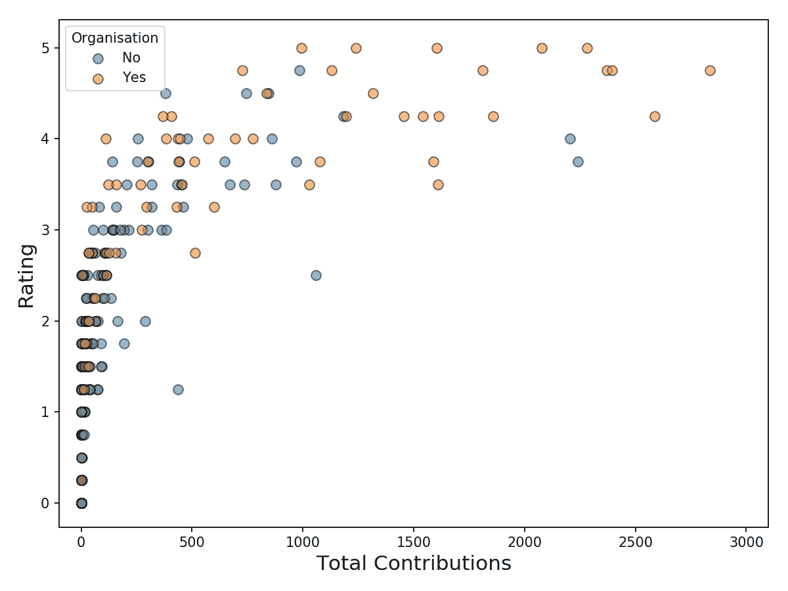

# GitRater —预测您的 GitHub 档案的质量

> 原文：<https://towardsdatascience.com/gitrater-predicting-the-quality-of-your-github-profile-b6cf66467304?source=collection_archive---------39----------------------->

## 使用机器学习来预测你是否擅长编码

如果你曾经申请过技术职位，你可能会给公司发一个你的 GitHub 简介的链接。这个档案中的信息可以很好地表明你的编码能力和是否适合团队。所有这些信息的不利之处在于，招聘人员可能需要很长时间来评估这些信息。为了节省时间，机器学习有可能被用来自动评估你的编码能力。

来源: [flaticon](https://www.flaticon.com/free-icon/rate_3163706?term=rating&page=1&position=9&page=1&position=9&related_id=3163706&origin=search)

在本文中，我们将带您了解构建这样一个模型的过程。我们讨论如何从 GitHub 收集数据，并使用这些数据创建模型特征。为了建立一些直觉，我们探索数据集中的关系。最后，我们比较和解释了两种最大似然算法——决策树和随机森林。你可以在 [GitHub](https://github.com/conorosully/git-rater) 上找到这个分析的代码，在 [Kaggle](https://www.kaggle.com/conorsully1/github-ratings) 上找到数据集。

# 数据收集和特征工程

从您的代码库到您关注的其他程序员，您的 GitHub 个人资料中有许多公开信息。我们构建了一个 web scraper，从 230 个用户的个人资料中收集了一些数据。例如，您将在任何用户的概览页面上看到与图 1 中相似的贡献列表。当用户编写新代码并将其保存到他们的一个代码库(repos)时，他们就做出了贡献。

图 1: GitHub 贡献(来源:[作者](https://github.com/conorosully))

通过搜集这些数据，我们最终得到了去年每天所做贡献的列表。为了能够在模型中使用这些数据，我们首先需要做一些特征工程。有几种方法可以做到这一点。比如我们可以统计最近一年的投稿总数( **n_cont** )。我们还可以获取自他们最后一次投稿以来的天数( **last_cont** )。这些贡献只是我们可以用来创建模型特征的 GitHub 概要文件的一个方面。

图 2: GitHub 工具条(来源:[作者](https://github.com/conorosully))

图 2 显示了用户侧边栏中的一些可用信息。由此，我们可以获得关注者的数量，以及用户已经标记的存储库的数量( **stars** )。这些已经是数字了，所以不需要特征工程。最后，我们还从组织信息中创建一个标志( **org_flag** )，它将表明用户是否是组织的一部分。

最后一组特征来自用户的回复。在图 3 中，我们可以看到一些代码回收的例子。我们收集了用户创建的回购总数(**回购**)。我们还收集了每个回购协议中使用的编码语言。由此，我们统计了所有用户回复中使用的不同编码语言的数量( **n_lang** )。

图 3: GitHub 存储库(来源:[作者](https://github.com/conorosully))

表 1 总结了所有创建的模型特征。除了 **stab_cont** 、 **foll_ratio** 和 **cont_repo_ratio、**这些我们上面都讨论过。还可以创建其他信息源/特征。我们将自己限制在这个集合中，因为它们相当简单，数据也很容易收集。希望这些特征至少与允许我们做出准确预测的编码能力有关。具体来说，我们将尝试使用它们来预测从 0 到 5 的评分。

表 1:模型特征列表

此评级是通过取两个独立评级的平均值得出的。重要的是，评价者并不局限于上述特征中包含的信息。例如，评价者可以打开 repos 中的文件，阅读实际编写的代码。在浏览了一个档案之后，每个评价者根据用户的编码水平给出一个等级，从 0 到 5 (5 是最好的)。两次评级的平均值作为最终评级/目标变量。

# 数据探索

在我们开始建模之前，探索一下我们的模型特征是一个好主意。我们这样做是为了建立直觉，并了解哪些功能将有助于预测评级。图 4 中可以看到一个潜在的好预测器的例子。在这里，我们可以看到额定值和 **n_cont** 之间的关系。请注意，随着用户总贡献的增加，用户的评级往往也会增加。

图 4:评级与贡献散点图

此时，你应该问问自己这段感情有没有意义。没有贡献或贡献很少的用户在过去的一年中不会做很多编码工作。做了很多贡献的用户会做很多编码。这似乎是合乎逻辑的——你编码得越多，你就越擅长编码。我们的模型有望利用这种关系进行预测。

另一方面，你可以看到评分和带星库数量的关系(**星**)。在这种情况下，似乎没有任何模式。也许这是因为你不需要做任何编码就可以启动其他用户的回复。也就是说，星星不会告诉我们任何关于你编码能力的事情。从这个分析中，我们不应该期望星星是我们模型中的一个重要特征。

图 5:评级与星级散点图

另一个潜在的重要特征是组织标志。我们可以期待组织中的用户成为更好的程序员。特别是，如果他们是像[谷歌开源社区](https://github.com/google)的一部分。在下面的方框图中，我们可以看到，属于某个组织的用户的评分往往更高。没有组织的平均评分为 1.8，而当用户是组织的一部分时，平均评分为 3.4。这种差异表明 **org_flag** 可能是一个很好的预测器。

图 6:评级与组织标志箱线图

我们应该记住，这些特征不是孤立存在的。看似具有预测性的特性，当它们与其他特性一起包含在模型中时，可能并不那么重要。这是由于特征本身之间的关系。例如，在图 7 中，我们可以看到贡献更多的用户更有可能成为组织的一部分。具体来说，贡献 500 英镑或更多的用户中有 70%是某个组织的成员。然而，对于那些缴款少于 500 英镑的人来说，这一比例仅为 20%。

图 7:评级与贡献-组织散点图

假设我们创建一个只有 **org_flag 的模型。**根据上述分析，组织中的员工可能会获得更高的预测评级。我们可以通过在模型中添加 **n_cont** 来改进这些预测。同样，贡献较大的人可能会获得较高的评级。然而，许多具有高贡献的用户将是组织的一部分。这意味着他们可能已经被给予了很高的评级，所以包括 **n_cont** 可能不会像我们想象的那样改善这些预测。最终， **n_cont** 的重要性实际上取决于它给出的信息比 **org_flag** 给出的信息多多少。

来源: [flaticon](https://www.flaticon.com/)

# 决策图表

考虑到我们的探索性数据分析，是时候继续建模了。我们将从创建一个简单的决策树开始。为此，我们首先分割数据集，并使用 200 行来训练决策树。我们保留剩余的 30 行作为测试集。决策树是使用基尼系数来决定每个节点的最优分割。我们还将树限制为每个叶节点至少有 10 个样本。您可以在图 9 中看到整个决策树。

为了理解这棵树是如何工作的，让我们从根节点开始。如果用户满足第一行中的规则(即，至少做出了 105 个贡献)，我们将沿着树中的右箭头向下。如果不满足该规则，我们将遵循左箭头。我们不断地检查规则并跟随箭头，直到到达一个叶节点。例如，如果一个用户做了 900 次贡献，并且有 90 个关注者，那么我们将到达用红色圈出的叶节点。17 个用户最终在这个桶中，并且他们被给予 4.603 的评级。

图 9:决策树

下一步是使用这个模型对测试集进行预测。为了评估这个模型，我们应该将实际评分与这些预测进行比较。一种方法是使用图 8 中的散点图。如果模型是完美的，所有点将落在红线上(即实际=预测)。黑色虚线距离红线一个单位。这意味着，与实际评级相比，只有 2 个预测的差异超过 1。总体而言，该模型在测试集上的 MSE 为 0.3077。

图 8:决策树实际评分与预测评分

# 随机森林

决策树通常被认为是一个简单的 ML 模型。让我们看看能否使用更复杂的方法——随机森林——来提高这一精度。具体来说，我们使用一个有 100 棵树的随机森林。每棵树的最大深度限制为 4。与决策树一样，您可以在图 10 中看到实际评分与预测评分的对比图。

同样，我们有 2 个预测的误差超过 1 个单位。就 MSE 而言，似乎确实有所改善。测试集上的 MSE 为 0.2691，比决策树低 12.5%。在决定使用哪种最终模型时，应该将精确度的提高与使用更复杂模型的缺点进行权衡。

图 10:随机森林实际与预测评级

其中一个缺点是我们不能像解释决策树一样解释随机森林。换句话说，我们不能简单地将整个模型可视化，如图 9 所示。这意味着我们对模型如何做出预测的理解会更差。为了解释这个模型，我们将不得不使用额外的技术，比如特征重要性分数。

我们可以在图 11 中看到随机森林的特性重要性分数。一般来说，特征的重要性越大，该特征在进行预测时就越有用。我们可以看到 **n_cont** 是迄今为止最有用的，其次是**回购**和**追随者**。我们可以看到**星星**并不是很重要。这与我们的探索性分析是一致的。不一致的是 **org_flag** 最不重要。看起来这个特性并不像我们预期的那样重要。

图 11:随机森林特征重要性

# 想法和未来的工作

在任何模型中，都有需要解决的弱点。我们应该努力理解的一个方面是为什么 **n_cont** 比其他任何特性都重要。参见图 12，当您第一次打开某人的个人资料时，贡献会立即吸引您的注意。这可能会对评定者的决策过程产生影响。换句话说，他们对捐款的依赖可能超过了他们的意愿。

图 12: Github 概述页面

评级也可能在其他方面出现偏差。例如，如果评价人考虑用户的档案图片，可能会引入种族/性别偏见。为了解决这个问题，我们需要一个客观的评级系统。它应该只考虑与编码能力直接相关的信息，并且该信息应该更统一地呈现。

在实践中，不同的公司或团队的评级系统可能会有所不同。对于给定的用户，数据工程团队可以给数据科学团队一个完全不同的评级。这是因为每个团队所需的技能不同。换句话说，评级将捕获用户在特定团队中的表现，而不是他们在总体编码方面的表现。

来源: [flaticon](https://www.flaticon.com/)

围绕特征工程也有很多工作可以做。到目前为止，我们所使用的功能实际上只是与编码能力相关。做出很多贡献并不能让你成为一个好的程序员。只是好的程序员往往会做出很多贡献。我们应该尝试从实际编写的代码中创建功能。例如，我们可以识别用户是否使用了单元测试，使用了一致的命名约定，或者正确地注释了他们的代码。

总的来说，使用机器学习来预测编码能力似乎是可能的。使用一个相当简单的方法，我们可以做出与实际评级一致的预测。希望这将为将来更好的模型打下基础。

我们提到了性别/种族偏见。机器学习中的这种偏见比许多人意识到的更普遍。亚马逊使用的一个系统就是一个例子，该系统不以性别中立的方式对求职者的简历进行评级。我们将在下面的文章中讨论这一点以及其他一些有偏差的算法:

</what-is-algorithm-fairness-3182e161cf9f>  

## 图像来源

所有图片都是我自己的或从[www.flaticon.com](http://www.flaticon.com/)获得的。在后者的情况下，我拥有他们的[高级计划](https://support.flaticon.com/hc/en-us/articles/202798201-What-are-Flaticon-Premium-licenses-)中定义的“完全许可”。