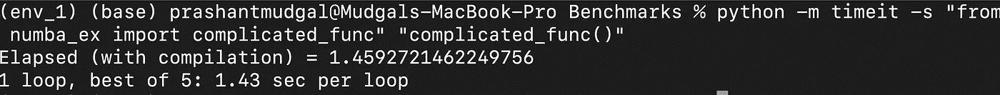
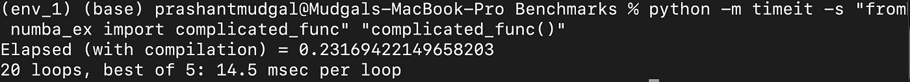
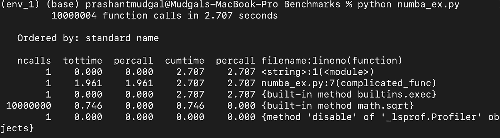
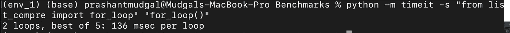

# 给 Python 插上翅膀——实现更快 Python 程序的简单技巧

> 原文：<https://towardsdatascience.com/give-wings-to-python-make-it-fly-6eb4d4859b89?source=collection_archive---------16----------------------->

## 编写优化且更快的 Python 程序的策略汇编

Python 不是特别快，但它是最受欢迎的编码语言之一，尤其是在数据分析方面。有趣的是，使它天生缓慢的原因也使它成为最受欢迎的语言。

1.  **动态类型化** —用户不必提供变量的数据类型。这让用户的生活更轻松，但给解释者带来了麻烦。
2.  **已解释，未编译** — Python 被解释为未编译，这意味着它不能提前对程序进行内存和速度的高级优化。
3.  **内存问题**——由于 Python 的灵活性，每个元素都有自己的内存，而不是一个连续的内存块。它会在提取操作过程中造成时间延迟


资料来源:联合国人类住区规划署

尽管有这些问题，我相信大多数缓慢进入系统可以归因于程序员编写简洁、优化程序的能力。这些年来，我在处理数据、构建模型、将*不那么优化的*代码投入生产的时候犯了很多错误。但是所有这些经历为我提供了一些工具，我一直用这些工具来使我的代码更干净、更快、更 pythonic 化(不管那意味着什么)。

让我们看看那是什么。

# 创可贴解决方案

如果你有很多时间，那么你可以把你的 Python 代码转换成 C/C++，然后在上面写一个 Python 包装器。它将为您提供 C++的速度，并保持 Python 的易用性。

但是，我们不希望这样，因为有更简单的解决方案。

Numba 走进房间。

好吧，我告诉你 Numba 从 2012 年就开始出现了，但对许多程序员来说仍然是难以捉摸的。

它本质上是把你的 Python 代码转换成机器码，速度和 C 代码差不多。

让我们用一个简单的例子来验证一下。一个简单的功能，没什么重的。



在具有 6 个内核的 i7 机器上，每循环 1.43 秒。看起来很慢，但肯定可以改进。

使用 pip 在您的机器上安装 numba

```
pip install numba
```

我们所做的只是添加了两行代码，import 和@jit(nopython=True)



每循环 14.5 毫秒。

那就是 1430/14.5 ~ 98X 的速度增益。

收益当然取决于你的机器和你到底想做什么，但如果你想快速解决问题而又不想过多地陷入代码的罪恶中，这是一个很好的起点。

*   它通常在你不得不处理令人烦恼的循环时起作用

或者，

*   其中需要对大集合执行相同的操作。

# 侧写师

您需要找出代码的哪一部分使它变慢了。在大多数情况下，这将是一些错误形成的循环或函数，这将是麻烦制造者。

## Unix 计时器

在 shell 上，在调用 python 和您的代码之前，您需要使用 Unix 的 time 命令。

## cProfiler

您可以从 shell 中运行 cProfiler，方法是调用

```
python -m cProfile -s time name_of_your_file.py
```

它会让你淹没在大量的信息中，所以你需要做些别的事情。

您可以在代码中导入 cProfile，并在您怀疑会使您陷入困境的函数上运行它。

```
import cProfile
cProfile.run('complicated_func()') #*Here I am running it on a complicated_function that has time overheads.*
```

输出可以放在文件中，也可以在 shell 上看到。

```
cProfile.run('complicated_func()', 'output.txt')
```



# 舒马赫速度

到目前为止，它是关于创可贴解决方案以及如何对您的代码进行时间配置，让我们来看看某些策略，它们不仅是最佳实践，而且还能为您加快速度。

## 发电机节省内存，提高速度

列表是很好的，但是如果你正在处理一些需要延迟生成的列，那么生成器会更好。

使用生成器带来的性能提升是延迟(按需)值生成的结果，这意味着更低的内存使用率。此外，我们不需要等到所有的元素都生成之后才开始使用它们。

上面的代码片段为列表使用了 87，616 字节的内存，而生成器只使用了 112 字节的内存**。**

*节省下来的内存可以让你的代码运行得更快，因为 CPU 正在处理的所有数据都应该在缓存中；如果使用列表，那么数据溢出到 L1 缓存的可能性更大。*

## **范围内的枚举**

这更多的是一个 ***干净代码*** 的原则，而不是与速度有关。如果您不仅需要处理数据的索引，还需要处理数据本身，那么在 Python 3.8 上，enumerate 是一个更干净、更好、也更快的选择。

## 进口

如果你打算只使用一个函数，不要导入整个库和包。

```
import math
value = math.sqrt(50)vsfrom math import sqrt
value = sqrt(50)
```

当编写生产级代码时，如此小的开销累积起来会达到惊人的比例。

## 明智地使用 Itertools

尽可能使用 itertools，它们可以节省大量时间，尤其是在避免 for 循环方面。

```
from itertools import productdef cartesian_prod (arr1, arr2):
    return list(product(arr1, arr2))arr1 = [1,2,3]
arr2 = [4,5,6]
cartesian_prod(arr1, arr2) # Output is
[(1, 4), (1, 5), (1, 6), (2, 4), (2, 5), (2, 6), (3, 4), (3, 5), (3, 6)]
```

如果您正在处理一个问题陈述，比如推荐系统，并且想要用户项的组合，那么通过 itertools 计算笛卡尔积是一个明智而安全的选择。

人们还可以使用 itertools 的排列组合功能来减轻生活中的一些痛苦。

## 只用 f 弦系住你的琴弦

不要对字符串使用任何旧的方法，比如%s 或 format()，f 字符串非常快，而且更容易使用

## 传统 for 循环的列表理解

一般来说，for 循环(至少比 while 循环好)很慢，如果你开始使用两个嵌套循环，那么复杂度将会是 n。



对于传统的 For 循环，时间是 136 毫秒


对于列表理解，它是 118 毫秒

> 这不是一个很大的改进，但是代码看起来更干净，并且只用一行代码就完成了。

类似地，使用 [*map、filter 和 reduce*](https://www.learnpython.org/en/Map,_Filter,_Reduce) 函数可以减轻代码的时间和空间复杂度。

资料来源:Giphy

## 你的硬件是什么？

十有八九，你可能在 SSD(固态硬盘)上运行你的代码。如果你已经达到专业水平的 python 编程，那么你检查 SFrames，可伸缩框架的缩写。它们在固态硬盘上的大型数据集上工作得非常好，比熊猫好得多。

人们可以使用 turicreate(graph lab 的免费版本)在代码中使用 SFrame。

# 结论

有许多方法可以优化代码的性能。所有上述策略都经过了尝试和测试，但它们不是快速解决问题或万无一失的解决方案，因为它们在某种程度上取决于您运行它的数据和您使用的硬件。

> 还有许多其他方法，如使用局部变量、并发和多线程，也有助于实现更快的速度。

编码时，遵循最佳实践，而不是抄近路，因为生产环境非常敏感，您不希望花费无数时间回顾您在亿万年前编写的东西。

通常在代码库的可读性和优化之间有一个折衷。孰先孰后的决定取决于你。