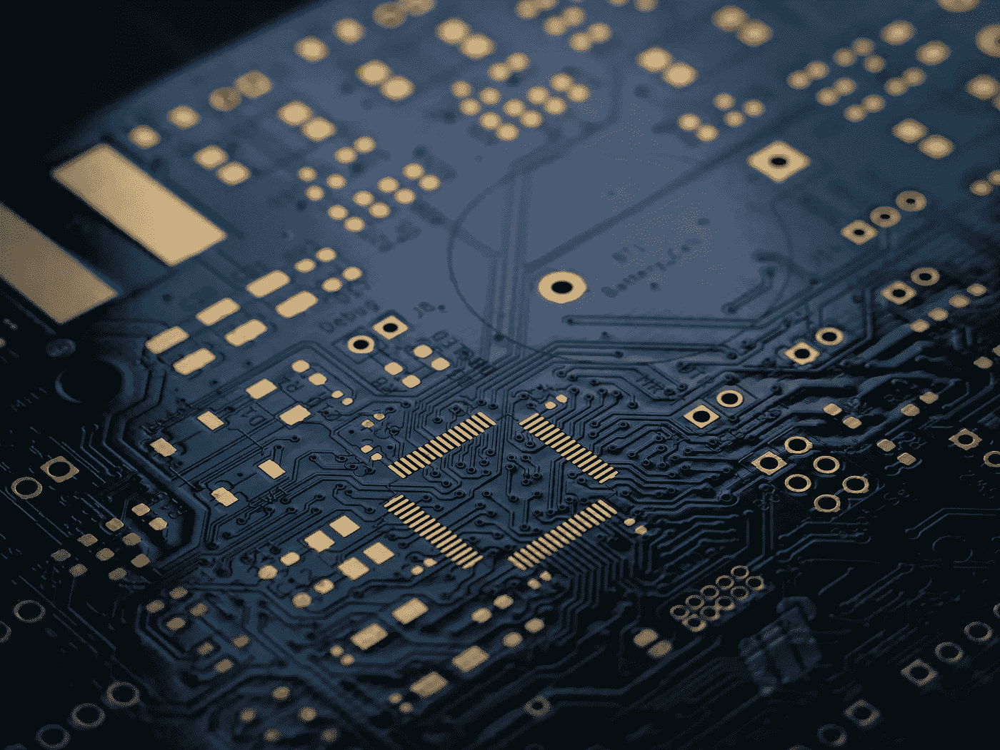
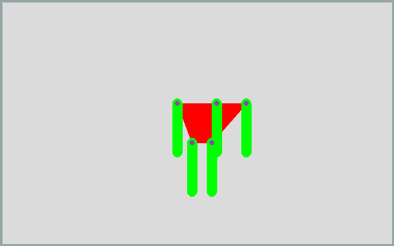
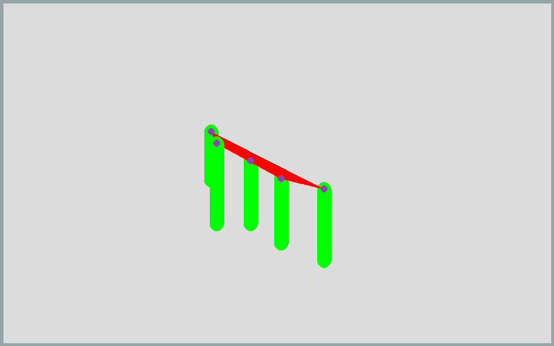
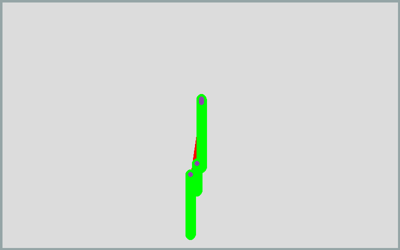
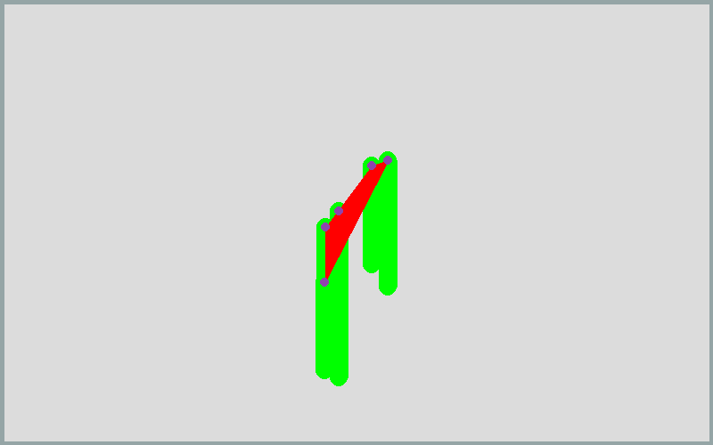

# 在物理引擎中实现遗传算法控制

> 原文：<https://towardsdatascience.com/giving-a-genetic-algorithm-control-in-a-physics-engine-abeeb5f2d603?source=collection_archive---------35----------------------->

## 人工智能在物理引擎中的应用简介

Vishnu Mohanan 在 [Unsplash](https://unsplash.com/s/photos/engineering?utm_source=unsplash&utm_medium=referral&utm_content=creditCopyText) 上的照片

人工智能最常见的商业应用是获得洞察力或对数据集进行预测。尽管我认为这很有趣，但是这些技术已经被其他人广泛地讨论过了。

本文涵盖了机器学习的一个更具实验性的应用:这是允许机器学习操纵物理模拟。

# 概念:

将人工智能放入物理环境有很多不同的可能性，但所有这些都涉及到操纵和控制环境中的对象和力。为了从这个项目中获得好的结果，我们需要给人工智能在环境中的控制增加限制。

照片由 [Med Badr Chemmaoui](https://unsplash.com/@medbadrc?utm_source=unsplash&utm_medium=referral&utm_content=creditCopyText) 在 [Unsplash](https://unsplash.com/s/photos/concept?utm_source=unsplash&utm_medium=referral&utm_content=creditCopyText) 拍摄

我决定的限制如下:人工智能必须生成一个 n 边多边形。多边形的每个点都有一个以固定速度旋转的分支。这个旋转速率是由 AI 定义的。

遗传算法需要一个适应度函数来随着时间的推移改进代理。在这种情况下，将根据两个因素来判断代理:速度和面积。在这种情况下，速度被定义为在 100 帧中行进的 x 距离。面积是由多边形的点围成的空间。面积被考虑在内，以防止需要更复杂的编码来添加空气阻力对生物的影响。

我们希望速度最大化，面积最小化。我们可以得出结论，智能体的适应度可以是速度/面积。这将使得适应度与速度成正比，与面积成反比。希望我们最终能拥有移动迅速、体积小巧的“生物”。这意味着一个类似的生物在现实中应该站得住脚，这给了这个项目更多的实用价值。

# 实施:

我将只添加代码中有趣的部分，因为代码的其余部分不需要任何解释。如果想要项目的完整代码，可以在[这里](https://github.com/victorsimrbt/physics_ai)找到。

## 物理模拟基础:

我在这个项目中使用的物理引擎是基于 pymunk 库的，它包含了使这个项目工作的所有部分。

下面的脚本是一个可以由模型生成的布娃娃的例子。

列表“vs”是构成布娃娃主体的点的列表。“肢体”列表是定义每个肢体的向量长度的列表。循环通过将肢体添加到身体的每个点来构建身体。这是模拟的 gif 图:

由作者创建

## 健身功能:

这是控制选择保留哪些代理的适应度函数。这个适应度函数为每个代理运行物理模拟。

每个智能体都有三个独立的神经网络，即“运动网络”、“身体网络”和“手臂网络”。运动网络为每个肢体生成运动速度，身体网络定义身体上每个点的坐标，手臂网络定义每个肢体的长度。这两种神经网络都将随机值作为输入。

模型有一个最终的双曲正切值(范围为-1 到 1)。然后乘以一个常数值，作为网络的范围。这是为了使模型可以创建多用途的结果，同时防止非常大或非常小的机构。这允许一些一致性，以便更好地比较。

身体的定义在第 26–29 行:对于身体上的每个点，添加一个手臂，连接类型为“枢轴关节”。枢轴关节只是一个围绕单个点旋转的关节。“简单的马达”仅仅意味着转速是一致的。

在药剂被放入一个大盒子之前，身体和马达已经安装好了。对于定义的步数，代理移动。代理运行的距离可以由它的身体位置的 x 维变化来定义。

我将单独讨论遗传算法，因为它更复杂，而且我在最近的项目中使用了很多。

# 结果:

以下是该算法创造的更多生物:

由作者创建

这种生物的身体很瘦，但手臂很短，而且确实会导致过多的净移动，从而导致体能下降。

由作者创建

瘦弱的身体和不同的旋转方向/速度使这种生物获得了比其他生物更高的分数。

由作者创建

对称的运动导致不多的运动，因此健康值低。

# 结论:

这个项目花了很长时间来拼凑，因为我尝试了许多不同的方法来使用物理环境。幸运的是，在我放弃这个项目之前，我找到了 pymunk。

这个项目的一个巨大限制是缺乏可以逐渐移动而不是旋转的关节/马达。我计划创建/找到一个功能，可以改变每一步的旋转角度/方向，允许像 LSTMs 更复杂的模型的实现。

我仍然认为这个项目很有趣，足以让我继续研究更多基于物理的优化问题。

# 我的链接:

如果你想看更多我的内容，点击这个 [**链接**](https://linktr.ee/victorsi) 。