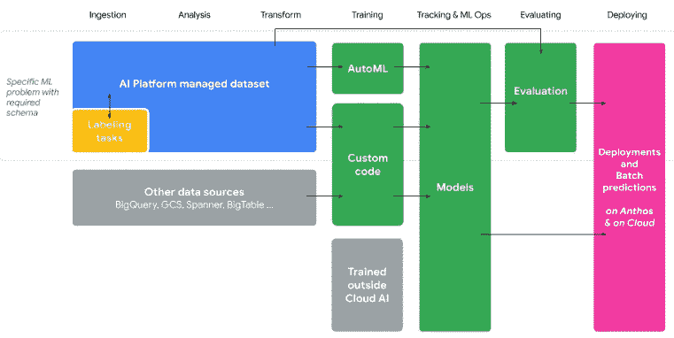
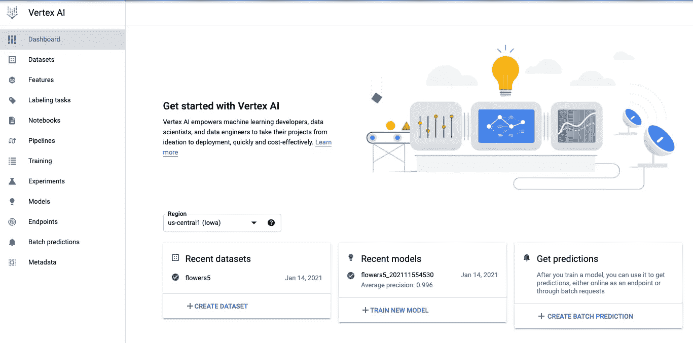
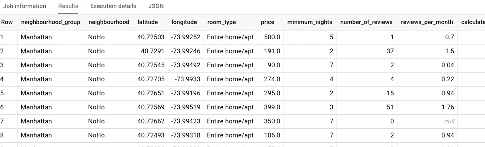
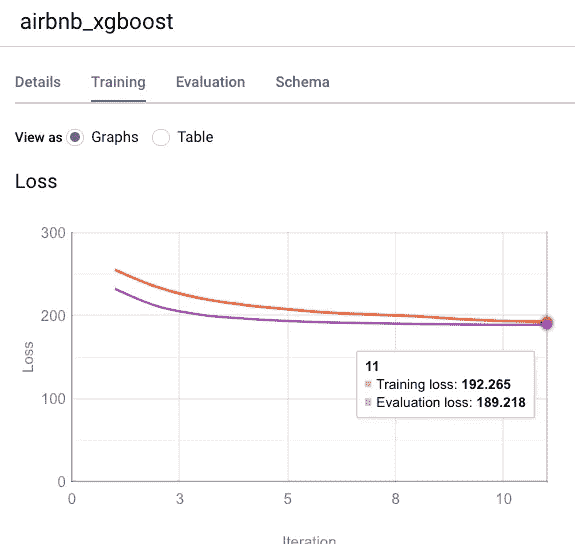
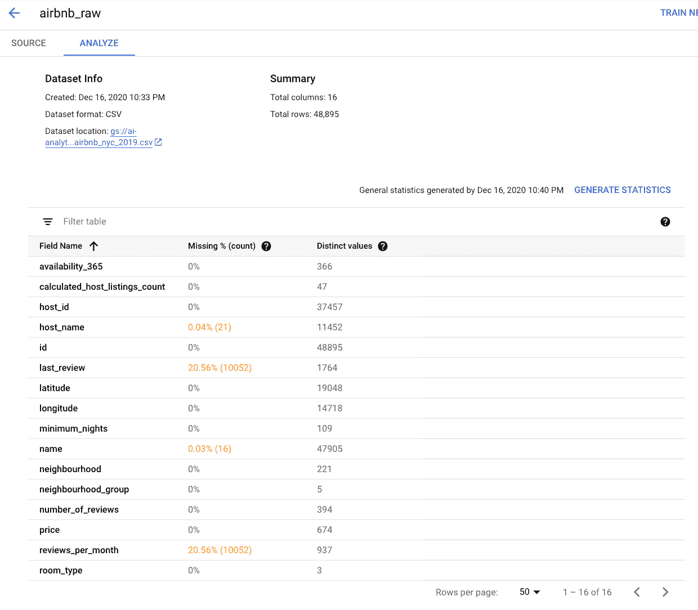
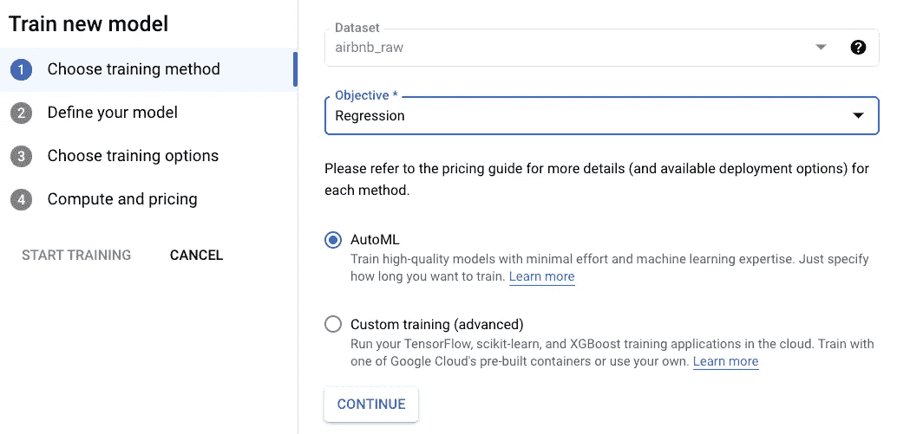
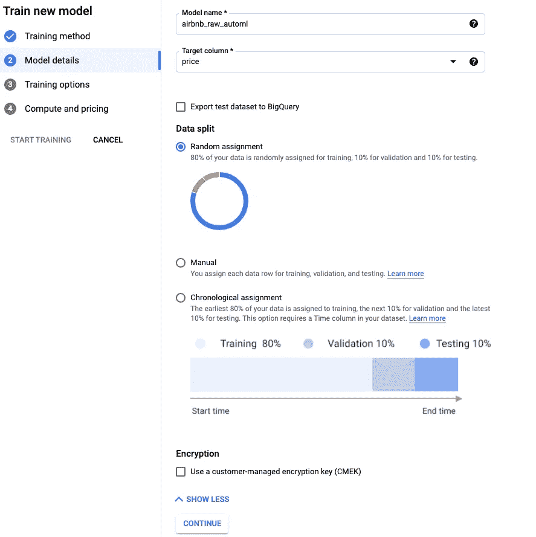
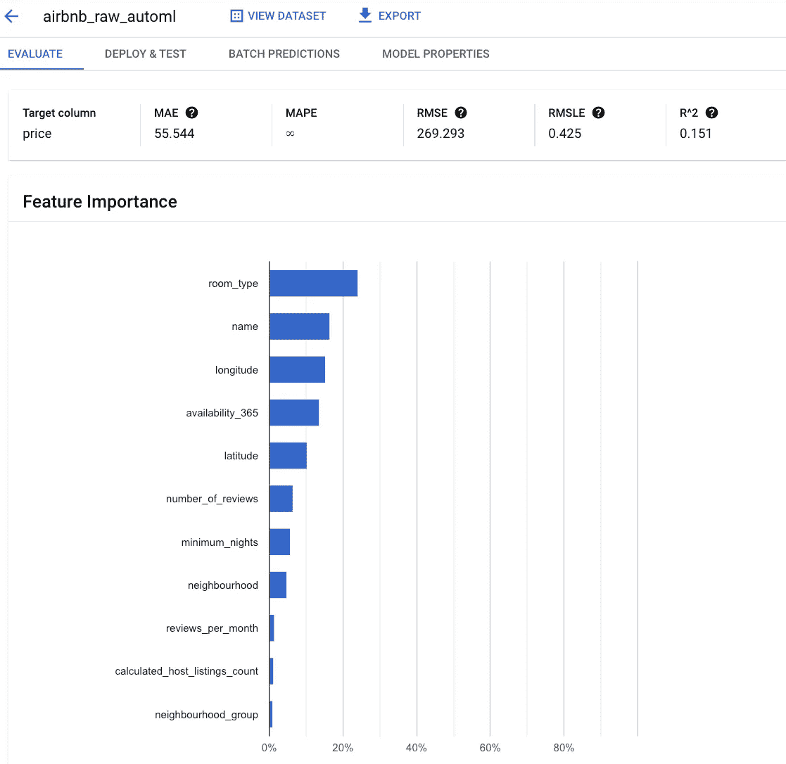

# 给谷歌云上新的统一 ML 平台 Vertex AI 一个旋转

> 原文：<https://towardsdatascience.com/giving-vertex-ai-the-new-unified-ml-platform-on-google-cloud-a-spin-35e0f3852f25?source=collection_archive---------2----------------------->

## 我们为什么需要它，无代码 ML 培训到底有多好，以及所有这些对数据科学工作意味着什么？

过去几个月，谷歌云人工智能平台团队一直在构建机器学习前景的统一视图。这是[今天在谷歌 I/O 发布的顶点人工智能](https://techcrunch.com/2021/05/18/google-cloud-launches-vertex-a-new-managed-machine-learning-platform/)。这是什么？有多好？对数据科学工作来说意味着什么？

## 有什么好统一的？

这个想法是机器学习中有几个关键的结构:

*   我们通过接收数据、分析数据和清理数据(ETL 或 ELT)来创建数据集。
*   然后我们训练一个模型(模型训练)——这包括实验、假设检验和超参数调整。
*   当有新数据时，在计划中，或者当代码改变时，该模型被版本化和重建(ML Ops)。
*   对模型进行评估，并与现有模型版本进行比较。
*   该模型被部署并用于在线和批量预测。

然而，这取决于您如何进行 ETL(您是否将数据存储在 CSV 文件中？TensorFlow 记录？JPEG 文件？在云存储中？在 BigQuery？)，剩下的管道就变得很不一样了。有一个 ML 数据集的想法不是很好吗？任何下游模型(TensorFlow，sklearn，PyTorch)都可以使用的？这就是统一数据集概念背后的含义。



Vertex AI 为 ML 生命周期提供了一套统一的 API。图表由亨利·塔彭和布莱恩·科巴什卡瓦提供

此外，部署 TensorFlow 模型的方式不同于部署 PyTorch 模型的方式，甚至 TensorFlow 模型也可能因使用 AutoML 还是通过代码创建而有所不同。在 Vertex AI 提供的一组统一的 API 中，你可以用同样的方式对待所有这些模型。

Vertex AI 提供了四个概念的统一定义/实现:

*   一个**数据集**可以是结构化的，也可以是非结构化的。它管理包括注释在内的元数据，可以存储在 GCP 的任何地方。认识到这是远景——目前只支持云存储和 BigQuery。还不是 Bigtable 或 Pub/Sub。
*   **训练管道**是一系列容器化的步骤，可用于使用数据集训练 ML 模型。容器化有助于通用性、可再现性和可审计性。
*   一个**模型**是一个带有元数据的 ML 模型，它是用训练管道构建的或者是直接加载的(只要它是兼容的格式)。
*   用户可以调用**端点**进行在线预测和解释。它可以有一个或多个模型，以及这些模型的一个或多个版本，并根据请求进行消歧。

关键的想法是，无论数据集、训练管道、模型或端点的类型如何，这些工件都是相同的。都是混搭。因此，一旦创建了数据集，就可以将其用于不同的模型。无论你如何训练你的模型，你都可以从一个端点获得可解释的人工智能。

这一点在 web 用户界面上显而易见:



好了，说够了为什么。让我们兜一圈。

## 带 BigQuery 的 SQL 中的 ML

当你使用新技术训练一个 ML 模型，并将其与你知道和理解的东西进行比较时，这总是好的。

我将使用 Kaggle 上的 Airbnb 纽约市[数据集来预测公寓租金的价格。](https://www.kaggle.com/dgomonov/new-york-city-airbnb-open-data)

首先，我们将数据加载到 BigQuery 中。这个数据集有点笨拙，在我将它加载到 BigQuery 之前需要清理(详情见[的博文](https://cloud.google.com/blog/topics/developers-practitioners/loading-complex-csv-files-bigquery-using-google-sheets))，但是我将它公之于众，所以你可以简单地尝试一下这个查询:

```
SELECT 
neighbourhood_group, neighbourhood, latitude, longitude, room_type, price, minimum_nights, number_of_reviews, reviews_per_month, calculated_host_listings_count, availability_365
FROM `ai-analytics-solutions.publicdata.airbnb_nyc_2019`
LIMIT 100
```



已经验证了数据现在看起来是合理的，让我们继续训练一个 xgboost 模型来预测价格。这就像添加两行 SQL 代码一样简单:

```
CREATE OR REPLACE MODEL advdata.airbnb_xgboost
OPTIONS(**model_type='boosted_tree_regressor', input_label_cols=['price']**) ASSELECT 
neighbourhood_group, neighbourhood, latitude, longitude, room_type, price, minimum_nights, number_of_reviews, reviews_per_month, calculated_host_listings_count, availability_365
FROM `ai-analytics-solutions.publicdata.airbnb_nyc_2019`
```

我们得到一个快速收敛的模型



…平均绝对误差为 64.88 美元。

这有多好？Airbnb 上纽约市公寓的均价是多少？

```
SELECT 
AVG(price)
FROM `ai-analytics-solutions.publicdata.airbnb_nyc_2019`
```

一共是 153 美元。所以，我们有 40%的折扣。也许不是一个投入生产的模型…但你不会期望一个公共数据集有更多的专有和个性化的数据来帮助改善这些预测。不过，这些数据的可用性有助于我们了解如何训练 ML 模型来预测价格。

接下来，我们来试试 Vertex AI 中的 Auto ML 表格。

## 顶点人工智能

让我们从 Kaggle 上的 CSV 文件开始，这样我们就不会被我将数据加载到 BigQuery 时所做的数据转换所困扰。转到[https://console.cloud.google.com/vertex-ai/datasets/create](https://console.cloud.google.com/vertex-ai/datasets/create)

*   将其命名为 airbnb_raw，选择**表格**、**回归**，选择**爱荷华**地区，点击**创建**
*   创建数据集后，从 GCS 中选择 CSV 文件，提供 URL:GS://data-science-on-GCP/Airbnb _ NYC _ 2019 . CSV，然后点击**继续**。
*   Vertex AI 愉快地加载数据，没有任何限制，拉出标题并显示 16 列。
*   单击 Generate Statistics，它会向您显示在缺少值方面唯一可能有问题的字段是 review 字段。但这是有道理的:不是每个 BnB 航空公司的客人都会留下评论。



*   现在选择训练新模型并选择回归和自动:



*   再次注意，我们可以提供自己的定制代码，并且仍然保留在整个工作流中。我们不必仅仅因为想要定制流程的一部分就放弃自动化培训管道。
*   在下一个窗格中，选择 price 作为要预测的目标列:



*   在下一个窗格中，从预测值集中删除 id 列。将邻域更改为分类(来自文本)，并将目标更改为 MAE。
*   给它 3 个小时的预算，开始训练。

大约 3 小时后，培训结束，我们可以检查模型并根据需要进行部署:



我们得到的平均绝对误差为 55 美元，比使用 xgboost 得到的误差几乎高出 20%。所以，一个更精确的模型，用更少的代码。包括评估、特性重要性、可解释性、部署等。所有这些都是现成的。

## 最底层的

BigQuery ML 和 AutoML 表都易于使用并且非常好。它有助于理解领域的基础知识(为什么没有评论？)，以及机器学习的(不要用 id 列做输入！)，但从一个公民数据科学家的角度来看，他们相当平易近人。编码和基础设施管理开销几乎完全消除了。

这对数据科学工作来说意味着什么？从编写原始 HTML 到使用 weebly/wix/etc 的转变。并不意味着网络开发人员的工作会减少。相反，这意味着更多的人创建网站。当每个人都有一个基本的网站时，它驱动了一种差异化的需求，以建立更好的网站，因此为网络开发人员提供了更多的工作。

机器学习的民主化也会导致同样的效果。随着越来越多的事情变得容易，将会有越来越多的机器学习模型被构建和部署。这将推动差异化的需求，并建立超越和解决日益复杂的任务的 ML 模型管道(例如，不只是估计租赁价格，而是进行动态定价)。

机器学习的民主化将导致更多的机器学习，以及更多的 ML 开发者的工作，而不是更少。这是一件好事，我为此感到兴奋。

还有，哦，Vertex AI 真的很好看。在你的 ML 问题上尝试一下，让我知道(你可以在 Twitter 上@lak_gcp 找到我)效果如何！

# 更多关于 Vertex AI 的阅读:

1.  [给谷歌云上的新统一 ML 平台 Vertex AI 一个旋转](/giving-vertex-ai-the-new-unified-ml-platform-on-google-cloud-a-spin-35e0f3852f25) :
    我们为什么需要它，无代码 ML 培训到底有多好，所有这些对数据科学工作意味着什么？
2.  [如何将 TensorFlow 模型部署到 Vertex AI](/how-to-deploy-a-tensorflow-model-to-vertex-ai-87d9ae1df56) :在 Vertex AI 中使用保存的模型和端点
3.  [使用 Python 在 Vertex AI 上开发和部署机器学习模型](https://medium.com/@lakshmanok/developing-and-deploying-a-machine-learning-model-on-vertex-ai-using-python-865b535814f8):编写让你的 MLOps 团队满意的训练管道
4.  [如何在 Vertex AI 中为超参数调整构建 MLOps 管道](https://lakshmanok.medium.com/how-to-build-an-mlops-pipeline-for-hyperparameter-tuning-in-vertex-ai-45cc2faf4ff5) :
    为超参数调整设置模型和协调器的最佳实践