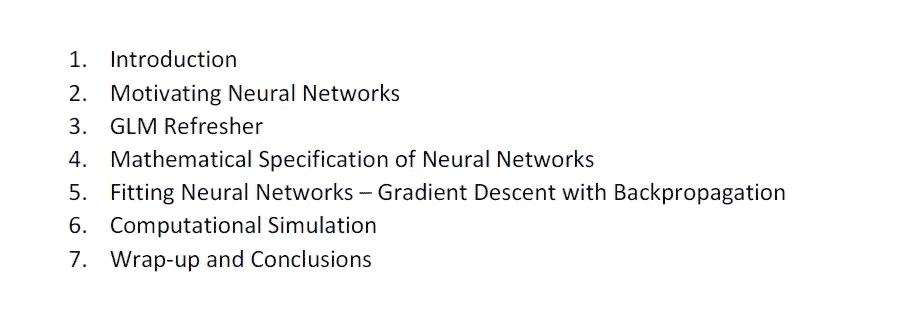
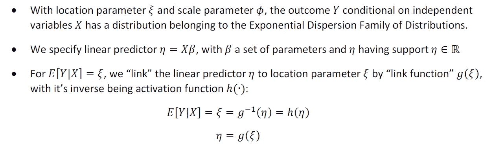
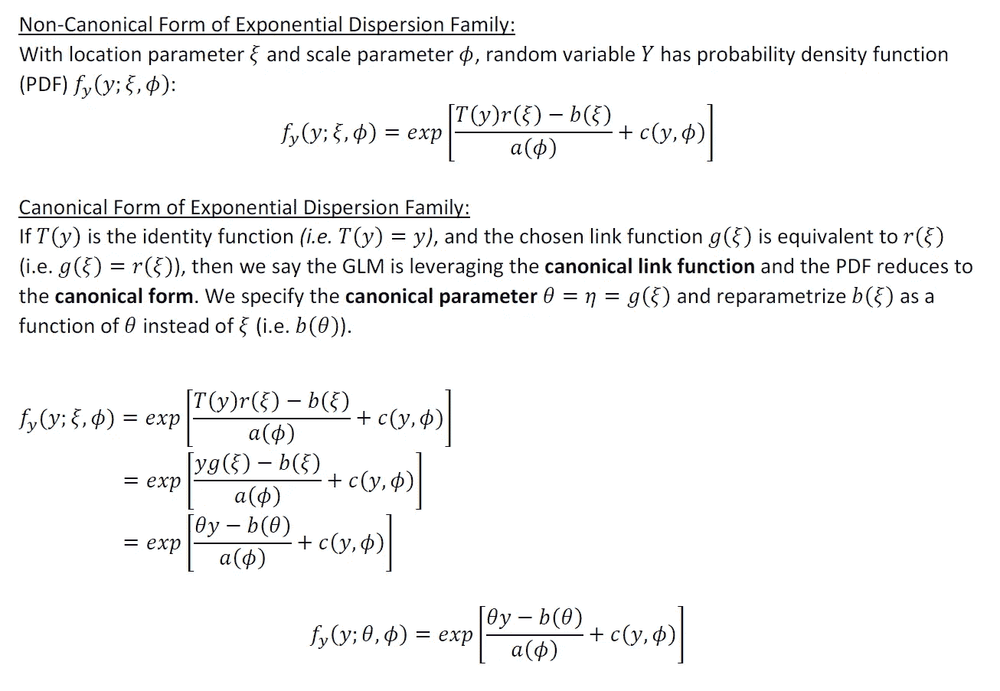
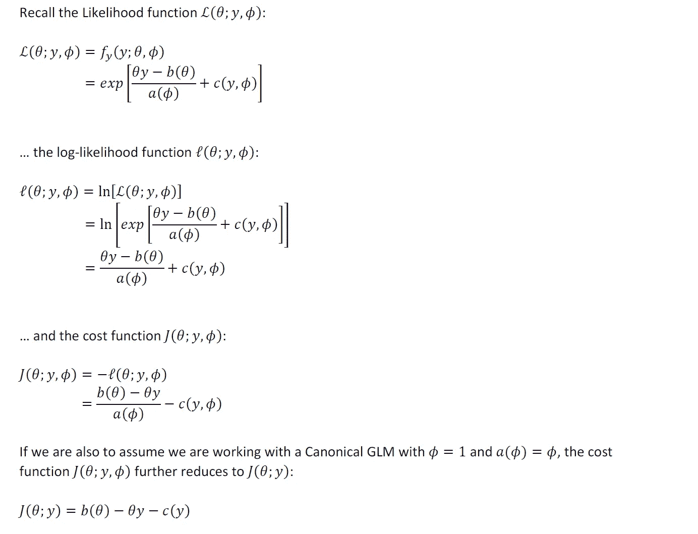
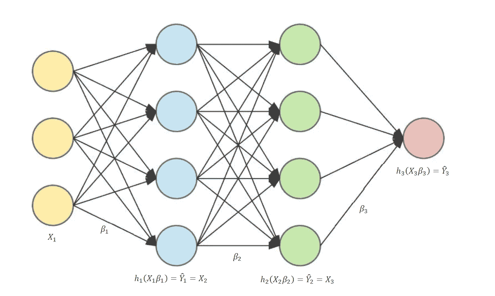
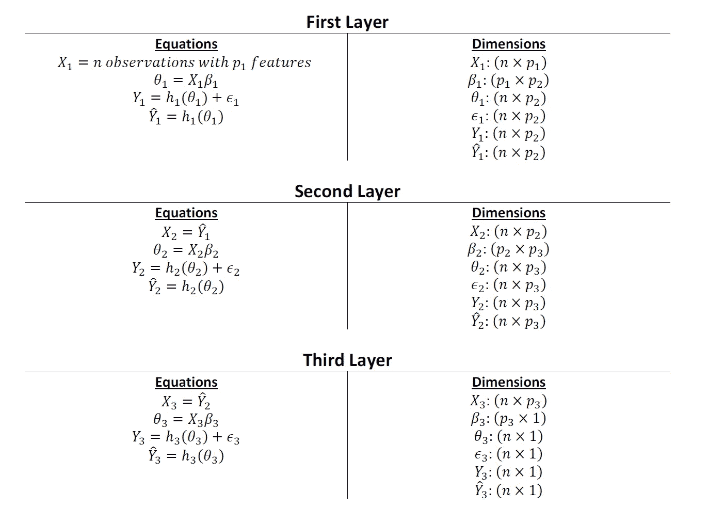
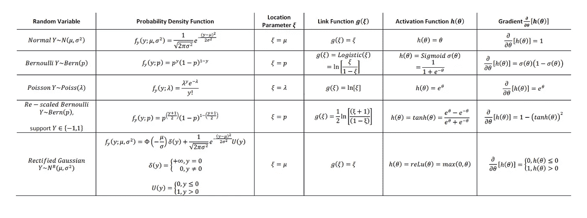
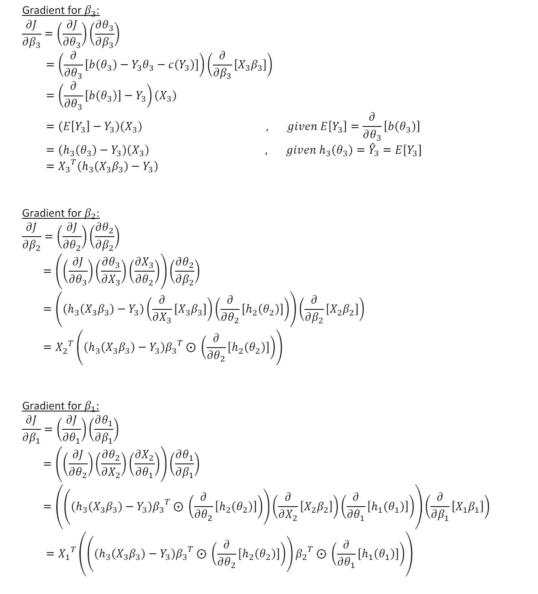
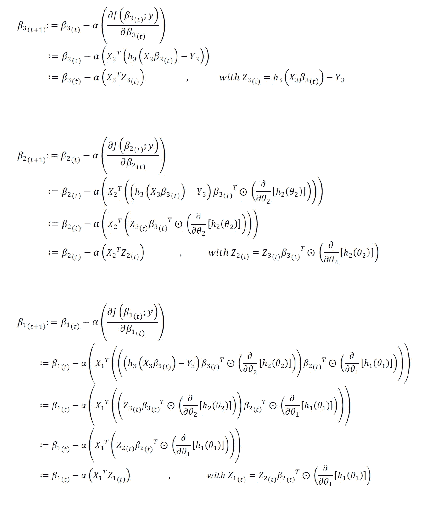

# GLMs 第三部分:作为递归广义线性模型的深度神经网络

> 原文：<https://towardsdatascience.com/glms-part-iii-deep-neural-networks-as-recursive-generalized-linear-models-ccb02817c9b5?source=collection_archive---------12----------------------->

## [实践教程](https://towardsdatascience.com/tagged/hands-on-tutorials)

## 数学推导和计算机模拟

[Unsplash](https://unsplash.com?utm_source=medium&utm_medium=referral) 上 [AltumCode](https://unsplash.com/@altumcode?utm_source=medium&utm_medium=referral) 的照片

# 1:简介

广义线性模型(GLMs)在包括统计学、数据科学、机器学习和其他计算科学在内的领域中起着关键作用。

本系列的第一部分提供了一个全面的数学概述，用规范和非规范的形式证明了常见的 GLMs。第二部分提供了 GLMs 常用迭代数值拟合程序的历史和数学背景，包括牛顿-拉夫森法、费希尔评分法、迭代加权最小二乘法和梯度下降法。

*   [GLMs 第一部分:严格的数学公式](/generalized-linear-models-a-rigorous-mathematical-formulation-58ac2ec7d9ea)
*   [GLMs 第二部分:牛顿-拉夫森，费希尔评分，&迭代加权最小二乘法(IRLS)——严格概述](/glms-part-ii-newton-raphson-fisher-scoring-iteratively-reweighted-least-squares-irls-a-1a1e2911047)

在这个三部分系列的最后一部分，我们探索神经网络及其与 GLMs 的联系。事实上，神经网络只不过是递归的规范 glm。伴随这一块是一个完全可用的计算机模拟。

这篇文章的目录如下:

作者图片

让我们跳进来吧！

# 2:激励神经网络

在本系列的前两篇文章中，我们重点讨论了 GLMs 的数学规范和恢复模型参数经验估计的拟合过程。然而，在这两篇文章中，我们都假设我们对所拟合的 GLMs 的参数模型规格有很强的信心。例如，假设我们有一个特性-结果关系，其中有 10 个特性的结果是伯努利分布的。我们可以拟合指定 11 个系数(1 个截距项，10 个特征中的每一个都有一个系数)的逻辑回归模型，而不需要特征或联合相互作用项的任何变换。只要问题的模型说明是正确的，逻辑回归模型将只返回“正确的”结果和推论。这些事实上是非常严格的参数假设。

然而，现在让我们假设我们不愿意对我们对模型规范的理解做出如此严格的参数假设。事实上，让我们假设我们根本不愿意对模型规范做任何假设。我们只是举手高呼“我们不知道模型规范是什么，我们也不愿意对它做任何假设！”。我们希望使用一种方法来大大放松对上述假设的需求。

有一类被称为“通用逼近器”的方法，神经网络属于其中。仅用一个隐藏层和非线性 sigmoid 激活函数，神经网络(理论上)就能够一致地估计任何任意模型规格。这是在某些用例中广泛采用神经网络的主要动机。

在进入神经网络背后的数学之前，让我们先回顾一下 GLMs 的数学知识。

# 3: GLM 复习

回想一下，广义线性模型(GLM)有三个主要组成部分:

作者图片

现在让我们来研究一下标准和非标准形式的指数离差分布族的概率密度函数(PDF)的参数化。

作者图片

回想一下，对于规范 GLMs，我们有以下属性:

作者图片

*(以上工程量的证明和推导见本 GLM 系列第一、二部分**[*)*](/generalized-linear-models-a-rigorous-mathematical-formulation-58ac2ec7d9ea)*

**

*作者图片*

# *4:跳到神经网络*

*假设我们有一个统计模型:*

*   *我们不是指定一个 GLM，而是指定几个相互并行的 glm。这些 GLMs 的平行分组我们称之为“层”。*
*   *模型不是由一个“层”组成，而是有几个层。前一层 GLMs 的输出成为下一层 GLMs 的输入特征。*

*上述模型实际上是标准的前馈神经网络。我们将网络的第一层称为“输入层”，最后一层称为“输出层”，中间的所有层称为“隐藏层”。*

*让我们假设一个前馈神经网络的例子，在输入和输出层之间有两个隐藏层。下图显示了这种网络的常见图示。每个“节点”(即圆)代表一个变量。请注意，下图并未精确显示每层中存在的节点数量。同样，节点的数量将对应于所述层中“特征”的数量。每个箭头对应一个估计的“权重”或系数。*

**

*作者图片*

*…让我们用数学方法指定每层的输入和输出，以及它们的尺寸:*

**

*作者图片*

*如果我们将每一层都想象成一个局部 GLM，我们可能会对拟合哪种类型的 GLMs 感兴趣？换句话说，我们可能对利用哪些链接功能/激活功能感兴趣？下表列出了神经网络层中使用的常见 GLM 类型。*

**

*作者图片*

*现在让我们来讨论如何将神经网络与数据相匹配。*

# *5:拟合神经网络—带反向传播的梯度下降*

*在本系列的第二部分中，我们深入研究了将数据拟合到 GLMs 的迭代数值技术。出于计算效率的考虑，标准 GLMs 通常在实践中适合利用牛顿-拉夫森或费希尔评分。然而，神经网络最适合利用梯度下降。我们需要在神经网络的每一层中恢复参数估计。给定网络各层的固有依赖结构，利用梯度下降作为我们选择的迭代数值拟合过程，在数值上将问题简化为动态规划算法(正如我们很快将看到的)。回想一下，对于梯度下降，在迭代步骤“ *t+1* ”求解层“ *k* 中的权重如下:*

**

*作者图片*

*根据以上梯度下降算法的说明，我们需要恢复关于我们的神经网络中每个β系数的**的成本函数的第一梯度。从技术上讲，我们可以用数学方法求解并恢复 ***中任何我们喜欢的*** 顺序的梯度。然而，仔细检查我们的神经网络，如果我们以“巧妙”的顺序求解梯度，我们可以降低所需的总计算量。可以容易地估计外层中权重的梯度(类似于如何在单个 GLM 中估计系数)。倒数第二层中权重的梯度是最后一层中梯度的函数。倒数第三层中的梯度是倒数第二层中梯度的函数，以此类推。因此，如果我们求解最后一层中的梯度，并通过网络逐层求解梯度，这种梯度求解练习简化为一般的动态规划问题。***

*在人工智能领域和神经网络文献中，动态编程的这个特殊实例被赋予了自己的特殊名称。我们称之为 ***反向传播*** 。随着梯度下降的每一次迭代，我们使用从前到后通过网络向前传播的来自步骤“ *t* 的权重的当前经验值(即 ***前向传播*** )来计算每一层的变量的值，然后通过从后到前的网络工作来更新步骤“ *t+1* 的权重。*

*让我们用数学方法推导出具有两个隐藏层的玩具问题的梯度:*

**

*作者图片*

*…因此，我们对步骤“ *t+1* ”的权重更新为三层中的权重:*

**

*作者图片*

# *6:计算模拟*

*下面是一个用玩具数据集拟合前馈神经网络的完整工作示例(从头开始构建)。在下面的代码中，神经网络类对象允许下列可调参数:*

*   *隐藏层数*
*   *每个隐藏层中的节点数*
*   *每个隐藏层的激活函数*
*   *小批量*
*   *节点丢失正则化*

*让我们导入我们需要的库:*

*…以及用于指定具有伯努利分布结果的玩具数据集的函数:*

*…以及神经网络模型的函数和类对象:*

*现在，让我们在玩具数据集上拟合神经网络模型，计算结果，并返回曲线下面积(AUC)分数*

*从上面可以看出，拟合神经网络模型的 AUC 约为 80%*

*有关上述计算模拟的完整代码/笔记本，请参见下面的 [**github 链接**](https://github.com/atrothman/GLM_Neural_Network) 。*

# *7:总结和结论*

*在本系列的第一部分中，我们提供了规范和非规范形式的常见 GLMs 的全面的数学概述(带有证明)。在第二部分中，我们提供了对典型和非典型 GLMs 的三个重要的迭代数值拟合过程的严格概述:牛顿-拉夫森，费希尔评分和迭代加权最小二乘法(IRLS)。在第三篇也是最后一篇文章中，我们介绍了标准的神经网络模型，以及如何将它们表述为递归 GLMs。*

*希望以上有见地。正如我在以前的一些文章中提到的，我认为没有足够的人花时间去做这些类型的练习。对我来说，这种基于理论的洞察力让我在实践中更容易使用方法。我个人的目标是鼓励该领域的其他人采取类似的方法。我打算在未来写一些基础作品，所以请订阅 [**并在媒体**](https://anr248.medium.com/) 和 [**LinkedIn**](http://www.linkedin.com/in/andrew-rothman-49739630) 上关注我的更新！*