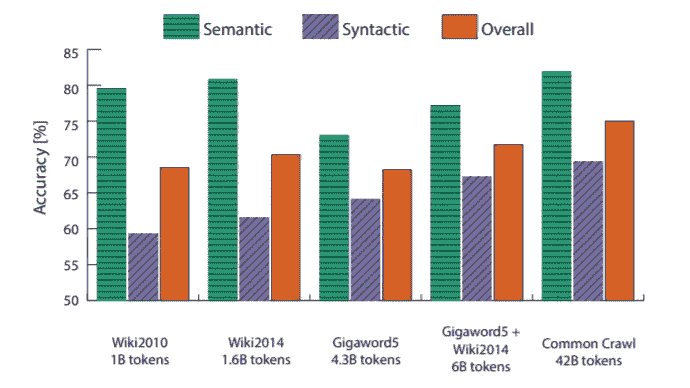

# 手套研究论文解释

> 原文：<https://towardsdatascience.com/glove-research-paper-explained-4f5b78b68f89?source=collection_archive---------15----------------------->

## 手套模型背后数学的直观理解和解释

图片来自 Unsplash

继我的 [***word2vectors 研究论文讲解***](/word2vec-research-paper-explained-205cb7eecc30) 博客之后，我又拿起 [**GloVe 研究论文**](https://nlp.stanford.edu/pubs/glove.pdf)**【Pennington 等人】来讲解我对一篇非常详细而全面的研究论文的理解。**

> ****GloVe** 代表**Global****Vectors**其中 Global 是指语料库的全局统计，Vectors 是单词的表示。早期的单词嵌入方法，如 LSA，word2vec，能够学习单词之间的句法和语义关系，但其起源尚不清楚。手套模型旨在明确归纳单词向量中的规则，并找到单词之间学习关系的来源。**

****1。手套型号概述****

**GloVe 是一个**全局对数双线性模型**。嗯，我相信你想知道术语' '*全局对数双线性*' '是什么意思。*全局*是指训练语料的全局统计。*对数双线性*是指输出的对数是两类字向量乘积的线性回归。在手套的情况下，两种类型是单词向量(w)和上下文向量(w^).如下所述，手套模型结合了两种广泛采用的用于训练单词向量的方法。**

## **1.1 矩阵分解**

**这些方法分解单词-单词或文档-术语共现矩阵。**哈尔**(语言的超空间模拟)【隆德&伯吉斯】、 **LSA** (潜在语义分析)【兰道尔、福尔茨、&拉哈姆】是使用矩阵分解的流行模型。**特征值分解**用于方阵，**奇异值分解** (SVD)用于矩阵分解的矩形矩阵。在词-词矩阵中，行代表词，列代表上下文词。矩阵 Mᵢⱼ中的值表示特定单词 Wᵢ在 Wⱼ.上下文中出现的次数在文档术语矩阵中，行代表单词，列代表文档。一行表示特定单词在所有文档中的分布，一列表示该文档中所有单词的分布。**

**矩阵分解方法通常包括以下步骤。**

1.  **为每个单词定义上下文，并生成单词-单词或文档术语矩阵 m。**
2.  **按行、列或长度规范化矩阵中的值。**
3.  **删除方差较小的列，以降低矩阵的维数。**
4.  **对 M 进行 SVD 矩阵分解，生成 U，S，V 矩阵。**
5.  **在通过取第一个 r 以降序对矩阵 M 的奇异值进行排序之后，< R (rank of matrix M), low rank of a matrix M can be obtained. Product of low rank matrices U^, S^ and V^ is close approximation to the original matrix M.**
6.  **Vector of a word Wⱼ is the jᵗʰ vector from reduced rank space matrix U^.**

**In such methods, the most common words in the corpus such as (*和*贡献了单词之间不成比例的相似性。出现在“The”、“and”上下文中的单词 Wᵢ和 Wⱼ导致比其真实相似性得分更大的相似性得分。类似地，Wᵢ和 Wⱼ不经常出现在“the”、“and”的上下文中，但具有真正的相似性，它们的相似性得分会更低。诸如**煤**【t . Rohde 等人】的方法通过使用基于矩阵的*相关性*或*熵*归一化来克服这个问题。当使用基于熵的归一化时，在所有上下文或文档中出现的单词，例如“the”、“and”，将具有高熵。原始计数用高熵项归一化，导致矩阵中这些项的高值缩小。这解决了向单词相似性分数添加不成比例的度量的问题。**

****1.2 基于窗口的方法****

**这些方法在**局部上下文窗口**上工作，而不是使用语料库的全局统计。[Bengio 等人]中的语言模型训练神经网络，神经网络又训练单词向量表示。该模型以 N 个单词的过去历史和预测下一个单词作为语言建模的目标。因此，该方法中的每个示例都是作为输入的单词的局部窗口，而输出是下一个单词。后来 word2vec 模型【Mikolov et al .】如 **skip-gram 和 CBOW** 解耦语言建模，训练单隐层神经网络。更详细的了解，可以去翻翻 [***我之前的文章***](/word2vec-research-paper-explained-205cb7eecc30) 就可以了。**

**与矩阵分解方法相比，这些方法没有利用可用的全局统计，导致单词的次优向量表示。通过使用跨语料库的重复局部窗口，可以减少模型的训练时间和复杂度。**

****2。手套模型背后的详细数学运算****

> **接下来是你们都期待阅读的部分。理解任何算法背后的数学是非常重要的。它有助于我们理解算法的公式和掌握一个概念。也就是说，让我们定义一些符号。**

**x 是共现矩阵(单词-单词)，其中 Xᵢⱼ是单词 Wⱼ在单词 Wᵢ.的上下文中的计数上下文对一个特定的单词意味着什么？单词周围的上下文可以被定义为由过去的 N 个单词和未来的 N 个单词组成的对称上下文。不对称上下文只包含过去的 N 个历史单词。简单计数或加权计数可用于计算矩阵中的值。简单计数将 1 作为出现次数。在加权计数中，1/d 用作出现次数，其中 d 是与给定单词的距离。使用权重背后的动机是，作为有意义的上下文，与给定单词距离较近的上下文单词比距离较远的单词更重要。**

****

**iᵗʰ行-eqⁿ的共现值(1)**

**在 Eqⁿ (1)中,“Xᵢ”是在“Wᵢ.”这个词的上下文中出现的所有词的总和**

****

**Eqⁿ (2)**

**在 Eqⁿ (2)中，p 是共现概率，其中 Pᵢⱼ是单词 Wⱼ在单词 Wᵢ.的上下文中出现的概率**

**GloVe 建议根据概率而不是原始计数来寻找两个单词之间的关系。通过寻找*与一些探测词* (Wₖ).)的共现概率来检查两个词(Wᵢ和 Wⱼ)之间的关系**

**假设我们有两个词，Wᵢ是'*冰*，Wⱼ是'*蒸汽*，还有一些探测词 Wₖ是'固体'、'气体'、'水'、'时尚'。从基本的理解中，我们知道“固体”更多地与'*冰*'有关(Wᵢ)and“气体”更多地与'*蒸汽* ' (Wⱼ)有关，而时尚与'*冰*'和'*蒸汽*'都无关，而水与'*冰'*'和'*蒸汽*'都有关现在我们的目标是在探测词中找到给定词的相关词。**

****

****表 1:** 来自 60 亿令牌语料库的同现概率(来源——GloVe 研究论文)**

**根据表 1，对于作为“固体”的探测词(Wₖ)，p(固体|冰)是“固体”在“冰”的上下文中出现的概率，是(1.9*10^–4)大于 p(固体|蒸汽)。P(k |冰)/P(k |蒸汽)之比是> > 1。对于探测词‘气’，比率为<<1\. For probe words ‘water’ and ‘fashion’ the ratio is nearly equal to 1\. The ratio of co-occurrence probability distinguishes words (solid and gas) which are more relevant to given words than irrelevant words (fashion and water). The words having ratio nearly equal to 1 either appear in the context of given words or not, hence causing no impact in learning relationship between given words. This proves ***的同现概率比率*** 是学习词表征的起点。**

**Pᵢₖ/Pⱼₖ的同现概率比取决于三个词 Wᵢ、Wⱼ、Wₖ.函数 F 的最一般形式可以在单词和上下文向量上定义如下。**

****

**Eqⁿ (3)**

**其中 w ∈ Rᵈ是单词向量，w∞∈rᵈ是上下文向量。Eqⁿ (3)的右侧是从训练语料库中获得的概率。尽管 f 函数有大量的可能性，但它应该对存在于 Pᵢₖ/Pⱼₖ.的信息进行编码目标词 Wᵢ和 Wⱼ之间的关系可以通过向量差来获得，因为这些向量来自 d 维的线性向量空间。因此等式变成了，**

****

**Eqⁿ (4)**

**现在，方程的右边是定标器，而 F 的输入是 d 维向量。f 可以被复杂的神经网络参数化，这最终将打破向量空间中的线性结构。为了避免这种情况，我们可以取 F 的输入的点积，这样可以防止向量维数与其他维数的混合。**

****

**Eqⁿ (5)**

**单词和上下文单词可以相互交换，因为出现在“ice”上下文中的“solid”等同于出现在“solid”上下文中的“ice”。因此 w ↔ w 和 X ↔ Xᵀ的替换可以在 Eqⁿ完成(5)。基本上，我们将左边的输入改为 f，然后希望对 Eqⁿ的右边产生类似的影响(5)。这也被称为保持两个组之间的结构相似性(同态函数)。我们在 Eqⁿ (5)的左手边有组 g，用减法作为组运算，在右手边有组 h，用除法作为组运算。现在，当我们替换 w ↔ w 和 X ↔ Xᵀ时，为了保持结构的相似性，g 中两个向量的相减应该反映 h 中这两个字向量的相除。假设 X= wᵢᵀwₖ，Y= wⱼᵀwₖ ∈ G，z =(x y)。函数 F 在组(R)和(R>0)之间应该是同态的。根据同态的定义，如果 G 中的 Z = X-Y 减去 op，那么在组 H**F(Z)= F(X)÷F(Y)但是 Z = X-Y 因此我们得到 F(X-Y)=F(x) ÷ F(y)。****

********

****Eqⁿ (6)****

****那么函数 F 应该是什么呢？你猜对了，应该是指数函数。F (x)= e ˣ.比较 Eqⁿ (5)和 Eqⁿ (6)，我们得到，F(wᵢᵀ*wₖ)=Pᵢₖ = Xᵢₖ / Xᵢ.因此，取两边对数，我们得到，****

********

****Eqⁿ (7)****

****Eqⁿ (7)在单词和上下文方面展示了对称性，除了术语 log(Xᵢ).由于这个术语独立于 Wₖ，我们可以认为这是 bᵢ的偏见术语。再加上一个偏差项 bₖ，我们得到****

********

****Eqⁿ (8)****

****由于 log(x)在 0 附近发散，我们可以在 log(Xᵢₖ上使用加法移位，使得对数的输入总是≥1，****

********

****Eqⁿ (9)****

****Eqⁿ (9)类似于同现 **矩阵**的对数的**分解，这是 **LSA 算法**背后的主要思想。但是上面的等式有一个问题。如果我们使用平方误差函数来定义成本函数，它将对矩阵中的所有项给予相同的权重，即使对于值接近 0 的罕见频率项也是如此。这样的术语很吵，携带的信息也不多。因此，加权最小二乘法可以用作手套模型的成本函数。******

****

**Eqⁿ (10)**

**注意，加法移位已经在 Eqⁿ (10)所示的矩阵 x 上完成。j 是我们想要在具有词汇大小的共现矩阵上最小化的成本函数。f(Xᵢⱼ)给矩阵中的每一项加权。wᵢ是单词向量，wⱼ是上下文向量。bᵢ和 bⱼ是每个向量的偏差项，Xᵢⱼ是共生矩阵中的项。**

**现在问题是如何选择函数 f，它应该遵循一定条件。f(0)=0，f 应该是非递减的，并且对于 x 的大值，f(x)不应该非常高，因为不应该过度加权频繁出现的单词。来自 Eqⁿ的 xₘ(11)与图 1 中的 Xₘₐₓ相同。在用 Eqⁿ的 Eqⁿ (11)代替 f(xᵢⱼ(10)后，我们得到手套模型的最终成本函数。然后，使用优化器对一批训练样本训练模型，以最小化成本函数，从而为每个单词生成单词和上下文向量。**

****

**Eqⁿ (11)**

****

****图 1**-α= 3/4 的权重函数。(来源——手套研究论文)**

**最后，我们完成了手套模型的完整推导。到目前为止，我们所有人都取得了很大的成就！！！现在，如果您想找出 GloVe 模型与 skip-gram (word2vec 模型)之间的关系，并理解 GloVe 模型的整体复杂性，您可以浏览接下来的部分。在这些部分之后，手套模型的实验和结果被讨论。**

****3。手套和 Skip-Gram 之间的等效性(word2vec 模型)****

**GloVe 模型基于全局共现矩阵，而 skip-gram 通过局部窗口扫描，并且不考虑全局统计。这两种方法可以被认为是训练单词向量的两种不同的思想流派。本节找出了 GloVe 和 skip-gram 之间的相似性，即使乍一看这两种类型的模型有不同的解释。**

**让我们定义跳格模型，其中 Qᵢⱼ定义单词 j 出现在单词 I 的上下文中的概率。Qᵢⱼ是给定 Wⱼ的上下文单词的概率分布，并且可以被认为是 softmax 函数。**

****

**Eqⁿ (12)**

**这里，wᵢ和 wⱼ分别是跳格模型的语境向量和词向量。skip-gram 模型的目标是最大化训练语料上所有局部窗口扫描的对数概率。通过由局部窗口生成的示例，经由随机/在线发生训练，但是全局目标函数可以在来自语料库的所有局部扫描上公式化为**

****

**Eqⁿ (13)**

**为了使成本函数为+ve，当 Qᵢⱼ值在 0 和 1 之间时添加负号，并且该值范围的对数为-ve。上述成本函数和原始跳转程序之间的唯一区别是前者是全局的，后者是局部的。当遍历每个局部窗口时，我们可以将相同的单词-上下文对(Xᵢⱼ)组合在一起，并将它们直接乘以 log(Qᵢⱼ项。**

****

**Eqⁿ (14)**

**我们知道 Pᵢⱼ=Xᵢⱼ/Xᵢ.因此代入 Xᵢⱼ，我们得到**

****

**Eqⁿ (15)**

**Xᵢ独立于 j，所以它可以在 j 上求和之外。H(Pᵢ,Qᵢ)是 Pᵢ和 Qᵢ.概率分布之间的交叉熵注意，在交叉熵公式中考虑了负号。代价函数变成交叉熵误差的加权和，权重为 Xᵢ.上述目标函数可以解释为全局跳过程序的目标。使用交叉熵作为误差度量有一定的局限性。p 是长尾分布，当使用交叉熵作为误差度量时，不太可能/罕见的事件具有较高的权重。此外，Q 必须用词汇 V 上的求和来归一化，这在使用交叉熵时是一个巨大的瓶颈。因此，可以使用不同成本误差度量来代替 Eqⁿ (15)中的交叉熵，其中之一是最小平方目标。q 中的分母项可以通过仅取分子项 Q^.来忽略，新的成本函数被定义为，**

****

**Eqⁿ (16)**

**这里，p^ᵢⱼ = Xᵢⱼ，Q^ᵢⱼ= exp(wᵢᵀ * wⱼ)是非正态分布。与 Q^ᵢⱼ相比，Xᵢⱼ采用较大的值，导致优化中的大梯度和大步骤，导致模型的不稳定学习。因此，使用对数的平方误差。**

****

**Eqⁿ (17)**

**代替 Xᵢ，f(Xᵢⱼ)被用作权重函数，如图 1 所示。方括号中的项可以颠倒，没有任何符号变化。Eqⁿ (17)的成本函数与 Eqⁿ (10)的 GloVe 模型的成本函数等价，这表明 skip-gram 模型最终基于语料库的共现矩阵，并且与 GloVe 模型具有相似性。**

****4。手套模型的复杂性****

**手套模型的复杂性可以从 Eqⁿ (10)的成本函数中找到。它取决于共生矩阵中非零元素的总数。求和在 I 和 j 上运行，vocab 大小为 V。手套模型的复杂度不超过 O(|V|)。对于几十万字的语料库，|V|超过几十亿。因此，为了获得模型的精确复杂度，可以对 x 中非零项的总数设置更严格的界限。共生矩阵 Xᵢⱼ中的项可以被建模为单词 j 和上下文 I 的频率等级(rᵢⱼ)的幂律函数**

****

**Eqⁿ (18)**

**语料库|C|中的单词总数与共现矩阵 x 的所有项的总和成比例**

****

**Eqⁿ (19)**

**矩阵中的所有元素，无论是单词 I 还是上下文 j，都可以通过将矩阵中的所有项(单词、上下文)放在一起考虑，从 X 中获得其频率排名。|X|是矩阵中任何单词/上下文的最大秩，与矩阵中非零元素的数量相同。ₓ,α是一个调和级数，比值为α，元素个数为|X|。通过将 Xᵢⱼ设置为其最小值 1，Eqⁿ (18)可以获得频率秩 r 的最大值。因此我们得到，|X|=k ^( /α)。在 Eqⁿ (19)中使用这个，我们得到**

****

**Eqⁿ (20)**

**使用广义调和数(Apostol，1976)在右侧展开 H 项，我们得到:**

****

**Eqⁿ (21 岁)**

**其中ζ (α)是黎曼ζ函数。当|X|很大时，两项中只有一项是相关的，这取决于我们得到的是α>1 还是α<1\. Hence we finally arrive at,**

****

**Eqⁿ (22)**

**Authors of GloVe observed that Xᵢⱼ is well modelled by setting α=1.25\. When α>1 |x|=o(|c|^0.8).因此，该模型的总体复杂度比 O(|V|)好得多，并且略微好于用 O(|C|)缩放的原始 skip-gram 模型。**

****5。实验****

**在以下三个 NLP 任务上测试训练的手套单词向量。**

****一、词语类比****

**任务是找到单词 d，它回答了“a 对于 b 就像 c 对于”这样的问题。数据集包含句法和语义问题。为了找到单词 d，根据余弦相似性，预测最接近(Wᵇ− Wᵃ+ Wᶜ)的 Wᵈ作为输出。**

****二。单词相似度****

**任务是按照相似性的降序排列与给定单词相似的单词。Spearman 等级相关用于测量模型的性能。**

****三。命名实体识别(NER)****

**任务是为语料库中的每个标记分配实体类型。CoNLL-2003 英语基准数据集有四种实体类型，即人员、位置、组织和杂项。连同记号特征一起，从手套模型训练的词向量作为输入被添加到 NER 模型，以生成实体类型的概率分布。**

****6。手套模型训练详情****

**手套模型在五个不同的语料库上训练:2010 年具有 10 亿个标记的维基百科转储，2014 年具有 16 亿个标记的维基百科转储，具有 43 亿个标记的 Gigaword 5，具有 60 亿个标记的 Gigaword5 + Wikipedia2014 的组合，来自普通爬行的 420 亿个标记的网络数据。**

*****预处理步骤*** :-语料库文本小写。[斯坦福标记器](https://nlp.stanford.edu/software/tokenizer.html)用于标记化。使用前 400，000 个常用词的词汇来构建共现矩阵。在构造矩阵之前，必须定义单词的上下文。对于相距 d 的单词，使用权重为 1/d 的递减加权窗口来计算矩阵值。GloVe 使用单词的左标记(历史)以及使用单词的左和右标记(历史和未来)的对称上下文来探索不对称上下文的影响。**

**以下数值在手套模型训练中设定。**

**对于图 1 所示的加权函数，Xₘ= 100，α=3/4。**

*****优化器*** - [阿达格拉德](https://www.jmlr.org/papers/volume12/duchi11a/duchi11a.pdf)(杜奇等人，2011)初始学习率为 0.05 的优化器用于从 x 随机采样的一批非零项。对于小于 300 维的向量，使用 50 次训练数据迭代，而对于大于 300 维的向量，使用 100 次迭代。**

**手套模型为每个令牌生成两个向量，W(单词向量)和 W~(上下文向量)。两个向量的和(W+W~)被用作最终向量。**

****7。结果****

****一、词语类比****

**各种模型的单词类比实验结果如表 2 所示。SG 模型代表 skip-gram，CBOW 代表连续词袋模型，SVD 代表奇异值分解。表 2 中显示了语义和句法以及总的准确率百分比。**手套**型号的**性能优于**两种 **word2vec** 型号。在语料库大小 1.6B 和向量维数 300 上训练的手套模型已经实现了近 70%的准确度，超过了 skip-gram 的 61%和 CBOW 的 36%。在 word2vec 模型中，随着向量维数从 300 增加到 1000，语料库大小从 1B 增加到 6B，模型准确性的提高非常显著，但与向量大小为 300 且语料库大小为 1.6B 的 GloVe 模型相比，仍然表现不佳。这表明即使在较小数据集上训练了 300 维的 GloVe 模型词向量，也比在大得多的数据集上训练的 1000 维的 word2vec 模型具有更有意义的信息。与主体大小的增加(从 6B 到 42B 增加了 7 倍)相比，手套模型的准确性增加了小幅度(75%)。**

****

****表 2** :词语类比任务的语义、句法和整体模型准确性(Source- GloVe 研究论文)**

**关于对称和非对称上下文、窗口大小和向量维数的手套模型的准确性如图 2 所示。所有模型都在 6B 语料库上进行训练。在(a)中，上下文是对称的，在向量维数的所有变化中，窗口大小为 10。随着向量维数从 50 增加到 300，句法、语义以及整体准确度稳步增加，之后准确度的增加与向量维数的增加相比可以忽略不计。在(b)中，向量维数在对称上下文窗口大小的所有变化中保持为 100。随着对称窗口大小的增加，与句法相比，所有的准确性随着语义的急剧增加而增加，这表明理解语义需要更宽的上下文，而短的上下文对于句法问题就足够了。在(c)中，向量大小在所有非对称窗口模型中保持为 100。类似的行为在(c)中被注意到作为来自(b)的对称上下文。在对称窗口大小为 3 时，语义准确性超过语法准确性，而在非对称窗口中，语义准确性需要 5 个窗口。**

****

****图 2** -词语类比模型精度 vs 向量维数、上下文和窗口大小。(来源——手套研究论文)**

**在图 3 中，显示了不同语料库上的手套模型准确度。在所有训练语料库中保持 300 的向量维数。句法准确率随着语料库规模的增大而稳步提高，而语义准确率却没有这种规律。因此，通过将语料库的大小从 1B 增加到 6B 和 42B，总体准确度没有显著提高。**

****

****图 3** -词语类比模型准确率 vs 训练语料库。(来源——手套研究论文)**

****二世。** **词语相似度**——各种数据集( [WordSim-353](http://alfonseca.org/eng/research/wordsim353.html) 、 [MC](https://aclweb.org/aclwiki/MC-28_Test_Collection_(State_of_the_art)) 、 [RG](https://aclweb.org/aclwiki/RG-65_Test_Collection_(State_of_the_art)) 、 [SCEW](http://www.bigdatalab.ac.cn/benchmark/bm/dd?data=Stanford%20Contextual%20Word%20Similarity) 和 [RW](https://nlp.stanford.edu/~lmthang/morphoNLM/) )与其他模型一起用于测试 GloVe 300 维词语向量。通过对词汇表中所有单词的每个向量维度进行归一化来获得相似性得分，然后对归一化向量使用余弦相似性来找到与给定单词相似的前 n 个单词。Spearman 的等级相关系数是根据从相似性得分和人类判断获得的前 n 个单词的等级来计算的。**

****

**Spearman 等级相关公式，其中 d =模型预测等级和输出等级之间的差异，n =观察值数量-eqⁿ(23)**

**在单词相似性任务的各种数据集上测试的各种模型的结果如表 3 所示。在 WS353、MC、RG 和 RW 数据集上， **GloVe** model **优于** SVD、CBOW 和 SG。在 42B 语料上训练的 GloVe 模型比在 SCWS 数据集上训练的 CBOW 模型提高了 spearman 等级相关性。**

****

****表 3** :跨各种数据集的不同模型的单词相似性任务的 Spearman 等级相关性。(来源——手套研究论文)**

****三。****——NER 任务在不同数据集上的模型性能(验证测试集 [CoNLL-2003](https://huggingface.co/datasets/conll2003) 、 [ACE](https://www.ldc.upenn.edu/sites/www.ldc.upenn.edu/files/edt-guidelines-v2-5.pdf) 和 [MUC7](https://aclweb.org/aclwiki/MUC-7_(State_of_the_art)) )如表 4 所示。****

********

******表 4** :各种模型在不同数据集上的 NER 任务 F1 得分。(来源——手套研究论文)****

****以上所有模型都是基于 CRF 的，具有不同的特征集。离散模型使用来自[斯坦福 NER 模型](https://nlp.stanford.edu/software/CRF-NER.html)的特征集，而其他模型使用基本特征集及其经过训练的词向量作为特征。F1 分数与其他数据集的测试数据一起用于 CoNLL-2003 的验证和测试数据集，以比较模型性能。 **GloVe** 模型在 **NER 任务**中的**表现优于**所有其他模型(离散、SVD 和两种 word2vec 模型)。****

****8。结论****

****手套模型讨论了两类算法，基于计数的算法和基于预测的算法。手套模型显示这两类方法差别不大，并且最终都使用**共现矩阵**作为底层概念来训练词向量。GloVe 捕获数据中存在的全局统计和线性子结构。因此 **GloVe** 是一个**全局对数双线性模型**在各种下游 NLP 任务上优于这两类模型。****

****如果你想了解更多关于如何使用 python 实现手套模型的知识，请在评论中告诉我。****

******9。资源******

****[1]原始研究论文——GloVe:单词表征的全局向量:[https://nlp.stanford.edu/pubs/glove.pdf](https://nlp.stanford.edu/pubs/glove.pdf)
【2】从词汇共现中产生高维语义空间:[https://link.springer.com/article/10.3758/BF03204766](https://link.springer.com/article/10.3758/BF03204766)
【3】潜在语义分析研究论文简介:[https://mainline . brynmawr . edu/Courses/cs 380/fall 2006/intro _ to _ LSA . pdf](https://mainline.brynmawr.edu/Courses/cs380/fall2006/intro_to_LSA.pdf)
【4】向量空间中单词表征的高效估计:[https://arxiv.org/pdf/1301.3781.pdf【T10](https://arxiv.org/pdf/1301.3781.pdf)****

> *****感谢您抽出时间阅读帖子。我希望你喜欢这本书。请在评论中告诉我你的想法。随时联系我关于*[***LinkedIn***](https://www.linkedin.com/in/nikhil-birajdar/)**和**[***Gmail***](mailto:nikhilbirajdar123@gmail.com)*。*******