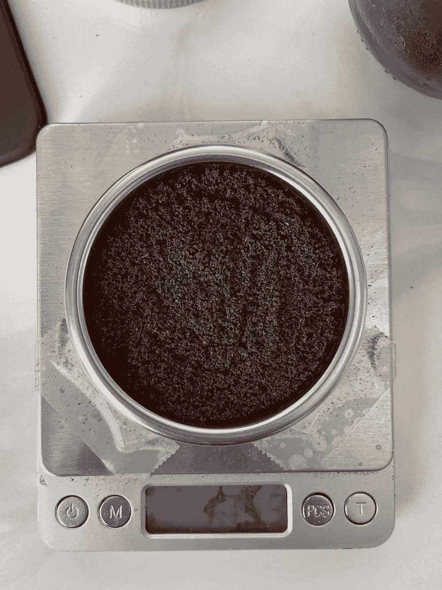
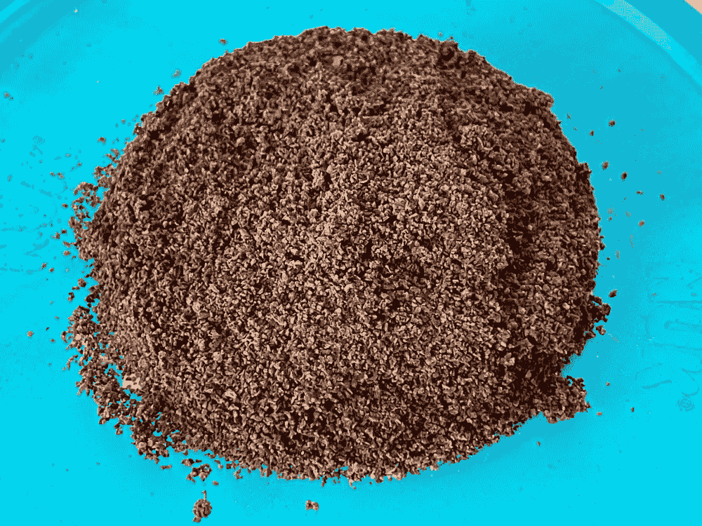

# 在黑暗的浓咖啡中发光，寻找微粒迁移

> 原文：<https://towardsdatascience.com/glow-in-the-dark-espresso-in-search-of-fines-migration-b369a3beee3b?source=collection_archive---------23----------------------->

## 咖啡数据科学

## 寻找另一种方式来看待微粒迁移理论

这是我写的第四篇关于微粒迁移的文章。我假设有证据表明，微粒不会通过粉笔实验(T0)和 T2 实验(T3)以及 T4 实验(T5)迁移。

我不打算重新做粉笔实验，直到我的儿子带着黑粉笔回家。我想这可以成为一个有趣的实验，结合用过的咖啡。如果更细小的粒子在整个冰球中运动，黑暗部分的发光会有助于使它们更容易被看到。白垩粉本身的尺寸比 100 微米小得多，所以它是细粉的一个很好的替代品。

目的是在黑暗的粉笔黄昏中，在用过的咖啡渣(直径为 400 微米)上发光。如果细粒迁移发生，它肯定会发生在大的咖啡颗粒上，颗粒之间有更多的空间供细粒迁移。

所有图片由作者提供

回顾一下，浓缩咖啡中的微粒迁移理论是，非常细小的颗粒(微粒)在一次喷射中迁移，然后可能会堵塞过滤器或进入杯中。这种迁移被认为是沟道效应的根本原因之一。

来展示黑暗粉笔在黑暗中的发光效果。

粉笔不容易溶解。有一些研究表明，升高温度会降低溶解度，而升高压力会降低溶解度，但在浓缩咖啡范围内并不多。

在黑暗中发光的颜色通常也不溶于水。

在这两种情况下，干燥地面和随后的液体仍然会让我们看到黑暗粉笔发光。

# 数据收集

我从 18g 经过筛选的废咖啡渣开始，因此大多数咖啡渣的直径大于 400um。然后我在上面加了 0.62g 的粉笔，我还加了一个[金属网筛](https://flairespresso.com/product/flair-58-puck-screen/)减少粉笔回流到我的机器里。

我做了粉笔灰，让它在阳光下晒几个小时。

我启动了金快车，然后开枪了。这是一场泥泞的灾难，很可能是因为提取了所有剩下的东西。我怀疑，由于高流量，这很可能是微粒迁移的最坏情况。最初，我想在黑暗中进行这个测试，这样我就可以看到如果微粒真的迁移了，它们是否会发光。

经过一番清理，我开始着手分析冰球。

# 圆盘分析

出于理智，我想检查一下顶部在黑暗中是否还会发光。因此，黑暗的图像是在一个没有灯光或窗户的房间里用长曝光相机拍摄的。

当我试图把整个冰球取出来时，只有最上面的部分露了出来。完美！冰球的顶部暴露得很好，我在黑暗中拍了张照片。视觉上，没有白色斑点，也没有任何东西在黑暗中出现。

我仔细检查了顶部，除了最顶部的颗粒外，我仍然没有发现任何白色颗粒。

然后我切开那一部分，我仍然没有发现白色斑点，表明没有粉笔穿透冰球。

作为一个健全的检查，我弹出了冰球的另一部分，我没有发现白色斑点的证据。在黑暗中，我没有发现发光的东西。

# 筛分分析

我拿起最上面的部分，用 400 微米的筛子筛选。有一些粉笔块留在上面，但是很多细小的粉笔颗粒在下面。

我用显微镜观察一些粒子只是为了好玩。

另外，我用烤箱烘干了所有的液体。我在黑暗中也观察了这个，我没有在黑粉笔中看到任何发光的迹象。我也没有看到托盘里有任何白色颗粒。

我刮去残渣，有 0.5 克残渣，相当于 2.77%的提取率。通常在用过的磨碎物中仍有少量残余物需要提取。

# 超暗测试

我把冰球的底部放在托盘上，我寻找任何白色颗粒，但我没有找到。

我试图用我的厨房灯在黑暗的粉笔中充电发光，但我发现了一个紫外线灯，所以我能够充电并在黑暗中前进。

对于顶部来说，黑暗粉笔中的光芒仍然闪耀，但对于底部，在托盘上展开，什么也没有。我试着拿着灯走了很多距离，但是什么都没有出现。

然后我对残留物做了同样的检查，什么也没发现。

我做了一个实验，试图用黑色粉笔和粗筛过的废咖啡找到微粒迁移的证据，但我没有找到证据。我尝试了多种方法来检测证据，在常规光线和紫外线下进行视觉检查，但我还是没有发现粉笔穿透冰球的任何证据。

> 结论:没有足够的证据表明微粒会迁移。

很有可能我错了，做了一个糟糕的实验，但是这个实验很简单，其他人可以重复甚至改进这个实验方案。我欢迎这样的测试。

如果你愿意，可以在 Twitter 和 YouTube 上关注我，我会在那里发布不同机器上的浓缩咖啡视频和浓缩咖啡相关的东西。你也可以在 [LinkedIn](https://www.linkedin.com/in/robert-mckeon-aloe-01581595?source=post_page---------------------------) 上找到我。也可以关注我[中](https://towardsdatascience.com/@rmckeon/follow)。

# [我的进一步阅读](https://rmckeon.medium.com/story-collection-splash-page-e15025710347):

[浓缩咖啡系列文章](https://rmckeon.medium.com/a-collection-of-espresso-articles-de8a3abf9917?postPublishedType=repub)

[工作和学校故事集](https://rmckeon.medium.com/a-collection-of-work-and-school-stories-6b7ca5a58318?source=your_stories_page-------------------------------------)

[个人故事和关注点](https://rmckeon.medium.com/personal-stories-and-concerns-51bd8b3e63e6?source=your_stories_page-------------------------------------)

[乐高故事启动页面](https://rmckeon.medium.com/lego-story-splash-page-b91ba4f56bc7?source=your_stories_page-------------------------------------)

[摄影启动页面](https://rmckeon.medium.com/photography-splash-page-fe93297abc06?source=your_stories_page-------------------------------------)

[使用图像处理测量咖啡研磨颗粒分布](https://link.medium.com/9Az9gAfWXdb)

[改善浓缩咖啡](https://rmckeon.medium.com/improving-espresso-splash-page-576c70e64d0d?source=your_stories_page-------------------------------------)

[断奏生活方式概述](https://rmckeon.medium.com/a-summary-of-the-staccato-lifestyle-dd1dc6d4b861?source=your_stories_page-------------------------------------)

[测量咖啡磨粒分布](https://rmckeon.medium.com/measuring-coffee-grind-distribution-d37a39ffc215?source=your_stories_page-------------------------------------)

[咖啡萃取](https://rmckeon.medium.com/coffee-extraction-splash-page-3e568df003ac?source=your_stories_page-------------------------------------)

[咖啡烘焙](https://rmckeon.medium.com/coffee-roasting-splash-page-780b0c3242ea?source=your_stories_page-------------------------------------)

[咖啡豆](https://rmckeon.medium.com/coffee-beans-splash-page-e52e1993274f?source=your_stories_page-------------------------------------)

[浓缩咖啡用纸质过滤器](https://rmckeon.medium.com/paper-filters-for-espresso-splash-page-f55fc553e98?source=your_stories_page-------------------------------------)

[浓缩咖啡篮及相关主题](https://rmckeon.medium.com/espresso-baskets-and-related-topics-splash-page-ff10f690a738?source=your_stories_page-------------------------------------)

[意式咖啡观点](https://rmckeon.medium.com/espresso-opinions-splash-page-5a89856d74da?source=your_stories_page-------------------------------------)

[透明 Portafilter 实验](https://rmckeon.medium.com/transparent-portafilter-experiments-splash-page-8fd3ae3a286d?source=your_stories_page-------------------------------------)

[杠杆机维护](https://rmckeon.medium.com/lever-machine-maintenance-splash-page-72c1e3102ff?source=your_stories_page-------------------------------------)

[咖啡评论与思考](https://rmckeon.medium.com/coffee-reviews-and-thoughts-splash-page-ca6840eb04f7?source=your_stories_page-------------------------------------)

[咖啡实验](https://rmckeon.medium.com/coffee-experiments-splash-page-671a77ba4d42?source=your_stories_page-------------------------------------)