# GMM:高斯混合模型——如何成功地使用它对你的数据进行聚类？

> 原文：<https://towardsdatascience.com/gmm-gaussian-mixture-models-how-to-successfully-use-it-to-cluster-your-data-891dc8ac058f?source=collection_archive---------4----------------------->

## 机器学习

## GMM 的直观解释和有用的 Python 示例

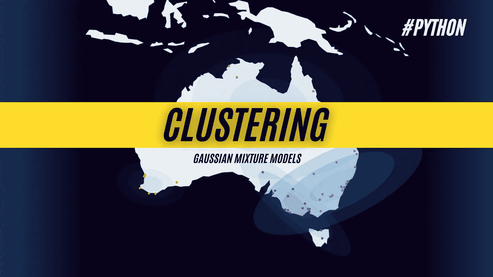

GMM-高斯混合模型。图片由[作者](https://solclover.com/)提供。

本文是解释不同机器学习算法如何工作的系列文章的一部分，并为您提供了一系列 Python 示例，以帮助您开始自己的数据科学项目。

# 故事涵盖以下主题:

*   高斯混合模型(GMM)属于算法的范畴。
*   GMM 算法如何工作的描述。
*   如何使用 GMM 进行聚类的 Python 示例。

# GMM 属于哪一类算法？

虽然不可能总是对每种算法进行完美的分类，但尝试这样做仍然是有益的。下面的**互动**图是我试图帮助你看到更广阔的机器学习领域。

确保点击👇在不同的类别上对**进行放大并揭示更多的**。

> 请注意，在许多情况下，相同的算法可以用于解决多种类型的问题。例如，可以使用神经网络进行分类、回归，并作为强化学习的一部分。

机器学习算法分类。由[作者](https://solclover.com/)创建的交互式图表。

***如果你喜欢数据科学和机器学习*** *，请* [*订阅*](https://solclover.com/subscribe) *每当我发布一个新的故事，你都会收到一封电子邮件。*

由于高斯混合模型(GMM)用于聚类，它们属于机器学习的**无监督**分支。

您可能已经知道，非监督技术(尤其是聚类)通常用于分段分析，或者作为一种在数据集中查找观察值之间的相似性/差异性的方法。这不同于监督学习模型，监督学习模型通常用于进行预测。

# GMM 算法的解释

## 聚类算法的类型

并非所有的聚类算法都是一样的。不同的聚类算法对如何最好地对数据进行聚类有不同的想法。有 4 个主要类别:

*   **基于质心的** —使用欧几里德距离将每个点分配到最近的聚类中心。例:[K-表示](/k-means-clustering-a-comprehensive-guide-to-its-successful-use-in-python-c3893957667d)
*   **基于连通性的** —假设附近的对象(数据点)比远处的对象更相关。例如:[层次凝聚聚类(HAC)](/hac-hierarchical-agglomerative-clustering-is-it-better-than-k-means-4ff6f459e390) 。
*   **基于密度的** —将集群定义为由低密度区域分隔的密集空间区域。他们擅长寻找任意形状的星团。示例:[带噪声的应用程序的基于密度的空间聚类(DBSCAN)](/dbscan-clustering-algorithm-how-to-build-powerful-density-based-models-21d9961c4cec) 。
*   **基于分布的** —假设数据中存在指定数量的分布。每个分布都有自己的均值(μ)和方差(σ ) /协方差(Cov)。示例:高斯混合模型(GMM)。

> 注意，方差用于单变量分析，协方差用于多变量分析。本文中的示例使用多元设置(多重分布/聚类)。

## GMM 简介

正如您可能已经想到的，高斯混合模型假设您的数据遵循高斯(也称为正态)分布。因为在您的数据中可以有多个这样的分布，所以您可以指定它们的数量，这实际上就是您想要的集群的数量。

此外，由于单独的分布可以重叠，因此模型输出不是将点硬分配给特定的聚类。该点属于所述分布是基于**概率**的。比方说，如果点 A 属于“聚类 0”的概率为 0.6，属于“聚类 1”的概率为 0.4，那么模型将推荐“聚类 0”作为该点的标签(因为 0.6 > 0.4)。

为了进一步帮助解释，让我们看一些图表。

*   下图显示了 GMM 确定的 4 个澳大利亚城市集群。请注意，每个聚类都有自己的均值(中心)、协方差(形状)和大小。此外，不同的集群(紫色、蓝色和绿色)之间有明显的重叠。

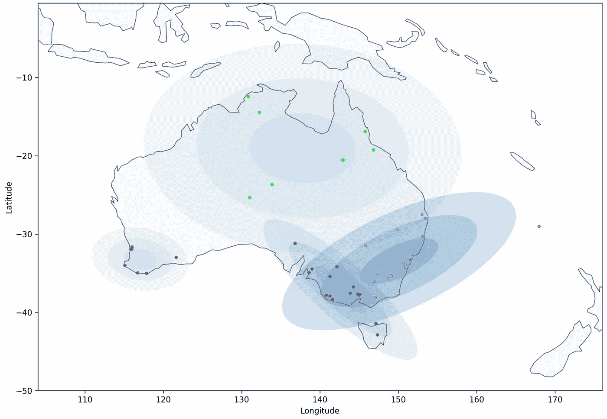

高斯混合模型(GMM) —澳大利亚城市的 4 个集群。图片由[作者](https://solclover.com/)提供。

*   如前所述，分类标签分配是基于挑选属于特定分类的特定数据点的最高概率。然而，这并不意味着该点肯定是该集群(分布)的一部分。
*   看看当我们要求模型为上面找到的分布生成新的数据点(样本)时会发生什么:

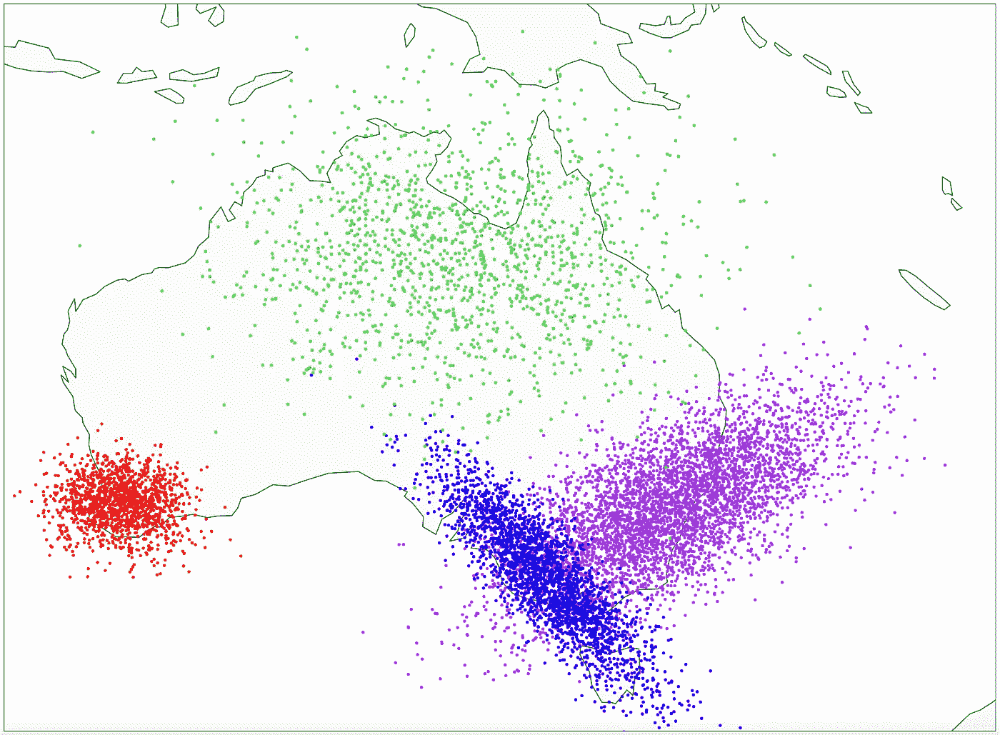

高斯混合模型(GMM)-为 4 个分布生成 10，000 个新样本。图片由[作者](https://solclover.com/)提供。

*   由于分布的重叠性质，你会得到一些混在蓝点中的紫色点，以及一些混在蓝点和紫色点中的绿色点。因此，GMM 可以被描述为一种**软聚类方法**，其中不存在硬决策边界来分离不同的聚类。

## **期望最大化(EM)**

为了理解 GMM 在实践中是如何工作的，我们需要看看期望最大化(EM)算法。EM 使用迭代方法来计算和重新计算每个聚类(分布)的参数，即平均值、方差/协方差和大小。

我不会对每一步中发生的事情进行复杂的数学计算。相反，我将给你一个直观的解释，从下面的图表开始，以便于形象化:

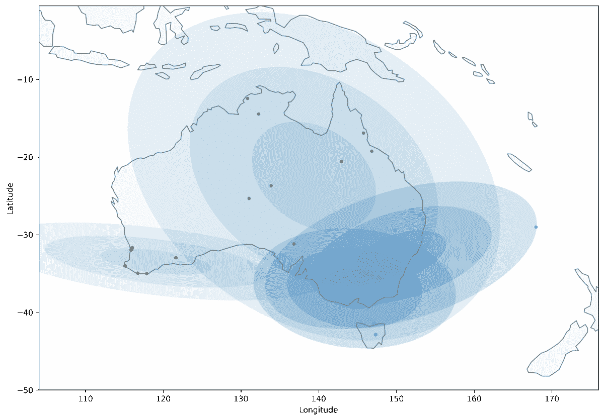

高斯混合模型(GMM) —寻找 4 个聚类的迭代过程。图片来自[作者。](https://solclover.com/)

开始时，该模型用一组参数初始化指定数量的聚类，这些参数可以是随机的，也可以是用户指定的。智能初始化选项在某些实现中也是可用的(例如， [sklearn 的 GMM 实现](https://scikit-learn.org/stable/modules/generated/sklearn.mixture.GaussianMixture.html#sklearn.mixture.GaussianMixture.sample)默认使用 kmeans 来初始化集群)。

> 对于上面的图表，我已经指定了我自己的一组平均值(起始中心)来初始化聚类，这帮助我创建了一个更好的可视化。与随机初始化相比，它还加快了收敛速度。
> 
> 然而，你必须非常小心初始化，因为 GMM 的最终结果往往是非常敏感的初始参数。因此，建议使用智能初始化或随机初始化多次，然后选择最佳结果。

因此，初始化聚类后，我们就可以使用均值(μ)、协方差(Cov)和大小(𝜋)了。

*   **期望(E 步骤)** —对于每个数据点，计算一个“责任” **r** ，简单来说，就是该数据点属于一个聚类 **c** 的概率。这是针对每个集群的每个点进行的。
*   **最大化(M 步)** —然后使用“责任”来重新计算每个聚类(分布)的平均值、协方差和大小。到了这一步，你也可以把“责任”当成一个砝码。数据点属于一个聚类的可能性越小，它在μ、Cov 和𝜋.的重新计算中的权重就越小在上面的 GIF 图像中，您可以看到簇的位置、形状和大小是如何随着每次迭代而变化的。

E-step 和 M-step 的过程重复多次，直到不能进行进一步的改进，即达到收敛。

# GMM 聚类的 Python 示例

## 设置

我们将使用以下数据和库:

*   来自 Kaggle 的澳大利亚天气数据
*   [Scikit-learn 库](https://scikit-learn.org/stable/index.html)根据[剪影得分](https://scikit-learn.org/stable/modules/generated/sklearn.metrics.silhouette_score.html?highlight=silhouette#sklearn.metrics.silhouette_score)确定我们想要多少个聚类，并执行 [GMM 聚类](https://scikit-learn.org/stable/modules/generated/sklearn.mixture.GaussianMixture.html#sklearn.mixture.GaussianMixture.sample)
*   用于数据可视化的 [Plotly](https://plotly.com/python/) 和 [Matplotlib](https://matplotlib.org/)
*   用于数据操作的[熊猫](https://pandas.pydata.org/docs/)和 [Numpy](https://numpy.org/doc/stable/)
*   [地理坐标](https://geopy.readthedocs.io/en/stable/)，[进度条](https://pypi.org/project/progressbar/)，采集澳大利亚城市坐标的时间

让我们导入所有的库:

然后我们从 Kaggle 获取澳大利亚的天气数据，你可以按照这个链接下载:[https://www . ka ggle . com/jsphyg/weather-dataset-rattle-package](https://www.kaggle.com/jsphyg/weather-dataset-rattle-package)。

我们接收数据并派生出一个新变量“Location2”，它具有使用 Geopy 提取城市坐标的正确格式。

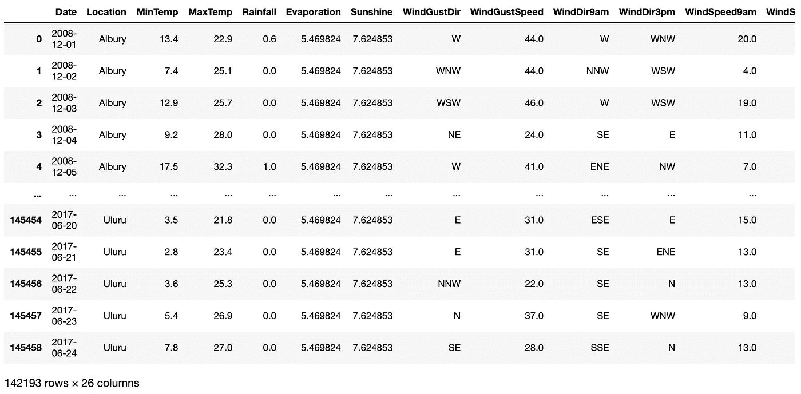

一段经过修改的 [Kaggle 的澳大利亚天气数据](https://www.kaggle.com/jsphyg/weather-dataset-rattle-package)。图片由[作者](https://solclover.medium.com/)提供。

因为我们的原始数据只包含位置(城市)名称而不包含坐标，所以我们将使用 Geopy 的名称来获取这些坐标。请注意，我们在每次调用之间添加了 1 秒钟的睡眠时间，以避免服务器过载。

这是我们得到的回报片段:

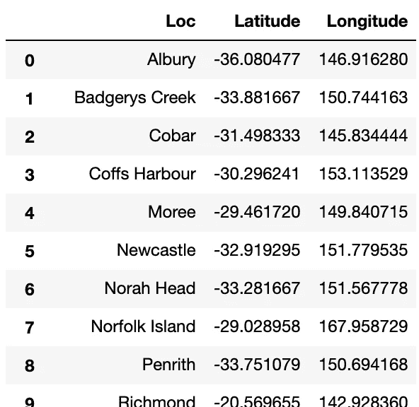

澳大利亚城市坐标。图片由[作者](https://solclover.com/)提供。

接下来，让我们在地图上标出城市:

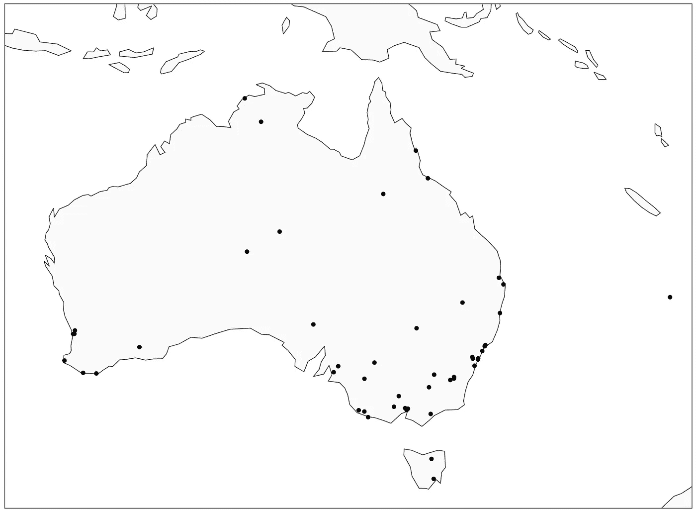

地图上的澳大利亚城市。图片由[作者](https://solclover.com/)提供。

## GMM 聚类—选择聚类的数量

有多种方法可以选择应该有多少个集群。它可以基于你对数据的了解，或者更多的数据驱动的东西，比如剪影分数。这里有一段直接引自 [sklearn](https://scikit-learn.org/stable/modules/clustering.html#silhouette-coefficient) 的话:

> 轮廓系数是为每个样本定义的，由两个分数组成:
> 
> **a:** 一个样本到同一类中所有其他点的平均距离。
> 
> **b:** 样本与下一个最近的聚类中所有其他点之间的平均距离。
> 
> 单个样品的轮廓系数 **s** 为:

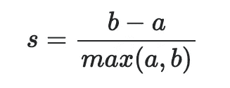

> 一组样本的轮廓系数是每个样本的轮廓系数的平均值。

让我们创建多个 GMM 模型使用不同数量的集群和绘图剪影分数。

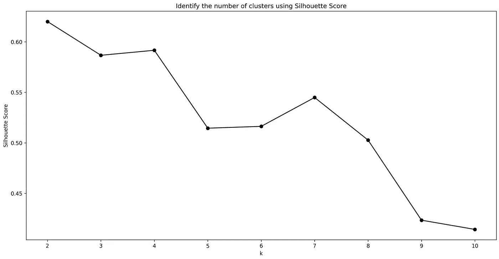

利用剪影分数确定 GMM 聚类数。图片由[作者](https://solclover.com/)提供。

一般来说，轮廓分数越高，你的聚类就越清晰。在这个例子中，我选择了 4 个集群，而不是 2 个，尽管 2 个集群设置的分数略高。

请注意，如果您非常熟悉您的数据，在决定聚类数量时，您可能更喜欢使用轮廓分数作为指南，而不是硬性规则。

## GMM 聚类—构建模型

现在让我们建立我们的 GMM 模型:

下面是上面的代码打印出来的总结。注意，在显示均值(聚类中心)的情况下，7 次迭代后已经实现收敛:

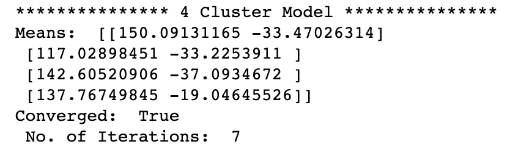

GMM 模型的输出。图片由[作者](https://solclover.com/)提供。

现在，让我们在地图上绘制集群:

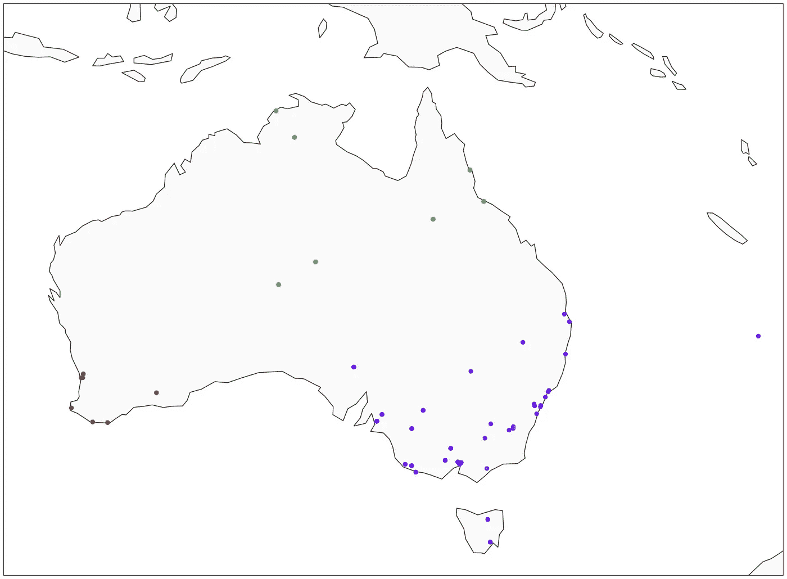

高斯混合模型(GMM) —澳大利亚城市的 4 个集群。图片由[作者提供。](https://solclover.com/)

最后，您还可以绘制模型生成的 10，000 个新点的样本，如本文前面的图表所示:

高斯混合模型(GMM)-为 4 个分布生成 10，000 个新样本。图片由[作者](https://solclover.com/)提供。

# 结论

高斯混合模型在聚类呈“椭圆形”的情况下非常有用。K-Means 只使用均值(质心)来寻找聚类，而 GMM 还包括方差/协方差。这正是 GMM 在识别非圆形聚类时优于 K-Means 的地方。

一般来说，你可以认为 GMM 是 K-Means 的一个更高级的版本，但是请记住，它并不总是给你优越的结果。这是因为这很大程度上取决于数据的形状和你想要达到的目标。

我希望这篇文章能帮助你更好地理解高斯混合模型。如果想了解更多的备选聚类算法，可以参考我下面的文章。

干杯！👏
**索尔·多比拉斯**

***如果你已经花光了这个月的学习预算，下次请记得我。*** *我的个性化链接加入媒介是:*

<https://solclover.com/membership>  </k-means-clustering-a-comprehensive-guide-to-its-successful-use-in-python-c3893957667d>  </hac-hierarchical-agglomerative-clustering-is-it-better-than-k-means-4ff6f459e390>  </dbscan-clustering-algorithm-how-to-build-powerful-density-based-models-21d9961c4cec> 