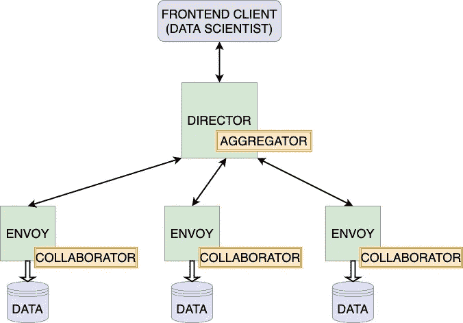

# 与 OpenFL 联合

> 原文：<https://towardsdatascience.com/go-federated-with-openfl-8bc145a5ead1?source=collection_archive---------22----------------------->

## 将您的深度学习管道放在联邦 rails 上

# 介绍

OpenFL 是英特尔开发的用于[联合学习](https://medium.com/@ODSC/what-is-federated-learning-99c7fc9bc4f5) (FL)的开源框架。FL 是一种在分布于多个节点的分片数据集上训练统计模型的技术。此外，由于隐私/法律问题(如 HIPAA 或 GDPR 等法律)、数据集的大小或其他原因，数据可能在不同的分片之间分布不同，并且不能在节点之间移动。OpenFL 旨在解决当数据在组织或远程数据中心之间拆分时所谓的[跨筒仓联合学习](https://blog.openmined.org/federated-learning-types/)问题。

> OpenFL 旨在为数据科学家提供一个有效且安全的基础设施。OpenFL 的可扩展特性应该使联邦学习领域的研究变得容易和民主化

随着 1.2 版本的更新，OpenFL 团队努力提高框架的可学性，并分离设置联邦和使用它运行 FL 实验的过程。在 OpenFL 团队，我们致力于最小化用户入口点，简化建立联盟的过程，以及注册和运行 FL 实验。

*1.2 版 OpenFL 更新*引入了用户会话、允许在重用现有连接的同时进行多次后续实验的长期组件，以及开发的交互式 Python API，以简化对单节点训练代码的修改，并为数据科学家提供单节点体验。

# 轻松处理远程数据

让我们想象一群配备有计算单元并保存唯一数据集的节点。如果一组节点持有的数据允许解决特定的数据科学问题，并且控制这些节点的人愿意合作解决该问题(至少允许对他们的数据进行本地培训)，则这样的一组节点可以组成联盟。

让我们想象一下，几个节点所有者同意创建一个联盟，从而使他们唯一的数据集成为虚拟全局数据集的碎片。现在，我们仔细看看最重要的部分——上面提到的数据碎片。数据碎片可能以不同的格式保存，尤其是如果节点属于不同的组织。数据碎片是异构的(这是我们首先要将它们组合在一起的原因)，它们在来源、磁盘上的结构、标记模式等方面有所不同。为了促进这种多样性并描述一个将使用所有碎片的单个实验，我们必须选择以下之一:

1.  实验中的数据加载过程应该有一个 switch-case 逻辑来加载不同的数据碎片。这种必要性不仅打破了实验定义的单节点体验，还意味着数据科学家知道每个数据集碎片的结构。
2.  数据集碎片所有者同意一个通用的数据结构，并相应地准备他们的数据。尽管实验中的数据加载过程对于所有数据集碎片都是相同的，但它们的所有者必须描述数据读取和转储脚本，并为每个给定的数据接口保留一份数据集副本。

OpenFL 试图通过将数据准备过程包含在联邦设置管道中，从这两种方法中取长补短来解决这个问题。OpenFL 现在为数据集碎片所有者提供了*碎片描述符*接口。它允许定义数据读取程序，并描述符合统一数据接口的数据采集方法。在不转储数据集碎片的格式化副本的情况下，*碎片描述符*为联邦中所有节点上的实验提供了单一的数据访问方法。在这个模式中，数据样本只在运行时加载。

总之，*分片描述符*的引入是为了解决数据异构，并为定义 FL 实验的数据科学家提供统一的数据接口。数据集碎片所有者可以介绍他们的数据读取过程、预处理，如果需要，甚至可以利用[差分隐私](https://medium.com/georgian-impact-blog/a-brief-introduction-to-differential-privacy-eacf8722283b)技术。

# 主要使用场景

在这一节中，我们将介绍设置一个联邦所需的主要步骤，并使用 OpenFL 进行一个 FL 实验来理解工作流。

## *成立联合会*

我们现在的情况是，有一群数据所有者同意合作解决一些数据科学问题，他们标记的数据集符合这一目的。第一步是在所有将用于联邦模型训练的机器上安装 OpenFL，我们将这些机器进一步称为“合作者节点”。

OpenFL 可以从 PyPI 安装(conda 包和 docker 镜像也是可用的):

```
$pip install openfl
```

然后数据所有者需要[实现*分片描述符*](https://openfl.readthedocs.io/en/latest/source/workflow/director_based_workflow.html#implement-shard-descriptors) Python 类。

此时，联合参与者必须选择联合中的中心节点，该节点将用作实验服务器，并将从所有协作者节点聚合模型更新。

名为 *Director* 服务的实验服务器现在应该使用 OpenFL 命令行界面(CLI)在中心节点上启动。它以联邦中的统一数据集格式和中心节点上的开放端口作为参数。

随着*导演*的运行，其名为*使节*的‘客户’现在可能在合作者节点上启动。*特使*也使用 OpenFL CLI 启动，使用配置文件和*控制器的*网络地址作为参数。上面提到的配置文件应该包含本地 *Shard Descriptor* 类的导入地址及其参数(如果需要的话)。启动后，*特使*尝试与*指挥者*建立 gRPC 连接，如果*分片描述符*符合统一数据接口，指挥者可能会接受*特使*加入联盟。

到目前为止，我们有一个星形的节点网络:几个*特使*连接到*主任*并等待即将到来的实验。我们称这样的网络为联盟。当*控制器*关闭时，该联盟可能会主持几个实验并停止存在。

## 注册一个 FL 实验

此时，数据科学家可以注册他们的实验，以便在联邦中执行。OpenFL 提供了一个单独的前端 *Director 的*客户端作为 Python API 的一部分来注册实验。数据科学家可以从另一台机器(包括计算资源有限的笔记本电脑)连接到 *Director* ，并在交互式环境(如 Jupyter 笔记本或 Python 脚本)中定义他们的实验。在下一节中，我们将进一步了解前端 Python API。

几个用户可能连接到同一个 *Director* ，但是注册的实验是在联邦中一个一个执行的(至少对于 OpenFL v1.2 是这样)。当实验结束时，用户可以检索训练工件:检查点和训练日志。

## 当一个实验被主任接受时会发生什么

当用户向*主管*报告 FL 实验时，实验工作空间和用于再现 Python 环境的信息被打包到一个档案中并发送给主管。导演向参与的*使者*播放实验档案。然后，导演启动一个*聚合器*服务来编排培训过程。*特使*启动*协作者*进程，该进程将根据本地数据训练模型。



绿色块是长期存在的组件。黄色块是为特定实验产生的短命组件。双向箭头是 gRPC 连接。(*图片作者*)

查看 OpenFL 文档中的详细图表[这里](https://openfl.readthedocs.io/en/latest/source/openfl/components.html)和[这里](https://openfl.readthedocs.io/en/latest/source/openfl/communication.html)。

# 交互式前端 API

在上一节中，我们从数据持有者的角度调查了与 OpenFL 的交互，现在让我们概述一下数据科学家可以利用所创建的基础设施的方式。

如上所述，OpenFL 提供了一个独特的交互式 Python API，旨在简化 FL 实验。通过这次更新，我们试图将研究人员的界面从建立网络的过程中分离出来，因此定义 FL 实验的努力不会随着联盟中合作者的数量而增加。

> 定义 FL 实验的努力并不与联盟中合作者的数量成比例

一般来说，前端 Python API 允许用户注册统计模型和训练逻辑，因此可以以联合的方式训练它。下面我们重点介绍在 OpenFL 中所看到的 FL 实验的三个主要部分:

*   **模型**和优化器可以以用户喜欢的方式创建和初始化。OpenFL 前端 API 提供了一个*模型接口*类来注册这些对象。OpenFL 允许使用 PyTorch 或 TensorFlow 2 深度学习框架作为计算后端。*模型接口*是选择其中一个或者提供支持另一个 DL 框架的插件的地方。OpenFL 本身是 DL 框架无关的。
*   **FL 任务**是包含训练逻辑的主要单元，描述独立于其他部分的训练程序的独立部分，例如“训练”或“验证”。OpenFL Python API 提供了*任务接口*类，允许将独立函数改编为 FL 任务。任务必须将模型、优化器和数据加载器作为参数，并可选地返回一些计算的指标，但除了这些约束，它还是一个常规的 Python 函数。
*   **数据加载器。**FL 实验定义的最后一部分是准备数据。OpenFL API 中有一个可子类化的*数据接口*，它将在 collaborator 节点上适配 *Shard 描述符*，并为任务提供本地数据。必须解释一下*分片描述符*和数据加载器之间的区别:*分片描述符*执行数据读取和预处理例程，每个*特使*可能有唯一的*分片描述符*，而数据加载器在数据科学家的环境中每个 FL 实验定义一次，包含扩充和批处理逻辑。

> OpenFL 是一个深度学习框架不可知的库

当 FL 实验的所有三个部分都实现时，用户应该利用控制对象来注册实验并监督实验的执行。

**联盟**对象是*主管的*客户端的包装器，它帮助将特定的笔记本连接到联盟。连接的联邦对象允许用户检查连接的*特使*集合，也可以提供一个模拟远程的虚拟碎片描述符。它允许对实验代码进行本地调试，从而提供单节点体验，就好像可以从数据科学家的机器上访问数据一样。

**实验**对象包装了模型、数据和任务接口，并帮助向给定的联邦报告实验。应该是用来打包本地代码和使用过的 Python 包列表，并发送给 *Director* 。实验对象还提供了监控已接受实验的状态和检索已训练模型的方法。

将交互式 API 引入 OpenFL 背后的总体意图是允许数据科学家包装他们现有的单节点训练管道，并以最小的努力开始 FL 实验。

# 摘要

OpenFL 开发致力于为数据科学家创建一个灵活方便的工具，试图简化和加速联邦学习领域的研究。

您可以查看一个使用 OpenFL 以联邦方式在 Kvasir 数据集上训练 UNet 模型的[实际示例，以及一个关于如何做的](https://github.com/intel/openfl/blob/develop/openfl-tutorials/interactive_api/PyTorch_Kvasir_UNet/workspace/PyTorch_Kvasir_UNet.ipynb)手册。

如果您感兴趣，这里有一个有用的资源列表:

*   [OpenFL GitHub 资源库](https://github.com/intel/openfl)
*   [OpenFL 松弛通道](https://join.slack.com/t/openfl/shared_invite/zt-ovzbohvn-T5fApk05~YS_iZhjJ5yaTw)
*   [OpenFL ReadTheDocs](https://openfl.readthedocs.io/en/latest/index.html)
*   [OpenFL 白皮书](https://arxiv.org/abs/2105.06413)


照片由 [Alina Grubnyak](https://unsplash.com/@alinnnaaaa?utm_source=unsplash&utm_medium=referral&utm_content=creditCopyText) 在 [Unsplash](https://unsplash.com/@alinnnaaaa?utm_source=unsplash&utm_medium=referral&utm_content=creditCopyText) 上拍摄