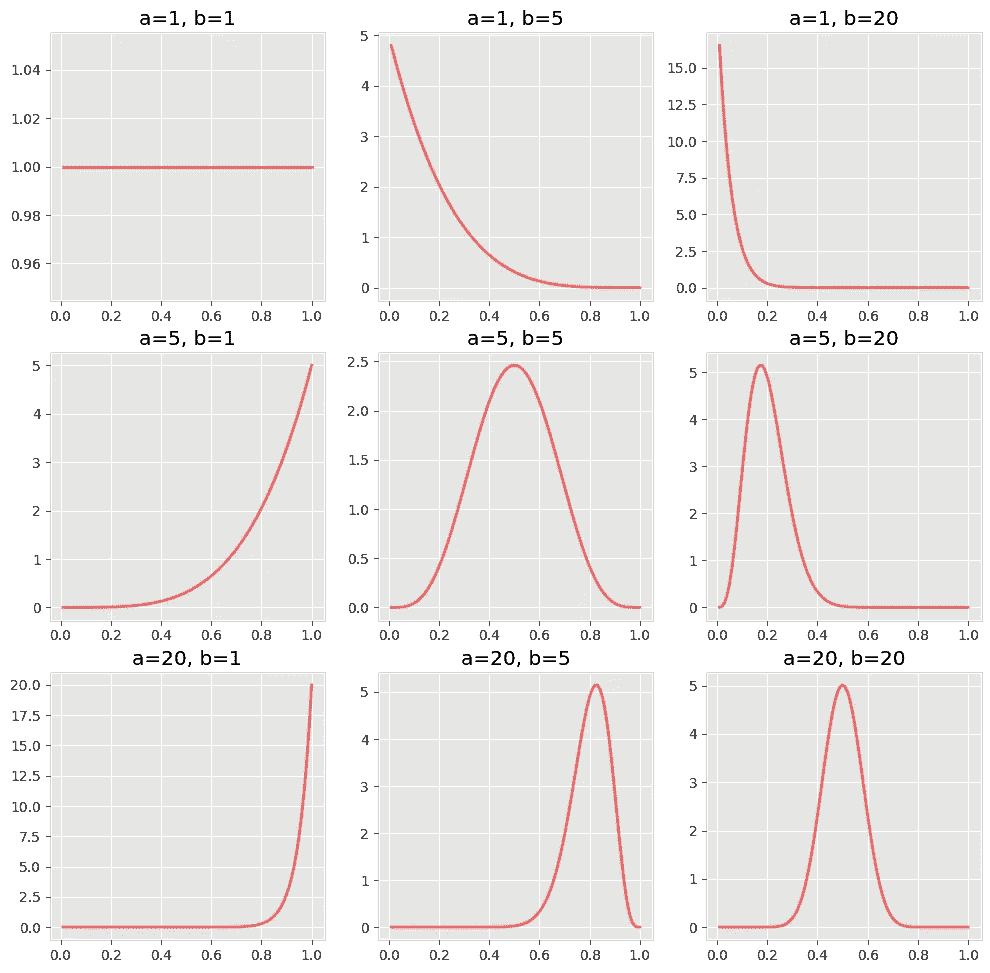
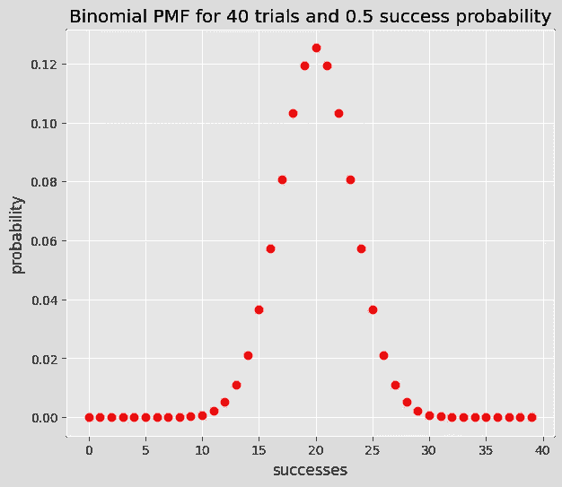
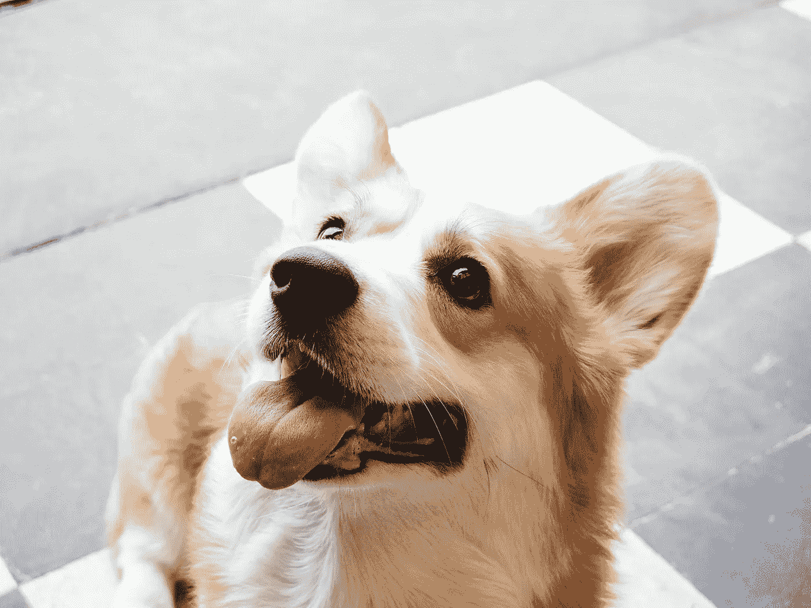
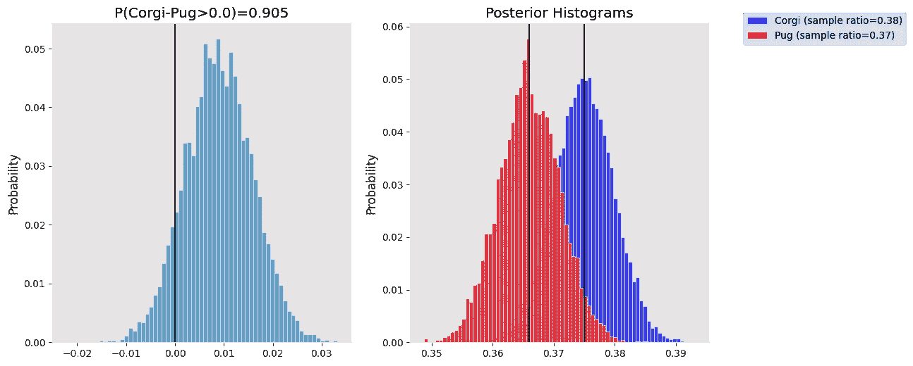

# 速率度量的贝叶斯 A/B 检验

> 原文：<https://towardsdatascience.com/going-bayesian-testing-rate-metrics-82e872b79175?source=collection_archive---------20----------------------->

## [入门](https://towardsdatascience.com/tagged/getting-started)

## 如何在没有 p 值和置信区间的情况下运行速率度量的 A/B 测试？


由[陈伶俐·桑特兰](https://unsplash.com/@brianna_santellan?utm_source=unsplash&utm_medium=referral&utm_content=creditCopyText)在 [Unsplash](https://unsplash.com/s/photos/corgi?utm_source=unsplash&utm_medium=referral&utm_content=creditCopyText) 上拍摄

你是否曾经努力向非技术观众甚至你自己解释你的 Frequentist 测试结果(即零假设/替代假设、p 值和置信区间)？你希望在运行 A/B 测试后，你可以说“有 95%的可能性 A 组比 B 组有更好的点击率”,然后就完事了吗？如果是的话，那你就来对地方了，如果不是的话，我们有可爱狗狗的照片，所以你可能会想留下来。

你是一名狗玩具公司 WoofWoof 的数据科学家。营销部门想要开展一个新的数字广告活动，他们正试图决定是否应该在广告中使用柯基犬或哈巴狗的图片。很快，你建议运行一个 A/B 测试，向一组人展示带有 corgi 的版本，向另一组人展示带有 pug 的版本，看看哪一个在点击率方面做得更好。营销部门同意了这一点，于是你开始回忆如何实际分析数据。

我们将介绍运行 A/B 测试所需的理论和步骤，即**贝叶斯方法**。我们将用 Python 实现一切。


布雷登·安德森在 [Unsplash](https://unsplash.com/s/photos/dogs-with-glasses?utm_source=unsplash&utm_medium=referral&utm_content=creditCopyText) 上拍摄的照片

# 你需要贝叶斯定理

题目有点露馅了，但是你需要熟悉 [**贝叶斯定理**](https://en.wikipedia.org/wiki/Bayes%27_theorem) 。贝叶斯定理为我们提供了一种方法来模拟在观察到新数据后，我们对某事物的先验信念是如何变化的。

```
Bayes Theorem
 P(A|B) = P(B|A) P(A) / P(B)where
 A, B: events in sample space
 P(A|B): conditional probability of A given B
 P(B|A): conditional probability of B given A
 P(A): probability of A
 P(B): probability of B
```

以上定义是针对离散变量，对于[连续变量](http://galton.uchicago.edu/~eichler/stat24600/Handouts/l06.pdf)是针对概率密度函数定义的。

在我们的例子中，我们关心的是点击率，我们用𝜃.来表示我们将把我们关于𝜃的先验信念表示为𝜋(𝜃)——这是感兴趣参数的**先验分布**。接下来，运行实验后我们将观察数据，𝛸.**似然函数** f(𝛸|𝜃)告诉我们，给定不同的𝜃.值，观察数据𝛸的可能性有多大我们真正关心的是𝜋(𝜃|𝛸)，即𝜃.的**后验分布**这基本上说明了在考虑了我们观察到的数据和我们先前的信念之后，不同的𝜃值的可能性有多大。我们可以用贝叶斯定理得到𝜋(𝜃|𝛸)。

```
𝜋(𝜃|𝛸) = f(𝛸|𝜃)𝜋(𝜃) / f(𝛸) 
       ~ f(𝛸|𝜃)𝜋(𝜃)where
  f(𝛸): probability density of 𝛸 (can think of it as a normalising constant)
```

总的来说，我们有

```
posterior ~ likelihood x prior.
```

# 先验:贝塔分布

先验的意思是获取我们对点击率可能值的任何先验知识。如果你不知道，你可以选择一个无信息先验，例如，所有可能的值都是同样可能的。无论是哪种情况，有一点是肯定的:速率度量只能取 0 到 1 之间的值！因此，我们需要一个先验分布来反映这一点，比如 [**Beta**](https://en.wikipedia.org/wiki/Beta_distribution) 分布。

贝塔分布有两个参数可以使用，𝛼 >0 和𝛽>0(图 1 中的`a`和`b`)。让我们看一些图，直观地了解它们如何影响密度函数的形状。



图一。不同参数值的贝塔分布。图片由作者提供。

您可能已经注意到了图 1 中的一个模式。分布的峰值在(𝛼-1)/(𝛼+𝛽-2)——这实际上是分布的模式。此外，𝛼和𝛽越大，模式周围的值就越集中(请看图 1 中的对角线)。

事实上，你可以认为𝛼-1 是成功的次数，𝛽-1 是失败的次数。那么，模式(𝛼-1)/(𝛼+𝛽-2)可以认为是`successes / trials`。因此，如果我们想要一个先验，给 0.5 左右的𝜃值更多的权重，就像我们做了一个实验，得到 20 个成功(点击)和 20 个失败(没有点击)，我们可以选择𝛼=21 和𝛽=21.如果我们想要一个无信息的先验，我们可以选择𝛼=1 和𝛽=1——在这种情况下显然没有模式。

请记住，您的先验越强，即非常大的𝛼和𝛽，我们将需要从它那里转移更多的数据。

# 可能性:二项分布

可能性告诉我们，在给定不同的𝜃.值的情况下，观察到数据的可能性有多大，𝛸由于我们正在使用比率指标，这意味着我们有试用(我们的数字广告的印象)和成功(点击的广告)，所以 [**二项式**](https://en.wikipedia.org/wiki/Binomial_distribution) 分布非常适合。

提醒一下，当成功概率等于𝜃(通常成功概率表示为`p`)时，𝜃binomial(𝜈分布对𝜈试验中𝜅成功的概率进行建模。



图片由作者提供。

# 后路:？

我们选择了贝塔分布作为我们的先验，二项分布作为我们的可能性。我们的后验可能是什么呢嗯…(你可能已经在想象可怕的数学计算了)。

原来我们的后验也是贝塔分布！当然，这不是意外。这种β-二项式先验似然组合经常被选择，因为它们是共轭先验。共轭先验仅仅意味着当你把它们结合起来时，后验分布与先验分布来自同一个分布族。

```
If
  Prior is Beta(𝛼, 𝛽)
  Likelihood is Binomial(𝜈, 𝜃)
Then
  Posterior is Beta(𝛼 + successes, 𝛽 + failures)
Where
  𝜈 = successes + failures
```

所以我们需要做的就是选择𝛼和𝛽作为我们的先验，运行我们的实验，收集数据，然后计算我们的后验概率，这也是一个参数为𝛼+successes，𝛽+failures.的贝塔分布轻松点。

我们的 A/B 测试计划是给两组相同的先验，然后使用 Bayes 定理计算它们的后验分布。一旦我们有了后验概率，我们就可以进行有趣的比较，找出并宣布赢家。

# 测试实现

我们感兴趣的是 A 组(柯基广告)在点击率(CTR)方面优于 B 组(哈巴狗广告)的概率，即

```
P(corgi CTR — pug CTR > margin)
```

其中`margin`可以是 0 或者其他我们关心的值。这基本上是在回答“柯基广告的点击率至少`margin`大于哈巴狗广告点击率的概率有多大”这个问题？

我们将通过对每组点击率的后验分布进行抽样来寻找答案。该过程如下:

```
Set N to some big number (e.g. 10000)
Set differences = []for i = 1 to N:
   a_sample = sample a value from group's A posterior
   b_sample = sample a value from group's B posterior
   a_b_diff = a_sample - b_sample store a_b_diff in differencesP(A - B > margin) ≈ % of values in differences that are greater than margin
```

在我们的实现中，我们将使用矢量化方法，而不是`for`循环，因为这样更快。

这可能看起来像很多代码，但大部分只是为了创造一些情节。第 23 行到第 35 行是重要的一行，在这里我们从后验抽样并计算差异的分布。

还有 [**另一种方式**](http://doingbayesiandataanalysis.blogspot.com/2013/08/how-much-of-bayesian-posterior.html) 你可以用后验来总结你的实验，这里我们还没有实现。它包括计算差异后验分布的**最高密度区间(HDI)** (最短区间，使得其中的值的概率等于`x%`)并检查它是否与实际等价的预定义的**区域****【ROPE】**重叠。例如，我们可以将 ROPE 定义为[-0.005，0.005]，这意味着我们认为两组在该范围内的差异可以忽略不计。计算出差异的后验分布后，下一步就是计算 95%的 HDI(实际用多少百分比由你自己决定)。如果人类发展指数没有与我们的绳子相交，我们得出结论，这两个群体是不同的。

# 他们当中谁最可爱？



由[弗洛伦西亚·波特](https://unsplash.com/@florenciapotter?utm_source=unsplash&utm_medium=referral&utm_content=creditCopyText)在 [Unsplash](https://unsplash.com/s/photos/corgi?utm_source=unsplash&utm_medium=referral&utm_content=creditCopyText) 上拍摄的照片

A/B 测试正在进行中，市场部已经要求你分析数据。

```
Corgi group
  Impressions: 9760
  Clicks: 3660Pug group
  Impressions: 9344
  Clicks: 3420
```

使用上一节中的代码，您可以简单地执行以下操作

```
GROUP_A = 'Corgi'
GROUP_B = 'Pug'ab_test = BetaBinomialTest(GROUP_A, GROUP_B)
ab_test.update_group_data(GROUP_A, successes=3660, trials=9760)
ab_test.update_group_data(GROUP_B, successes=3420, trials=9344)prob, differences = ab_test.compare(GROUP_A, GROUP_B, margin=0.0)
```

才能快速得到答案。



左图:差异分布。右图:点击率的后验分布。图片由作者提供。

你回到市场部，让他们知道有大约 90%的可能性 corgi 版本比 pug 版本更好。在这一点上，他们可能会决定 90%就足够了，并与 corgies 合作，或者决定继续实验，以收集更多的数据，并变得更加确定。

# 其他指标呢？

如果你已经到了这一步，你可能想知道当你想使用贝叶斯 A/B 测试进行非速率度量时会发生什么。有更多的共轭先验分布对，因此可以很容易地使用。如果这些符合你的数据，那么你是幸运的——方法将与我们在本文中看到的非常相似。否则，您可能需要使用贝叶斯推理包，比如 [PyStan](https://pystan.readthedocs.io/en/latest/) ，来为您创建后验分布的近似值。

# 结论

在本文中，我们介绍了使用 Bayes 定理运行速率度量的 A/B 测试的理论。我们已经了解了如何在 Python 中实现测试，并且看到拥有组的后验分布允许我们计算不同问题的概率(不同的`margin`值)。

我们还得出结论，柯基犬比哈巴狗更可爱，这位作者有偏见(如果你没有注意到，这篇文章中没有哈巴狗的图片)。

更多来自同一作者。

<https://medium.com/analytics-vidhya/calculating-using-monte-carlo-simulations-337cff638ac5>  <https://medium.com/analytics-vidhya/multi-armed-bandits-part-1-epsilon-greedy-algorithm-with-python-code-534b9e2abc9>  

# 参考

【1】【贝叶斯定理】*维基百科*。【在线】。可用:[https://en.wikipedia.org/wiki/Bayes%27_theorem.](https://en.wikipedia.org/wiki/Bayes%27_theorem.)【访问时间:2021 年 2 月 7 日】

【2】*巴耶定理*。【在线】。可用:[http://Galton . uchicago . edu/~ ei chler/stat 24600/讲义/l06.pdf.](http://galton.uchicago.edu/~eichler/stat24600/Handouts/l06.pdf.) 【访问时间:2021 年 2 月 7 日】

[3] A .金，“共轭先验解释”，*中*，2020 年 1 月 16 日。【在线】。可用:[https://towardsdatascience . com/conjugate-prior-explained-75957 DC 80 bfb。](/conjugate-prior-explained-75957dc80bfb.)【访问日期:2021 年 2 月 13 日】

[4]约翰·克鲁施克。2010.做贝叶斯数据分析:R 和 bug 教程(第 1 期。由…编辑).美国学术出版社。