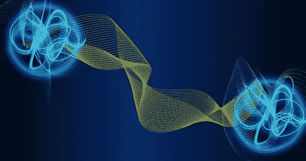

# 超越二进制

> 原文：<https://towardsdatascience.com/going-beyond-binary-cdb70c18a4a4?source=collection_archive---------29----------------------->

## 了解量子计算的世界⚛


图片由[格特·奥特曼](https://pixabay.com/users/geralt-9301/?utm_source=link-attribution&amp;utm_medium=referral&amp;utm_campaign=image&amp;utm_content=3871216)提供，来自 [Pixabay](https://pixabay.com/?utm_source=link-attribution&amp;utm_medium=referral&amp;utm_campaign=image&amp;utm_content=3871216)

# 什么是量子计算？

让我们考虑一台经典的计算机，它的每一位都处于两种状态之一，T0 或 T1，通常被认为是 T2 或 T3。一个*量子*比特，更好的说法是一个 ***量子比特*** ，相当于量子计算机。量子位具有一些非常独特和有趣的性质，这使得量子计算成为计算机中最有趣的领域之一。

## 叠加

与比特不同，量子比特可以处于`1`或`0`或*的状态，在*之间的任何地方🤯！很疯狂，不是吗？这是由于被称为 ***叠加*** 的量子粒子的能力，其中这些粒子不是具有单个*定义的*状态，比如 1 或 0，而是具有成为`1`或`0`的*。*

*当一个量子位处于叠加态时，测量它的值，然后 ***将量子位从它的无限可能状态*** 坍缩到众所周知的状态`0`和`1`。然后，它保持在该状态，直到复位。*

**

*[MuonRay](https://www.blogger.com/profile/03712859045968965104) 来自[博客](http://muonray.blogspot.com/2014/09/overview-of-quantum-entanglement.html)*

## *纠缠*

*可以说，量子计算最有趣的现象是两个或更多的量子比特能够成为相互纠缠的*。**

**在这样的系统中，任何一个纠缠粒子的状态都不能独立于其他粒子的量子状态来描述。这意味着无论您对一个粒子应用什么操作或过程，都会与其他粒子相关联。例如，如果你测量一个粒子并坍缩，那么其他粒子也会坍缩。**

> **好吧，所以它们是基于概率的。但是我们能改变这些概率吗？**

**是啊！它遵循一个叫做 ***的量子干涉过程。*****

## **量子干涉**

**量子位元以这种或那种方式坍缩(即坍缩为 0 或 1)的可能性是由量子干涉决定的。干涉会影响一个量子位的状态，从而影响测量过程中某个结果的概率，而这个概率状态正是量子计算的强大之处。**

> **所以我有点掌握它的窍门了…但是我实际上是如何编码的呢？我需要量子计算机吗？**

**一点也不！微软发布了一个 [***量子开发套件*** *(QDK)*](https://docs.microsoft.com/en-us/azure/quantum/overview-what-is-qsharp-and-qdk) ，这是一套工具，允许我们*在我们的桌面上模拟量子环境*！**

# **量子环境中的编码**

****

**照片由[路易斯·戈麦斯](https://www.pexels.com/@luis-gomes-166706?utm_content=attributionCopyText&utm_medium=referral&utm_source=pexels)从 [Pexels](https://www.pexels.com/photo/black-and-gray-laptop-computer-546819/?utm_content=attributionCopyText&utm_medium=referral&utm_source=pexels) 拍摄**

**虽然我们通常需要下载 QDK 进行开发，但在 Jupyter 环境中测试是最容易的，微软为此专门发布了一个 IPython 内核。**

**虽然这里也解释了所有的 Jupyter 代码，但我鼓励你去 [***这个 DeepNote 项目***](https://deepnote.com/project/Quantum-Computing-Q-YrKZTUadQuCIe1GiyZG24A/%2FQuantumComputing%2FQuantumComputing.ipynb) ，复制它并运行它，因为它包含额外的注释和代码练习。解决了这个问题，让我们开始吧。**

## **QSharp 基础知识**

**在一篇文章中解释完整的 Q#语言超出了我的能力范围，但是，让我们看看一般的语法来了解这种语言。**

**在下面的代码块中，使用`open`命令，一些依赖项被导入到文件中。遵循的命名约定非常类似于 C#。**

**这些用于整个 Jupyter 笔记本**

**现在我们可以看看在 Q#中创建函数和变量的语法。在 Q#中，变量是不可变的，这意味着在初始化之后，它们不能被重新赋值，除非被指定为可变的。创建它们的语法类似于您在 javaScript 中看到的，使用了`let`关键字。**

```
**let varName = varValue;**
```

**注意，变量的数据类型不是在初始化时指定的，而是从给定的`varValue`中自动推断出来的。**

**可变变量(值*可以*改变的变量)可以使用`mutable`关键字初始化，并使用`set`关键字重新赋值。**

```
**mutable varName = varValue;
set varName = anotherValue;**
```

**另一个重要的 Q#特性是操作，它相当于其他语言中的函数。操作将特定的数据类型作为输入来返回输出。操作的语法是~**

```
**operation OpName(input1: DType, input2: DType): ReturnDType {
    // body of the operation
    return retVal;
}**
```

> **注意，没有返回值的函数的`ReturnDType`是`Unit`，相当于 C#或 C/C++中的`void`。要了解更多关于 Q#数据类型的信息，请查阅微软官方文档。**

**下面是一个基本 Hello World 操作的代码，使用 Q#中的`[Message](https://docs.microsoft.com/en-us/qsharp/api/qsharp/microsoft.quantum.intrinsic.message)`函数，它大致相当于 Python 中的`print`、C#中的`Console.Write`和 C++中的`std::cout`。**

**由于 Q#是一种运行在量子计算机上的语言，执行操作的方式有点不同。我们不是直接执行，而是运行一个 IPYNB magic 命令— `[%simulate](https://docs.microsoft.com/en-us/qsharp/api/iqsharp-magic/simulate)`，后跟模拟操作的名称。**

**该消息打印在标准输出中**

**Q#支持基本的数据类型`Int`、`Float`等等，以及它们上面的操作符。下面是 Q#中的一个基本加法函数。**

**为了模拟我们的操作，我们需要在操作名称后输入`key=value`格式的参数，如下所示。**

**3 + 5 = 8，对吗？**

## **Q#中的量子测量**

**如上所述，量子位(更好的说法是量子位)是量子计算机的基本存储单位。这里有一个程序分配一个量子位并返回它的测量值。
返回 Q#中一个量子位的测量值的函数是 [M 操作](https://docs.microsoft.com/en-us/qsharp/api/qsharp/microsoft.quantum.intrinsic.m) `[M(Qubit) => Result](https://docs.microsoft.com/en-us/qsharp/api/qsharp/microsoft.quantum.intrinsic.m)`，其中`Result`是一个内置的数据类型，它给出了`One`或`Zero`。**

**用于创建和测量量子位的代码**

**运行这个程序给了我们`0`的输出，因为量子位在分配后*总是*处于零的初始化状态。**

**初始化的量子位总是具有 0 的测量值**

## **Q#中的叠加**

**叠加态是量子粒子的唯一状态，其值是无限概率的组合。
回想一下，在叠加态下测量一个量子位会将它折叠成两个二进制值中的一个。
一个特殊的*量子比特门*将一个量子粒子置于叠加态，在 Q#中，就是 [H(哈达玛的简称)](https://docs.microsoft.com/en-us/qsharp/api/qsharp/microsoft.quantum.intrinsic.h) `[H(Qubit) => Unit](https://docs.microsoft.com/en-us/qsharp/api/qsharp/microsoft.quantum.intrinsic.h)`。**

> **注意，H 变换返回`Unit`，因为它只是就地改变量子位的状态。**

## **随机数发生器**

**这意味着我们可以用量子位制造一个[真随机数发生器(RNG)](https://en.wikipedia.org/wiki/Random_number_generation) ！这里面的步骤会是~**

*   **分配量子位**
*   **将量子位叠加**
*   **测量量子位并返回其值。**

> **请注意，为了能够重复使用，量子位需要在每次测量后重置。为此，我们使用测量和复位的组合操作，即`[MResetZ](https://docs.microsoft.com/en-us/qsharp/api/qsharp/microsoft.quantum.measurement.mresetz)`。**
> 
> **此外，我还创建了一个助手函数`RunNTimes`，它将任意一个函数`Unit => Result`和一个数字`n`作为输入，并运行该函数 n 次。**

**用于创建一位数随机数生成器的代码**

**用`n = 100`运行`nQRNG`,得到如下结果~**

**我们得到几乎等量的 1 和 0，证实了随机性**

# **结论**

****

**照片由[安娜·阿兰特斯](https://www.pexels.com/@ana-arantes-1457565?utm_content=attributionCopyText&utm_medium=referral&utm_source=pexels)从[派克斯](https://www.pexels.com/photo/photo-of-end-signage-3006228/?utm_content=attributionCopyText&utm_medium=referral&utm_source=pexels)拍摄**

**我们完了！本教程的目的是以一种不需要任何数学资格的方式唤起人们对量子计算的兴趣，此外还为读者提供了使用 Q#和 QDK 迈出量子计算第一步的工具。如果你还没有 ***我真的鼓励你*** [***看看这里的 Jupyter 笔记本***](https://deepnote.com/project/Quantum-Computing-Q-YrKZTUadQuCIe1GiyZG24A/%2FQuantumComputing%2FQuantumComputing.ipynb) 因为那会给你一些 Q#的实践经验。**

**为了继续你的量子计算专业知识之旅，我鼓励你查阅微软文档中的以下资源。**

**学习数学的工具**

*   **[用于量子计算的线性代数](https://docs.microsoft.com/en-us/azure/quantum/overview-algebra-for-quantum-computing)**
*   **[向量和矩阵](https://docs.microsoft.com/en-us/azure/quantum/concepts-vectors-and-matrices)**
*   **[量子位](https://docs.microsoft.com/en-us/azure/quantum/concepts-the-qubit)**

**此外,[量子卡式](https://github.com/microsoft/QuantumKatas)是开始 Q#和量子计算之旅的绝佳方式。**

**你可以通过 [Linkedin](https://www.linkedin.com/in/dweep-joshipura/) 、 [Email](mailto:dweepjoshipuracar@gmail.com) 或 [Github](https://github.com/djthegr8) 联系我！**

**我希望你喜欢这个教程，并拥有美好的一天！**