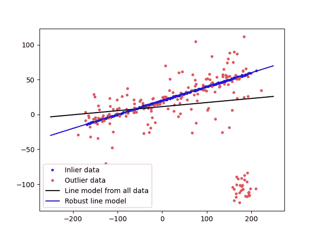
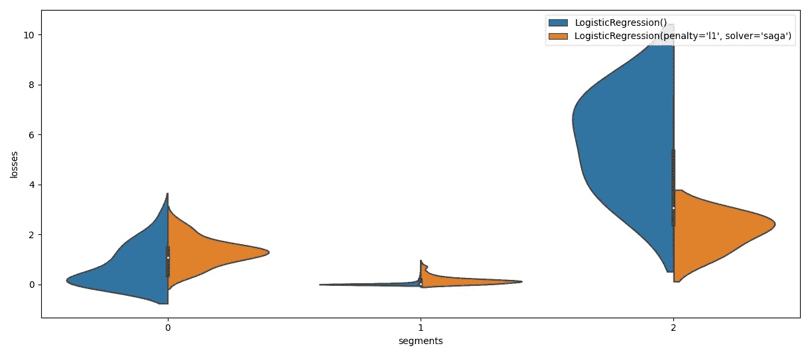
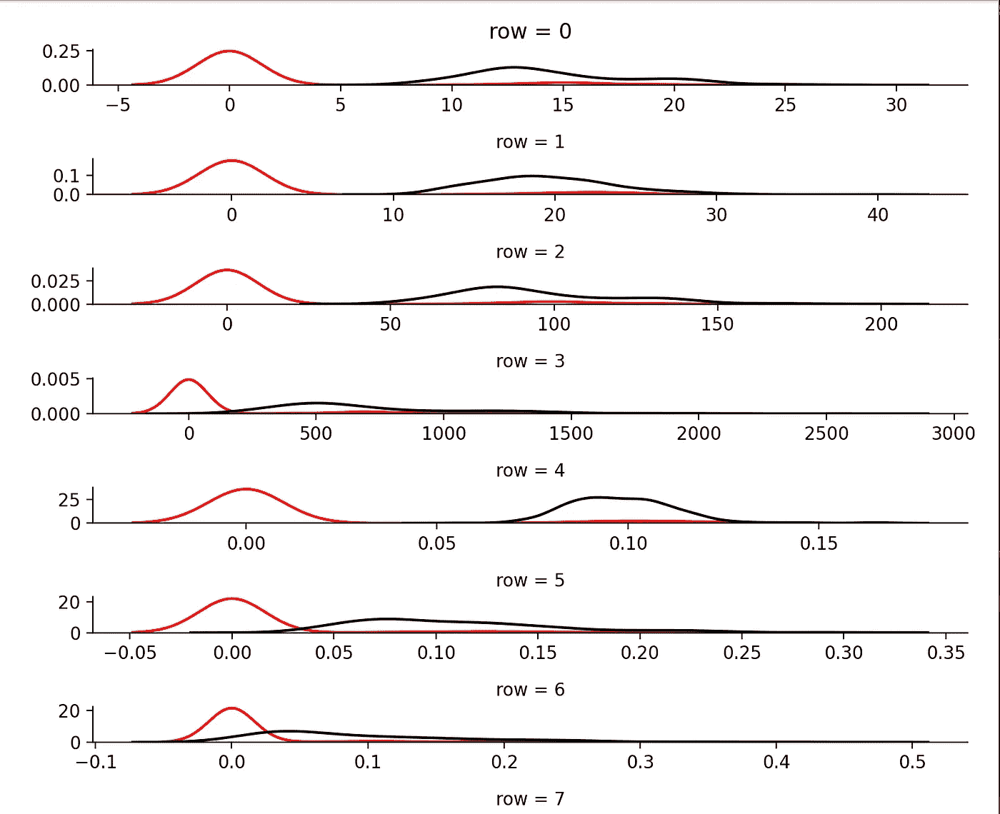
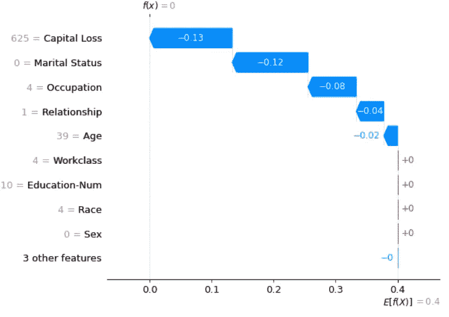
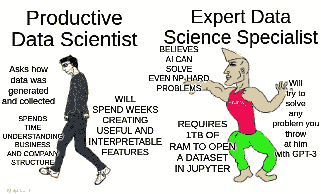

# 超越 ML 系统的简单误差分析

> 原文：<https://towardsdatascience.com/going-beyond-simple-error-analysis-of-ml-systems-9218f9602d33?source=collection_archive---------41----------------------->

## [行业笔记](https://towardsdatascience.com/tagged/notes-from-industry)

## 在部署机器学习算法时，赌注比任何玩具问题或竞争都要高得多。

*原载于 2021 年 7 月 26 日*[*https://alexandruburlacu . github . io*](https://alexandruburlacu.github.io/posts/2021-07-26-ml-error-analysis)*。*

# 首先，有一个故事…

想象你自己是一名 ML 工程师…非常酷，我的朋友！

首先恭喜你，拍拍自己的背，你的家人一定很骄傲。

第二，根据公司规模、文化和机器学习团队的成熟度，你很可能会在许多计算机科学和软件工程领域中漫游。

再次，拍拍自己的背。现在，让我们进入正题。

作为 MLE，你的部分工作是挑选、调整和部署 ML 模型。我相信我不需要向你解释这不是那么微不足道的。你一定相信这个过程的难点是调模型吧？或者可能是算法的部署？虽然这些确实很重要，尤其是后一个，但这里有个问题*给你:*

> **您如何确保生产出高质量的模型？**

如果你要告诉我，你刚刚在一个保留的数据集上测试了你的模型，你选择的度量标准是精度或均方差之类的东西，那就运行吧。很快。很远。如果你没有跑，准备好被质疑你是否:

*   有一个基线，
*   平衡数据集或调整指标，
*   使用保留的数据集进行调整/超参数搜索…等等。


*这么多问题……制作人:imgflip.com*

我想你现在已经明白，简单的训练/测试分割和一些误差指标，比如准确度或者甚至 F1*，都不足以回答问题。但是什么样的*才够呢？嗯，视情况而定，就像软件工程中的所有事情一样。您需要理解，将您的模型特征减少到只有一个或几个标量将会丢失太多关于模型的信息。*

**F1 成绩是更好的选择，btw*

# …然后是至理名言

**更像个人战争故事*

> 免责声明，这是一个很长的帖子，所以也许泡些茶/咖啡，吃点零食，你知道，一些帮助你度过整个事情的东西。也许记笔记会帮助你保持专注。在阅读大量的技术文本时，它无疑会对我有所帮助。

另一个小小的免责声明:我有一个与这个主题无关的旧帖子，但是它的焦点是可解释性/可解释性方法。在这篇博客文章中，我更多地关注如何评估机器学习模型的错误。如果你认为这些主题彼此非常接近，有些重叠，你是对的。为了更好地评估一个模型，我们有时需要理解它进行预测的“推理”。

请记住——根据您应用机器学习的领域，一个不合格的模型可以是任何东西，从您的用户的一点烦恼到放大偏见并使您的客户逃离您的企业的完整垃圾箱火灾。虽然上述用户可能很容易选择退出前者，但后者可能会毁了你的业务。我们不想那样。你的雇主肯定不知道。

好的，收到。但是你*怎么知道*一个机器学习模型是好的呢？需要了解它的预测吗？你的用例中有你最关心的特定用户群吗？这些问题可以帮助您获得一个评估策略，从而确保在您部署一个 ML 模型之后不会出现任何问题。

你知道吗，让我先定义几个 ML 评估成熟度等级。对我来说解释起来更容易，对你来说也更容易理解。现在，不要为一些更高级的术语的含义而烦恼，我将在本节之后解释它们。

*   **0 级(L0)** :有一个训练+测试分割和一两个通用指标，比如 MSE 或准确性。在这个层次上，不建议部署 ML 模型(最好理解为:不负责任)。
*   **第 1 级(L1)** :前一级，但是如果可能的话使用交叉验证，或者最坏的情况，有一个大而多样的测试集。对于分类问题，您需要每个类的度量，对于回归问题，您需要多个度量。对于分类用例，ROC-AUC 得分或 F1 得分等指标比准确性好得多，因此使用这些指标。此外，了解您的模型的精度和召回特性对于成功的 ML 产品至关重要。在回归的情况下，[MAPE+RMSE+调整后的 R](https://medium.com/analytics-vidhya/mae-mse-rmse-coefficient-of-determination-adjusted-r-squared-which-metric-is-better-cd0326a5697e) 是一个很好的组合，你也可以考虑用 [AIC 和/或 BIC](https://stats.stackexchange.com/questions/577/is-there-any-reason-to-prefer-the-aic-or-bic-over-the-other) 。对于回归，尝试至少有一个对异常值稳健的度量标准( [MAPE 对某些类型的异常值稳健，但对其他类型的异常值不稳健](https://www.h2o.ai/blog/regression-metrics-guide))。
*   **Level 1.1 (L1.1)** :检查大多数错误预测，即预测可信度高，但预测错误的条目。它可以帮助你发现错误模式，甚至可能是偏见。
*   **第 2 级(L2)** :使用反事实和输入值随机变化的扰动分析。通常，这种方法允许理解每个条目的特性重要性，但这更像是您必须努力才能获得的额外收获。
*   **2.1 级(l 2.1)**:[ICE/PDP](https://scikit-learn.org/stable/modules/partial_dependence.html)/[ALE](https://christophm.github.io/interpretable-ml-book/ale.html)图可用于更好地理解特性重要性。请记住，这些对计算能力的要求相当高。
*   **2.2 级(L2.2)** :在批准部署模型之前，替代局部解释(通常是石灰)和/或附加特征解释(即 SHAP)以理解模型预测。也需要大量计算。
*   **三级(L3)** :基于群组的模型检验。定义群组的一种方法是通过[流形](https://github.com/uber/manifold)式的错误分组。在这个层次上，重要的是要认识到数据分布的变化，如果适用的话，要对不同时期的数据进行评估。请相信我，有时特性和/或标签分布会发生变化，即使在您不希望它们发生变化的领域。不考虑这一点会让你感到头疼。
*   **(可选)第四级(L4)** :对抗性实例检查。像主播和 TCAV 这样的东西也在这个水平。原则上，任何其他高级的模型可解释性/可解释性或安全审计都在这个级别。


*异能等级。不要做 L0。制造厂商:imgflip.com*

当在测试版中发布一个模型时，你会希望处于第 1 级，当它处于生产阶段时，你会希望处于第 2 级，然后从第 2 级发展到第 3 级。级别 4 更具体，并不是每个用例都需要它。也许你正在内部使用你的 ML 算法，一些恶意代理试图欺骗你的风险很低，在这种情况下，我怀疑你需要检查你的模型的行为，但使用你自己的判断。

注意，虽然我提到了回归用例，但是我省略了很多关于时间序列预测的信息。这是故意这样做的，因为这个话题很大，而且这个帖子已经读了很久了。但是如果你对这里发生的事情有一个基本的了解，你可以把不同的时间序列分析工具映射到这些层次上。

# 方法

让我们粗略地将评估/错误分析方法分为三大类:(1)度量，(2)分组，和(3)解释。度量是显而易见的。分组可能是最抽象的。我们把训练/测试分割、交叉验证、输入数据群组和错误分组放在这里…哦，上帝…组(没有双关的意思)。最后，在解释的保护伞下，还有诸如代理本地解释、特征重要性，甚至分析最错误的预测等等。

## 韵律学

我不会深入探讨基于指标的评估，但会提到，根据您的用例，您可能希望考虑与预测错误程度相关的非线性指标。也许你可以接受一点错误，但是如果模型是非常错误的，或者经常错误，你会想要更多的惩罚它。或者，相反，随着错误预测的增多，或者模型的总损失不断增加，您希望您的指标具有类似于对数的行为，即随着模型错误的增多，指标将减弱其增长。

此外，关于对异常值稳健的度量，如果您事先做了一些异常值消除，有时这些是很好的。或者可能有必要，在你不能或者特别是不去除异常值的情况下，不管出于什么原因。记住这一点。



*离群值对模型拟合度的影响。来源:*[](https://scikit-image.org)

*通常，在生产场景中，您会想要在不同的群组上评估您的模型性能，甚至可能基于这些群组来使用不同的模型。群组是指一组实体，具有特定的分组标准，如年龄段，或基于位置，或其他。*

## *分组*

*我在上一段提到了群组，所以继续跟进是有意义的。团队很重要，因为你的利益相关者对这些感兴趣，有时你也是，但是企业通常是团队的头号“粉丝”。为什么？嗯，可能有很多原因。也许他们对为特殊的客户群体提供一流的服务特别感兴趣，或者也许他们必须遵守一些法规，这些法规要求他们为所有用户提供特定级别的性能。*

*此外，如果是真实世界的数据，您的数据集肯定是有偏差的。也就是说，对于每个类别/类别组，您将会有代表性不足的类别、各种不平衡，甚至不同的要素分布。例如，对于任何企业来说，给北美地区以外的用户提供低于标准的推荐，或者预测某个有色人种是某种类人猿是不合适的。*

*我们需要根据一些特征创建群组，并跟踪我们的机器学习系统在这些方面的表现。通常你会发现，那些意识到自己团队的团队会为不同的用户群部署不同的模型，以确保为每个人提供高质量的服务。*

*但是分组不仅仅是基于输入数据特征的群组。有时对于模型分析来说，根据错误创建分组是有意义的。根据误差分布进行某种分组。也许对于某些输入，你的模型给出的误差很低，对于其他输入，误差很高，而对于另一组，误差分布完全不同。为了发现和理解这些，你可以使用 K-Means 来聚集你的损失，并找出你的模型失败或表现不佳的原因。这就是优步的流形所做的，这真是太棒了！*

****

**(上)3 组误差分布，以及 2 个模型之间的*比较*。(底部)一旦我们有了错误组，我们就想知道为什么会发生这些错误。可视化这两个集群之间的特征分布差异会有所帮助。
来源:作者。灵感来源:*[*http://manifold.mlvis.io/*](http://manifold.mlvis.io/)*。**

*最后，分组也是关于你如何将你的数据安排到训练和测试分割中。或者更多的分割，比如模型训练过程中的评估。这些有助于注意模型何时开始过度拟合或其他情况。请记住，在进行超参数搜索时应特别小心。对于快速训练的模型，一种叫做[嵌套交叉验证](https://weina.me/nested-cross-validation/)的技术是一种非常好的方法，可以确保模型真的很好。嵌套部分是必要的，因为进行超参数优化(HPO)时，您是在评估集上进行优化，所以至少可以说您的结果是“乐观的”。进行额外的分割可以让你对最终模型有一个更公正的评估。慢模式呢？哦，博伊。试着拥有一个足够大的数据集，这样你就可以在所有的评估/测试阶段进行大的划分。你也没有这个？你听说过人工智能的需求层次吗？*

*此外，一个经常被忽视的问题是数据集的目标分布。它可能严重不平衡，因此，在对其进行训练/验证/测试分割取样时，应特别小心。这就是为什么你应该总是寻找一种方法让你的分割*分层*(见 scikit-learn 的`StratifiedKFold`，还有`train_test_split`有一个`stratify=`参数，对于多输出数据集检查`multioutput_crossvalidation`包)。当数据集不平衡时，你可以尝试做一些过采样，比如 la SMOTE 或 ADASYN，但根据我的经验，这可能并不总是有效，所以只需实验(这是一个类似 scikit-learn 的库`[imbalanced-learn](https://imbalanced-learn.org/stable/index.html)`)。*

## *解释*

> **免责声明#2，这篇博文的这一部分可能是最令人震惊的部分之一。关于 ML 可解释性/可解释性有相当多的文献，我将只简要地提到一些方法，为了更深入的概述，请查看 Christoph Molnar 的* [*【可解释机器学习】*](https://christophm.github.io/interpretable-ml-book/) *。**

*这个类别非常抽象，有些人可能会认为这些与模型评估没有真正的联系，而是 ML 可解释性/可解释性。我说这些方法可以揭露隐藏的错误和偏见。基于这些，现在你可以选择一个模型而不是另一个，因此解释对于评估是有用的。这些工具在识别“**正确答案—错误方法**”场景方面表现出色，这些场景将在没有任何问题指标和分组的情况下通过。*

*那么，关于一个模型，你能“解读”出哪些可以帮助你评估它的东西呢？首先，如果您的模型/API 允许，您可以检查特性的重要性。您可能会发现一个模型对一些模糊的特性或者没有意义的特性给予了过多的关注。此时，你应该成为一名侦探，并找出为什么会这样。这种特征重要性被称为 ***全局特征重要性*** ，因为它是在模型级别从所有训练数据中推断出来的。*

*接下来容易做的是 ***扰动分析*** ，其中有多个类别。扰动分析意味着改变输入，看看会发生什么。我们可以出于不同的目的改变输入，以评估模型的不同方面。*

*   *反事实，又名“如果我改变这一个特征，我的模型预测会如何改变？”。例如，我们可以检查模型对变化的敏感程度，原则上这些变化会直观地改变预测。一个突出的工具是 Tensorboard 的假设工具。*
*   *对立的例子，又名“我能创建这样的输入吗，虽然与正常输入相似，但会导致混乱的预测”。检查这些对于面向外部用户的系统来说通常很重要，在这些系统中，攻击可能会产生非常恶劣的后果，而且因为这种验证更加具体，所以通常会留到项目的后期进行。*
*   *为了评估模型对不重要的变化有多稳健，或者它捕捉“常识性”有多好，随机改变也可以用于局部特征重要性。在情感分析问题的情况下，一个随机的改变可能是用同义词替换没有积极或消极语义的词，也就是中性词。*
*   *非分布数据。好吧，这不是真正的扰动分析，但有时你想确保模型可以推广到相似但不完全相似的数据。或者你可能只是想让[在工作中找点乐子](https://www.youtube.com/watch?v=yneJIxOdMX4)，然后把德语句子传给一个在西班牙语文本上训练过的情感分析模型。*

*另一种帮助您发现错误模式的方法是检查模型可信度非常高的错误预测。简单来说，皇家混蛋。我学这个方法比较晚，是从 Goodfellow 等人的深度学习书上学的，我很懒，这个方法虽然事后看来很明显，但对我来说是新的。我更喜欢做扰动分析，这样就不需要漂亮的打印和/或绘图了。但是当我在做我的研究项目时，我现在“强迫”我自己(其实也没那么糟糕)也做这一步。*

*我建议定义一些由以前有问题的输入例子组成的回归测试套件。这有助于确保 ML 模型的未来版本确实是对以前版本的改进。在它可以检查以前错误分类的条目或使用不同类型的扰动分析的例子。稍后，您将会感谢这个回归套件。*

*替代本地解释，其中最突出的工具是石灰，是另一种可解释性工具。代理本地解释试图用简单的机器学习模型来逼近复杂的机器学习模型，但仅针对输入数据的子集，或者可能仅针对单个实例。*

*最后(现在是肯定的)，另一个值得注意的 ML 可解释性方法是附加特征解释，对于这一类别，最突出的工具之一是 SHAP。SHAP 尤其有趣，尽管更难理解，因为它基于博弈论，并使用匀称的值来定义局部特征的重要性。这种方法的一个问题是 Shapely 值或几乎任何其他附加特征解释方法都没有考虑特征交互，这可能是一个交易破坏者。*

**

**SHAP 用沙普利值来解释每个特征值对预测的影响。来源:作者。**

*还有更先进的工具，专门针对神经网络进行调整。这些使用不同形式的显著性或激活图。像这样的工具很酷，也很有用，但是很难使用，而且不够通用。试图涵盖其中的一个子集将需要[一整本书](https://christophm.github.io/interpretable-ml-book/)，所以如果你感兴趣，你知道该怎么做；).在这本书里，你可以找到更多关于现代工具的详细解释，比如 SHAP、莱姆、锚，还有更经典的方法，比如 PDP、ICE 和 ALE 图。甚至像 [Tensorflow 的 TCAV 工具](https://github.com/tensorflow/tcav)这样的概念识别方法。*

*要记住的一点是，可解释性工具对于正确的模型评估是至关重要的。虽然不是直接的映射，但是您可以将这些解释方法用于像代码评审这样的模型。在生产系统中，你不会在没有代码审查的情况下合并代码，不是吗？*

# *个人推荐*

*我们已经接近这篇文章的结尾了，所以我想给你一些建议，告诉你当评估 ML 模型时，如果那些成熟度级别还不够的话，该如何进行。这些建议更低级、更实用，如果你愿意的话，还有些问题。*

*   *当然，从几个合适的评估指标开始。不要只用一个。如果可以的话，交叉验证。如果做 HPO，有两个测试分裂。对于分类，我会推荐至少一些损失和一些得分函数+ scikit-learn 的`classification_report`,如果你没有大量的类，混淆矩阵是你的朋友。有些人使用 AUC 和精确召回曲线，这很好，但我不习惯这些。也许在这篇博文之后，我会开始使用它们。(照我说的做，不要照我做的做)*
*   *在这之后，我通常做扰动分析(随机和反事实)。寻找前 k 个最错误的预测是有帮助的，但我很少这样做(照我说的做，不照我做，#2)。*
*   *如果我还不满意，我肯定会检查错误组，比如流形和/或代理本地解释(类似于 LIME，我主要使用`eli5`包)。我不喜欢后一种方法，因为这需要花费大量的时间，尤其是对于较大的输入。关于代理模型的局部解释，有时我发现使用缺省值来调整代理可能太简单了。我做 NLP，所以这两点对我来说都是一个真正的问题。*

*有时，尤其是在开发的早期阶段，我可以对模型预测进行一种“探索性测试”，即输入非分布数据，看看会发生什么。*

*对于个人实验，我有时可以使用 SHAP，但我发现它有点令人沮丧，很难导出图形，而且它在 Jupyter 上工作时效果最好。此外，它很慢，但这是所有代理解释的普遍问题。*

*我还没有玩转锚、对立的例子，以及做类似“找到与不同类最相似的条目”或“找到与这个类最相似的条目”的事情。后两者可以在特征、嵌入和/或预测空间中使用 kNN 来完成。微软数据科学家似乎在问这类问题来评估他们的模型。***

*最后，我确信这些信息会让你不知所措。这就是为什么我能给出的最好的建议是使用一个简单的模型，一个容易理解的模型。为了提高性能，你也可以尝试在有意义的特性上投入时间。总而言之，做你的公司需要你成为的数据科学家就好，而不是你想成为的那种。无聊理性战胜炒作驱动。*

**

*明智地选择你的英雄。制造商:imgflip.com*

*可能这个帖子，没有其他的，帮助我结晶了很多多年来获得的隐性知识。也许你听过这句名言——“一个人教，两个人学”，我相信这里也发生过类似的事情。*

*我知道我的帖子通常又长又密，对不起，我想，但另一方面，现在你不必书签 5-10 页，只需这一页😀😀😀jk。无论如何，感谢你坚持不懈地阅读这篇文章，如果你想留下一些反馈或只是有一个问题，请留下评论。估计要过一段时间才能下次了。*

```
 *vvvvvvvvvvvvvvvvvvvvvvvvvvvvvvvvvvvvvvvvvvvvvvvvvvvvvvvvvvvvvvvvv
> Until then, you can play around                                 <
> with most of the methods described in this blog post            <
> by checking the link below                                      <
> [https://github.com/AlexandruBurlacu/error_analysis_code_samples](https://github.com/AlexandruBurlacu/error_analysis_code_samples) <
  ^^^^^^^^^^^^^^^^^^^^^^^^^^^^^^^^^^^^^^^^^^^^^^^^^^^^^^^^^^^^^^^*
```

*[你也可以点击这里。](https://github.com/AlexandruBurlacu/error_analysis_code_samples)所有的例子都是种子，所以应该可以重现一切。玩得开心。*

# *承认*

*特别感谢 [@dgaponcic](https://twitter.com/dgaponcic) 的风格检查和内容审核，再次感谢 [@anisoara_ionela](https://twitter.com/anisoara_ionela) 的彻底语法检查，感谢 [@dianaartiom](https://twitter.com/dianaartiom) 对 ML 的最后一点反馈。你们都是最棒的❤*

# *几个参考*

*   *[回归指标的详细概述](http://people.duke.edu/~rnau/compare.htm)*
*   *[Christoph Molnar 的可解释机器学习](https://christophm.github.io/interpretable-ml-book/)；惊人的工作，大量的信息，大量的细节*
*   *** [色域纸](https://github.com/AlexandruBurlacu/alexandruburlacu.github.io/blob/main/_data/ml_debugging/19_gamut_chi.pdf)帮助您提出关于型号的正确问题*
*   *[汇纸](https://github.com/AlexandruBurlacu/alexandruburlacu.github.io/blob/main/_data/ml_debugging/1808.00196.pdf)和[汇 GitHub 回购](https://github.com/uber/manifold)*
*   *[很好地概述了如何评估和选择 ML 模型](https://neptune.ai/blog/the-ultimate-guide-to-evaluation-and-selection-of-models-in-machine-learning)*

*Github repos，其中也包含各自论文的链接:*

*   *[LIME GitHub 回购](https://github.com/marcotcr/lime)*
*   *[SHAP GitHub 回购](https://github.com/slundberg/shap)*
*   *[主播 GitHub 回购](https://github.com/marcotcr/anchor)*
*   *还有一个[棒极了的 GitHub repo](https://github.com/altamiracorp/awesome-xai#critiques) 关于不同的 XAI 工具和论文。*