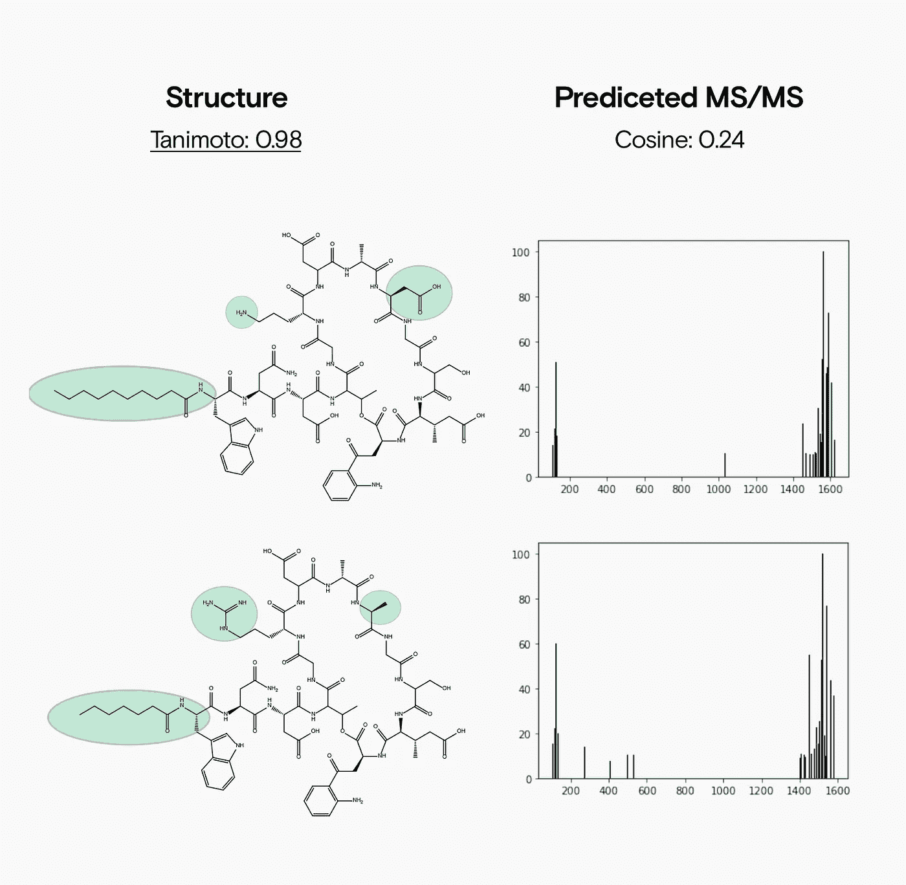
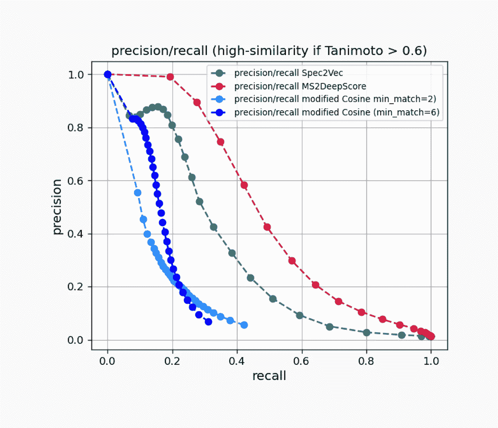

# 利用 MS2DeepScore 超越光谱相似性

> 原文：<https://towardsdatascience.com/going-beyond-spectral-similarity-with-ms2deepscore-ef0f923428e6?source=collection_archive---------36----------------------->

## 使用深度学习模型直接从 MS/MS 谱图预测结构相似性。

来源:作者

光谱相似性得分通常被用作结构相似性的代表。但是在很多情况下，两者有很大的不同。这可能会对库比较的结果产生疑问。Florian 和他的团队建立了一个深度学习模型，成功地直接从串联质谱预测了结构相似性。

# 光谱比较是每个代谢组学工作流程的一部分

将质谱测量结果与库测量结果进行比较是任何代谢组学分析流程中的关键步骤。你需要可靠的光谱比较，

*   **识别您的化合物**:在参考库中搜索与您的碎片模式相匹配的化合物。
*   **寻找类似物**:通过相似的裂解模式寻找结构相关的化合物。
*   **帮助结构解析**:将你的分子与一个分子类别联系起来，以缩小潜在的分配范围。

对于串联质谱，通常通过计算它们之间的余弦值来比较质谱。高余弦值表明两种化合物的裂解曲线重叠良好。

你可能认为高余弦值与高结构相似性相关。不幸的是，余弦分数只能告诉你光谱的**相似度。但是当你想要注释你的化合物时，你会对**结构相似感兴趣。这是一个至关重要的区别。****

# 光谱和结构的相似性:苹果和橘子

让我们来看看不同之处:

1.  **光谱相似度**，例如余弦相似度，测量两个质谱图之间的重叠。
2.  **结构相似度，**与 Tanimoto 评分一样，使用分子结构的 2D 向量表示法来量化两个**分子指纹**的重叠。

光谱相似性可能与结构相似性显著不同。这可能会让你从图书馆搜索中得出错误的结论。让我们看看这会对你的工作产生怎样的影响。

以抗生素达托霉素(上图)和一种假设的类似物(下图)为例:

来源:作者

达托霉素(上图)和它的类似物(下图)改变了裂解模式，尽管总体上彼此非常相似。余弦分数比较将给出较低的分数，并且不能检测出它们是高度相似的结构。

*   **高结构相似性:**类似物(下图)的结构仍与其未修饰形式达托霉素(上图)高度相似。
*   **低光谱相似性:**类似物中的修饰携带到许多碎片中，并使许多质谱峰发生位移。结果，几乎没有重叠的峰保留下来，因此光谱相似性得分较低。

这意味着，如果你的样品中含有达托霉素类似物，你将**不会**从文库或类似物搜索中找到，即使你在文库中有达托霉素参比光谱！

这意味着如果你仅仅依靠余弦相似性，

*   你不能确定余弦值最高的匹配真的是最好的结构匹配。
*   您的库可能包含相近的结构匹配，但您看不到它，因为匹配的光谱相似性得分非常低。

然而，Florian Huber 和他的团队找到了一种直接从串联质谱预测结构相似性的方法。

# MS2DeepScore 如何从串联质谱预测结构相似性

MS2DeepScore 可以预测化合物何时是密切相关的结构类似物，即使其他比较方法，如余弦相似性，可能会失败。

Florian Huber 和他的团队使用来自 15，000 多种独特化合物的 100，000 多种光谱训练了 MS2DeepScore。一旦经过训练，MS2DeepScore 模型就可以直接从两种化合物各自的 MS/MS 图谱中预测它们之间的 Tanimoto 相似性得分。

使用它所学到的知识，MS2DeepScore 在关联结构相似的化合物方面始终优于余弦相似度和 Spec2Vec，即使当化合物的碎片图谱发生变化时。重要的是，用于比较得分准确性的化合物不包括在 MS2DeepScore 训练数据集中。

MS2DeepScore 在精度与召回率方面优于余弦得分和 Spec2Vec。来源:作者

在我们的实施例中，达托霉素和类似物之间的余弦值仅为 0.24。由此，我们可以假设这些化合物在结构上并不紧密。但 MS2DeepScore 模型预测的谷本得分为 0.95，非常接近实际的谷本得分 0.98。

# 使用 MS2DeepScore

开始使用 MS2DeepScore 很简单，您可以在几分钟内开始用它比较光谱。

无论用什么乐器采集，都可以使用 MS2DeepScore。MS2DeepScore 与 [matchms 模块](https://blog.esciencecenter.nl/build-your-own-mass-spectrometry-analysis-pipeline-in-python-using-matchms-part-i-d96c718c68ee)一起工作，因此您可以选择几个开源数据类型，如。mgf，。mzxml 和. mzml。

Florian 和他的团队将 MS2DeepScore 设计成一个包含 Jupyter 笔记本教程的 [python 包](https://github.com/matchms/ms2deepscore)来帮助您入门。你可以使用[模型](https://zenodo.org/record/4699356)开始比较你的光谱，该模型已经在[的 15，000 种化合物](https://zenodo.org/record/4699300)的 109，000 个光谱上进行了预训练。要了解更多关于 MS2DeepScore 及其开发的信息，请务必查看[预印本出版物](https://doi.org/10.1101/2021.04.18.440324)。

# MS2DeepScore 的下一步是什么？

我们正在构建利用 MS2DeepScore 进行库匹配的新方法，包括一个 API、一个易于使用的界面和持续更新的模型。

这个新版本将提供，

*   在超过 230，000 个光谱上训练的新模型；
*   图书馆与 GNPS 公共数据库的匹配；
*   一种新的否定模式比较。

如果您想试用它，请不要犹豫[联系我们](https://www.datarevenue.com/en-contact)获得测试版访问。