# 争取金牌:使用广义线性模型预测奥运会奖牌结果

> 原文：<https://towardsdatascience.com/going-for-gold-predicting-medal-outcomes-in-the-olympics-using-generalized-linear-modeling-e6e9d4837ae8?source=collection_archive---------11----------------------->

## 我们能建立一个运动员赢得奖牌几率的广义线性模型吗？


凯尔·迪亚斯在 [Unsplash](https://unsplash.com/s/photos/olympics?utm_source=unsplash&utm_medium=referral&utm_content=creditCopyText) 上的照片

和许多人一样，我一直在家里享受东京奥运会。作为一名数据科学家，在观看一些网球比赛时，我摆弄了一个关于奥运选手的 [Kaggle 数据集，列出了他们的年龄、性别和国籍等特征，以及每个运动员获得的奖牌(如果有的话)，并想看看我能否基于这些特征建立一个运动员赢得奖牌几率的广义线性模型。](https://www.kaggle.com/heesoo37/120-years-of-olympic-history-athletes-and-results)

# 动机

根据年龄、身高和国籍等相关特征，我们能否预测某个运动员在奥运会上赢得奖牌的可能性？

# 资料组

我们将使用从雅典 1896 年到里约 2016 年的夏季和冬季奥运会的综合数据集。对每位运动员的以下特征进行测量:

*   ID(每个运动员的唯一标识符，以说明重复的姓名)
*   名字
*   性别(F 代表女性，M 代表男性)
*   年龄
*   高度(厘米)
*   重量(千克)
*   组
*   NOC——由国家奥林匹克委员会为每个国家制定的三个字母的代码(例如，USA:美利坚合众国)
*   游戏(例如，2008 年夏季，2010 年冬季)
*   年
*   季节(夏季或冬季)
*   城市(如东京)
*   运动(如网球)
*   项目(如网球女子单打)
*   奖牌(金、银、铜、钠)

# 初始数据探索

首先，让我们加载数据集:

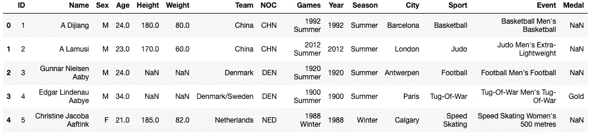

作者图片

让我们看看哪个国家积累的金牌最多:

```
USA    1131
URS     471
GER     319
GBR     289
FRA     264
       ... 
HAI       1
FIJ       1
PER       1
HKG       1
SYR       1
Name: NOC, Length: 109, dtype: int64
```

我们看到美国获得了最多的金牌，截至 2016 年，共有 1131 枚奖牌，这是有道理的，因为它自 1896 年成立以来一直参加奥运会。

让我们看看美国在哪个运动项目上赢得了最多的奖牌:

```
Athletics                    344
Swimming                     246
Shooting                      54
Wrestling                     52
Boxing                        50
Diving                        48
Gymnastics                    35
Rowing                        33
Speed Skating                 29
Basketball                    23
Tennis                        21
Sailing                       19
Weightlifting                 16
Cycling                       16
Alpine Skiing                 16
Figure Skating                15
Archery                       14
Equestrianism                 11
Snowboarding                  10
Freestyle Skiing               8
Bobsleigh                      7
Beach Volleyball               6
Synchronized Swimming          5
Canoeing                       5
Short Track Speed Skating      4
Fencing                        4
Football                       4
Art Competitions               4
Skeleton                       3
Golf                           3
Softball                       3
Ice Hockey                     3
Water Polo                     3
Rugby                          3
Volleyball                     3
Judo                           2
Taekwondo                      2
Nordic Combined                1
Jeu De Paume                   1
Baseball                       1
Triathlon                      1
Roque                          1
Tug-Of-War                     1
Polo                           1
Name: Sport, dtype: int64
```

因此，看起来美国以 344 枚金牌在田径项目上独占鳌头，其次是游泳项目，有 246 枚金牌。但是，我需要注意的是，截至 2016 年里约奥运会，田径项目的实际金牌数为 [335 枚。截至 2018 年，当这些数据汇总在一起时，大多数剩余的运动项目都有正确的统计数据，然而，在过去如何计算奖牌方面存在一些轻微的差异。例如，在击剑比赛中，数据显示美国获得了 4 枚奖牌，但一些消息来源却报道了 3 枚。这是由于 1904 年国际奥委会将美国人艾伯特森·范·佐·波斯特算作代表古巴而不是美国的](https://www.nbcsports.com/northwest/tokyo-olympics/us-olympic-medal-records-history-our-countrys-biggest-wins)[差异](https://en.wikipedia.org/wiki/Fencing_at_the_1904_Summer_Olympics)T5 造成的。在该数据集中，假设美国人表示。我推测，在奥运会早期的田径比赛中也有类似的争议，这可以解释略高的数字，所以我鼓励读者在得出结论之前，与官方的奥运资料进行交叉验证，以自己对这个数据集的分析。尽管如此，上面这些统计数据大部分都是正确的，比如游泳和网球。

我们可以根据运动发生的季节来划分运动项目:冬天或夏天。既然田径和游泳是夏季项目，让我们来看看美国在哪个冬季项目中获得了最多的金牌:

```
Speed Skating                29
Alpine Skiing                16
Figure Skating               14
Snowboarding                 10
Freestyle Skiing              8
Short Track Speed Skating     4
Skeleton                      3
Ice Hockey                    3
Nordic Combined               1
Name: Sport, dtype: int64
```

美国以 29 枚奖牌获得了最多的速滑金牌，但似乎夏天才是美国真正闪光的地方。让我们看看哪个国家在冬奥会上赢得了最多的金牌。

```
NOR    111
USA     96
GER     86
URS     77
CAN     62
AUT     59
SUI     50
SWE     50
RUS     49
FIN     42
GDR     39
ITA     37
NED     37
FRA     31
KOR     26
CHN     12
FRG     11
GBR     11
JPN     10
EUN      9
CZE      7
BLR      6
AUS      6
POL      6
CRO      4
EST      4
SVK      2
SLO      2
UKR      2
LIE      2
TCH      2
ESP      1
KAZ      1
IND      1
BEL      1
NEP      1
UZB      1
BUL      1
Name: NOC, dtype: int64
```

挪威也没有 NOC 代码，根据该数据集，挪威在冬季奥运会上以 111 枚金牌领先。然而，截至 2014 年索契冬奥会(这是该数据集中最近的一次冬季奥运会)，官方统计数据为 118 次，其中缺少了一些 1992 年和 1994 年的数据。然而，像田径运动一样，这并不是一个巨大的偏差。

然后我们可以看到挪威在冬季奥运会上占主导地位的运动:

```
Cross Country Skiing    33
Speed Skating           25
Biathlon                15
Nordic Combined         13
Alpine Skiing           10
Ski Jumping              9
Figure Skating           3
Freestyle Skiing         2
Curling                  1
Name: Sport, dtype: int64
```

因此，越野滑雪是挪威的强项，共获得 33 枚金牌。

我们可以使用熊猫的`crosstab`函数来可视化这些奖牌分布

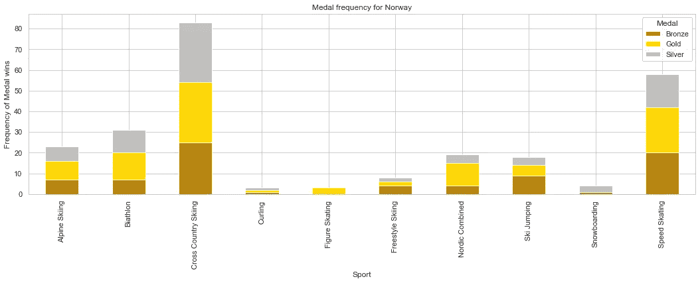

作者图片

与美国相比

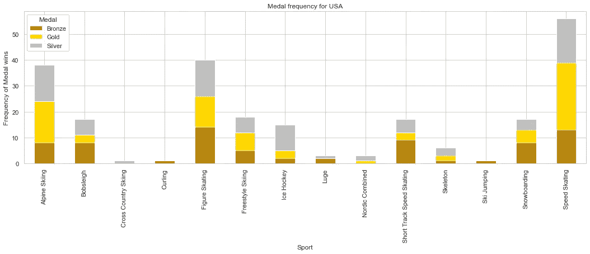

作者图片

请注意，并不是每一项冬季运动都有代表，因为美国并没有在每一项冬季运动中获得奖牌。例如，冬季两项没有出现，不像在挪威的图表中也有一些运动没有出现。

# 广义线性建模

现在我们已经做了一些基本的汇总统计，让我们看看我们是否可以建立一个模型来预测单个运动员(而不是一支球队/国家)赢得奖牌的机会。有各种方法可以做到这一点，如训练神经网络，但在本文中，我们将重点放在广义线性模型(GLM)。

回想一下，线性回归通过一些解释变量 *X* 的线性组合，对一个连续变量 *y* ~ N( *μ* ， *σ* )进行建模。例如，我们可以根据运动员的身高和性别预测他们的体重，如下所示

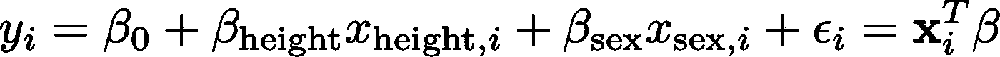

其中 *β* 是第 *i* 名运动员的每个特征的系数——在这种情况下，是身高和性别——而 *ϵ* 是残差的误差项。这可以更概括地描述为:

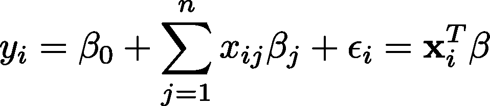

关于线性回归的更深入的讨论，见[这里](https://medium.com/nerd-for-tech/hypothesis-testing-on-linear-regression-c2a1799ba964)和[这里](https://medium.com/analytics-vidhya/understanding-the-linear-regression-808c1f6941c0)。

像这样的线性回归模型满足三个关键属性:

1.  它们有一个随机成分*y*——我们的因变量——遵循正态分布。
2.  如上所述定义的线性预测器，通常称为 *η*
3.  将线性预测器连接到均值的链接函数 *g* 在线性模型的情况下， *g* 是恒等链接函数 g，因此*g(ηᵢ*)=*ηᵢ=**μᵢ*。

现在假设我们想预测自奥运会以来每个国家获得的奖牌数。因为我们的 *y* 变量统计的是奖牌数，它是一个离散变量，违背了线性回归中使用的正态分布下连续变量的假设。在这种情况下，更合适的模型是泊松回归模型。这是一个广义线性模型(GLM)的例子。

广义线性模型在某种意义上是广义的，尽管在它的根部仍然有一个线性模型，但是随机分量 *y* 可以是分布的[指数族](https://people.eecs.berkeley.edu/~jordan/courses/260-spring10/other-readings/chapter8.pdf)的任何成员(例如，正态、伽玛、泊松等)，并且链接函数可以是任何函数，只要它是平滑且可逆的。

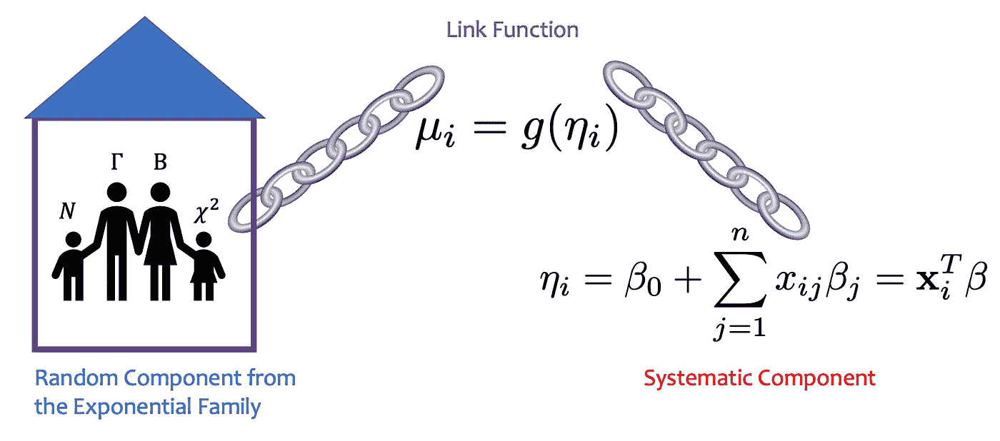

作者图片

假设我们想模拟一名运动员是否获得了奖牌:铜牌、银牌或金牌。因为这是一个二元结果，我们的响应变量 *y* 应该遵循伯努利分布 *y* ~ Bin(1 *，p* )=Ber( *p* )，我们的线性预测器的链接函数定义如下:

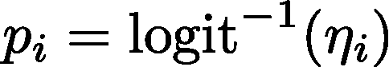

在哪里

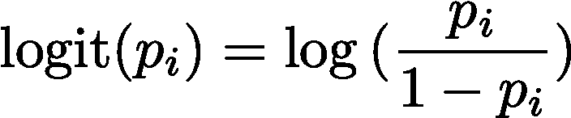

逆 logit 函数称为逻辑函数，它基于线性预测值对赢得奖牌的概率进行建模。由于通常 *n* = 1(因此我们得到 *μᵢ* = *pᵢ* )，这个模型被称为逻辑回归。

我们将以游泳为例，展示具有物流链接功能的 GLM:

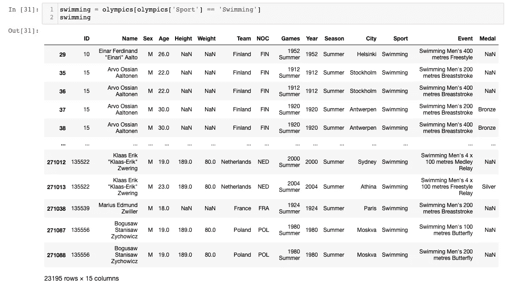

请注意，有几个身高和体重条目是 NaNs，因此我们将删除这些条目以及年龄，以便更好地衡量:

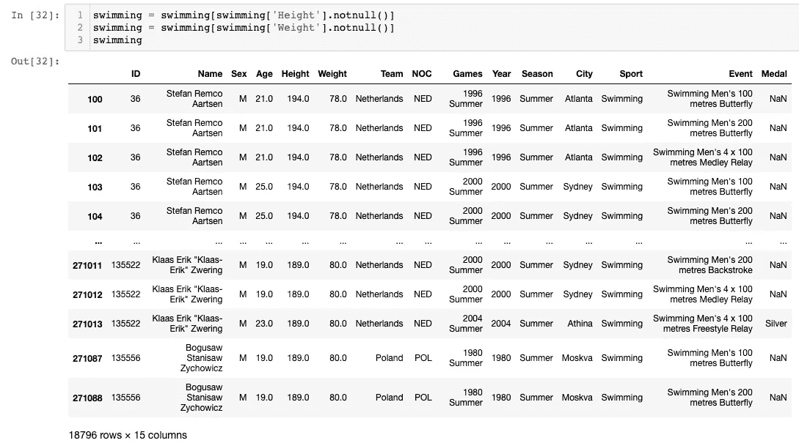

我们还将我们的响应变量 Medal 建模为 0 代表北美，1 代表金牌、银牌或铜牌

最后，我们将性别编码为 0 代表男性，1 代表女性:

现在我们准备好构建我们的模型了。我们将使用`statsmodels`和`patsy` 包，您可以使用 pip 来安装它们。`statsmodels`包含了我们将需要来适应我们的 GLM 的函数，而`patsy`是一个用户友好的库，用于构建我们可以使用以前的包来适应的统计模型。让我们从一些简单的事情开始，建立年龄和奖牌结果之间的关系模型。我们将首先安装软件包并运行以下代码:

```
pip install statsmodels
pip install patsy
```

运行此代码，我们获得以下输出:

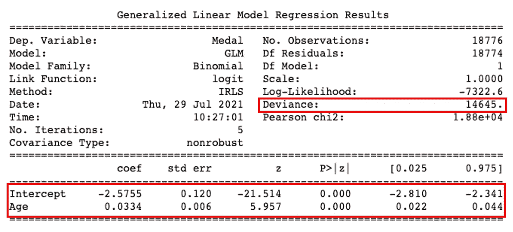

作者图片

这个输出包含很多内容，但是我希望您关注的主要内容是两行，截距和年龄，以及偏差。对于前两行中的每一行，它们都列出了该参数的估计系数β、标准误差、z 得分、表示模型中该预测值显著性的 p 值以及估计系数β的置信区间。

偏差是对[残差平方和](https://www.statisticshowto.com/residual-sum-squares/)的概括，它量化了 GLMs 的拟合优度。理想情况下，我们希望这个度量小于 *n-p* ，其中 *n* 是观察值的数量(18776)，而 *p* 是我们模型中的参数数量(2)。因此我们的偏差是 14645<18776–2 = 18774。因此，模型通过了拟合优度测试，但让我们尝试将其可视化。`statsmodels`没有用于 GLMs 的直观绘图库，但我们可以使用`matplotlib`绘图库轻松地对其进行编码，绘制拟合概率与年龄的关系。

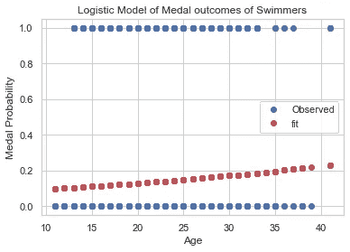

作者图片

这并没有真正给我们一个很好的拟合，这是有道理的，因为年龄不一定与性能的增长率相关联。让我们尝试添加额外的特征，比如身高、体重和性别。

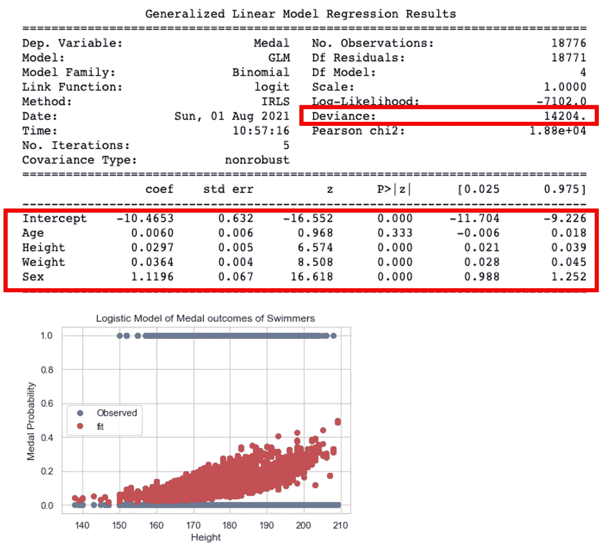

根据高度绘图，我们获得了稍微好一点的拟合，正如偏差从 14645 下降到 14202 所证明的那样，但它仍然不能有效地给我们的数据一个稳健的拟合。年龄不是一个具有高 p 值的重要预测因素，这在我们的年龄模型中并不令人惊讶。

回想一下，美国的第二大运动是游泳，所以我们可以将美国作为一个解释变量。与该数据集中的性别二进制分类(不包括任何非二进制运动员)不同，国家(NOC)是一个跨越两个以上类别的分类变量，因此我们需要以这样一种方式修改它，即我们有一个列来指定某个运动员是否代表美国。`pandas`有一个函数`get_dummies()`，它创建一个虚拟变量，将输入列的每个分类变量二进制化。

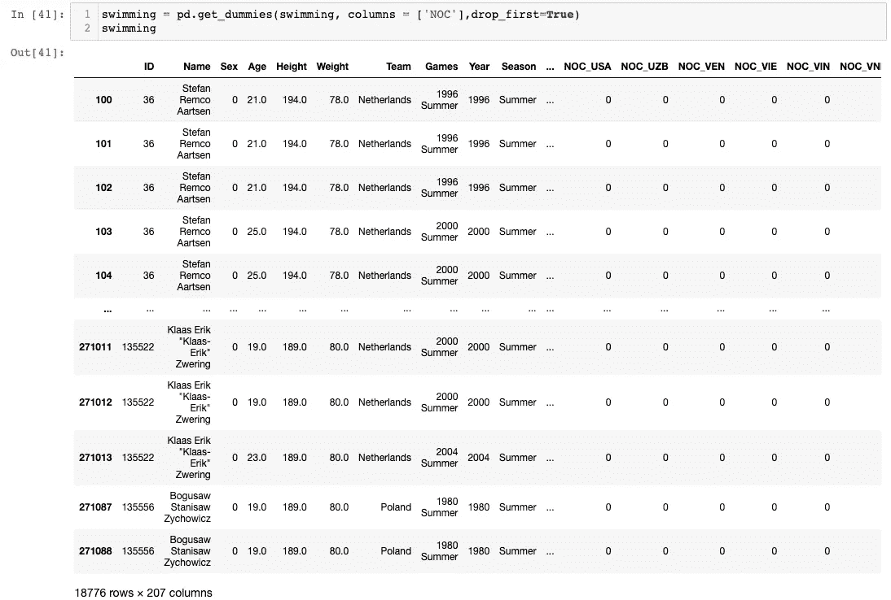

作者图片

这将删除 NOC 列，取而代之的是为每个国家添加二进制列，以“NOC_”为前缀，表示某个运动员是否代表该国。因此，“NOC_USA”告诉我们一名参赛运动员是否代表美国，而“NOC_CAN”告诉我们一名运动员是否代表加拿大。

现在让我们将这个新变量添加到我们的模型中，看看它是否能更好地拟合我们的游泳数据。我们将删除年龄，因为它的表现不佳，并再次按高度绘图。


这给了我们一个比以前的模型更好的拟合，从 14202 年到 11922 年偏差的显著下降也可以看出这一点。鉴于美国在游泳方面的声誉，根据数据，成为美国人会增加一个人成功的机会是有道理的。如果我们建立 0.6 或 0.7 的截止概率作为决定奖牌结果的阈值，我们将获得非常接近二进制数据的拟合。

# 结论

在本文中，我们学习了 GLMs，使用一个综合的奥运会数据集作为逻辑回归的例子，以及一些数据格式化/清理技术。虽然 GLMs 是统计建模的强大工具，但它们也有缺点。如果数据集包含大量要素，则可能会过度拟合模型或遇到性能计算瓶颈，具体取决于数据集的大小。此外，还有其他不在该数据集中的特征可以改进我们的模型，例如在非奥运场馆的运动表现(例如网球的温布尔登)。还有其他可能更有效的数据建模方法，如支持向量机或神经网络。最后，对于像这样的历史数据集，很可能会因为有争议的视图而导致缺失值或错误，因此当您从该数据集和类似数据集得出结论时，请记住这一点。

我希望你喜欢这篇文章。我鼓励你自己尝试这个数据集并进行分析。请在下面的评论中告诉我你的经历，或者如果你有任何问题。编码快乐！