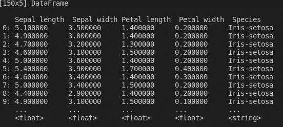
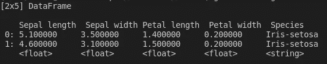
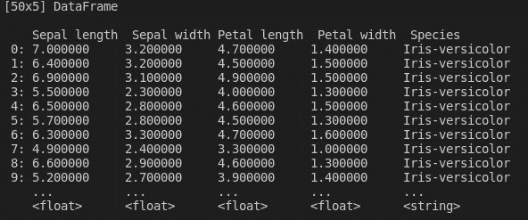
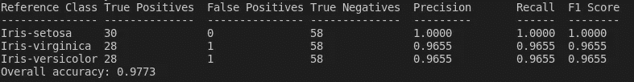

# 用于机器学习的 Golang？

> 原文：<https://towardsdatascience.com/golang-for-machine-learning-bd4bb84594ee?source=collection_archive---------2----------------------->

## 意见

## Golang 是建立机器学习管道的未来吗？让我们试着建一个。

Go 或 Golang 是 Google 在 2007 年设计的，在语法上与 C 类似，但具有内存安全、垃圾收集和结构类型。除了其惊人的快速性能之外，与 Python 不同，Go 允许简单的并发，就像在 C++或 Java 中一样。并发性允许多个程序或算法(包括 ML 的那些)异步执行，而不影响最终结果。


照片由 [Fotis Fotopoulos](https://unsplash.com/@ffstop?utm_source=medium&utm_medium=referral) 在 [Unsplash](https://unsplash.com?utm_source=medium&utm_medium=referral) 上拍摄

考虑到这一点，我计划比较使用 Golang 构建一个简单的 ML 管道的优缺点。我将同时使用 Python 作为参考点。此外，我将提供我个人对这种语言的总体看法，并评估 Go 在 AI/ML 社区中是否有前途。所以，让我们开始吧。

**注意:**在我们继续之前，这篇文章不会介绍如何在你的机器上安装和设置 Go。如果您还没有这样做，请遵循这些全面的[说明](https://golang.org/doc/install)。

**目录:**

1.  设置
2.  数据帧
3.  数据操作
4.  围棋中的机器学习

# 设置

首先，我们需要在我们的终端中安装以下软件包。

1.  安装 **DataFrame** 和 **GoNum** 包及其依赖项。DataFrame 和 GoNum 类似于 Python 的 NumPy，通常用于操作 DataFrame 对象。

```
$ go get -u github.com/kniren/gota/dataframe
$ go get -u github.com/gonum/matrix
$ go get -u gonum.org/v1/gonum/...
```

2.安装 [**GoLearn**](https://github.com/sjwhitworth/golearn/wiki/Installation) 包。GoLearn 是 GoLang 中的一个机器学习库，类似于 Python 的 sklearn。它允许简单的矩阵操作、ML 算法的构造、模型拟合，甚至用于训练/评估过程的数据分割。

```
$ g++ --version # make sure you have a G++ compiler$ go get github.com/gonum/blas$ go get -t -u -v github.com/sjwhitworth/golearn
$ cd $GOPATH/src/github.com/sjwhitworth/golearn
$ go get -t -u -v ./...
```

既然困难的部分已经过去，让我们进行更有趣的部分吧！

# 数据帧

我们将使用描述不同类型鸢尾花的鸢尾数据集。您可以通过在终端中运行以下命令来获取 IRIS 数据集:

```
$ wget [https://raw.githubusercontent.com/sjwhitworth/golearn/master/examples/datasets/iris_headers.csv](https://raw.githubusercontent.com/sjwhitworth/golearn/master/examples/datasets/iris_headers.csv)
```

确保将。CSV 文件，位于您当前正在处理的文件夹以及您的 *main.go* 文件所在的位置。

我们需要首先将下面的包导入到我们的 *main.go* 程序文件中。

现在我们已经有了所有的导入，让我们编写 main()函数来加载 CSV 数据并很好地打印出来。

您将得到以下漂亮的数据摘要，它描述了行数(150)、属性数(5)、属性摘要(包括数据类型)以及前几行的摘要视图。



虹膜数据帧摘要(图片来自作者)

相当整洁！到目前为止，这些操作中的大部分与您在 Python 中的编码方式相似。

# 数据操作

现在让我们来探索如何在 Go 中执行数据操作。

## **1。子集化**

Python 中最简单的子集化操作之一是使用 **df.head()** 操作。我们可以在 Go 中类似地执行这个功能。

```
head := df.Subset([]int{0, 3})                       fmt.Println(head)
```

您将看到数据帧的前两行。



在 Go 中设置数据帧的子集(图片来自作者)

个人觉得操作没有 Python 中的那么啰嗦。如果事先不了解 Go 中的数据类型，您将很难理解这个函数。

## 2.**过滤**

假设现在你想探索鸢尾属物种的属性。您可以使用函数 filter()过滤行，如下所示。

```
versicolorOnly := df.Filter(dataframe.F{
    Colname:    " Species",
    Comparator: "==",
    Comparando: "Iris-versicolor"
})fmt.Println(versicolorOnly)
```

您将只检索带有鸢尾-杂色物种的行！



按物种名称过滤(图片来自作者)

您也可以将*比较器*属性与>、≥、<或≤的属性互换。

就我个人而言，我不介意语法上的变化，因为这些操作到目前为止看起来非常直观。但是这些程序的字数明显比 Python 中的长，如下图所示。

```
versicolorOnly = df[df[" Species"] == "Iris-versicolor"]
```

## 3.**列选择**

除了子集化和行过滤之外，还可以通过下面的简单操作对列进行子集化。

```
attrFiltered := df.Select([]string{"Petal length", "Sepal length"})                       fmt.Println(attrFiltered)
```

您可以找到许多其他的数据争论操作，包括连接、聚合、函数应用(回想一下。在熊猫身上应用()。)、*等。*

总的来说，我还是更喜欢 Python，但可能是因为我没有足够的围棋实践经验。然而，Go 的冗长可能会阻止我追求前者。

# 围棋中的机器学习

既然我们已经在 Go 中处理了一些数据帧，我们可以开始构建一个简单的机器学习管道。对于这个例子，让我们建立一个简单的 KNN 分类器来确定鸢尾的物种类型，给定它的属性集合(例如，花瓣长度，花瓣宽度等)。

## 0.重新加载数据

在 main()函数中，让我们重新加载 CSV 数据集。

```
fmt.Println("Load our csv data")
rawData, err := base.ParseCSVToInstances("iris_headers.csv", true)if err != nil {
    panic(err)
}
```

## 1.初始化 KNN 分类器

这里，我们从 GoLearn 的 *knn 子包* *中初始化一个新的 KnnClassifier。然后，我们将必要的属性传递给新的分类器类:使用*欧几里德*作为距离函数，*线性*作为算法核心，使用 *2* 作为选择的邻居数量。*

```
fmt.Println("Initialize our KNN classifier")
cls := knn.NewKnnClassifier("euclidean", "linear", 2)
```

## 2.培训-测试分割

像往常一样，我们执行训练/测试数据分割(各 50%)。到目前为止没有什么新奇的，一切看起来都和我们在 Python 的 sklearn 库中做的一样。

```
fmt.Println("Perform a training-test split")
trainData, testData := base.InstancesTrainTestSplit(rawData, 0.50)
```

## 3.训练分类器

任何 ML 流水线的主要部分将是分类器的训练。但是，如果你熟悉 Python 的 sklearn 包，那么 Go 中的过程即使不完全相同，也是相似的。

```
cls.Fit(trainData)
```

## 4.汇总指标

训练步骤完成后，我们可以使用保留的测试数据执行评估，并检索性能总结。

```
fmt.Println("Print our summary metrics")confusionMat, err := evaluation.GetConfusionMatrix(testData, predictions)if err != nil {
    panic(fmt.Sprintf("Error: %s",err.Error()))
}fmt.Println(evaluation.GetSummary(confusionMat))
```

如果一切顺利，您将在终端中打印出以下内容！



我们的 KNN 分类器的评估总结(图片来自作者)

不算太差！对于新训练的 KNN 分类器，我们达到了 97.73%的准确率。尝试并实现你能在 [GoLearn](https://pkg.go.dev/github.com/Soypete/golearn) 中找到的其他类型的分类器！

最后，您可以在下面的代码片段中找到完整的代码！

# **结论**

总的来说，我发现构建机器学习管道的 Go 语法足够直观。不过我发现 Go 的 ML 社区规模比 Python 的要小。这使得故障排除非常麻烦，有时甚至令人沮丧。此外，许多这些包中缺乏 GPU 支持会阻碍您的 AI 开发过程。不仅如此，不同的 ML 相关包之间似乎也很少有互操作性。例如，GoLearn 包实现了自己的 Dataframe“Instance”类，该类可能无法很好地与原生的 GoNum 类甚至 GoTA 的 data frame 对象一起工作。

尽管如此，Go 凭借其高超的速度和并发性，有可能在机器学习应用中超越 Python 但它需要有足够的数量(即临界质量)的人工智能开发人员这样做。

***做订阅我的邮件简讯:***[*【https://tinyurl.com/2npw2fnz】*](https://tinyurl.com/2npw2fnz)****在这里我定期用通俗易懂的语言和漂亮的可视化方式总结 AI 研究论文。****

# ***参考文献***

*[1][https://en . Wikipedia . org/wiki/Go _(编程 _ 语言)](https://en.wikipedia.org/wiki/Go_(programming_language))*

*[2]戈努姆:[https://github.com/gonum/gonum](https://github.com/gonum/gonum)*

*[3]戈勒恩:[https://pkg.go.dev/github.com/Soypete/golearn](https://pkg.go.dev/github.com/Soypete/golearn)*

*[4]戈塔:[https://github.com/go-gota/gota](https://github.com/go-gota/gota)*