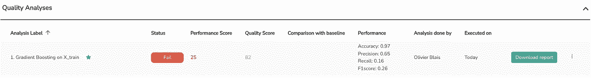

# 一个(好得多的)评估你的机器学习模型的方法

> 原文：<https://towardsdatascience.com/good-approach-to-evaluate-your-machine-learning-model-e2e1fd6aa6bb?source=collection_archive---------9----------------------->

## 使用一个或两个性能度量标准似乎足以宣称你的 ML 模型是好的——它很可能不是。

对于像我这样的数据科学家来说，使用经典的性能指标来恰当地评估 ML 模型是多么的困难。

即使可以使用[多种指标和评分方法](https://scikit-learn.org/stable/modules/model_evaluation.html)，理解我(可能还有许多其他人)面临的问题的正确指标仍然具有挑战性。这就是为什么我在大部分 ML 模型质量评估中使用飞贼 AI 的原因。在过去的两年里，我一直是开发飞贼 AI 的积极成员。

<https://snit.ch?utm_source=blogOlivier&utm_medium=referral&utm_campaign=abetterapproach>  

让我用一个例子来解释为什么选择正确的指标如此重要:使用 UC Irvine 机器学习存储库中集中的数据生成一个可以预测公司破产的模型。该数据集名为[台湾破产预测](https://archive-beta.ics.uci.edu/ml/datasets/taiwanese+bankruptcy+prediction)(由 CC 4.0 授权)，利用了《台湾经济日报》1999 年至 2009 年的破产数据。

# 问题:不平衡的数据集

您将遇到的第一个问题是数据集中的不平衡。这既是好消息，也是坏消息。好消息是只有 3.3%的公司破产了！另一方面，坏消息是数据集中的不平衡使得预测“罕见阶层”(3.3%)变得更加困难，因为我们的懒惰模型可以通过简单地预测没有破产来预测 96.7%的公司的正确命运。

作者的目标不平衡评估

您可以看到，这也是一个性能评估问题，因为大多数指标都偏向于最大的类，最终导致它们出错。为什么？预测没有破产使得我们的模型在理论上有 96.7%的准确性。这里有一个在飞贼 AI 中构建和评估的第一个模型的例子。默认情况下，该工具会计算多个相关的性能指标。正如你在下面看到的，我们的第一个模型获得了 96%的准确率。然而，当你看 F1 的分数时，[，一个不平衡班级的更好的衡量标准](https://peltarion.com/knowledge-center/documentation/evaluation-view/measure-performance-when-working-with-imbalanced-data)，我得到的分数仅仅是 26%…

作者的初始质量分析图像

那么是什么原因呢？

# 不平衡数据集的解决方案

当处理不平衡的数据时，第二步是尝试使训练数据集更加平衡。你可以通过对多数类(非破产)进行欠采样、去除随机观察或对少数类(破产)进行过采样来实现这一点。

对于过采样，您可以复制随机观测值或使用成熟的算法创建合成观测值，如*合成少数过采样技术。* SMOTE 的工作方式是选择相近的示例，在示例之间画一条线，然后在沿着这条线的一个点上画一个新的示例。

如您所见，我可以使用许多技术来增强我的模型。

有了飞贼，我可以清楚地看到我的各种实验的历史:

作者的多重质量分析图像

以下是我从上面的实验中学到的一些结论:

*   欠采样和过采样技术显著提高了 F1 分数。这是好事！
*   然而，这种性能的提高是以牺牲模型的整体质量为代价的。
*   我们的模型 4(带欠采样的梯度提升)是最好的模型，因为它的性能几乎与模型 2 一样好，但质量通常更好。

# 等等！这个“质量分”是什么？

Snitch 使用大约十几个自动质量分析来生成这个质量分数。

质量分析产生:

*   **特征贡献得分:**到检查你的模型的预测是否有偏差或者在输入变量之间公平分布。
*   **随机噪声鲁棒性分数:**检查您的模型是否对噪声数据的引入具有鲁棒性。
*   **极端噪声鲁棒性得分:**检查您的模型是否对最坏情况噪声数据的引入具有鲁棒性。

图片来自[飞贼 AI 质量分析方法论](https://help.snit.ch/article/19-quality-analysis)，2021。经允许重新发布

# 绩效评估很难

没有什么是来之不易的，绩效考核也不例外。虽然很难做到正确，但在开发模型时，性能评估需要认真对待。不是因为你有一个好的精度，你的模型才是好的。

事实是，准确性甚至可能不是一个相关的性能指标。在我们的例子中，F1 分数肯定更好，因为我们的数据集是不平衡的。这里的教训很简单。确保您验证了您选择的指标正确地衡量了您试图实现的目标。

尽管性能指标很重要(它们毕竟是关于测量你的模型预测结果有多好)，但是这些指标不能验证数据偏差或者你的模型的整体稳健性。这里的一个好的实践是专门测试其他特征，如偏差和稳健性。

我们看到，一些模型在理论上比其他模型表现更好，但实际上质量较差。我们也看到了表现不佳但质量更好的模型。最终，目标是能够比较这些信号以选择最佳方法。

请记住，一个更好的方法不应该只关注于评估您的模型的性能，它实际上需要进行深入的测试，以确保您的系统也是健壮的，以便它实际上可以处理生产中的新数据…这就是奇迹需要发生的地方！