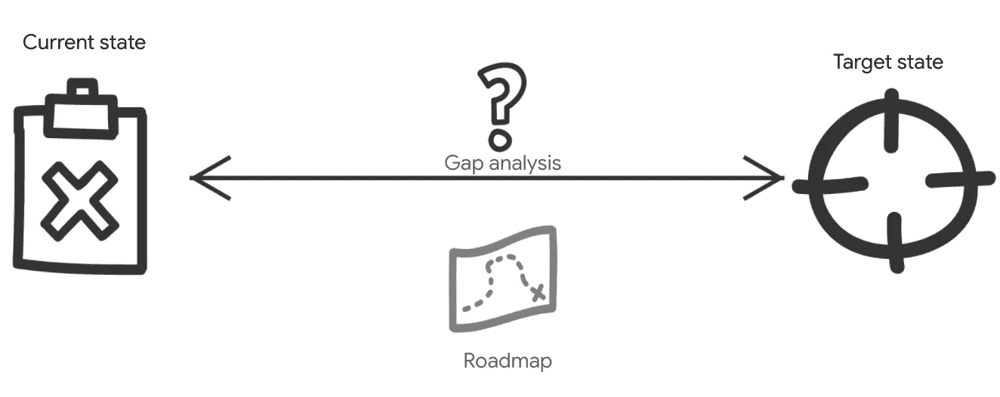
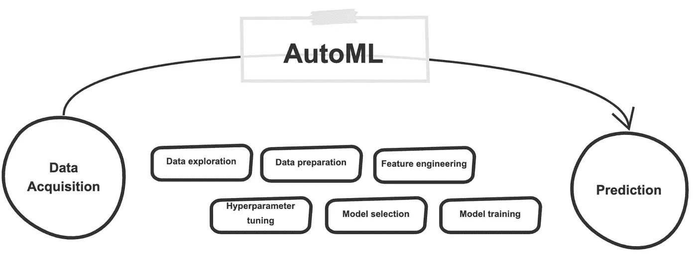
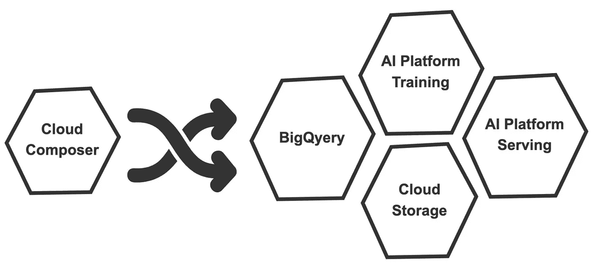
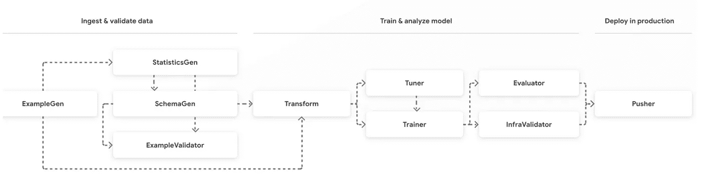

# 面向 MLOps 的谷歌云服务

> 原文：<https://towardsdatascience.com/google-cloud-services-for-mlops-d1702cd9930e?source=collection_archive---------22----------------------->

## 探索 Google 云平台上的 MLOps 选项

来自 [Pexels](https://www.pexels.com/photo/aerial-photo-of-black-spiral-staircase-929280/?utm_content=attributionCopyText&utm_medium=referral&utm_source=pexels) 的 Axel Vandenhirtz 的照片

在 [MLOps 是实践，而不是工具](https://medium.com/technoesis/mlops-is-a-practice-not-a-tool-41674c5bdad7)的故事中，我描述了 MLOps 的价值和核心组成部分。主要目标是远离特定的工具，强调人和过程。重点是**什么**(MLOps 定义)和**为什么**(考虑 m lops 的原因)。在这里，我将开始解决**如何**的问题，特别是如何使用谷歌云平台服务(以下简称 GCP 服务)来加强你的 MLOps 实践。

假设你想在机器学习中实现一个连续的交付和自动化管道。在这种情况下，有几种谷歌技术可以利用，我将区分两类:GCP 服务和人工智能管道功能。您的选择在很大程度上取决于您的环境、目标和 MLOps 成熟度。

这个故事分为三个部分:

*   MLOps 成熟度模型
*   面向 ML 工作流的 GCP 服务
*   GCP 的 MLOps 框架(人工智能平台管道)

# **m lops 成熟度模型**

您可以通过考虑您在 AI 项目中的自动化和可重复性水平来评估您的 MLOps 成熟度。本文中提出的一种方法[是定义三个级别:](https://cloud.google.com/solutions/machine-learning/mlops-continuous-delivery-and-automation-pipelines-in-machine-learning)

*   **MLOps level 0** 是人工智能计划的手动流程。
*   **MLOps 一级**带来 ML 流水线自动化。
*   **ML ops 2 级**支持所有 ML 活动的完整 CI/CD 渠道。

现在，您如何在您的组织中利用这种成熟度模型呢？首先，您需要了解您当前在 MLOps 实践方面的成熟度水平，这可以通过**成熟度评估**练习来完成。该评估将帮助您识别您在 ML 中的优势和劣势，不仅从过程的角度，而且从考虑现有的人员和工具的角度。

如果你不打算采取行动，做一个成熟度评估毫无意义。做评估的目的不是获得一个分数，而是确定你在哪里，你想去哪里。因此，下一步是确定您希望达到的目标 MLOps 水平。一旦你有了一个目标，你就可以做一个差距分析来确定你当前的状态和你的最终目标之间缺少什么。这些信息将帮助您定义实现目标的不同步骤(路线图)。

差距分析对于从人员、流程和技术角度理解如何改变您的组织至关重要。

差距分析，以确定目标状态和实现目标的路线图。

# **协调 ML 工作流程的 GCP 服务**

现在让我们假设您的 MLOps 过程已经定义，并且您最终准备好利用工具来支持您的 AI 实践。

您将寻找一个支持整个机器学习生命周期的技术解决方案，从发现和可行性到模型实验和操作化。该工具必须理想地自动化人工智能实验、模型训练和评估、模型部署和模型监控的一些或所有方面。

GCP 有多种选择来支持这一需求。通常情况下，没有放之四海而皆准的解决方案。你必须根据你的目标和现有的团队来决定。为了满足不同的需求，选择多种工具是绝对没问题的。

首先要考虑的是 [Google Cloud AutoML](https://cloud.google.com/automl) 。为什么是 AutoML？因为它将负责人工智能团队通常必须进行的许多活动。

使用 AutoML，您注入数据，它会训练一个与您试图解决的问题相关的模型。然后，您可以使用经过训练的模型，并将其用于在线或批量预测。AutoML 提供了一条捷径，并加速了几个典型的 ML 典型任务，如数据探索、数据准备、特征工程、模型选择、模型训练、模型评估和超参数调整。AutoML 简化了人工智能过程，并自动化了通常是 MLOps 一部分的任务。

GCP 的自动化:从数据采集到预测

Google Cloud 上 MLOps 的另一个选择是使用 GCP 服务创建一个管道。如前所述，MLOps 完全是关于人工智能任务的自动化，以支持端到端的生命周期。您可以使用完全托管的 GCP 服务来自动化数据提取、数据准备和模型训练。让我们以四个基本的 GCP 服务为例:BigQuery、云存储、AI 平台和 Cloud Composer。

您可以使用 BigQuery 进行探索性数据分析和数据准备(结构化或半结构化数据)。你可以在云存储中存储非结构化数据(图像、视频、音频)，你可以使用人工智能平台来训练回归或分类问题的模型。您可以使用 Cloud composer 来编排从开始(数据采集)到结束(服务和监控)的流程。

编排 ML 工作流程的简单 GCP 服务。

# **GCP MLOps 框架**

我刚刚介绍了一些支持基本 MLOps 流程的简单 GCP 服务选项。但是对于更高级的需求，您可能想要考虑使用 MLOps 框架。目前最受欢迎的是 Kubeflow Pipelines 和 Tensorflow Extended (TFX)。两者都是开源框架，在 GCP 上得到完全支持。

Kubeflow 是一个 Kubernetes-native 机器学习工具包。使用 [Kubeflow Pipelines](https://www.kubeflow.org/docs/components/pipelines/pipelines/) ，您可以基于容器构建和部署可移植的、可伸缩的端到端 ML 工作流。Kubeflow 最初是 Google 的一个内部项目，后来它被开源了，现在它可以在任何支持 Kubernetes 的地方运行(云和本地)。

使用 Kubeflow，第一步是使用特定的 SDK 创建管道定义。一旦定义了管道及其不同的组件，您需要创建一个 Kubeflow *实验*来运行管道。然后，各种组件被封装起来，作为工作流在 Kubernetes 集群上执行。

另一个流行的 MLOps 框架是 Tensorflow Extended (TFX)。TFX 始于 2017 年，是谷歌的一项内部计划，并迅速成为大规模端到端 ML 的首选框架，不仅在谷歌内部，而且在所有其他 Alphabet 实体中。然后在 2019 年，TFX 成为公开的开源软件。

TFX 是一个配置框架，它提供了定义、启动和监控 Tensorflow 机器学习系统的组件。TFX 库中有多个组件，您可以根据您的 MLOps 需求组装它们，以创建一个有向无环图(DAG 是您的 TFX 管道)。管道通常会混合数据接收和验证、数据转换、ML 建模、模型分析和模型服务步骤。

TFX 组件(图片来自[https://www.tensorflow.org/tfx](https://www.tensorflow.org/tfx))

如果 TFX 提供了定义管道所需的一切，那么您必须利用外部的*编排器*来运行管道。在撰写本文时，TFX 支持的 orchestrators 是 Apache Airflow、Apache Beam 和 Kubeflow。这一步非常简单，因为它主要是管道中的一个配置，您可以在其中指定想要使用哪个编排。

Kubeflow 管道和 TFX 都通过 AI 平台管道在 Google Cloud 上得到支持，因此您可以选择最适合您的 MLOps 实现的方式。

使用 AI 平台管道，您可以全面了解工作流程中的不同步骤。您还可以与其他 GCP 服务集成，例如作为数据源的云存储或 BigQuery，用于转换的数据流，或用于训练和服务模型的人工智能平台。

当需要为您的 MLOps 实践选择工具时，Google Cloud 提供了多个选项来满足从最基本到最高级的需求。

做出明智决策的一个关键驱动因素应该是您的 MLOps 成熟度。没有放之四海而皆准的方法。有时，一组简单的编排好的 GCP 服务就足够了(AutoML、BigQuery、云存储、AI 平台训练和 Cloud Composer。)但对于其他场景，支持 Kubeflow 管道和 Tensorflow Extended (TFX)的 AI 平台管道服务将是端到端 ML 工作流的更好选择。