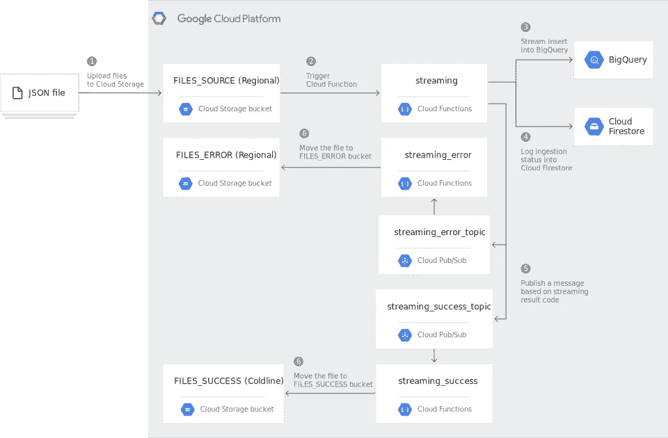
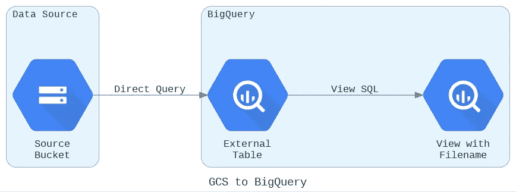

# Google 云存储(GCS)让 BigQuery 变得简单

> 原文：<https://towardsdatascience.com/google-cloud-storage-gcs-to-bigquery-the-simple-way-4bb74216b8c8?source=collection_archive---------6----------------------->

## 因为简单比复杂好(但复杂比复杂好)


谁不爱一朵简单的云。在 [Unsplash](https://unsplash.com?utm_source=medium&utm_medium=referral) 上由 [C Dustin](https://unsplash.com/@dianamia?utm_source=medium&utm_medium=referral) 拍摄的照片

我部署的第一个云功能就是为了完成这个任务。我们每天晚上都有大量 CSV 文件被放入 Google 云存储桶中，这些文件需要在 BigQuery 中进行转换和分析。

花了一些时间在谷歌上，我来到了[这个](https://cloud.google.com/architecture/streaming-data-from-cloud-storage-into-bigquery-using-cloud-functions)操作指南，它有点不同(JSON 文件而不是 CSV)，但我想我可以稍微调整一下，让它工作。毕竟，在软件和数据工程的世界里，这是一个非常普通的工作流程:找到一些*几乎*做你需要的事情，弄清楚它是如何工作的，然后调整代码来做*你需要的事情。而且成功了！我花了一整天全力以赴地工作，但最终我们有了一个正常工作的数据管道，如下所示:*



将数据从谷歌云存储传输到 BigQuery。图片来自[https://cloud . Google . com/architecture/streaming-data-from-cloud-storage-into-big query-using-cloud-functions](https://cloud.google.com/architecture/streaming-data-from-cloud-storage-into-bigquery-using-cloud-functions)

三个云存储桶，三个 Python 云函数，两个 PubSub 主题，一个 Firestore 数据库，一个 BigQuery 数据集，六杯咖啡和一只梨树上的鹧鸪，我们准备好了！总共有十种不同的云资源，所以有十个不同的地方可以检查是否有问题(在某些时候几乎总是会有问题，尽管可能不是以你期望的方式)。

快进到现在(更多的云功能被开发、调试、部署，并且大部分都被淘汰了……稍后会有更多的介绍),我的想法转向了[Python 的禅](https://github.com/python/peps/blob/master/pep-0020.txt)，特别是第 3 和第 4 点:

> 简单比复杂好。
> 
> 复杂总比复杂好。

但是复杂和复杂有什么区别呢？根据剑桥词典:

> [**复杂**](https://dictionary.cambridge.org/dictionary/english/complex) **(形容词):涉及许多不同但相关的部分**
> 
> [**复杂的**](https://dictionary.cambridge.org/dictionary/english/complicated) **(形容词):涉及很多不同的部分，以一种难以理解的方式**

现在我看看上面的架构图，它看起来并不复杂。看起来很复杂。

一定有更好的方法。

结果是有:



以简单的方式从 BigQuery 查询 GCS 数据(图片由作者使用[图](https://diagrams.mingrammer.com/)

事实证明，如果数据在云存储桶中，您根本不需要将数据流式传输或加载到 BigQuery 中，您只需要使用[外部表](https://cloud.google.com/bigquery/external-data-cloud-storage#creating_and_querying_a_permanent_external_table)的魔力。

简单吧？您只需通过 UI 或 [DDL](https://cloud.google.com/bigquery/docs/reference/standard-sql/data-definition-language) 在 BigQuery 中创建一个新表(本质上是在 BigQuery SQL 编辑器中用 SQL 执行管理任务的一种方法)。在 UI 中，您必须确保将表格类型从默认的`Native table`更改为`External table`,因为忘记这样做将导致一个静态表格，该表格不会拾取新数据。

DDL(数据定义语言)实际上非常简单，在这种情况下:

```
CREATE OR REPLACE EXTERNAL TABLE `myproject.mydataset.mytable`
OPTIONS (
  format = 'CSV',
  uris = ['gs://mybucket/*.csv']
)
```

这里重要的部分是*。因为这意味着任何出现在 bucket 中的新文件都会立即出现在 BigQuery 中。您还可以通过添加不同 URIs 的列表来聚合多个存储桶中的文件:

```
CREATE OR REPLACE EXTERNAL TABLE `myproject.mydataset.mytable`
OPTIONS (
  format = 'CSV',
  uris = ['gs://mybucket01/*.csv', 'gs://mybucket02/*.csv']
)
```

或者通过在 URI 中包含文件夹路径，从不同的子文件夹创建表:

```
CREATE OR REPLACE EXTERNAL TABLE `myproject.mydataset.mytable`
OPTIONS (
  format = 'CSV',
  uris = ['gs://mybucket/subfolder/*.csv']
)
```

甚至过滤不同文件名:

```
CREATE OR REPLACE EXTERNAL TABLE `myproject.mydataset.mytable`
OPTIONS (
  format = 'CSV',
  uris = ['gs://mybucket/filename_stem*']
)
```

然而，您*受到每个 URI 只能使用一个[通配符](https://cloud.google.com/bigquery/external-data-cloud-storage#wildcard-support)这一事实的约束，因此，如果您想将不同的文件过滤到不同的表中，并确保可以在 BigQuery 中查询新数据，不同的文件类型将需要共享一个文件名词干。*

最后一步是将文件名添加到 BigQuery 中。实际上有一个名为 _FILE_NAME 的[伪列](https://cloud.google.com/bigquery/external-data-cloud-storage#the_file_name_pseudo_column),它将原始文件名传递到外部表中，但是您必须显式地查询(并重命名)它以使其可用。最简单的方法是使用下面的 SQL 通过 UI 创建一个视图:

```
SELECT *, 
_FILE_NAME AS filename 
FROM `myproject.mydataset.mytable`
```

或通过 DDL:

```
CREATE OR REPLACE VIEW `myproject.mydataset.myview`
AS
SELECT *, 
_FILE_NAME AS filename 
FROM `myproject.mydataset.mytable`
```

厉害！

嗯，也许吧。希望这一切都完美地工作，您的实时数据是可查询的，并且您对自己构建了一个简单、轻量级、无服务器、零维护的数据“管道”感到非常满意(从技术上来说，它甚至不能称为管道，因为您实际上没有移动任何数据)。

但事情并不总是这么简单。为什么？

一个词:图式。

如果(这是一个很大的假设)模式自动检测能够完美地工作，那么这种方法就非常有效。如果您查看[文档](https://cloud.google.com/bigquery/docs/schema-detect)，您会注意到为了推断模式:

> BigQuery 通过在数据源中选择一个随机文件并扫描多达 100 行数据作为代表性样本来启动推断过程。然后，BigQuery 检查每个字段，并尝试根据样本中的值为该字段分配一种数据类型。

但是如果这 100 行不能代表所有的数据呢？如果分析的行都是有效的整数，但其他行也包含字母字符？如果 BigQuery 将类型推断为 INT64，这将导致您对数据运行的任何查询都失败，这显然不好。

我的朋友，这意味着你可能处于 BigQuery 模式管理的世界中，一个你可能会也可能不会完好无损(或神志清醒)的兔子洞。或者您可能需要使用另一种方法或外部工具来自动管理模式更改，但是您试图保持简单。你只是想让它稳定可靠地工作。一劳永逸。

> “你吃了蓝色药丸……故事结束，你在床上醒来，相信你想相信的一切。你吃红色药丸……你呆在[仙境](https://en.wikipedia.org/wiki/Alice%27s_Adventures_in_Wonderland)，我让你看看兔子洞有多深。”—墨菲斯，《黑客帝国》(1999 年)

还有一个办法，我的朋友。不吃药。

处理这种模式挑战(以及系统之间许多不同的数据类型问题)的最简单方法是:

1.  创建一个外部表，将*的所有*数据类型设置为字符串
2.  [SAFE_CAST](https://cloud.google.com/bigquery/docs/reference/standard-sql/functions-and-operators#safe_casting) 将所有字段转换为正确的数据类型

看起来很简单，对吧。

是啊，没那么简单。怎么把所有东西都设置成 string？这不是 UI 中的一个选项(但如果是就好了)。如果你有数百列呢？您真的不希望手工编写 SQL 转换代码，因为 a)这将花费很长时间，b)您几乎肯定会在某个地方犯一个(可能永远无法发现的)错误。

有很多简单的变通方法可以做到这一点，但是最好的方法——不需要外部工具，不需要通过 API 或使用 CLI 进行交互——是使用一些相对较新的 BigQuery 功能:脚本。

但那是另一天的主题…

希望这已经对一些人有所帮助，并消除了(至少一些)你未来生活中的并发症！

> 最令人满意的问题是那些当你足够认真地看待它们时就会消失的问题——我，2021

如果您觉得这(以及其他相关材料)有用和/或有趣，请跟我来！

如果您还不是会员，请[加入 Medium](https://jim-barlow.medium.com/membership),从这个活跃、充满活力和激情的数据人社区每月只需 5 美元就能获得无限的故事。也有很多其他人，但是如果你对数据感兴趣，那么这里就是你要去的地方…