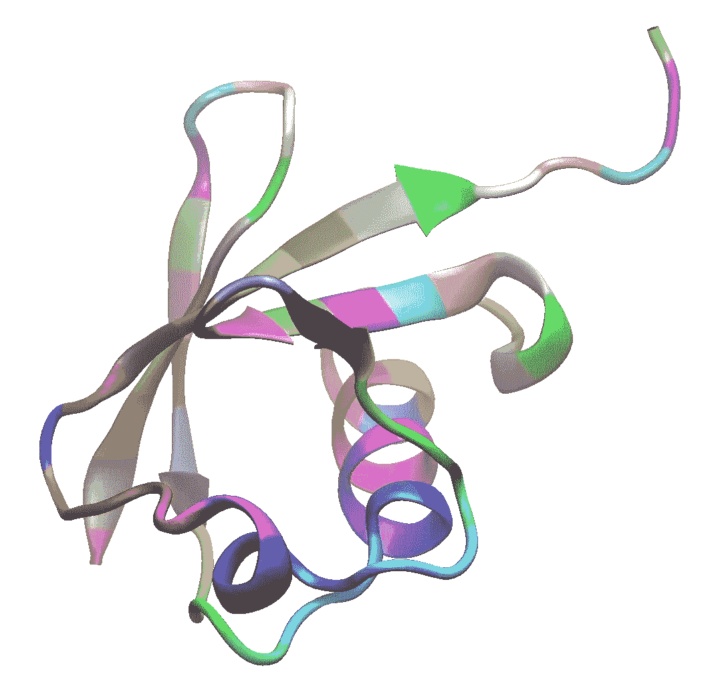
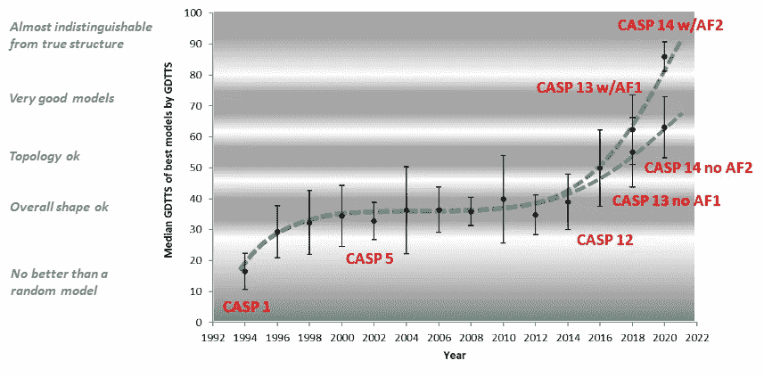
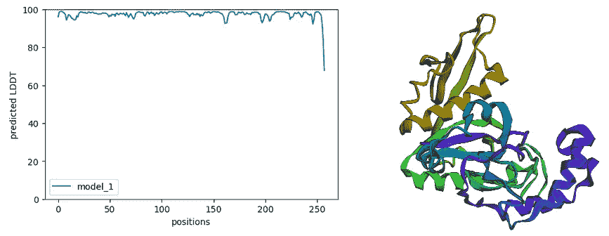

# 谷歌 colab 笔记本已经在运行 Deepmind 的 AlphaFold v. 2

> 原文：<https://towardsdatascience.com/google-colab-notebooks-are-already-running-deepminds-alphafold-v-2-92b4531ec127?source=collection_archive---------7----------------------->

## 全球数百名科学家已经从这一革命性的软件中获益。而且是免费的。


**另见我的两个涉及不同方面的后续故事:**

*   [***基于 AlphaFold 的数据库和成熟的、易于使用的在线 AlphaFold 界面为生物学带来了革命性的变化***](/alphafold-based-databases-and-fully-fledged-easy-to-use-alphafold-interfaces-poised-to-baf865c6d75e)
*   [***alpha fold 上的宣传随着这份新的预印本不断增长***](/the-hype-on-alphafold-keeps-growing-with-this-new-preprint-a8c1f21d15c8)

**上周(2021 年 7 月)，Deepmind 的同行评审学术论文发表在 *Nature* 上，描述了其预测蛋白质结构的 CASP 获奖 AlphaFold v.2 程序的所有细节。同时，他们在 Github 上发布了它所有的代码开源。在几个小时内，一些科学家创造了谷歌 Colab 笔记本，每个拥有免费谷歌账户的人都可以用自己喜欢的蛋白质运行 AF2，而无需下载其 2.2 TB 的任何一点，也不需要任何硬件。使用这些程序进行研究的 CASP 评估员的故事。**

2020 年 12 月，一个名为 [CASP](https://lucianosphere.medium.com/the-critical-assessment-of-structure-prediction-casp-over-a-quarter-century-tracking-the-state-bde0a92b3680) 的组织举办了一场预测蛋白质三维形状的“比赛”,该组织透露，Deepmind 的 AlphaFold (AF2)版本 2 以相当大的差距“赢”了亚军。许多媒体称 AF2 解决了一个 50 年的老问题。虽然这是一种夸张，但 AF2 对生物学的贡献是巨大的，有望减轻实验蛋白质结构测定的负担，并加速分子生物学的研究。尽管有这些好消息，世界各地的科学家还是引发了负面情绪，这些情绪与据称的技术不可获得性、缺乏再现性的细节以及急于知道运行 AF2 是否超出学术预算有关。但是事情已经完全不同了，而且是永久性的。

上周(2021 年 7 月)，Deepmind 的同行评审学术论文发表在 [*《自然》*](https://www.nature.com/articles/s41586-021-03819-2) 上，描述了其预测蛋白质结构的 CASP 获奖 AlphaFold v.2 程序的所有细节。与此同时，他们在 [Github](https://github.com/deepmind/alphafold) 上发布了所有的代码开源。一些科学家仍然抱怨数据文件太大(实际上有 2.2 TB)。然而，在几个小时内，一些专注的科学家创造了谷歌 Colab 笔记本电脑，每个人都可以使用免费的谷歌帐户运行 AF2，甚至不需要下载数据，也不需要任何特殊的硬件。事实上，所有的计算都发生在云上，但都在一个免费的 colab 空间内，这使得用户能够对运行进行微调。在经历了如此多的负面情绪后，所有这些都被认为是使技术大众化的最佳方式之一。感谢谷歌！

**目录**

*   [***一些背景:蛋白质结构，实验测定，以及基于计算机的蛋白质结构预测***](#7c11)
*   [***【结构预测的关键评估】(CASP***](#c1fa)***)***
*   [***用于蛋白质建模的机器学习方法，Deepmind 及其 AlphaFold 1 程序***](#1a91)
*   [***AlphaFold 版本 2***](#4110)
*   [***通过协作笔记本民主化访问 AF2 进入分子生物学新时代***](#630a)

**一些背景:蛋白质结构、实验测定和基于计算机的蛋白质结构预测**

蛋白质是生物“纳米机器”，由长的、基本上线性的氨基酸链组成，这些氨基酸链采用所谓的*结构*进行三维折叠。自然界中有 20 种氨基酸，它们在每个蛋白质中以独特的方式重复，由每个蛋白质编码基因决定。了解氨基酸序列很容易，因为这可以直接从基因组中推断出来。但是要了解它们在 3D 空间中的排列方式是很困难的。而且，每个氨基酸就像一个由几个原子组成的小分子；因此，了解蛋白质的 3D 形状或“3D 结构”需要确定其所有氨基酸的所有原子的相对位置。例如，给定由字母 A、C、D、E、F、G、H、I、K、L、M、N、P、Q、R、S、T、V、W 和 Y 表示的 20 种标准氨基酸，称为泛素的蛋白质由以下序列组成:

```
MQIFVKTLTGKTITLEVEPSDTIENVKAKIQDKEGIPPDQQRLIFAGKQLEDGRTLSDYNIQKESTLHLVLRLRGG
```

…在 3D 中折叠成这样，每个原子显示为一个通过棒与其他原子相连的球体，每个氨基酸(即上面序列中的每个字母)以不同的颜色显示:


泛素的原子结构。图片作者。

但是，请注意，我们通常通过仅显示近似 3D 形状的轨迹来简化这些图形:



代表泛素三维结构的轨迹。图片作者。

每次 AlphaFold 在聚光灯下，你可能都会看到这种类型的图纸。

了解蛋白质的三维形状在生物学和任何相关学科中都是必不可少的。仅举数百个例子中的两个，生物技术应用的酶实际上是一类特殊的蛋白质。抗生素、化疗剂和药物等绝大多数化合物的目标都是小分子，其作用依赖于识别和结合蛋白质的三维特征。

结构生物学是试图在原子水平上解释生物系统的学科。这主要取决于相关分子结构的可用性，其中最重要的通常是蛋白质。虽然许多结构可以通过实验技术确定，如 X 射线或中子衍射、核磁共振(NMR)或电子冷冻显微镜(也称为冷冻电子显微镜，cryo-EM)，但也有使用计算方法预测或“建模”这些结构的替代方法。事实上，结构生物学家长期以来的梦想是将蛋白质序列输入计算机程序，并从中获得它所采用的三维结构。这并不容易，而且还没有完全解决，但是经过几十年对这个问题的研究，机器学习模型的入侵(当然还有大量数据的可用性)导致了 AF2(以及其他几个程序，我们必须澄清)，它可以非常准确地预测许多蛋白质的 3D 结构。

自然，这种预测对于大量生物分子来说是必不可少的，这些生物分子无法在各种实验所需的数量和条件下生产。但是预测结构对于在解决结构所需的实验中可能不难生产和操纵的分子的情况也是有用的，但是对于这些分子来说，结构提供的信息量与成本和时间不相称。事实上，如果我们能够有足够的信心预测生物分子的结构，我们就可以将实验集中在特别困难的系统上(这正是结构基因组学所追求的),或者集中在研究结构扰动的影响上，比如配体与被研究蛋白质结合的影响。在极端情况下，如果我们能够在原子水平上预测一个给定系统的所有物理化学，我们就可以完全免除结构测定实验，并可以集中精力直接理解机制和这种知识允许我们做的一切:开发新的药物，设计新的酶，理解进化，…

**结构预测的关键评估(CASP)**

鉴于结构预测对结构生物学的影响，自上世纪中期以来，几代研究人员一直在研究这个问题，特别是蛋白质，因为它们比其他生物大分子具有更大的结构价值和多样性。已经开发了许多方法，这些方法可以分为两大类。一方面，那些使用已知结构试图预测相似序列或折叠的蛋白质结构，这被称为“同源建模”。另一方面，那些试图独立于与已知结构的其它蛋白质的任何同源性而“折叠”序列的方法，例如通过使用基于基本物理化学原理的模拟或通过使用关于小肽片段和/或残基接触的结构的信息。

随着结构建模的方法、程序和专家出现的大问题是如何评估这些预测的质量。在 20 世纪 90 年代早期，结构预测的关键评估，或 CASP，作为一个组织诞生，其目标是提供对预测蛋白质结构的可用方法的持续监测和评估。竞赛(实际上没人想称之为竞赛，但对许多人来说这就是竞赛！)每 2 年举行一次，在此期间，组织者收集尚未在蛋白质数据库中发表的实验结构。组织者将这些蛋白质的氨基酸序列提供给预测组，预测组在一段时间后将他们的预测发送给组织者。然后，一组独立于组织且不作为预测者参与的评估者将预测者提供的模型与只有评估者可以访问的实验结构进行比较。每场比赛都以一系列论文结束，这些论文描述了目标提出的难度，描述了预测者提供的模型的质量，生成了预测者的“官方”排名，并讨论了建模的“艺术状态”，特别是哪些方法有效，哪些结构问题特别难以预测，等等。在 2016 年和 2019 年之间，举行了 CASP12 和 CASP13，为此，该作者是竞赛主赛道的评估员，该竞赛侧重于预测困难的目标。这两个 CASP 开始揭示与共同进化技术一起应用的机器学习方法的破坏性力量，不仅出自 alpha fold 1(casp 13 的“获胜者”)之手，而且出自几个学术团体之手，这些学术团体在之前的几年中一直在为这些技术奠定基础。

想了解更多关于 CASP 的信息，请看另一个故事。要查看 CASP12 和 CASP13 论文(技术同行评审文章)，请参见我[在*分子建模和序列分析*下列出的关于蛋白质建模的出版物。](http://lucianoabriata.altervista.org/publications.html)

**蛋白质建模的机器学习方法，Deepmind 及其 AlphaFold 1 程序**

2018 年 12 月，CASP 透露，有史以来第一位私人玩家“赢了”。这是谷歌字母表小组的 Deepmind。Deepmind 的程序 AlphaFold 的第一个版本排名第一，大大高于第二名，但不是明星。此外，尽管它发明并实施了一些新的想法，但其核心主要是将学术界在过去几年中所做的事情推向极限。在关键要素中，不仅分析进入序列，还分析一系列相关序列(“序列比对”)，这些序列对应于通过略微不同的序列实现相似 3D 折叠的蛋白质。关键是，在进化过程中氨基酸会发生变化，但在空间上接近的氨基酸对必须保持一定的亲和力，从而在进化模式中引入耦合。十年来，学术界一直在分析如何从序列比对中提取这些偶联。到了 CASP12，他们开始正确地做这件事，在结构预测方面带来了小小的改进。到 CASP13 时，许多小组都在做，但一些学术小组和 AF1 也利用这一信息不仅预测了接触的氨基酸对，还预测了它们之间的距离，甚至它们的相对方向。这些中间预测然后被不同的程序使用，包括 AF1，来模拟蛋白质的三维结构。

AF1 是 CASP13 中评估的大多数蛋白质中最好的，你可能看到了媒体的大肆宣传。但它并不像 AF2 那样具有破坏性。

**AlphaFold 版本 2**

2020 年 12 月，CASP14 的结果在网上公布(由于疫情，所以我可以作为一名前评估员在那里！)表明 Deepmind 又赢了，但这一次是迄今为止实际上“解决”了**一些**(并不像你在媒体上看到的那样，只是一些)蛋白质结构预测中的关键问题。

像其他程序一样，AF1 作为一种不相连的模块工作。一个主要模块分析输入序列和比对，以预测氨基酸对之间的距离和方向，然后另一个模块使用这些距离和方向作为约束条件，将氨基酸的线性序列“折叠”成预测的 3D 结构。AF2 不是对 AF1 的调整，而是完全的重新设计，从输入到输出的一切都通过一个单一的模型，从序列到预测的 3D 结构。这意味着网络“知道”所有连接序列和结构的物理过程。细节在他们的[同行评议文章](https://www.nature.com/articles/s41586-021-03819-2)中，尤其是在它的支持信息中。在中级阶段，卡洛斯·奥特拉尔的职位是。

下面的图总结了自四分之一世纪前开始以来 CASP 取得的进展(我是在 2002 年才知道 CASP 的，当时我刚刚了解蛋白质结构！).经过多年相当差的预测能力(注意这个图只针对硬目标！)你可以看到从 CASP11 到 CASP12 的明显改进(还没有 AlphaFold)，然后是从 CASP13 的另一个跳跃，不仅是由于 AF1，而且是在整个社区，然后是 CASP14 的最新改进，学术方面也有所改进，但不如 Deepmind 那么多，它打破了质量的障碍。此外，它的预测一直很好，正如你在相当低的离差中看到的。



CASP 的时间演化。对于每个 CASP 版本，我绘制了针对所有困难目标的最佳模型的 GDTTS 中位数(+/-中位数偏差)。GDTTS 是 CASP 的主要指标之一:得分低于 30–40 的模型相当差，高于 50–60 的开始相当好，高于 80–90 的表示与实验结构非常一致。图片作者。

AF2 的预测是如此之好，它不仅得到了正确的整体形状，还得到了大多数原子的精确位置。在我上面展示的蛋白质图形示例中，这意味着不仅要正确猜测轨迹的走向，还要准确猜测构成每个氨基酸的所有原子的位置。它得到了一些非常大的蛋白质(通常更大的蛋白质更难建模)。它甚至得到了一些蛋白质-蛋白质复合物，这是 CASP 中一个完全不同的轨道，仍然落后。

AF2 对 CASP14 的预测如此之好，以至于他们的一些模型被用于完成一些 CASP14 靶标的实验结构测定。这种情况在之前的 CASPs 中只发生过几次。

最后，AF2 不仅是蛋白质结构的可靠预测因子，也是其已知结构质量的良好预测因子。这是蛋白质结构预测领域的关键，但却被开发者和用户所忽视。一个带有相关质量评估的模型要比一个缺乏任何正式质量评估的假定好的模型丰富得多。所有严肃的团体都提供这样的估计，在 AF2 的情况下，Deepmind 的人确信他们的质量指标是好的。AF2 预测了一个称为 LDDT 的质量估计，CASP 用它来逐个氨基酸地比较模型和实验结构。通过这种方式，AF2 会告诉您所生产车型的不同区域的情况。

**通过合作笔记本对 AF2 的民主化访问——进入分子生物学的新时代**

在 CASP14 披露 AF2 的成功后，批评和怀疑立即接踵而至:“学术界无法与这些巨头竞争”，“他们做出了它，但我们将无法使用它，这很好”，以及“他们肯定不会开放使用它”是一些常见的反应。但是事情已经完全不同了。，为好。

上周，描述这个庞大的机器学习模型的全部结果的学术论文与 Github 托管的所有免费开源代码一起发布。此外，参与的研究人员(我非常感谢他们)建立了谷歌 Colab 管道，你甚至可以在手机上使用 AF2。

从 Github 下载的 AF2 重 2.2 TB，该模型将在 GPU 上运行。但是通过使用 Google Colab 你不需要下载软件，也不需要任何强大的 GPU。你只需要在云上运行一切。而且你甚至不需要了解云计算！

这两位研究人员用上面的 Twitter 帐户组装的 Colab 笔记本可以处理一切事情，从加载库和输入你的蛋白质序列到构建其比对，找到已知结构的同源物(“模板”，这当然对相关蛋白质的建模有很大帮助)，运行 AF2 并显示结果:你可以在浏览器中看到 5 个 3D 模型，以及估计的 LDDT 对序列的绘图。此外，原则上，您可以派生这些笔记本中的任何一个，并进行自己的编辑，以使运行适应更具体的任务。



AF2 在 Google Colab 笔记本上运行的示例结果，此处显示了右侧的模型及其对序列的相关质量评估。图片作者。

我已经用这些笔记本做了几次测试，已经得出了一些结论。最重要的一点是序列比对和模板都有助于获得更好的模型。我看到了许多关于人们使用该工具的推文，但许多推文忽略了 LDDT 估计图。这些剧情必不可少！

对 AF2 预测的高质量的大肆宣传对我来说更加剧了实际使用它的可能性，而且如此容易。这为全世界的研究人员带来了潜力，为 AF2 的局限性和可能性的广泛基准铺平了道路。对于研究不可实验的蛋白质的生物学家来说，模拟蛋白质结构是必不可少的。正如引言中所解释的，即使你有一些数据，但不能正确使用，好的蛋白质模型也是有用的。无需深入细节，一个例子是通过分子置换对 X 射线数据进行定相的能力。另一个大的领域是使用蛋白质模型来完成实验量，例如使用原子坐标的中分辨率 Cryo-EM。随着 Deepmind 本身进入生物学的其他问题(没有透露计划，但我们可以先猜测蛋白质-蛋白质相互作用，然后进行小分子设计)，以及学术界可以从 AF2 应用和现在公开的所有知识中直接获利，未来甚至更加光明。

长期以来，生物学工作一直依赖于计算机和经典软件。现在是 AI 的时代。

**更多链接和阅读**

在 [TDS 编辑](https://medium.com/u/7e12c71dfa81?source=post_page-----92b4531ec127--------------------------------):[https://towards data science . com/alpha fold-based-databases-and-fully-fledged-easy-use-alpha fold-interfaces-horizing-BAF 865 c6d 75 e](/alphafold-based-databases-and-fully-fledged-easy-to-use-alphafold-interfaces-poised-to-baf865c6d75e)中看到我的**后续**故事

还有这个**的后续故事**在 [TDS Editors](https://medium.com/u/7e12c71dfa81?source=post_page-----92b4531ec127--------------------------------) 中讲述了 AlphaFold2 与调用一个出色的序列比对构建器 MMSeqs2 的结合，让用户在简单的 Colab 笔记本上充分利用这项技术:[https://towards data science . com/the-hype-on-alpha fold-keep-growing-with-this-new-preprint-a8c1 f 21 d15 c8](/the-hype-on-alphafold-keeps-growing-with-this-new-preprint-a8c1f21d15c8)

Google colab 笔记本也可以用来运行**分子动力学模拟**，见本故事 [TDS 编辑](https://medium.com/u/7e12c71dfa81?source=post_page-----92b4531ec127--------------------------------):[https://towards data science . com/new-preprint-descriptions-Google-colab-notebook-to-efficient-run-molecular-dynamics-simulations-of-9b 317 f 0e 428 c](/new-preprint-describes-google-colab-notebook-to-efficiently-run-molecular-dynamics-simulations-of-9b317f0e428c)

[AlphaFold 2 论文自然](https://www.nature.com/articles/s41586-021-03819-2)

Github 中的 AlphaFold 2 代码

牛津蛋白质信息学小组 Carlos Outeiral 的博客文章:[Google deep mind 的 AlphaFold 2 真正实现了什么，对蛋白质折叠、生物学和生物信息学意味着什么](https://www.blopig.com/blog/2020/12/casp14-what-google-deepminds-alphafold-2-really-achieved-and-what-it-means-for-protein-folding-biology-and-bioinformatics/)。非常有趣的第一个想法和回顾在第 14 章发生了什么。

牛津蛋白质信息学小组 Carlos Outeiral 的博客文章:[结构预测奇迹的背后是什么](https://www.blopig.com/blog/2021/07/alphafold-2-is-here-whats-behind-the-structure-prediction-miracle/)。比我在这里给你的更详细，但比《自然》杂志的文章简单。

喜欢这篇文章，想给我提示？【[](https://www.paypal.me/LAbriata)**】-谢谢！**

***我是一个自然、科学、技术、编程和 DIY 爱好者。生物技术专家和化学家，在潮湿的实验室和计算机里。我写我广泛兴趣范围内的一切。查看我的* [*列表*](https://lucianosphere.medium.com/lists) *了解更多故事。* [*成为媒介会员*](https://lucianosphere.medium.com/membership) *访问我和其他作家的所有故事，* [*订阅通过邮件获取我的新故事*](https://lucianosphere.medium.com/subscribe) *(平台原创附属链接)。***