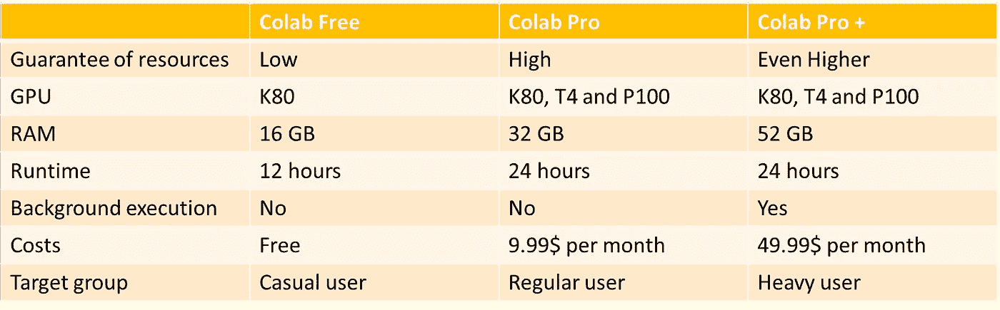

# Google Colab Pro+:值 49.99 美元吗？

> 原文：<https://towardsdatascience.com/google-colab-pro-is-it-worth-49-99-c542770b8e56?source=collection_archive---------2----------------------->

## 谷歌刚刚发布了 Colab 的新订阅计划:Pro+。新变种是否值每月 49.99 美元？我看了看新包装。

作者图片

[*Google Colab*](https://colab.research.google.com/signup) *在家做深度学习，准备和分享数据科学案例，相互协作，越来越受欢迎。就我个人而言，我使用 Google Colab 主要是为了 Kaggle 比赛。所以我很好奇新的订阅选项会提供什么。*

两年前，谷歌发布了 Colab Pro。这是 Colab 的第一个付费订阅选项。每月 9.99 美元，专业用户可以获得更快的 GPU，如 T4 和 P100，如果资源可用的话。此外，pro 版本的运行时间更长，实例连接时间长达 24 小时。在免费版本中，运行时间限制为 12 小时，RAM 也限制为 16 GB。在 pro 版本中，可以选择高内存选项，从而使用 32 GB 的 RAM。Google Pro+变种现在提供了更多的选择，可以在没有云服务器或本地机器的情况下相对便宜地运行深度学习。让我们看一看。

## 肌肉——GPU 和内存

Colab Pro+提供对与 Colab Pro 相同的 GPU 的访问。但是，如果资源不足，Pro+用户将被优先考虑。在 RAM 方面，Pro+又出现了一个显著的变化。

> 虽然 Colab Pro 提供 32 GB 的内存，但 Pro+用户可以通过高内存选项获得 52 GB 的内存。

这大约是专业用户的 1.6 倍，免费用户的 3.25 倍。这意味着大量数据也可以在 GPU 应用程序之外进行处理。

## 运行时间

连接的持续时间在机器和深度学习中非常重要。在免费版本中，笔记本电脑在 12 小时后断开连接，在专业版本中，在 24 小时后断开连接。一直困扰我的是，浏览器必须保持打开，否则在我的体验中，大约 90 分钟后就会断开连接。这对于密集的生态测试是没有用的，因为本地机器必须一直开着。浏览器崩溃时有发生。

> H ere Pro+在我看来提供了最重要的创新之一:**后台执行**。在训练被触发后，虚拟机继续运行长达 24 小时**，而**浏览器不必保持打开。

模型和数据仍然存储在工作空间中。我总是将数据直接推送到我的 Google Drive，这使得后台执行更加有用。

## 有效性

不幸的是，目前可用性没有任何变化。Colab Pro 和 Colab Pro+在以下国家均有销售:**美国、加拿大、日本、巴西、德国、法国、印度、英国、**和**泰国**。在这些国家/地区之外，Pro 或 Pro+套餐不可用。

Colab 订阅计划的比较；作者图片

## 结论

从我的角度来看，如果有人持续使用 Colab Pro+服务，并且还想培训大型模型，例如在迁移学习领域，那么 Colab Pro+是值得的。最重要的新特性是后台执行。52 GB RAM 也是一个有用的升级，因为过去我经常用完 Colab Pro 中的 32 GB RAM，导致运行时崩溃。此外，当我长时间密集使用 GPU 和高内存引擎时，我更经常被服务阻止。在那些时刻，Colab Pro+的进一步优先化会帮助我。如果您只是偶尔使用 Colab，即一个月几次，那么升级肯定是不值得的。

## 进一步阅读

*   订阅概况:【https://colab.research.google.com/signup 
*   主要常见问题:[https://research.google.com/colaboratory/faq.html](https://research.google.com/colaboratory/faq.html)
*   充分利用 Colab:[https://colab.research.google.com/notebooks/pro.ipynb](https://colab.research.google.com/notebooks/pro.ipynb)

[如果您喜欢中级数据科学，并且还没有注册，请随时使用我的推荐链接加入社区。](https://medium.com/@droste.benedikt/membership)