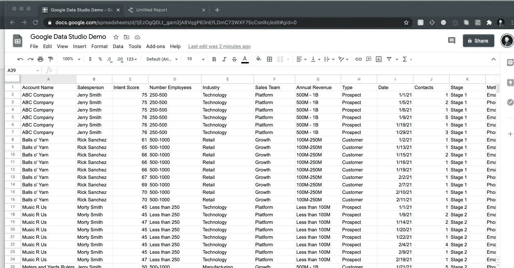
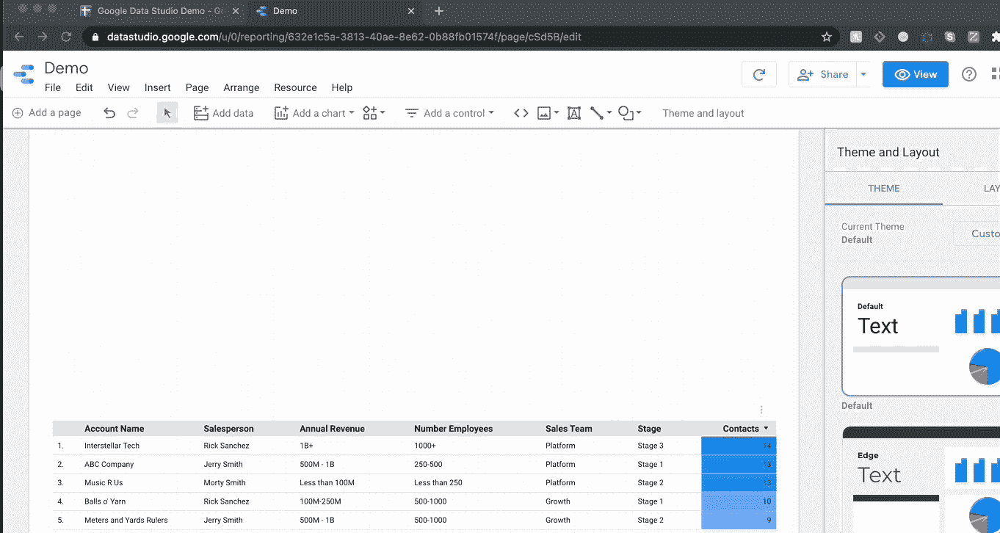
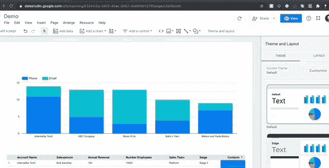
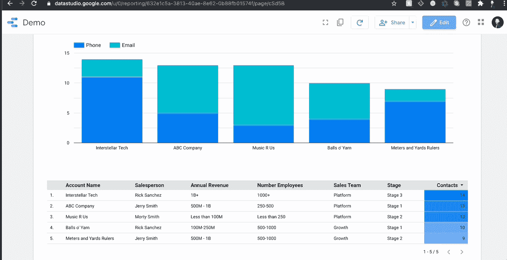

# 面向初学者的谷歌数据工作室

> 原文：<https://towardsdatascience.com/google-data-studio-for-beginners-99355e9df809?source=collection_archive---------17----------------------->

艾萨克·史密斯在 [Unsplash](/s/photos/data-visualization?utm_source=unsplash&utm_medium=referral&utm_content=creditCopyText) 上拍摄的照片

## 使用最简单的免费工具之一，在几分钟内实现令人难以置信的可视化

每个作家都知道，一幅画胜过千言万语；在数据科学领域，一个好的可视化是物有所值的。作为一个对这个行业和技能还非常陌生的人，我不能从专业的角度来说，但作为一个新手数据工程师，我来到我的新公司时，口袋里有一些熊猫，眼睛里有明亮的城市灯光。我的团队已经收集了大量奇妙的、基本上干净的数据…但是没有人有时间或专业知识将其转化为可操作的东西。对于初出茅庐的数据科学家来说，他们在寻求理解的过程中发现的可能是最伟大的工具:谷歌数据工作室。

当我第一次开始玩它的界面时，我嗤之以鼻。这不是熊猫，也不是 Seaborn，我刚刚花了数百个小时学习如何在工作场所使用我新奇的 Python 技能，所以我决定这样做。也就是说，我用它做得越多，我就越能理解谷歌数据工作室，或者酷孩子们称之为 GDS 的真正强大的本质。

由[弗兰基·查马基](https://unsplash.com/@franki?utm_source=unsplash&utm_medium=referral&utm_content=creditCopyText)在 [Unsplash](/s/photos/data-visualization?utm_source=unsplash&utm_medium=referral&utm_content=creditCopyText) 上拍摄的照片

## **显示不告诉**

每个人都喜欢图表。说真的，他们有。即使讨厌数据的人也喜欢好的图表。线上升了吗？有多好看？但最重要的是，上线了吗？

我是在开玩笑(大部分是)，但是在商业世界里，我们的工作不是玩数据，而是为那些不玩数据的人翻译数据。一次又一次，你会发现一个漂亮的图表会在任何一天胜过一个数字。不仅如此，当你和一个像糖果一样吞噬度量标准的团队一起工作时，你需要尽可能快地提供大量的图表。因此，谷歌数据工作室是你的星期五。

在我们了解这项计划的威力之前，重要的是要知道它并不适合所有人。这是一个在数据新手和数据科学家之间架起桥梁的工具。它能做机器学习吗？不，你应该用它来清理数据吗？亲爱的上帝，不。即使合并也有它的局限性。但是任何一个从头开始编写堆积条形图的人几乎都会被这样一个事实所冒犯:在比煎鸡蛋还短的时间内将一个漂亮而精确的图表转储到一个报告中是多么容易(当然，如果你的数据是干净的话！).

谷歌数据工作室的优势在于其数据处理的可塑性。每个数字列都有一个可定制的默认聚合，所以从详细的行跳到一个分组的总和比说“Pivot table，schmivot table”更容易。不仅如此，它还让数据探索变成了一个拖拽式的梦想。最后，也是最重要的一点，它是为数不多的免费程序之一，允许你私下与你的团队分享数据，而不必在一个封闭的网站上进行托管。我充分意识到了 Streamlit 的强大功能和可定制性，我仍然计划在未来广泛使用该程序，但对于与我的团队共享敏感数据，GDS 是一个上帝派来的人。我可以说，在不小的程度上，GDS 改变了我的团队的工作方式。但是为什么要告诉你，当我可以给你看的时候？

[航空焦点](https://unsplash.com/@airfocus?utm_source=unsplash&utm_medium=referral&utm_content=creditCopyText)在 [Unsplash](/s/photos/collaboration?utm_source=unsplash&utm_medium=referral&utm_content=creditCopyText) 上拍摄的照片

# **如何做 GDS 报告**

您首先会注意到，在几分钟内创建一个完全填充的交互式报告是多么容易。请记住，GDS 是一个聚合工具，所以请确保您的数据是干净和一致的。俗话说:“垃圾进来等于垃圾出去”，所以你永远不要指望谷歌的优秀员工会为你做真正的数据工程工作。

## **第一步:加载您的数据**

加载数据有多种选择。GDS 可以很好地处理空值，但是在这样做之前要确保理解空值以及列的语义配置。当您开始时，最常见的挫折之一是意识到您的配置到处都是，当遇到它不理解的值时，您的数据会中断。

GDS 有几个加载数据的方便选项，尽管它们都有各自的优缺点。在连接数据之前，一定要阅读文档，因为当你发现行丢失时已经太晚了。数据连接器包括:

*   PostgreSQL/MySQL*(每个查询限制 100k 行)*
*   Google Sheets *(没有高级账户的数据限制)*
*   CSV 文件上传*(最大数据集大小为 100mb)*
*   谷歌大查询*(我没用过)*
*   谷歌分析/谷歌广告*(仅限最近三个月没有付费版本*)
*   以及更多的谷歌产品

我个人最喜欢的是谷歌床单。您可以在几秒钟内连接两个程序，GDS 会将该工作表视为活动数据库，因此，只要您单击报表页面顶部的刷新按钮，您就会看到报表中反映的更改。在我的大部分报告中，我会上传文件，这样我就可以随心所欲地拥有尽可能多的行和列，而不会接近 100mb 的限制。

我创建了一个假数据集来演示加载和可视化数据是多么容易。我可以强调地告诉你，我想出这些假公司名字所花的时间比我写 GDS 报告的时间还要长。我的数据包括数据类型的组合:分类字符串、整数和日期。下面你可以看到我将这些数据连接到 GDS，并在几秒钟内创建了一个表:

仅此而已。我会说，在操作之前，你应该总是检查你的数据的语义配置，我在上传数据之后就这样做了。

## 第二步:视觉化

让我告诉你在 GDS 想象是多么的不可思议的容易。我在我的报告中添加了一个堆积条形图，然后更改了维度，这样我们就可以看到每个客户的联系方式的明细。

就这么简单！每个图表都从列(绿色字段)中提取数据，同时聚合指标(蓝色字段)。如果您想对一个数字列求和，只需将其拖到指标中，然后选择求和(或平均值、中值、最大值等。).对于对象列，可以选择“计数”或“非重复计数”。最后，有一个专门针对日期范围的特定维度，这就是 GDS 真正有趣的地方。

## **第三步:过滤器**

任何人都可以给他们的团队一个带有现成图表的 powerpoint，但 GDS 走得更远。该计划旨在为所有团队成员提供充分的互动，这种互动采取过滤器的形式。在大多数程序中，如果你有 3 个销售团队，你需要为每个团队做不同的报告，但是在 GDS，你可以创建过滤器，点击一个按钮来改变报告。筛选器可以控制数据中的任何列。

## **3A。过滤器控制箱**

您可以在左侧看到基本的交互式过滤器。我通常对几乎所有的事情都使用下拉菜单，我鼓励你尝试一下，看看什么是有效的。对于每个过滤器，您选择它将控制哪一列，然后选择您想要显示的指标，以显示该列的不同之处。假设我只想查看销售团队的客户，我想查看的指标是该类别中有多少不同的客户。您只需选择“帐户名”作为您的指标，然后将聚合设置为非重复计数。就是这样！这里有一个快速的方法:

您甚至可以通过对报告元素进行分组来控制哪些过滤器会影响哪些图表。如果没有分组，筛选器将影响共享数据源的任何内容，但是有了分组，您可以创建用户友好的复杂报表。您还可以选择将**固定过滤器**应用于任何报告对象，也可以选择将所述过滤器一起应用于整个组。

## **3B。日期控制**

GDS 最有用的元素之一是它的现场报道能力。当你连接 Google Analytics 数据源时，它会直接从你的网站上提取实时数据，并根据你的报告进行汇总。当然，有些数据连接器比其他连接器快得多(在我的经验中，CSV 文件上传往往是最快的，但是数据更新是手动的)。也就是说，如果你关注纵向数据，日期范围可能很重要。GDS 非常擅长自动解析日期列，但是，即使您在处理列时遇到问题，也可以使用 PARSEDATE()函数创建一个自定义字段。我现在不会进入自定义字段，这将是另一篇文章，但请放心，如果你以' YYYY-MM-DD '格式传递日期时间列或对象列，GDS 会很好地翻译它，即使存在空值。

日期控件影响每个图表和字段中的特定数据字段。无论您在报告中放置什么对象，它们都有一个“日期范围”选项。您也可以将日期范围应用于组。在这里，您可以设置默认的日期范围，可以简单到上周，也可以复杂到上周三之前的 47 天。

## **3C。应用过滤器**

我最后一个小小的滤镜是一个天才按钮，在所有的图表对象上贴上“应用滤镜”的标签。通过打开此按钮，您可以单击表格中的一行或图表中的一列，报告将自动基于该对象进行过滤。看看这个:

就这么简单！希望您现在可以看到这个免费的开箱即用的包中有多少工具可供您使用。

# **结论**

作为我团队中唯一的数据人员，Google Data Studio 改变了我的生活，但它肯定有其局限性。我计划写更多的优点和缺点，以及一些我在混合数据时发现的有用的方法。以下是 GDS 如此强大的原因概述:

## **优点**

*   难以置信的易于使用(甚至对于非数据人员)
*   丰富的数据连接器和可靠的文档
*   自由的
*   非常适合团队内部的私人数据共享
*   非常可定制的交互式报告
*   使用与 Google Sheets/Excel 相同的字段函数，并提供便于参考的文档字符串
*   漂亮的动态图表
*   过滤器本身就值门票的钱
*   不需要编码

## **CONS**

*   在将数据强制写入报告之前，您必须了解您的数据
*   如果不升级到 Google 360(每年花费 15 万美元),上传的大小是有限制的。)
*   没有文档和论坛之外的技术支持
*   合并数据源有极大的局限性(例如，不能使用多个连接键连接多个数据源。所有表必须有一个公共连接列)
*   有时它只是中断，错误消息充其量只是含糊不清

总的来说，Google Data Studio 感觉像 Data Science-Lite，但除了 Streamlit for teams(仍处于测试阶段)之外，我还没有找到更好、更简单的选项来与非数据团队成员共享漂亮、复杂、交互式的报告。

我将在未来发布更多操作方法，如下所示:

*   使用 Google Sheets api 构建数据管道
*   非数据团队成员的最佳数据通信实践
*   数据混合

谢谢朋友们！如果你有问题或想法，请留下评论，我会尽力回答。