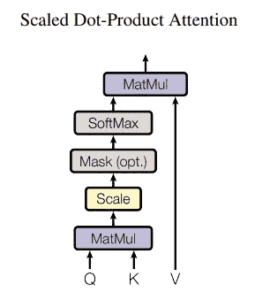
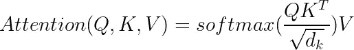
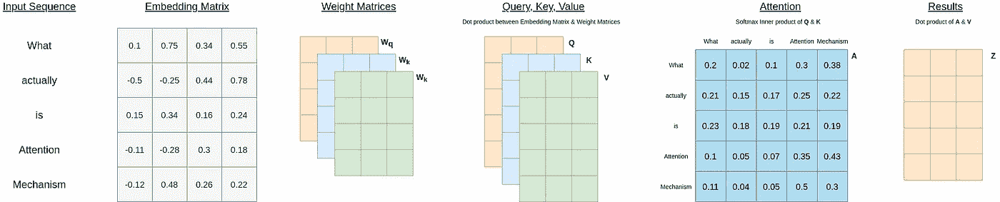
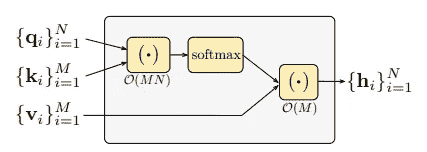
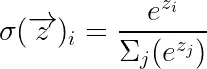
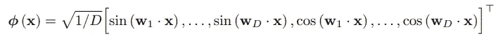
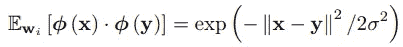
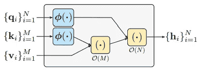

# 谷歌的 RFA:逼近变形金刚中的 Softmax 注意机制

> 原文：<https://towardsdatascience.com/google-deepminds-rfa-approximating-softmax-attention-mechanism-in-transformers-d685345bbc18?source=collection_archive---------15----------------------->

图片由 [Free-Photos](https://pixabay.com/photos/?utm_source=link-attribution&amp;utm_medium=referral&amp;utm_campaign=image&amp;utm_content=846089) 来自 [Pixabay](https://pixabay.com/?utm_source=link-attribution&amp;utm_medium=referral&amp;utm_campaign=image&amp;utm_content=846089)

## [思想与理论](https://towardsdatascience.com/tagged/thoughts-and-theory)

## 什么是注意机制&为什么 RFA 比 Softmax 好？

谷歌最近发布了一种新方法——随机特征注意力——来取代《变形金刚》中的 softmax 注意力机制，以实现类似或更好的性能，同时在时间和空间复杂度上有显著改善。

在这篇博客中，我们将了解变形金刚的背景，什么是注意力机制，以及为什么 RFA 是 softmax 注意力机制的更好替代方案。我们将从 RFA 中获得一些东西来结束这篇博客。

> 注:本博客基于彭等人的 Google Deepmind 最新论文“随机特征注意”。虽然我们将涵盖大多数核心概念，但请务必阅读该论文[此处](https://openreview.net/pdf?id=QtTKTdVrFBB)以深入了解数学推导、实验结果和讨论。

## 背景

变形金刚是目前最好的序列对序列机器学习模型。它擅长从数据序列中学习，这一事实使它在自然语言处理、机器翻译、时间序列建模和信号处理方面尤其出色。

变形金刚成功的基石是注意力机制。这些机制查看输入序列并识别最重要的元素。当对序列进行编码时，这些元素将具有更重的权重，即受到更多的关注。

## 说白了注意力机制是什么？

想象一下，我们正在会议中做笔记，准备写一封跟进邮件。记笔记的时候，不太可能把什么都写下来。我们可能需要用缩写或图画来代替单词；我们可能还需要跳过那些可以推断出意义损失最小的单词。这个过程将把一个小时的会议浓缩成只有一页的笔记。从本质上讲，注意力机制也在做同样的事情，它试图通过更多地关注重要的嵌入(单词的缩写或图标表示)来对序列进行编码。

## 什么是 Softmax 注意机制？

假设我们有句子*“什么是真正的注意机制”。*

注意机制的目标是计算序列的不同部分应该如何彼此链接并因此应该同时被注意的相关性矩阵。例如，“*注意*”和“*机制*”应该连在一起，但两者都不应该与“*实际上*”或“*是*”有很大的关联。

该机制将从摄取我们的输入句子的数字形式开始，即单词嵌入矩阵。

> 注意:单词嵌入是一个单词的向量表示，它提取了该单词的不同属性。这些属性的一个过度隐含的例子可以是情感、词性和字符数。

然后，它将为查询`W_q`、密钥`W_k`和值`W_v`初始化三个权重矩阵。

然后我们可以计算查询矩阵`Q`、键矩阵`K`和值矩阵`V`，分别作为单词嵌入矩阵与`W_q`、`W_k`和`W_v`的点积。正如《注意力是你的全部需求》一文中所述，初始注意力矩阵可以计算如下:

来源:瓦斯瓦尼等人的《注意力是你所需要的一切》。

或者数学上如下:

来源:作者图片

为了帮助理解矩阵运算的流程，下面是底层矩阵的图示流程:

注意机制的内部状态——来源:作者图片

这种注意力也被称为 softmax 注意力，因为它使用 softmax 激活函数来将`Q`和`K`的缩放点积转换为注意力的相对测量值`A`，其中每隔一个单词将分享一个注意力比例，该比例总计为 1(或 100%)。然后，softmax 结果将与`V`相结合，为其提供基于注意力的语义结果。

> 但是什么是查询、键和值呢？

理解查询、键、值三元组背后的直觉的一种过于简单的方式可以是将转换器理解句子的能力视为最大化以下条件似然性:

*   输入序列为`[**y**, "actually", "is", "attention", "mechanism"]`时 **y** =“什么”的概率
*   输入序列为`["what", **y**, "is", "attention", "mechanism"]`时 **y** =“实际”的概率
*   输入序列为`["what", "actually", **y**, "attention", "mechanism"]`时 **y** =“是”的概率
*   输入序列为`["what", "actually", "is", **y**, "mechanism"]`时 **y** =“注意”的概率
*   输入序列为`["what", "actually", "is", "attention", **y**]`时 **y** =“实际”的概率

推断可能性的方法是注意输入句子中的其他单词(单词嵌入)。在训练过程中，转换器将通过改进三个权重矩阵来学习如何基于嵌入将单词链接在一起。

这种架构的好处是，我们可以通过创建多组查询、键、值三元组(也称为多头注意力)或通过堆叠这些注意力层来捕获更复杂的语义结构。

## 为什么 Softmax 的注意力机制不够好？

在一个典型的 transformer 中，多头注意力被用来分解更复杂的语言模式。然后，softmax 注意机制的时间和空间复杂度变为`O(MN)`，其将以输入序列长度的二次方速率增长。

Softmax 注意机制——资料来源:彭等人的“随机特征注意”。

为了解决这个问题，来自 Google Deepmind 的团队利用了 Bochner 定理，并扩展了 Rahmi & Recht (2008)的工作，使用**随机特征图ϕ** (独立正态分布的随机向量`**w**`和输入句子`**x**`之间的内积的傅立叶特征)来估计 softmax 函数的指数函数。

Softmax 函数—来源:作者图片

随机特征图——来源:彭等的“随机特征注意”。

随机特征图的点积可以用来估计指数函数——来源:彭等的《随机特征注意》。

在不深入推导太多数学细节的情况下，softmax 注意机制可以近似为以下结构:

RFA 注意机制——资料来源:彭等《随机特征注意》。

通过用 RFA 近似 softmax，Google Deepmind 将时间和空间复杂度降低到了`O(M + N)`，即从二次到线性。

## 谷歌 Deepmind 的研究成果

*   由于 RFA 具有相同的输入和输出维数要求，因此 RFA 可以用来替代 softmax 注意机制。
*   随着复杂度从二次下降到线性，当输入文本序列较长时，RFA 取得了更显著的改善。
*   RFA 背后的基本原理可以用于近似高斯核之外的其他核函数。在 Google Deepmind 的论文中，他们展示了如何将相同的方法应用于近似反余弦核。
*   像 softmax 一样，RFA 本身不考虑输入句子中的位置距离。在 Google Deepmind 的论文中，他们讨论了如何将递归神经网络的灵感应用于 RFA，以便单词的重要性将根据它们在句子中的相对位置呈指数衰减。
*   最后但同样重要的是，机器学习看起来非常闪亮，但它都是关于数学和统计的。感谢优秀的研究人员和程序员，我们拥有了 TensorFlow 和 PyTorch 这样的高级软件包。尽管如此，我们需要不断学习最新的发展，并修改核心概念，以确保我们正在开发可防御和可解释的机器学习模型和管道。

这是这个博客的内容。希望你觉得博客或代码有用！如果我错过了什么，或者如果你有任何问题，请随时回复或 pm。如果你想了解更多关于 Python、数据科学或机器学习的知识，你可能想看看这些帖子:

*   [TensorFlow:使用 GPU 将 NumPy 加速 10000 倍以上](https://pub.towardsai.net/tensorflow-accelerate-numpy-with-gpus-964e9087fdab)
*   [改进数据科学工作流程的 7 种简单方法](/7-easy-ways-for-improving-your-data-science-workflow-b2da81ea3b2)
*   [熊猫数据帧上的高效条件逻辑](/efficient-implementation-of-conditional-logic-on-pandas-dataframes-4afa61eb7fce)
*   [常见 Python 数据结构的内存效率](/memory-efficiency-of-common-python-data-structures-88f0f720421)
*   [Python 的并行性](/parallelism-with-python-part-1-196f0458ca14)
*   [数据科学的基本 Jupyter 扩展设置](/cookiecutter-plugin-for-jupyter-easily-organise-your-data-science-environment-a56f83140f72)
*   [Python 中高效的根搜索算法](/mastering-root-searching-algorithms-in-python-7120c335a2a8)

如果你想了解更多关于如何将机器学习应用于交易和投资的信息，这里有一些你可能感兴趣的帖子:

*   [Python 中交易策略优化的遗传算法](https://pub.towardsai.net/genetic-algorithm-for-trading-strategy-optimization-in-python-614eb660990d)
*   [遗传算法——停止过度拟合交易策略](https://medium.com/towards-artificial-intelligence/genetic-algorithm-stop-overfitting-trading-strategies-5df671d5cde1)
*   [人工神经网络选股推荐系统](https://pub.towardsai.net/ann-recommendation-system-for-stock-selection-c9751a3a0520)

 [## Louis Chan-FTI Consulting | LinkedIn 数据科学总监

### 雄心勃勃的，好奇的和有创造力的个人，对分支知识和知识之间的相互联系有强烈的信念

www.linkedin.com](https://www.linkedin.com/in/louis-chan-b55b9287/) 