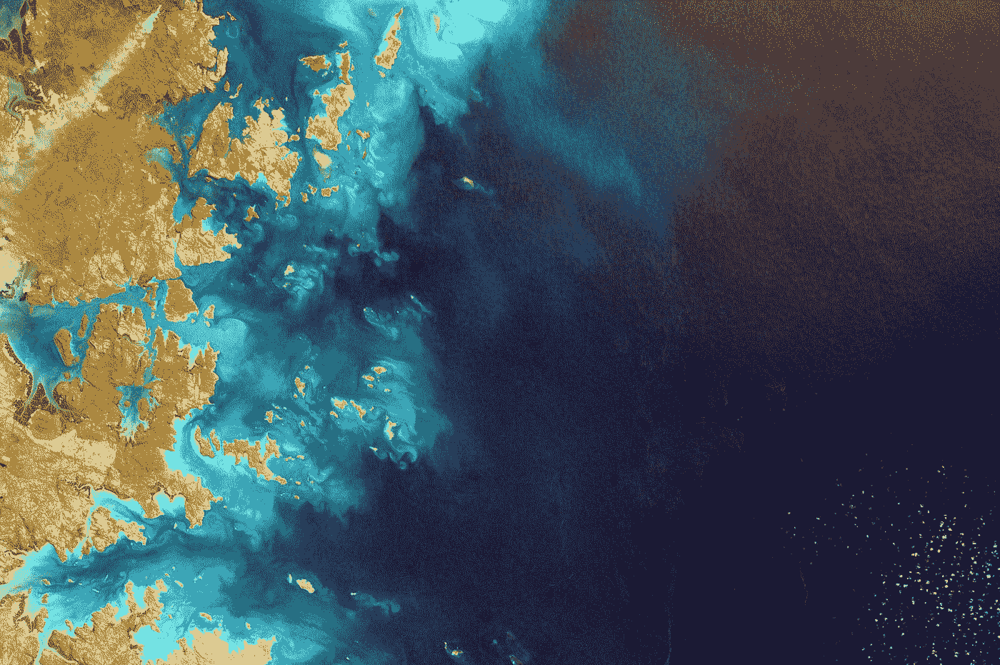
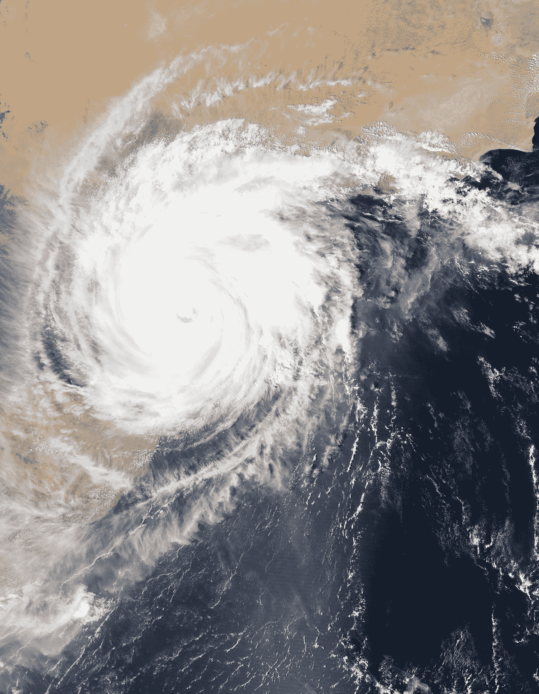

# 谷歌地球引擎:资源和提示

> 原文：<https://towardsdatascience.com/google-earth-engine-resources-and-tips-9c4369a66d8a?source=collection_archive---------30----------------------->

## 学习基础知识和动手实践的最佳资源！

美国宇航局在 [Unsplash](https://unsplash.com?utm_source=medium&utm_medium=referral) 拍摄的照片

没有什么比通过那些被称为卫星的无情生物的眼睛从太空一路看到地球更令人兴奋的了。你会立刻意识到你只是比你大得多的事物中的一小部分。这是我每次使用谷歌地球引擎平台加载卫星图像进行分析时的感受。

如果你曾经对地理空间数据分析和揭示全球范围的地球观测洞察力感到好奇，那么谷歌地球引擎平台应该是你的首选。

GEE 拥有让您起步的一切。从数 Pb 的随时可用的最新卫星图像和地理空间数据集，一直到由谷歌数据中心基础设施和丰富的资源支持的完全可操作的开发环境，以检测变化，量化地球表面的差异，并绘制长期趋势。

让我们来看看一些技巧和资源，您可以利用它们来练习使用该平台并利用其分析功能！

## 注册一个谷歌地球引擎开发者账户

要使用 GEE 作为开发人员，您需要首先注册！在此过程中，您将填写一份简短的表格，其中包含您的基本信息，以及您目前拥有的任何关系和您目前工作的组织。

在这份表格中，你还需要提供一个简短的描述，说明你打算如何使用地球引擎。确保你尽可能的具体。在大约一周内，无论您是否有权访问该平台，您都应该会收到 GEE 团队的回复。这一步应该很简单。

## 探索[数据目录](https://developers.google.com/earth-engine/datasets)

获得平台访问权限后，第一个很好的步骤是探索数据目录中可用的数据集。这将使您熟悉您可以访问的数据和卫星图像。

该平台拥有丰富的地表温度、气候、土地覆盖、地形、农田、大气和合成孔径雷达(SAR)数据。

确保您浏览了 Landsat 和 Sentinel 数据集，因为您可能需要在平台上执行几乎任何任务时查看这些数据集。

照片由 [NASA](https://unsplash.com/@nasa?utm_source=medium&utm_medium=referral) 在 [Unsplash](https://unsplash.com?utm_source=medium&utm_medium=referral) 上拍摄

## 了解开发环境是如何工作的

现在您需要开始接触使用 GEE 环境的技术方面。首先熟悉 JavaScript 开发环境和 IDE。

了解如何管理脚本、搜索文档、接收资源、在代码编辑器中保存和运行脚本、使用控制台查看输出和调试代码、使用检查器检查地图上的元素、管理任务以及查看地图和管理其图层。

随着时间的推移，一旦你做了一些练习，这些项目将成为第二天性。请记住，您不需要从第一天起就知道如何在环境中做每件事情！

## 了解地球引擎 API 的方法和对象

为了能够利用平台提供的功能，您需要熟悉各种类型的 Earth Engine 对象。

您应该知道图像、图像集合、几何图形、特征、特征集合、缩减器、连接、数组和图表之间的区别。

这些课程中的每一门都可以在很长一段时间内掌握。但是作为起点，在深入研究每个类的方法之前，请确保您知道一个类和另一个类之间到底有什么不同。

## 设定一个时间表来浏览开发者指南

这些提供了丰富的学习材料，您应该仔细阅读，尝试使用地球引擎代码编辑器复制，并在此基础上进行构建。

这些指南涵盖了所有种类的材料，包括:JavaScript 崩溃指南、最佳编码实践、调试提示和技巧、开发环境概述、API 教程、关键概念，如服务器端与客户端对象和变量之间的差异、上面讨论的不同类的对象和方法、机器学习算法以及许多其他关于资产管理的有用资源。

## 不要错过地球引擎社区提供的高质量[教程](https://developers.google.com/earth-engine/tutorials)

这包括来自地球引擎用户社区的贡献。您可以找到一些有价值的资源，这些资源以非常直观和友好的方式解释了基本概念。

查看[初学者食谱](https://developers.google.com/earth-engine/tutorials/community/beginners-cookbook)，它对你需要知道的基础知识进行了很好的概述，让你开始舒适地进行基本的地球引擎开发。

一旦你在基础知识方面接受了足够的培训，并探索了像哨兵 2 号和陆地卫星 8 号那样的多光谱图像，请查看本教程，学习[合成孔径雷达](https://developers.google.com/earth-engine/tutorials/community/sar-basics) (SAR)的基础知识！

## 练习。练习。练习。

谷歌地球引擎的一个很大的特点是，它让你专注于做实际的科学和分析，而不是专注于下载和管理大量复杂的维护数据。

这在地理空间数据分析工作流程中为您节省了大量时间。利用额外的时间在小规模的项目上练习，一旦你掌握了基本原理，你就可以在此基础上进行扩展。

试着通过不时解决不同的问题来观察地球表面不同种类的变化！最近发生的埃特纳火山爆发、德克萨斯州的风暴和洪水以及去年贝鲁特港口的毁灭性爆炸都是最近发生的事件，您可以使用谷歌地球引擎来探索这些事件，尝试检测地球表面的变化并测量损害。

由于团队([谷歌地球](https://medium.com/u/5995184886b6?source=post_page-----9c4369a66d8a--------------------------------)、[谷歌开发者](https://medium.com/u/991272e72e68?source=post_page-----9c4369a66d8a--------------------------------)、[谷歌云](https://medium.com/u/4f3f4ee0f977?source=post_page-----9c4369a66d8a--------------------------------))每天都在努力改进谷歌地球引擎的体验，这种可能性是无穷无尽的。