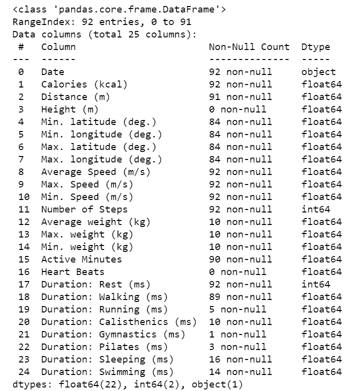
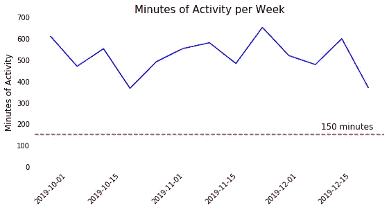
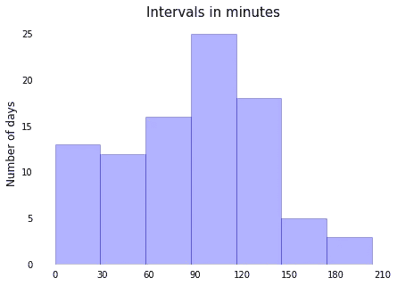
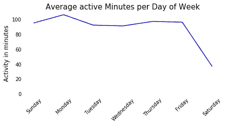
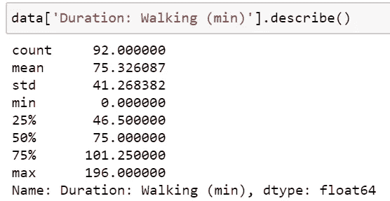
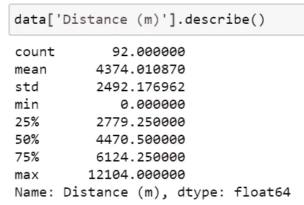
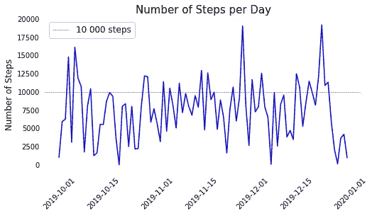

# Google Fit 数据分析

> 原文：<https://towardsdatascience.com/google-fit-data-analysis-8541d5402f3b?source=collection_archive---------21----------------------->

## 一个简单的方法来解释数据探索的主要步骤。


威廉·艾文在 [Unsplash](https://unsplash.com?utm_source=medium&utm_medium=referral) 上的照片

# 说明

前一阵子我开始学习数据分析，经过一些学习练习后，我渴望做自己的数据探索项目。我想了想这个话题，决定我不想使用常见的和普遍可用的数据资源，如 Kaggle 或其他流行的数据集平台。我想用一些我个人感兴趣的东西。我的选择来自几个月前我安装在手机上的 Google Fit 应用程序的数据，该应用程序用于推动自己进行一些体育活动。

所以当我开始我的项目时，我有两个目的。第一个是使用数据分析的主要概念从头到尾经历数据探索的整个过程:清理、探索和可视化。第二是评估我在日常体育活动中的进步:我变得更爱运动了吗，我在运动上投入了多少时间，什么样的运动最适合我？

这两个目标对我来说真的很有意思，也很重要，现在想和大家分享一下我小小的研究成果。

# 一些理论

通常，数据分析的过程包括这五个步骤:

1.  研究目标
2.  收集数据
3.  数据准备
4.  数据探索
5.  解释结果

设定研究的目的意味着我们必须知道，需要回答什么问题。我们真正想知道的是，我们的兴趣点是什么？这影响了我们研究所需的数据、参数和变量。根据这一点，我们将选择我们要寻找的数据源。

在我们确定了研究的目的和需要的数据类型后，我们应该从任何可用的资源中收集数据。最重要的是数据必须尽可能的准确和完整。否则，我们所有的研究都可能导致不正确的结果，都是无用的。

但这是一种非常罕见的情况，当我们有很好的干净的数据，我们可以立即探索。这就是为什么我们带走我们所拥有的，然后清理它，为探索做准备。

只有完成了前面的所有步骤，我们才能探索我们的数据。它可能包括使用描述性统计、建模和最有用的工具——可视化。在这个阶段，我们可以确认或否认我们的假设，并获得我们在研究的第一阶段设定目标时所提问题的答案。

最后，我们得出可以与目标受众、利益相关者或我们自己分享的结论。

好，让我们开始，一步一步地经历所有这些阶段。

# 1.研究目标

正如我之前说过的，这个项目有两个目的:在数据分析方面进行训练，并从我的 Google Fit 应用程序中接收一些关于我的体育活动的反馈。我有一个假设，通过每天使用这个应用程序，我变得更加热爱运动，随着时间的推移，我的运动活动增加了。

# 2.收集数据

这项研究的原始数据取自我在 2019 年 9 月安装在手机上的 Google Fit 应用程序。要从这个应用程序下载数据，我们应该使用 [Google 外卖系统](https://takeout.google.com/)。该系统旨在向用户提供来自谷歌各种来源的数据。你要做的就是在那里注册，并指定你想从哪个应用程序接收什么样的数据，谷歌会以 CSV 格式将它们发送到你的电子邮件中。

对于 Fit 应用程序，Google 为给定时间段的每一天提供了一组文件，以及带有聚合数据的文件。我们将使用最后一个，因为它包含了我们需要的所有信息。我们要探索的时间段是从 2019 年 11 月 1 日到 12 月 31 日。

在我们的研究中，我们将使用带有 Python 模块 Pandas 和 Matpoltlib 的 Jupiter Notebook。

让我们从导入必要的模块开始…

```
import pandas as pd
import matplotlib.pyplot as plt
```

…并从文件中读取数据。

```
data = pd.read_csv('google-fit-data-file.csv')
```

让我们先快速看一下我们的数据:

```
data.info()
```



我们看到我们的数据集有 92 行 25 列。我们有很多空牢房。有些数据根本不存在(比如身高和心脏点)。我们以后再考虑如何处理它。

现在让我们看一下数据的前几行。

```
data.head()
```


如此混乱，毫无头绪。顺便说一下，这就是我热爱数据科学的原因:它让我们从这些乱七八糟的数字中获得有趣的、有时是意想不到的见解。很快我们就会从这一团乱麻中做出一份订单。

现在我们知道了数据的样子，我们可以开始为进一步的探索做准备了。

# 3.数据准备

## 3.1.清洁

首先要清理数据。这是什么意思？这意味着我们应该抛弃一切对研究没有价值或意义的东西。例如，我们的数据集中不需要一些列，因为它们现在与我无关。

正如我们在数据信息中看到的，列“身高”和“心跳”是空的。在这个分析中，我们不会处理地理数据，所以我们也不需要包含纬度和经度的列。我们不想讨论体重，所以我们删除了所有包含这些数据的列。我们不需要一个列有休息和睡眠时间的栏目，因为我们谈论的是运动，而不是休息。

我们可以用熊猫的*下拉*功能删除这些栏目:


*axis=1* 意味着我们处理列，而不是行。 *inplace=True* 允许我们不复制表来存储新数据，而是改变数据集本身。

## 3.2.格式化

有时(坦率地说，几乎总是)我们不得不改变我们拥有的数据。我们可能有不同的理由这样做，但在这个过程的最后，我们有一个更合适的数据格式或数据本身，可以更容易理解，描述和可视化。你会在下面的例子中明白我的意思。

**3.2.1。类型转换**

首先，我想将日期列的类型转换为*日期时间*格式。这将使我们有机会把日期当作日期来处理，而不是字符串。这可以通过内置的 pandas *to_datetime* 函数来实现:

```
data['Date'] = pd.to_datetime(data['Date'], dayfirst=True)
```

**3.2.2。处理缺失数据**

此外，我们希望用 0 填充所有的 *NaN* (空)值，这样熊猫就可以将它们视为数字，而不是缺失值。有必要进行进一步的分析和可视化。这可以通过 *fillna* pandas 函数来完成。

```
data.fillna(0, inplace=True)
```

**3.2.3。改变尺寸**

当我们查看数据时，我们发现一些值的维度不合适。很难用毫秒来表示时间，或者用米每秒来表示速度。因此，我们将把数字转换成更熟悉的单位，并相应地更改列名。

现在数据集看起来更好更清晰了。


## 3.3.添加信息

有时出于某种目的，我们需要向数据集添加信息。例如，我想在我们的数据表中添加一列:星期几(这真的很有趣，我的体育活动是否依赖于它)。在 pandas 中，每个 *datetime* 对象都有一个内置属性 *dayofweek。应用它，我们为每个日期接收一个从 0(星期一)到 6(星期日)的工作日。我们不想使用数字:它们不能提供信息。所以我们把它们转换成单词，并稍微改变一下列的顺序。*

经过所有这些转换后，我们的数据集看起来好多了:


# 4.数据探索

现在让我们开始最有趣的部分——理解我们拥有的数据。出于简洁的目的，这里我将只探索和可视化其中的一部分。但是对于那些感兴趣的人来说，在本文的结尾会有一个到 GitHub repo 的链接，在那里你可以找到这个项目的完整版本。

## 4.1.一般活动

好了，我们的数据集是干净的，可以开始研究了。让我们深入研究一下。

我们将从我每天活动的一般指标开始:活动分钟，即我每天做多少分钟的运动。让我们画一个简单的图表。


有意思。看起来像硬甜菜。我活动的分钟数既不是每天都不变，也不是每天、每月都在增加。好像是随机的。

好吧，如果这里没有逻辑，至少我们可以回答一个重要的问题:我做了足够的事情来尽可能保持健康吗？我们知道世界卫生组织建议每周至少运动 150 分钟。让我们检查一下我的活动是否属于这个框架。

首先，我们需要计算每周的分钟数。我们看到最后一周只包括一天，所以我们将放弃这个值。

现在我们可以为这些数据做一个图表。我们为 150 分钟的值添加一条直线，以查看我的每周活动是否超过它。



看起来很好。至少我可以说我做了足够的努力来保持健康。

但是我通常做多少分钟的运动呢？直方图可以帮助我们回答这个问题。



我们看到这个直方图几乎呈正态分布。最常见的间隔在 90 到 120 分钟之间。还不错。但是在两栋半房子之后，天数急剧下降。我从来没有走超过三个小时。

我对这些一般值的最后一个问题是:它们是否取决于一周中的某一天？正是为了这个问题，我们向数据集添加了“星期几”列。

首先，我们计算一周中每天的分钟数。然后，我们可以计算一周中每天的平均活动时间(分钟)。但我们应该准确:一个月中一周的不同天数可能不同。所以我们需要计算一周中的每一天在我们的数据集中出现了多少次。然后我们可以计算出一周中每天的平均活动时间。

我们可以画一个图形来直观地展示这些结果。



看起来很自然。像许多其他人一样，我周一做很多事情，周六更喜欢呆在家里休息(你应该知道在我住的地方，周日是工作日)。

## 4.2.各种活动

现在是时候谈谈我在这三个月中所做的各种活动了。


印象深刻，啊？除了到处走走，我几乎什么也没做。它占我所有活动的 75%以上。排在第二位的是游泳，然后是一点健美操，然后是几乎看不见的跑步、体操和普拉提。

好的。现在不是心烦的时候。我以后可以改进。

## 4.3.步行

既然散步是我的主要活动，那就让我们更具体地谈谈吧。



我们看到一天的平均行走时间是 75 分钟。一个多小时。当我们每天去工作或购物时，我们甚至不去想我们从一个地方到另一个地方花了多少时间。但这很重要，因为它对我们的整个生活都有影响。

但是那些日子我走过的距离是多少呢？



最小距离为 0。这符合逻辑。当然，有时我会呆在家里。我走过的最大距离是 12 公里多一点。差不多吧。让我们看看它是什么时候发生的。


十一月二十八日。哦，我记得那天。我和我的家人一起旅行。那真是凉爽的一天。

这个数据的另一个输出是，通常，我每天步行超过四公里。不多，但也不少，啊？

最后一个关于距离的问题:在那三个月里，我一般走了多少公里？


哇！400 多公里！

还有一个与距离相关的指标是步数。世界卫生组织建议每天至少走 10 000 步。让我们看看我是否成功。



坦白说，不是。我很少做我应该做的那么多步骤。让我们数一数我满足这个条件的天数百分比。


我觉得还不够。我应该努力。

# 5.解释结果

在这里，我们应该回答开始研究时提出的问题，并确认或拒绝假设的理论。就你所记得的，我有一个假设，每天使用谷歌体育应用程序会让我更运动。

这是不对的。没有一个图表在这段时间内没有持续增长的趋势。因此，使用这个应用程序——任何种类的应用程序——都不会让你的工作有起色。但是它可以向你展示真实的情况。有了这些数据，你就可以决定做什么。这取决于你，这是个好消息。

现在我知道走路是我的强项。但是我真的需要付出巨大的努力来让自己接受常规训练。我不应该依赖外部刺激。动机是内在的。我只需要有勇气承认它，并遵循这条道路。

# 结论

因此，我们对来自 Google Fit 应用程序的数据进行了为期三个月的研究。我们看到了我们拥有的数据，清理、重组、描述并可视化了它们。我们确定关系和模式，并绘制图形来说明它们。

使用数据可以让我们更多地了解我们周围的现象，得出科学结论，揭示以前认为不可知的东西，并有助于在所有应用领域做出明智的决策。这也是我喜欢数据和数据分析的原因。我希望继续我的研究，如果我发现一些有趣的东西，我会与人分享。

这里是 GitHub 资源库的链接，里面有该项目的完整版本:[https://github.com/shebeolga/Google-Fit-Data-Analysis](https://github.com/shebeolga/Google-Fit-Data-Analysis)。我将感谢你对这个话题的评论和补充。