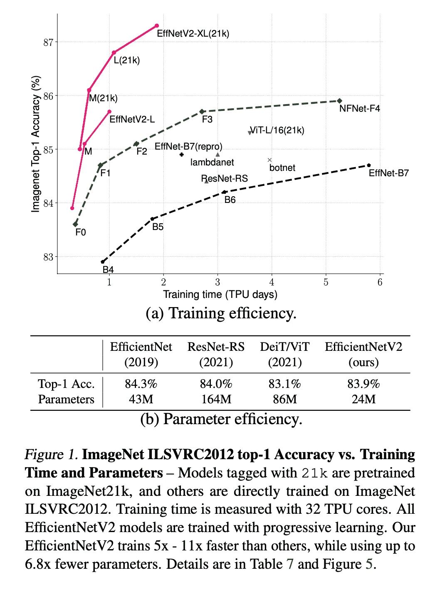
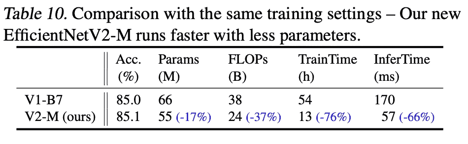

# 谷歌发布 efficient net v2——一个更小、更快、更高效的网络

> 原文：<https://towardsdatascience.com/google-releases-efficientnetv2-a-smaller-faster-and-better-efficientnet-673a77bdd43c?source=collection_archive---------4----------------------->

## 与最先进的技术相比，性能更高，同时训练速度提高 5-10 倍

由 [Fab Lentz](https://unsplash.com/@fossy?utm_source=medium&utm_medium=referral) 在 [Unsplash](https://unsplash.com?utm_source=medium&utm_medium=referral) 上拍摄的照片

> 通过渐进式学习，我们的 EfficientNetV2 在 ImageNet 和 CIFAR/Cars/Flowers 数据集上明显优于以前的模型。通过在相同的 ImageNet21k 上进行预训练，我们的 EfficientNetV2 在 ImageNet ILSVRC2012 上实现了 87.3%的顶级准确率，比最近的 ViT 高 2.0%，同时使用相同的计算资源训练速度快 5-11 倍。代码将在 https://github.com/的[发布](https://github.com/)Google/automl/efficient net v2。

来源: [Arxiv](https://arxiv.org/pdf/2104.00298.pdf)

高效网络已经成为高质量和快速图像分类的 SOTA。他们大约在 2 年前发布，因为他们的扩展方式而非常受欢迎，这使得他们的训练比其他网络快得多。几天前，谷歌发布了 EfficientNetV2，它在训练速度和准确性方面都比 EfficientNet 有了很大的提高。在这篇文章中，我们将探讨这个新的高效网络是如何优于以前的。

DenseNets 和 EfficientNets 等性能更好的网络的主要基础是以更少的参数获得更好的性能。当您减少参数的数量时，您通常会获得很多好处，例如更小的模型大小，使它们更容易适应内存。然而，这通常会降低性能。因此，主要的挑战是在不降低性能的情况下减少参数的数量。

这一挑战现在主要属于神经网络架构搜索(NAS)领域，该领域日益成为热门话题。在最佳情况下，我们将对某个神经网络给出一个问题描述，它将为该问题提供一个最佳的网络架构。

我不想在这篇文章中讨论效率网。但是，我想提醒大家效率网络的概念，以便我们能够找出架构中的主要差异，这些差异实际上会带来更好的性能。高效网络使用 NAS 来构建基线网络(B0)，然后使用“**复合扩展”**来增加网络容量，而不大幅增加参数数量。在这种情况下，最重要的度量标准是 FLOPS(每秒浮点运算次数)和参数数量。

## 1.渐进式训练

乔纳森·博尔巴在 [Unsplash](https://unsplash.com?utm_source=medium&utm_medium=referral) 上的照片

EfficientNetV2 使用渐进式学习的概念，这意味着尽管训练开始时图像尺寸最初很小，但它们的尺寸会逐渐增大。这种解决方案源于这样一个事实，即 EfficientNets 的训练速度在高图像大小时开始受到影响。

渐进式学习并不是一个新概念，以前就有人用过。问题是，当它以前使用时，相同的正则化效果用于不同的图像大小。EfficientNetV2 的作者认为这降低了网络容量和性能。这就是为什么他们动态地增加正则化和图像大小来解决这个问题。

仔细想想，很有道理。对小图像的大的正则化效果会导致欠拟合，而对大图像的小的正则化效果会导致过拟合。

> 借助改进的渐进式学习，我们的 EfficientNetV2 在 ImageNet、CIFAR-10、CIFAR- 100、Cars 和 Flowers 数据集上取得了出色的结果。在 ImageNet 上，我们实现了 85.7%的顶级准确率，同时训练速度比以前的模型快 3-9 倍，体积小 6.8 倍

来源: [Arxiv](https://arxiv.org/pdf/2104.00298.pdf)

**2。MB Conv 层上的熔融 MB Conv 层**

EfficientNets 使用一个称为"**深度方向卷积层"**的卷积层，这些层的参数和 FLOPS 数量较少，但它们无法充分利用现代加速器(GPU/CPU) [1]。为了解决这个问题，最近一篇名为“ **MobileDets:搜索移动加速器的对象检测架构”**的论文用一种新的层解决了这个问题，他们称之为“**融合 MB Conv 层”。**这一新层正在 EfficientNetV2 中使用。然而，他们不能简单地用融合层替换所有旧的 MB Conv 层，因为它有更多的参数。

这就是为什么他们使用训练感知 NAS 来动态搜索融合和常规 MB Conv 层的最佳组合[1]。NAS 的结果显示，在早期阶段用融合的层替换一些 MB Conv 层提供了更小模型的更好性能。它还示出了 MB Conv 层(沿着网络)的较小扩展比是更优的。最后，它表明内核越小，层数越多越好。

来源: [Arxiv](https://arxiv.org/pdf/2104.00298.pdf) 。EfficientNetV2 在 ImageNet 上拥有几乎最高的精确度，而参数数量却只有一半

**3。更加动态的扩展方法**

我认为这里要学习的一个主要的有价值的想法是他们用来改进网络的方法。我认为总结这种方法的最佳方式是首先调查 EfficientNet 的问题，这是显而易见的，但下一步是**开始使一些规则和概念更加动态，以更好地适应目标和目的。**我们首先在渐进式学习中看到这一点，当时他们使正则化更加动态，以更好地适应图像大小，从而提高了性能。

我们现在看到这种方法再次被用于扩大网络规模。EfficientNet 使用一个简单的复合缩放规则[1]平均放大所有阶段。EfficientNetV2 的作者指出，这是不必要的，因为并非所有这些阶段都需要扩展来提高性能。这就是为什么他们使用非统一的缩放策略，在后期阶段逐渐添加更多的层。他们还添加了一个缩放规则来限制最大图像大小，因为 EfficientNets 往往会过度放大图像大小[1](导致内存问题)。

我认为这背后的要点是，早期的层并不真正需要扩展，因为在这个早期阶段，网络只关注高级功能。然而，当我们进入网络的更深部分并开始查看底层功能时，我们将需要更大的层来完全消化这些细节。

来源: [Arxiv](https://arxiv.org/pdf/2104.00298.pdf)

**参考文献:**

[1]Arxiv 中的 EfficientNetsV2