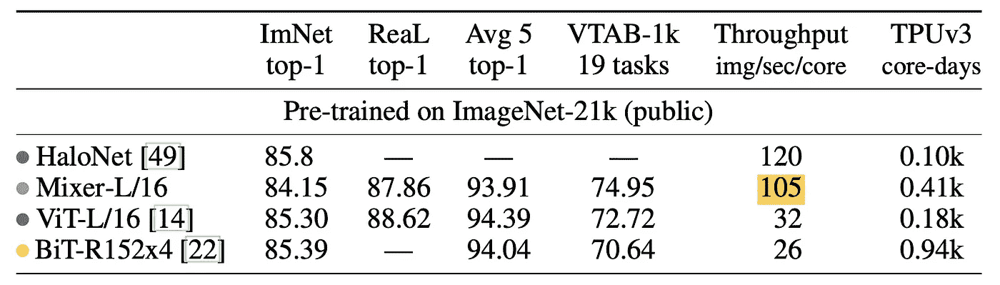

# 谷歌发布 MLP 混合器:全 MLP 架构

> 原文：<https://towardsdatascience.com/google-releases-mlp-mixer-an-all-mlp-architecture-for-vision-824fac3e788c?source=collection_archive---------18----------------------->

## 回到 MLPs 的图像处理，简单但有效(有竞争力的结果)

由 [Unsplash](https://unsplash.com?utm_source=medium&utm_medium=referral) 上的[absolute vision](https://unsplash.com/@freegraphictoday?utm_source=medium&utm_medium=referral)拍摄

图像处理是机器学习中最有趣的分支之一。它从多层感知开始，然后是回旋，然后是自我关注(变形金刚)，现在这篇论文把我们带回 MLPs。如果你和我一样，你的第一个问题会是 MLP 如何达到和变形金刚和 CNN 几乎一样的效果？这是我们将在本文中回答的问题。新提出的“MLP 混合器”实现了非常接近 SOTA 模型的结果，该模型以几乎 3 倍的速度在大量数据上训练。这也是论文中一个有趣的指标(图像/核心/秒)。

提出的 MLP 混合器没有使用任何卷积或任何自我关注层，但却达到了几乎 SOTA 的结果，这是相当发人深省的。

## MLP 混频器架构

在讨论网络如何工作之前，让我们从讨论网络的组件开始，然后将它们放在一起(就像分解汽车引擎并分析各个部分)。

> 我们提出了 *MLP 混合器*，一种完全基于多层感知器(MLPs)的架构。MLP 混合器包含两种类型的层:一种是 MLPs 独立应用于图像面片(即“混合”每个位置的特征)，另一种是 MLPs 跨面片应用(即“混合”空间信息)。

来源:[arxiv 上的 MLP 混音器](https://arxiv.org/abs/2105.01601)

这里要注意的第一件事是输入图像是如何“建模/表示”的，它被建模为面片(当它被分割时)x 通道。第一种类型的层(将称为通道混合层[1])，对图像的独立小块进行操作，并允许在学习期间在它们的通道之间进行通信(因此是通道混合)。然而，第二种类型(称之为补丁混合)的工作方式是相同的，只是针对补丁(允许不同补丁之间的通信)。

现代图像处理网络的核心思想是在给定位置混合特征或者在不同位置之间混合特征[1]。CNN 用卷积、核和池来执行这两种不同类型的混合，而视觉变形者用自我关注来执行它们。然而，MLP 混合器试图以一种更“分离”的方式(下面解释)并且仅使用 MLP 来实现这两者。仅使用 MLP(基本上是矩阵乘法)的主要优点是架构简单和计算速度快。

## 它是如何工作的？

这是有趣的部分，我们讨论输入如何变成输出，以及图像在通过网络时发生了什么。

来源:[arxiv 上的 MLP 混合器](https://arxiv.org/abs/2105.01601) —图像首先被分成不重叠的小块，然后被发送到网络。

第一个完全连接的层将非重叠面片投影到所需的隐藏维度中(根据层的大小)。这一层的类型是有意义的“补丁混合”层。你可以认为这是对图像进行编码，这是神经网络(作为自动编码器)中广泛使用的压缩技巧，用于降低图像的维度，只保留最关键的特征。在这之后，用图像补片的值相对于隐藏尺寸值来构建“表格”。

面片混合层在表格的列上执行其矩阵操作(例如转置)，而声道混合层在表格的行上执行其矩阵操作(这在上面被表示为“混合器层”)。之后，应用非线性激活函数[1]。这听起来可能有点混乱，但直观地说，您可以看到混合器正在试图找到最佳的方式来混合和编码图像的通道和补丁，以获得有意义的输出。

这里要注意的重要一点是，非重叠面片的隐藏表示的大小与输入面片的数量无关。在这里证明这一点将使这篇文章比我想要的长得多，所以请随意检查文件。但是，本质上，这给出了 MLP 混频器与其他架构之间的一个非常重要的性能差异，即:

> MLP 混合器的计算复杂度与输入面片的数量成线性关系，不像 ViT 的复杂度是二次的。

来源:[arxiv 上的 MLP 混音器](https://arxiv.org/abs/2105.01601)

MLP 混频器还有几个优点，简化了其架构:

*   这些层具有相同的尺寸
*   每层仅由 2 个 MLP 块组成
*   每层接受相同大小的输入
*   所有图像块都用相同的投影矩阵进行线性投影

与通常具有金字塔结构的 CNN 相比，这使得对该网络的推理和使用变得简单一些[1]。我记得我第一次试图设计一个 CNN，弄清楚什么时候缩小图像，什么时候放大图像，以及放大/缩小的程度可能有点困难。然而，这些问题在这种体系结构中并不存在。

需要注意的一点是，该模型还使用了跳过连接和正则化，但我不认为我们需要讨论这些概念，因为它们在许多其他资源中被广泛使用和解释。

## 最后的想法

来源:[arxiv 上的 MLP 混音器](https://arxiv.org/abs/2105.01601)

就结果而言，有多个表，这张表突出了一个事实，即混频器的性能与其他架构非常相似，但速度更快。它的“吞吐量”为 105 图像/秒/内核，相比之下，Vision transformer 为 32 图像/秒/内核。平心而论，这听起来可能是一个非常奇怪的指标，有时感觉 ML 的研究人员试图找到一个指标，使他们的网络看起来比其他人好得多。然而，我认为我们都可以客观地同意，仅用 MLP 块就达到相同的性能水平仍然令人印象深刻。

我希望我提供了低层次细节和高层次细节的良好平衡，没有引起太多的混乱。如果你有任何不明白的地方，请在评论中告诉我，我会尽我所能进一步解释。

# 谢谢你

感谢您阅读本文:)如果您喜欢这篇文章，请考虑在这里给我买杯咖啡(咖啡有助于我写作):

 [## mostafaibrahim

### 嘿，你好👋谢谢你考虑给我买一杯咖啡，☕️，说清楚一点，你的钱不会帮我付账单，我…

www.buymeacoffee.com](https://www.buymeacoffee.com/mostafaibrahim) 

如果你想定期收到关于人工智能和机器学习的最新论文的评论，请在这里添加你的电子邮件并订阅！

https://artisanal-motivator-8249.ck.page/5524b8f934

## 参考

[1][arxiv 上的 MLP 调音台](https://arxiv.org/abs/2105.01601)