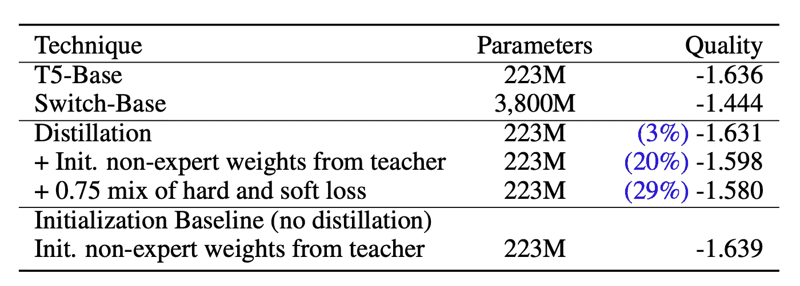

# 谷歌开关变压器:在恒定计算成本下扩展到万亿参数模型

> 原文：<https://towardsdatascience.com/google-switch-transformers-scaling-to-trillion-parameter-models-with-constant-computational-costs-806fd145923d?source=collection_archive---------14----------------------->

## **在强烈调整的 T5-XXL 基线(谷歌的顶级变压器)上实现了 4 倍的预训练加速。**

由[亚瑟·奥西皮扬](https://unsplash.com/@arty_nyc?utm_source=medium&utm_medium=referral)在 [Unsplash](https://unsplash.com?utm_source=medium&utm_medium=referral) 上拍摄的照片

变形金刚已经在机器学习方面取得了巨大的成功，特别是 NLP(现在还有图像处理)。它们是目前最热门的话题之一，谷歌试图改善它们是有道理的。

几天前，谷歌发布了一篇新的大型论文，提出了一种新的方法，在保持每秒浮点运算次数(ML 计算成本标准度量)的同时，大幅增加参数的数量。

众所周知，增加参数的数量会增加模型的复杂性和学习能力(当然在一定程度上)。正如预期的那样，该车型比 [T5-XXL](https://huggingface.co/google/t5-xxl-ssm) 提高了 4 倍，比 T5-Base 和 [T5-Large](https://huggingface.co/t5-large) 提高了 7 倍。

他们的论文比大多数论文都要大得多(大约 30 页)，所以为了使这篇文章简明扼要，我将突出最重要的细节。

## 先决条件

[科学高清照片](https://unsplash.com/@scienceinhd?utm_source=medium&utm_medium=referral)上 [Unsplash](https://unsplash.com?utm_source=medium&utm_medium=referral)

1.  **混合专家(MoE)算法**

> 专家混合指的是一种机器学习技术，其中使用多个专家(学习者)将问题空间划分为同质区域。…如果输出以多级概率选通函数为条件，这种混合被称为专家的分层混合。

来源:[维基百科](https://en.wikipedia.org/wiki/Mixture_of_experts#:~:text=Mixture%20of%20experts%20refers%20to,problem%20space%20into%20homogeneous%20regions.&text=If%20the%20output%20is%20conditioned,a%20hierarchical%20mixture%20of%20experts.)

关于 MoE 最有趣的事情之一是，虽然典型的深度学习网络对所有输入使用相同的参数，但 MoE 会调整网络，对不同的输入使用不同的参数。这使得网络更加通用。

如果你想一想，这意味着模型将有大量(稀疏)的参数，然而，并不是所有的参数都会同时使用，这是本文的本质。

MoE 在本文之前就已经介绍过了，但是，它有几个训练不稳定性和计算成本问题，本文已经解决了。

2.**蒸馏**

蒸馏本质上是 ML 中的“教”。当一个更小的网络模仿一个更大更好的网络，而不需要经过漫长的训练过程，就可以从中学习。这与迁移学习有所不同，并提供了显著的性能提升。

事实上，脸书最近最先进的 DeIt 论文使用 0 卷积和不到 1%的最先进数据集对图像进行分类依赖于蒸馏。如果您有兴趣了解更多关于蒸馏令牌的技巧，请在这里查看我的文章:

</facebook-deit-a-promising-new-technique-for-image-classification-6516f039b4bb>  

3.**模型和数据分片(并行)**

当模型和数据极其庞大时，您必须开始将它们分散到多个内核中。这通常是有挑战性的，但是因为这里的模型基本上是稀疏的(不是所有的参数总是被使用)，这是容易的。其实主要卖点就是简单高效的稀疏性！

## **论文集锦(简述其工作原理)**

照片由 [Garett Mizunaka](https://unsplash.com/@garett3?utm_source=medium&utm_medium=referral) 在 [Unsplash](https://unsplash.com?utm_source=medium&utm_medium=referral) 上拍摄

这篇论文最令人愉快的一点是他们使用了“工程思维”。当处理大量的计算能力和模型参数时，你必须聪明。这就是为什么第一个重点是如何在关注后将令牌发送给正确的专家(MoE)。

这个模型从一个经典的[自我关注模块](/illustrated-self-attention-2d627e33b20a#:~:text=In%20layman%27s%20terms%2C%20the%20self,these%20interactions%20and%20attention%20scores.)(变形金刚的精髓)开始。注意部分可以聚合信息，将序列中的各个项目相互关联起来，并将它们转换成一个新序列，在这个新序列中，标记可以从其他标记收集信息。[2]

之后，有一个前馈网络(FFN)，其中每个令牌都被隔离。FFN 的工作是为下一组层的**确定每个标记的最佳表示。所以基本上注意力是一种相互关联的记号，前馈层是相互关联的层[2]。你可以认为 FFN 是两个实体之间翻译的中间人。一边是需要处理的令牌，另一边是一组专家。**

现在有趣的是，我上面描述的都是 MoE 变压器，我们还没有开关变压器！

## 路由技巧

交换变压器在 FFN 层之前引入“交换”层，该层实质上推动 FFN 成为专家，并且该交换将每个令牌匹配到正确的 FFN /专家。它本质上将正确的令牌路由给最合适的“专家”。

例如，一个 FFN 层可能是处理名词的专家，另一个层可能专门处理动词、标点符号等……[2]。

他们称这个概念为**交换路由**，它本质上是混合专家的升级。之前 MoE 的作者假设，由于计算成本的需求，这是不可能的。Google 在这个领域引入了一个非常新颖的解决方法。

> 相反，我们使用一种简化的策略，只向一个*专家发送。我们表明，这种简化保持了模型质量，减少了路由计算，性能更好。这种 k = 1 的路由策略后来被称为交换层。交换层有三方面的好处:*
> 
> (1)减少了路由器计算，因为我们仅将令牌路由到单个专家。
> 
> (2)每个专家的批量大小(专家容量)可以至少减半，因为每个令牌仅被路由到单个专家。
> 
> (3)简化了路由实现，降低了通信成本。

来源:[开关变压器论文](https://arxiv.org/abs/2101.03961)

我们都知道 ML 依赖于浮点运算。如果你要部署一个大型的分布式模型，你必须发送大量的浮点数。浮点数主要有两种大小:16 位和 32 位，如果你只发送 16 位的数，你将不能进行标准的 ML 计算，并且由于计算的限制，你不能发送 32 位的数(这是交换路由所需要的)。

那么他们做了什么..？他们引入了一种**选择性精度**技术，向模型发送 16 位浮点，并选择性地将所需的浮点放大到 32 位浮点，以执行所需的操作，然后再将这些浮点缩小到 16 位。解决难题的简单方法！

他们还通过**能力因子**的概念来优化这些过程，其中每个专家只处理一定数量的令牌。

此外，为了缓解一些部署问题(因为这些模型非常庞大)，他们使用基于 [BERT](/bert-explained-state-of-the-art-language-model-for-nlp-f8b21a9b6270) 模型的**蒸馏技术**。

来源: [arxiv](https://arxiv.org/abs/2101.03961) (乳胶转载表)

结果是在不增加参数数量的情况下，性能提高了 3–30%。这证明了蒸馏的神奇！

**最终想法**

这篇论文里好像做了很多工作，我还没有全部涵盖！文中有更多关于分发模型和数据的内容，但我的目的是展示亮点。看到创新总是很棒，我认为最好的部分是他们使用工程和计算机系统技术来解决 ML 问题(如路由和选择性精度)。这表明，ML 不仅是数学和统计学，也是计算机科学。

如果你有兴趣阅读更多关于其他小说的文章，请点击这里查看我的文章:

</open-ai-clip-learning-visual-concepts-from-natural-language-supervision-d02644969278>  </openai-curl-reinforcement-learning-meets-unsupervised-learning-b038897daa30>  </the-first-rl-approach-to-control-blood-glucose-without-requiring-meal-announcements-daa6a7f47c2b>  

如果你想定期收到关于人工智能和机器学习的最新论文的评论，请在这里添加你的电子邮件并订阅！

[https://artisanal-motivator-8249.ck.page/5524b8f934](https://artisanal-motivator-8249.ck.page/5524b8f934)

**参考文献:**

[1]开关变压器:通过简单有效的稀疏性扩展到万亿参数模型。威廉·费杜斯、巴雷特·佐夫和诺姆·沙泽尔。2021.在 [arxiv](https://arxiv.org/abs/2101.03961) 中

[2]开关变压器:通过简单有效的稀疏性扩展到万亿参数模型。youtube 上的扬尼克·基尔彻