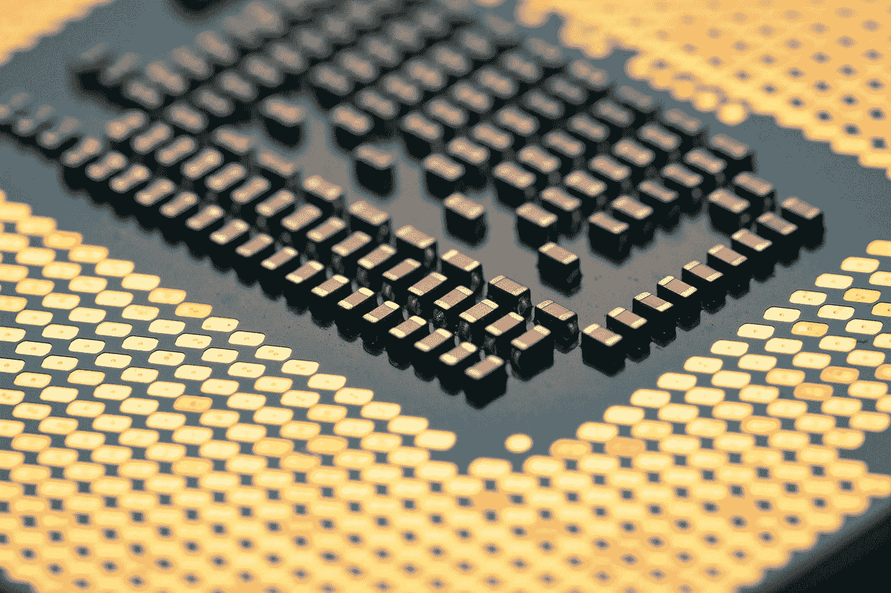

# 谷歌张量让人工智能变得更好:下面是方法

> 原文：<https://towardsdatascience.com/google-tensor-changed-ai-for-the-better-here-is-how-b476eea684f6?source=collection_archive---------9----------------------->

## [社区笔记](https://pedram-ataee.medium.com/list/notes-on-community-cc93416f5a13)

## 我认为这是人工智能领域一场革命的三个原因

由[瑞恩](https://unsplash.com/@rioryan?utm_source=medium&utm_medium=referral)在 [Unsplash](https://unsplash.com?utm_source=medium&utm_medium=referral) 上拍摄

谷歌设计了自己的人工智能芯片，名为 **Tensor** ，用于其新的 Pixel 6 智能手机。该芯片结合了 GPU、CPU、ISP(图像信号处理器)、TPU(张量处理单元)和专用安全芯片。据一位谷歌高管称，Tensor 比 Pixel 5 中使用的高通骁龙 765G 快四倍多。谷歌想要比以前更好地为用户带来 **Edge AI** ，他们需要一个更强大的 AI 芯片。他们希望向用户推出增强的计算摄影，如*消除摄影炸弹*和*解决模糊的面孔*，帮助他们轻松完成日常任务。此外，他们希望为用户更好地引入*实时翻译*和*转录*。使用旧的高通芯片是不可能的。

> 人工智能芯片是一种处理器，经过优化，可以通过谷歌的 TensorFlow 和脸书的 PyTorch 等 ML 框架运行机器学习任务。

人工智能的发展面临着许多伦理上的和技术上的挑战，这些挑战可能会从根本上阻止它的进步。伦理挑战之一是，由于各种隐私行为，我们不能将所有数据发送到人工智能模型运行的云端。我们必须找到在用户层面运行这些模型的方法，这就是所谓的边缘人工智能。技术挑战之一是我们缺乏人工智能专用硬件，这降低了人工智能产品的开发或采用速度。CPU 不是为人工智能中的特殊计算而设计的，因此，当涉及到大型人工智能模型时，它们缺乏效率。与 CPU 相比，GPU 具有更高的效率；然而，它们还不是最佳的。

在这篇文章中，我想分享为什么我认为张量是人工智能发展中的一个惊人的里程碑，以解决上述挑战。希望你会觉得有趣。

# —张量和张量流:一个强大的组合💪

谷歌大脑团队几年前开发了一个名为 Tensorflow 的高级人工智能框架。之后，谷歌设计了自己的处理单元，名为张量处理单元或 TPU，以更有效地执行张量流。TPU 的发明是人工智能的一场革命，大大加快了拥有数百万(或数十亿)参数的庞大机器学习模型的训练。然而，这项技术不能用于 Edge AI 中的智能手机等低功耗设备。谷歌加入低功耗设备的人工智能芯片制造俱乐部可能是该行业的下一场革命。许多公司如 [FogHorn](https://www.foghorn.io/) 和 [BlinkAI](https://www.blink.ai/) 正在使用市场上现有的 AI 芯片进行边缘 AI 研究。然而，Google 通过 TensorFlow 和 Tensor 的结合所能创造的功效将是改变游戏规则的。欢迎加入俱乐部，谷歌！

# — Tensor 是 AI 设计的 AI 芯片！😲

是不是很酷？这个故事是从《自然》杂志上发表的一篇文章开始的，标题是“T4:一种快速芯片设计的图形布局方法”。为了设计一个处理芯片，有一个被称为“布局规划”的关键步骤，其中工程团队必须放置大量元件，以满足包括功耗和性能在内的一系列物理要求。我没有进一步深入它的细节，因为我也不是硬件工程方面的专家。然而，当你在一系列约束条件下做出一系列选择时，人工智能可以发挥作用。你可能还记得 AlphaGo 项目是如何击败一名职业人类围棋选手的。这是完全一样的。张量是这个项目的真正成果，是人工智能行业的一个新的里程碑。太棒了，谷歌！

# ——张量帮助我们构建伦理人工智能。💡

这是一个双刃剑的说法。伦理人工智能有从数据隐私到全民人工智能的各个方面。Tensor 帮助许多用户有机会尝试最新的人工智能进展，而他们并不担心自己的隐私。为什么？因为 AI 引擎在芯片上运行，没有数据被发送到云端进行进一步计算。另一方面，谷歌将人工智能软件和硬件绑定得越紧密，其他公司就越难竞争。我不想看到有一天其他公司甚至不能在执行人工智能推理上竞争，即在使用人工智能上竞争。我们几乎输给了大型科技公司。如果我们在人工智能推理上输给他们，那将是一场噩梦。这就是为什么我认为“张量帮助我们建立道德人工智能”是一把双刃剑。

 [## 致数据科学界的公开信

### 人工智能伦理挑战:偏见和偏见，经济不平等和全球变暖

towardsdatascience.com](/an-open-letter-to-data-science-community-cc887d45a3d1) 

# 感谢阅读！

如果你喜欢这个帖子，想支持我…

*   *跟我上* [*中*](https://medium.com/@pedram-ataee) *！*
*   *在* [*亚马逊*](https://www.amazon.com/Pedram-Ataee/e/B08D6J3WNW) *上查看我的书！*
*   *成为* [*中的一员*](https://pedram-ataee.medium.com/membership) *！*
*   *连接上*[*Linkedin*](https://www.linkedin.com/in/pedrama/)*！*
*   *关注我* [*推特*](https://twitter.com/pedram_ataee) *！*

 [## 通过我的推荐链接加入 Medium—Pedram Ataee 博士

### 作为一个媒体会员，你的会员费的一部分会给你阅读的作家，你可以完全接触到每一个故事…

pedram-ataee.medium.com](https://pedram-ataee.medium.com/membership)