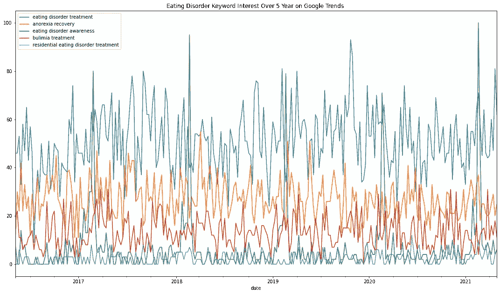

# 谷歌趋势分析

> 原文：<https://towardsdatascience.com/google-trends-analysis-1f029c941ba?source=collection_archive---------25----------------------->

# 心理健康宣传月


[活动发起人](https://unsplash.com/@campaign_creators?utm_source=unsplash&utm_medium=referral&utm_content=creditCopyText)在 [Unsplash](https://unsplash.com/s/photos/google-trend-data?utm_source=unsplash&utm_medium=referral&utm_content=creditCopyText) 上的照片

五月是[心理健康宣传月](https://www.nami.org/Get-Involved/Awareness-Events/Mental-Health-Awareness-Month)，正因为如此，我选择写一个与心理健康相关的数据科学项目。本教程将介绍分析与饮食失调相关的 Google 趋势数据的过程。

# 连接到 Pytrends

该分析的第一步是安装适当的软件包。在这种情况下，我们需要 pytrends，它连接到 [Google Trends](https://trends.google.com/trends/?geo=US) 数据。

```
!pip install pytrends
```

接下来，我们必须导入 pandas 库以允许我们处理数据帧。然后，我们启动 pytrend 函数。

```
import pandas as pdfrom pytrends.request import TrendReqpytrend = TrendReq()
```

下一步是建立一个你想要调查的关键词列表。在这种情况下，我们正在寻找与进食障碍恢复和/或意识相关的关键词。这是作为起点的五个基本关键字的示例。我们通过调用关键字列表并设置时间范围来定义 pytrend 在本例中是过去五年。

```
kw_list = ['eating disorder treatment', 'anorexia recovery', 'eating disorder awareness', 'bulimia treatment', 'residential eating disorder treatment']pytrend.build_payload(kw_list, cat=0, timeframe='today 5-y', geo='', gprop='')
```

接下来，我们创建一个随时间变化的数据框架。为了简单起见，我称这个数据帧为“df ”,但是你可以随便叫它什么。

```
df=pytrend.interest_over_time()
```

现在我只想看到数据帧的前十行，所以我调用 head 函数。这将以表格形式显示每个关键字的数据。

```
df.head()
```


数据帧输出

# 这是什么意思？

这些数字到底是什么意思？Simon Rogers[在之前的一篇媒体文章中对 Google Trends 数据做了简单的解释。基本上，兴趣分数从 0 到 100，这表明了与特定关键字相关的谷歌搜索的参与度。因此，兴趣越高，搜索就越多，这对于公司的 SEO 活动或其他营销活动来说是有益的。让我们在接下来的几个步骤中绘制出一些兴趣趋势，以显示对不同饮食失调关键词的兴趣是如何变化的。首先，我们将导入 numpy 和 matplotlib 来绘制数据。](https://medium.com/google-news-lab/what-is-google-trends-data-and-what-does-it-mean-b48f07342ee8)

```
import numpy as npimport matplotlib.pyplot as pltdata = df.drop(labels=['isPartial'],axis='columns')data.to_csv('MentalHealthGoogleTrends.csv', encoding='utf_8_sig')image = data.plot(title = 'Eating Disorder Keyword Interest Over 5 Year on Google Trends ')fig = image.get_figure()fig.set_size_inches(18.5, 10.5)fig.savefig('GoogleTrends.png')
```



谷歌趋势利息日期图

# 过去五年对 ED 恢复的兴趣

上面的图表明，在过去的五年里，人们对饮食失调恢复关键词的兴趣(至少在谷歌看来)有所波动。我们可以看到，“饮食失调治疗”是目前最受欢迎的搜索。令人惊讶的是，虽然 2017 年有所增长，但 2018 年又回落了。它似乎像一种趋势一样循环往复，考虑到当今时代 ED 的发病率正在增加，这是很有趣的。

另一个有趣的发现是，“住宿饮食障碍治疗”的搜索兴趣最低。作为一个搜索过 ed 治疗的人，我知道在门诊治疗之后，下一步往往是住院治疗。此外，寻找合适的居住设施需要大量的时间和研究，所以有趣的是，今天没有多少人在搜索这个术语。

# 后续步骤

现在我们已经有了一些直观的关键词的趋势，是时候找到与热门关键词(饮食失调治疗)相关的关键词了。我们将用我们最感兴趣的关键字启动 pytrend 负载，然后运行相关的查询搜索。

```
pytrend.build_payload(kw_list=['Eating Disorder Treatment'])related_queries = pytrend.related_queries()
```

接下来，我们调用刚刚提取的值。

```
related_queries.values()
```


从这个图表中，我们可以看到，最上面的关键词是“进食障碍的治疗”。然而，如果我们在上升类别下看，我们看到“我附近的住院饮食障碍治疗”越来越受欢迎。

# 相关主题

现在我们来看看相关的话题。这遵循类似的协议，但将返回与“饮食失调治疗”相关的首要主题。

```
related_topic = pytrend.related_topics()related_topic.values()
```


我们可以看到，上升的话题和我们感兴趣的关键词没有必然联系。然而,“热门”话题肯定与我们正在看的内容无关。这表明，有时谷歌趋势数据需要谨慎对待。

# 结论

这只是对 pytrends 的介绍。通过查看与饮食失调治疗相关的谷歌趋势数据，我们获得了有用的见解。例如，如果这是国家饮食紊乱协会(NEDA)的营销机构，这些见解可以应用于他们的付费和有机搜索策略。