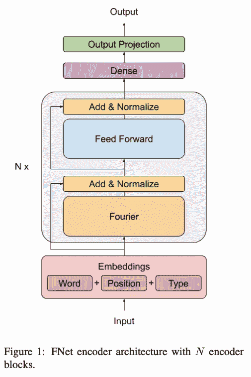
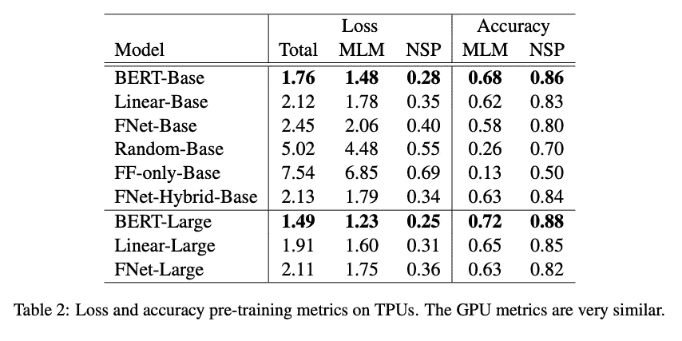
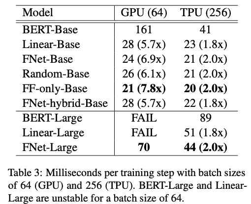

# Google 的 FNet:混合令牌和傅立叶变换

> 原文：<https://towardsdatascience.com/googles-fnet-mixing-tokens-with-fourier-transforms-f98778168c45?source=collection_archive---------10----------------------->

## 借助傅立叶变换的魔力，将变形金刚的训练速度提高 7 倍

Amr Taha 在 [Unsplash](https://unsplash.com?utm_source=medium&utm_medium=referral) 上拍摄的照片

> 通过用线性变换替换注意力子层，我们能够降低 Transformer 架构的复杂性和内存占用。我们表明，FNet 在速度、内存占用和准确性之间提供了一个很好的折衷，在 GLUE 基准测试中，在通用分类迁移学习设置中实现了 BERT 的 92%的准确性(Wang et al .，2018)，但在 GPU 上训练**的速度是 7 倍**，在 TPUs 上是 2 倍

来源: [Arxiv](https://arxiv.org/pdf/2105.03824.pdf)

最近的 ML 论文的目标是摆弄变压器层。看看哪些有用，哪些没用是很有趣的(尽管我们可能只能从那些论文中看到哪些有用)。由于变压器的大量使用，我认为过去的 6-12 个月是关于优化它们的。从改变层到减少自我关注层，到大大减小变压器网络尺寸。这篇论文综述将讨论如何改变层来提高训练速度，最有趣的部分是它是使用傅立叶变换完成的。

## **什么是傅立叶变换？**

> [傅立叶变换](https://en.wikipedia.org/wiki/Fourier_transform)是一个数学概念，可以 ***将信号分解成其组成频率*** 。傅立叶变换不仅给出信号中存在的频率，还给出信号中存在的每个频率的幅度。

来源: [TDS](/understanding-audio-data-fourier-transform-fft-spectrogram-and-speech-recognition-a4072d228520)

傅立叶变换是信号处理中最常用的变换之一。它本质上是以一种特定的方式将图形的信号波“包裹”在一个圆上，这样您就可以更容易地提取信号属性和特征(从而处理信号)。如果你和我一样是个数学呆子，你一定听说过傅立叶变换。但是，让我感兴趣的是这和神经网络有什么关系？变压器通常处理 NLP，而不是信号处理，这也是我选择回顾本文的主要原因。

然而，令我惊讶的是，这些傅立叶变换似乎在深度学习领域有许多应用，例如[1]:

*   [解偏微分方程](https://arxiv.org/pdf/2010.08895.pdf)(用神经网络！)
*   加速回旋
*   稳定递归神经网络(傅立叶 RNN 和 ForeNet)

## 为什么要改变自我关注层？

虽然自我注意块导致更高的准确性，并为网络提供有用的上下文含义，但它们在计算上是昂贵的。这里的研究显示了一些非常重要的发现——对那些自我关注块的需求**很快就饱和了。**在阅读了最近的多篇变压器优化论文后，我开始注意到这一趋势。自我关注是相当强大的，但它本质上正在成为一个瓶颈，在不影响表现的情况下，有一个取代它的竞赛。

事实上，在 Nvidia 最近在[发表的一篇论文中，他们发现对于大多数架构来说，将不到 50%的层作为自我关注块在性能方面更有效，而对于 Transformer-XL，他们建议大约 20%。此外，这些块应该只在网络的前 2/3 中(不在整个网络中交错)**。这导致自我关注块减少了 63%,计算时间减少了 35%。**](/nvidias-pay-attention-when-required-a-transformer-optimization-approach-694d1472da14)

FNet 论文研究了一种不同的方法来混合变压器令牌(这是自我关注所做的)，并提出了一种新的线性方法来使用 FTs 这样做。事不宜迟，让我们开始吧

## FNet 架构

来源: [Arxiv](https://arxiv.org/pdf/2105.03824.pdf)

架构实际上非常简单，这就是为什么这一部分不会很长的原因。这种架构与经典架构的唯一区别在于，编码器的自我关注层被傅立叶层[1]取代，傅立叶层对输入序列长度和隐藏维度进行 2D 傅立叶变换。这样做背后的主要直觉是傅立叶变换可能能够为混合输入令牌提供更好的方法(通过它的变换)。

从计算机科学的角度来看，由于非线性和自关注的复杂性，变压器具有二次复杂性(O(N))。然而，傅立叶变换是线性的，因此提供了更好的复杂性(并且增加了计算速度)。此外，与自我关注计算相比，傅立叶变换的计算在 GPU/TPU 上更加优化[1]。此外，傅立叶变换层不像自我注意那样有任何可学习的权重，因此使用更少的内存(因为模型尺寸变小了)。

## 简要结果

好吧，这听起来很简单，只是对网络中一种类型的图层进行了更改。让我们来看看这种变化可能带来的影响。

来源: [Arxiv](https://arxiv.org/pdf/2105.03824.pdf)

请注意，F-Net 的准确性比 BERT 稍低，但是在训练步骤和内存使用方面要快得多。这是我喜欢这篇文章的一个原因，他们展示了他们方法的优点和缺点(无论如何，没有神奇的权衡！).

## 最后的想法

平心而论，即使它实现了同样的性能，我仍然会对这篇论文感兴趣，因为它提供了一种相当新颖的方法来取代自我关注层。就我个人而言，我回顾这些论文并撰写它们的主要原因是为了引发您的思考，展示大公司是如何进行优化的。在阅读本文之前，我从未想过傅立叶变换可以用来优化变压器。我想这促使我们成为更全面的数据科学家，扩展我们的知识视野，因为你永远不知道两种不同的想法可能会在哪里交织成一个。

另一方面，由于离线机器学习的需要(模型部署在小型设备上)，较小的模型变得越来越重要，本文使我们向较小的变压器迈进了一步。我认为意识到机器学习/数据科学行业的发展方向很重要。

最后，如果你对傅立叶变换感兴趣(你应该感兴趣)，我建议看看 3Blue1Brown 的这个令人惊叹的视频:

如果你想定期收到关于人工智能和机器学习的最新论文的评论，请在这里添加你的电子邮件并订阅！

https://artisanal-motivator-8249.ck.page/5524b8f934

## **参考文献:**

[1] FNet on [Arxiv](https://arxiv.org/pdf/2105.03824.pdf)