# 谷歌的开放图像:现在更容易下载和评估与 51

> 原文：<https://towardsdatascience.com/googles-open-images-now-easier-to-download-and-evaluate-with-fiftyone-615ce0482c02?source=collection_archive---------7----------------------->

## 高效下载开放图像，并使用开放图像风格的评估功能对您的模型进行评估

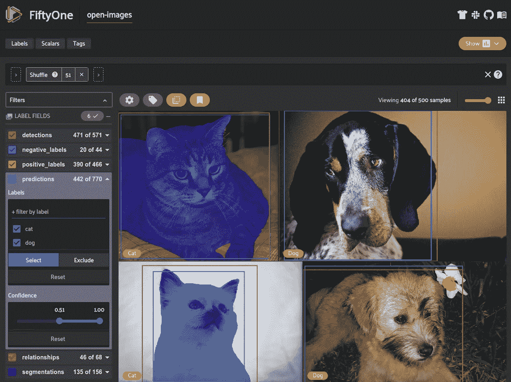

[打开图像数据集](https://voxel51.com/docs/fiftyone/tutorials/open_images.html)在[五十一](http://fiftyone.ai/)下载并可视化(图片由作者提供)

[谷歌的开放图像](https://storage.googleapis.com/openimages/web/download.html)是一个数据集的庞然大物。它拥有超过 900 万张图像、8000 万条注释和跨越多个任务的 600 个类，是计算机视觉社区中领先的数据集之一。

> 使用[开放图像](https://voxel51.com/docs/fiftyone/tutorials/open_images.html)现在比以往任何时候都更容易，因为它集成到了开源 ML 开发工具 [FiftyOne](http://fiftyone.ai/) 。

计算机视觉模型比以往任何时候都更加渴求数据。开发您自己的模型需要您自己收集和注释大量数据，或者求助于公共数据集，希望它们包含与您的任务相关的数据。Open Images 背后的团队致力于为任何人提供一个巨大的数据湖。通过仅在[知识共享署名(CC-BY)](https://creativecommons.org/licenses/by/4.0/) 许可下管理图像，任何感兴趣的人都可以使用开放图像。

凭借图像级标签、分段、视觉关系、本地化叙述和比下一个最大的检测数据集 多 15 倍的 [**对象检测，开放图像可以很容易地添加到您的数据湖和训练工作流中。然而，学习一种新的数据集格式并将其合并到您的工作流程中通常是乏味且耗时的。以前，下载开放图像的过程包括编写定制脚本来下载和解析您想要的图像和标签。这催生了多种工具来帮助加载数据集，但它们都有严重的缺点，比如**](https://arxiv.org/pdf/1811.00982.pdf)**[不支持分段和关系](https://github.com/EscVM/OIDv4_ToolKit)、[没有可视化能力](https://github.com/monocongo/openimages)以及[不能指定下载格式](https://github.com/DmitryRyumin/OIDv6)。**

在 [Voxel51](https://voxel51.com/) ，我们[与 Google](https://storage.googleapis.com/openimages/web/2021-05-12-oid-and-fiftyone.html) 合作，通过将它整合到我们的开源 ML 工具 [FiftyOne](http://fiftyone.ai/) 的[数据集 Zoo](https://voxel51.com/docs/fiftyone/user_guide/dataset_zoo/index.html) 中，创建了一个易于使用的下载开放图像的来源。使用[五十一](http://fiftyone.ai/)，您可以准确指定您想要下载的[开放图像的子集，](https://voxel51.com/docs/fiftyone/user_guide/dataset_zoo/datasets.html#dataset-zoo-open-images)[将其导出](https://voxel51.com/docs/fiftyone/user_guide/export_datasets.html)成几十种不同的格式，在[五十一应用](https://voxel51.com/docs/fiftyone/user_guide/app.html)中可视化，甚至[使用开放图像风格的对象检测评估](https://voxel51.com/docs/fiftyone/user_guide/user_guide/evaluation.html#open-images-style-evaluation)来评估您的模型。

这篇博文将带你了解如何使用 [FiftyOne](http://fiftyone.ai/) 来:

*   [下载开放图片](https://voxel51.com/docs/fiftyone/tutorials/open_images.html)
*   [以不同的数据集格式导出](https://voxel51.com/docs/fiftyone/user_guide/export_datasets.html)打开的图像
*   [使用开放图像风格的评估来评估对象检测模型](https://voxel51.com/docs/fiftyone/user_guide/user_guide/evaluation.html#open-images-style-evaluation)

在我们开始之前，确保[安装 51 个](https://voxel51.com/docs/fiftyone/getting_started/install.html):

```
pip install fiftyone
```

# 跟随在科拉布

你可以直接在[这个 Google Colab 笔记本](https://voxel51.com/docs/fiftyone/tutorials/open_images.html)的浏览器中运行这篇博文中的例子。跟随链接，点击“在 Google Colab 中运行”。

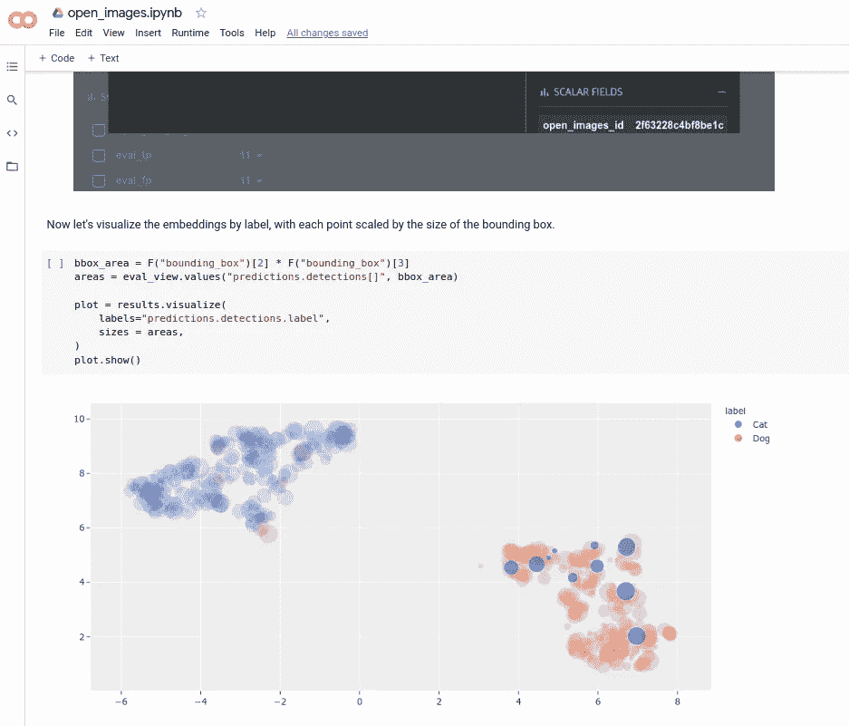

可视化嵌入在笔记本中的开放图像(作者图片)

# 打开 51 数据集动物园中的图像

现在只需要[一个命令或一行 Python 代码](https://voxel51.com/docs/fiftyone/user_guide/dataset_zoo/index.html#basic-recipe)就可以从开放图像中准确下载您想要的样本。然后，您可以在 [FiftyOne 应用程序](https://voxel51.com/docs/fiftyone/user_guide/app.html)中用多一行代码探索数据集。

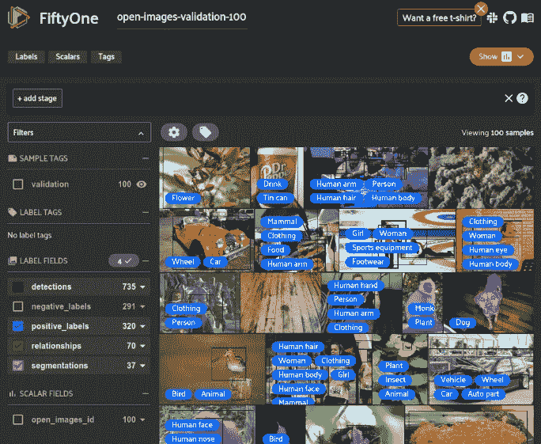

[打开图像数据集](https://storage.googleapis.com/openimages/web/index.html)在[五十一](http://fiftyone.ai/)下载并可视化(图片由作者提供)

将 Open Images 集成到 FiftyOne 中提供了多个参数,您可以使用这些参数来指定您想要下载的样本及其数量:

*   `label_types`:要加载的标签类型列表。值为`("detections", "classifications", "relationships", "segmentations")`。默认情况下，会加载所有标签，但并非每个样本都会包含每种标签类型。如果同时指定了`max_samples`和`label_types`，那么每个样本都将包含指定的标签类型。
*   `split`和`splits`:一个字符串或字符串列表，指示要加载的拆分。可用的拆分是`("test", "train", "validation")`。
*   `classes`:指定需要加载的类的字符串列表。只有包含至少一个指定类实例的示例才会被下载。
*   `attrs`:要加载的关系属性的字符串列表。该参数仅在`"relationships"`处于`label_types`时有用。
*   `max_samples`:导入样本的最大数量。默认情况下，会导入所有样本。
*   `shuffle`:布尔型，指示是否随机打乱导入样本的顺序。
*   `seed`:洗牌时使用的随机种子。
*   `image_ids`:要加载的特定图像 id 列表。id 可以指定为`<split>/<image-id>`或`<image-id>`
*   `image_ids_file`:换行分隔的`.txt`、`.json`或`.csv`文件的路径，包含要加载的图像 id 列表。id 可以指定为`<split>/<image-id>`或`<image-id>`。如果提供了`image_ids`，该参数被忽略

其中一些参数允许您指定希望包含在子集中的特定类和属性。您可以使用以下命令查看打开的图像中的可用选项列表:

利用这一功能，我们可以为特定任务筛选数据集，而无需下载整个数据集或解析任何原始注释文件。例如，如果我们想要训练一个木制物体的检测器，我们可以指定我们只想要来自包含带有注释为`Wooden`的`visual relationship`的物体的开放图像的样本:


木制乒乓球台在五十一年可视化(图片由作者提供)

再比如，我们建立一个检测猫狗的数据集。我们可以为类别`Dog`和`Cat`获得`detections`以及图像级别`classifications`:


在 51 中可视化的开放图像的猫/狗子集(图像由作者提供)

当处理包含对象检测的数据集时，FiftyOne 允许您创建一个[补丁视图](https://voxel51.com/docs/fiftyone/user_guide/app.html#viewing-object-patches)，其中每个样本包含一个对象。当试图分析特定的对象类或属性时，这非常有用，尤其是在混乱的场景中。

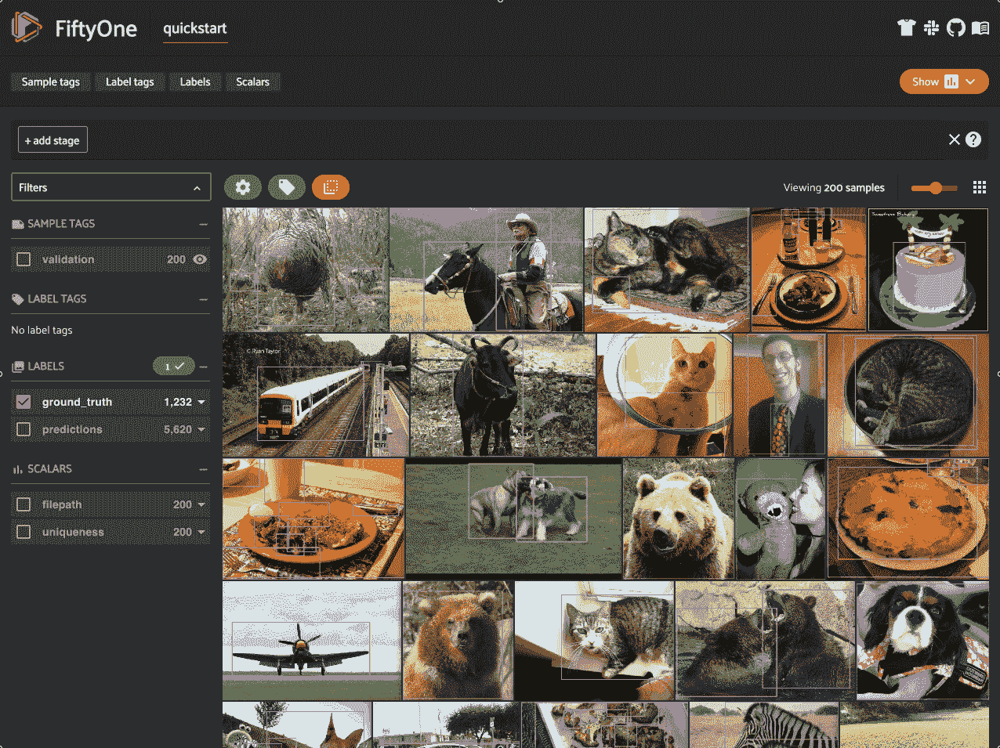

第五十一个应用程序中对象的[补丁视图](https://voxel51.com/docs/fiftyone/user_guide/app.html#viewing-object-patches)示例(图片由作者提供)

# 导出到不同的格式

多年来，COCO 数据集一直是最重要的对象检测数据集，导致相当大比例的计算机视觉(CV)社区采用 [COCO 格式](/how-to-work-with-object-detection-datasets-in-coco-format-9bf4fb5848a4)来解决他们的对象检测问题。为项目选择数据集格式决定了加载和处理数据集所需的解析器，这使得很难处理不同格式的新数据。FiftyOne 允许您[将数据集导出成几十种不同的格式](https://voxel51.com/docs/fiftyone/user_guide/export_datasets.html)让您可以轻松地将其集成到现有的工作流程中。

例如，您可以导出为类似于 [COCO](https://voxel51.com/docs/fiftyone/user_guide/dataset_creation/datasets.html#cocodetectiondataset) 、 [Pascal VOC](https://voxel51.com/docs/fiftyone/user_guide/dataset_creation/datasets.html#vocdetectiondataset) 、 [CVAT](https://voxel51.com/docs/fiftyone/user_guide/dataset_creation/datasets.html#cvatimagedataset) 、 [YOLO](https://voxel51.com/docs/fiftyone/user_guide/dataset_creation/datasets.html#yolodataset) 、 [TFRecords](https://voxel51.com/docs/fiftyone/user_guide/dataset_creation/datasets.html#tfobjectdetectiondataset) 、[分类目录树](https://voxel51.com/docs/fiftyone/user_guide/dataset_creation/datasets.html#imageclassificationdirectorytree)、 [more](https://voxel51.com/docs/fiftyone/user_guide/dataset_creation/datasets.html#supported-formats) 的格式。其中许多格式还支持导出分段掩码。

实际上，以 [COCO 格式](/how-to-work-with-object-detection-datasets-in-coco-format-9bf4fb5848a4)导出我们之前加载到磁盘的打开图像的子集非常简单:

如果您想[将您的数据重新导入到 FiftyOne](https://voxel51.com/docs/fiftyone/user_guide/dataset_creation/index.html) 中，并且数据集遵循一种受支持的格式，这也可以在一行代码中完成:

即使你的数据集是完全自定义的格式，将它加载到 fiftone 中仍然很容易[。](https://voxel51.com/docs/fiftyone/user_guide/dataset_creation/samples.html)

# 开放图像目标检测评估

FiftyOne 不仅可以轻松加载和导出开放图像和自定义数据集，还可以让您[可视化您的数据](https://voxel51.com/docs/fiftyone/user_guide/app.html)和[评估模型结果](https://voxel51.com/docs/fiftyone/user_guide/evaluation.html)。

[Open Images 风格的对象检测评估](https://voxel51.com/docs/fiftyone/user_guide/evaluation.html#open-images-style-evaluation)是为 [Open Images challenges](https://storage.googleapis.com/openimages/web/challenge_overview.html) 创建的。它与可可式评估有几个显著的不同:

*   图像级标签指示在每个图像中评估哪些对象类。如果预测了一个类，但没有将其注释为正或负图像级标签，则该类将被忽略。
*   [语义类层次](https://storage.googleapis.com/openimages/2018_04/bbox_labels_600_hierarchy_visualizer/circle.html)用于扩展预测和基础事实对象列表，以包括和评估所有父类。默认情况下，基本事实检测仅包括叶类，并且必须在评估发生之前展开。这是在五十一中自动执行的。
*   像 COCO 一样，“人群”地面真相检测能够与多个预测相匹配。但与 COCO 不同的是，每个人群中只有一个预测是真正积极的。
*   COCO 式评估在 10 个不同的 IoU 值范围内对 AP 求平均值，Open Images 式评估仅使用 0.5 的 IoU 来计算 mAP。

*如果您想查看* [*开放式图像式评估*](https://voxel51.com/docs/fiftyone/user_guide/evaluation.html#open-images-style-evaluation) *或* [*COCO 式评估*](https://voxel51.com/docs/fiftyone/user_guide/evaluation.html#coco-style-evaluation-default) 的评估协议的详细步骤，请点击这些链接。

为了尝试开放图像风格的评估，我们可以使用来自[51 模型动物园](https://voxel51.com/docs/fiftyone/user_guide/model_zoo/index.html)的模型来生成对我们下载的开放图像的猫和狗子集的检测预测。我们将向数据集添加一个新的`predictions` [字段](https://voxel51.com/docs/fiftyone/user_guide/using_datasets.html#fields):

*注意:运行该模型需要 TensorFlow 1.14。*

```
pip install tensorflow==1.14
```

对于这个例子，我们只对“猫”和“狗”这两个类的预测感兴趣，所以我们可以利用 FiftyOne 灵活的数据集表示来创建一个[视图](https://voxel51.com/docs/fiftyone/user_guide/using_views.html)到只包含这些类的数据集中。此外，我们运行的模型是在 COCO 上训练的，COCO 使用小写类名，因此我们需要[重新映射](https://voxel51.com/docs/fiftyone/user_guide/using_views.html#modifying-fields)它们以匹配打开图像的大写类名:

我们现在可以对数据集和预测运行开放图像风格的评估:

返回的`results` [对象](https://voxel51.com/docs/fiftyone/api/fiftyone.utils.eval.openimages.html#fiftyone.utils.eval.openimages.OpenImagesDetectionResults)包含了我们需要的一切，从[地图](https://voxel51.com/docs/fiftyone/api/fiftyone.utils.eval.openimages.html#fiftyone.utils.eval.openimages.OpenImagesDetectionResults.mAP)，到 [PR 曲线](https://voxel51.com/docs/fiftyone/api/fiftyone.utils.eval.openimages.html#fiftyone.utils.eval.openimages.OpenImagesDetectionResults.plot_pr_curves)，到[混淆矩阵](https://voxel51.com/docs/fiftyone/user_guide/evaluation.html#confusion-matrices)。

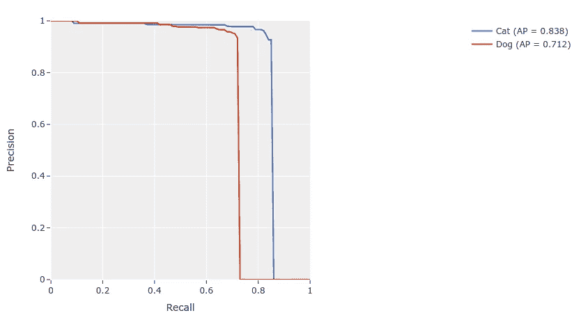

[51 年绘制的 PR 曲线](https://voxel51.com/docs/fiftyone/user_guide/evaluation.html#computing-map-and-pr-curves)(图片由作者提供)

应该注意的是，默认情况下，这些检测协议将只把预测对象与同一类别的基本事实对象进行匹配。这意味着，如果我们想要一个有趣的[混淆矩阵](https://voxel51.com/docs/fiftyone/user_guide/evaluation.html#confusion-matrices)，我们将需要用等于`False`的参数`classwise`进行评估:

我们现在可以查看一个[交互式混淆矩阵](https://voxel51.com/docs/fiftyone/user_guide/plots.html#confusion-matrices)，其中如果我们单击一个单元格，则[51 个应用程序](https://voxel51.com/docs/fiftyone/user_guide/app.html)将会更新，仅显示该单元格中存在的样本。因此，例如，如果我们单击包含与预测的“猫”检测相匹配的真实“狗”检测的单元，我们可以深入了解我们模型的故障模式:

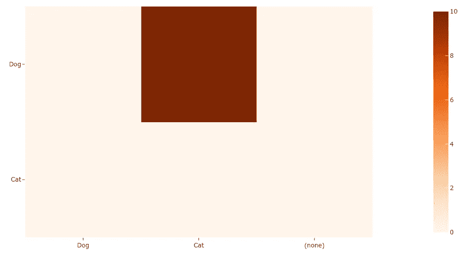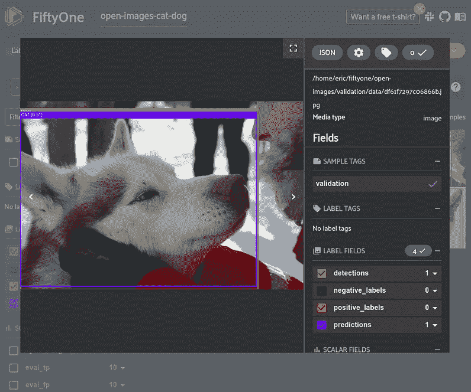

假阳性在 51 中交互可视化(图片由作者提供)

*注:* [*互动剧情*](https://voxel51.com/docs/fiftyone/user_guide/plots.html) *目前仅在 Jupyter 笔记本中支持。对其他环境的支持将很快增加。*

当在 51 中评估对象检测数据集时，在运行`evaluate_detections`并用`eval_key`将结果存储在数据集上之后，我们能够创建所谓的[评估视图](https://voxel51.com/docs/fiftyone/user_guide/app.html#viewing-evaluation-patches)。这是数据集的一个视图，其中每个样本都是一个单独的基础事实或预测对象补丁，允许您按真阳性、假阳性和假阴性、匹配的 IoU 以及单击按钮的其他评估元数据进行排序。

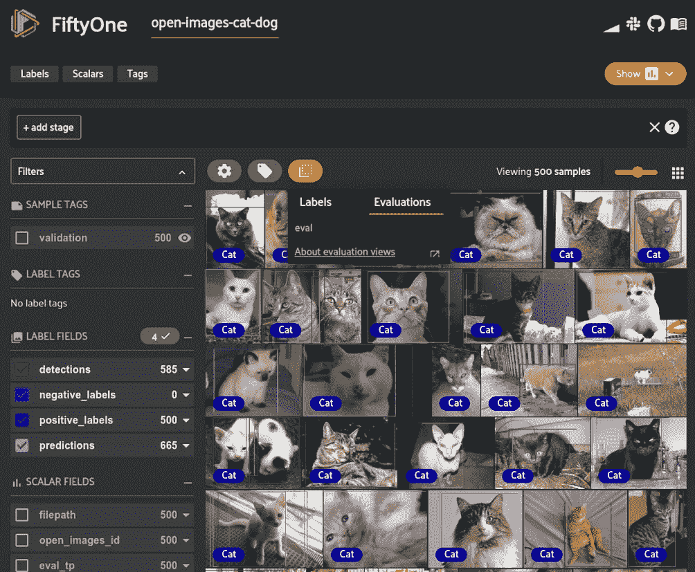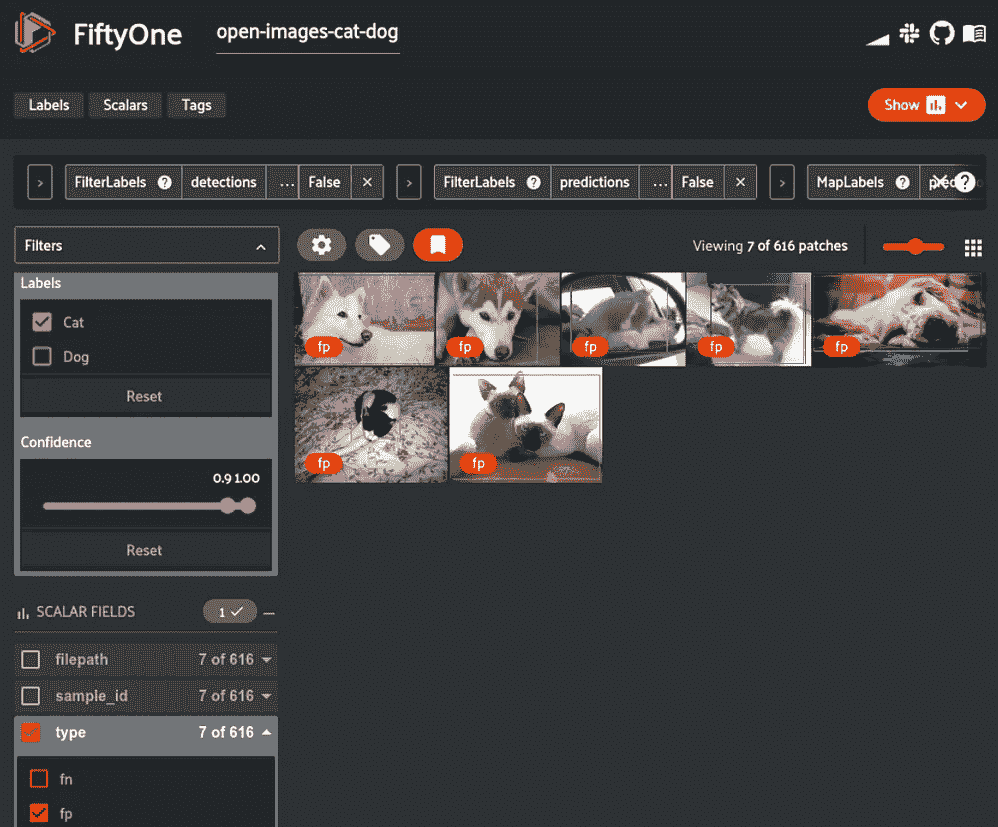

在第五十一个应用中创建[评估视图](https://voxel51.com/docs/fiftyone/user_guide/app.html#viewing-evaluation-patches)(图片由作者提供)

# 高级数据集探索

如果我们想对我们的模型有一个更细致的了解，那么在低维空间中[可视化对象嵌入是很有用的，它允许我们快速挑选出数据中的模式、集群和异常。51 号大脑](https://voxel51.com/docs/fiftyone/user_guide/brain.html#brain-embeddings-visualization)正是提供了这种工作流程。

*注意:大脑* *默认使用的* [*降维方法是* `*umap*` *我们需要安装:*](https://voxel51.com/docs/fiftyone/user_guide/brain.html#dimensionality-reduction-methods)

```
pip install umap-learn
```

我们可以再次使用[51 模型动物园来生成嵌入](https://voxel51.com/docs/fiftyone/user_guide/model_zoo/index.html#embeddings)，然后我们将可视化这些嵌入:


[第五十一届互动嵌入可视化](https://voxel51.com/docs/fiftyone/tutorials/image_embeddings.html)(图片由作者提供)

由于多种原因，这种可视化非常有价值，尤其是对于像包含机器生成标签的开放图像这样的数据集。可视化和交互式探索嵌入使您可以快速抽查哪些机器生成的标签可能需要检查并发送进行重新标注。

我们还可以使用这些嵌入来自动[查找相似和重复的样本](https://voxel51.com/docs/fiftyone/user_guide/app.html#sorting-by-visual-similarity)，只需点击一个按钮。

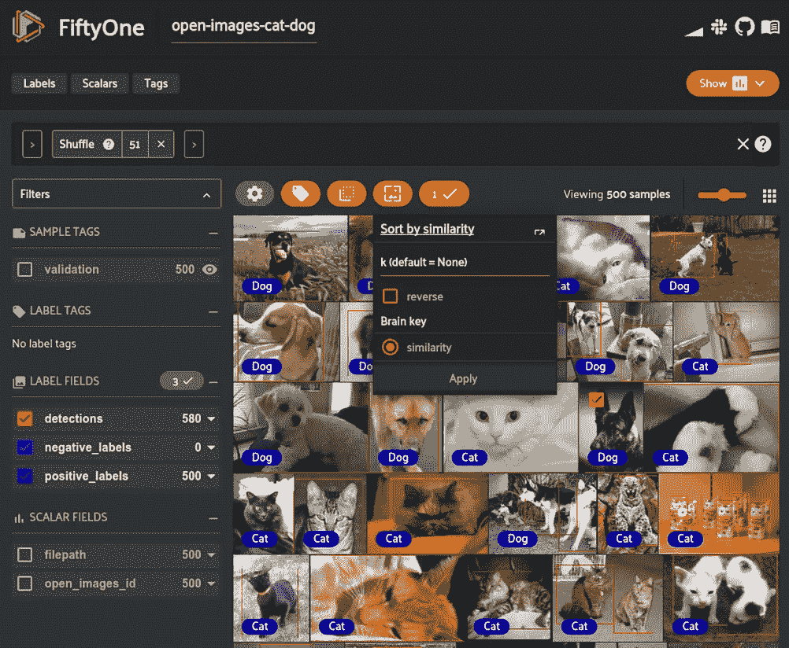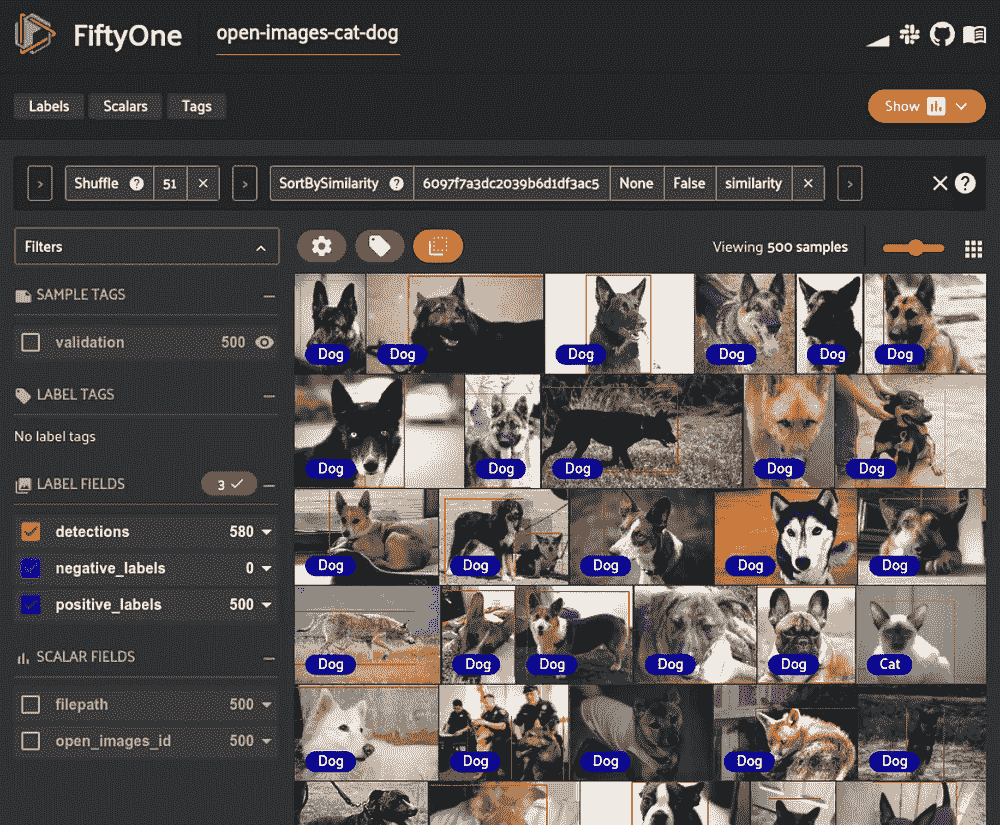

选取样本并按相似度排序[第五十一(图片由作者提供)](https://voxel51.com/docs/fiftyone/user_guide/app.html#sorting-by-visual-similarity)

一旦我们彻底探索了我们的数据集，并找到了我们想要进一步分析或改进的方面，就很容易[标记单个样本或标签](https://voxel51.com/docs/fiftyone/tutorials/open_images.html#Tagging)以便将其隔离用于下游用例。


51 中的标签样本(图片由作者提供)

# 摘要

[Open Images](https://storage.googleapis.com/openimages/web/download.html) 是一个大规模但经过彻底标记的数据集，可以为您的数据湖和模型训练工作流增加有用的内容。下载和探索[开放图像](https://storage.googleapis.com/openimages/web/download.html)最简单的方法是使用[51](https://voxel51.com/docs/fiftyone/index.html)。对于像[开放图像](https://storage.googleapis.com/openimages/web/download.html)一样大的数据集，动手评估您的模型结果可能会很困难。通过可视化嵌入，FiftyOne 可以轻松理解数据集，找到模型中的故障模式，并揭示数据中的模式。

# 关于体素 51

[Voxel51](https://voxel51.com/) 总部位于密歇根州安阿伯，由 Jason Corso 博士和 Brian Moore 博士于 2016 年创立，是一家人工智能软件公司，通过提供开放核心软件构建模块，使计算机视觉和机器学习工程师能够快速设计数据驱动的工作流，从而实现软件 2.0 的民主化。

想了解更多？在 [fiftyone.ai](http://fiftyone.ai/) 查看我们的网站。