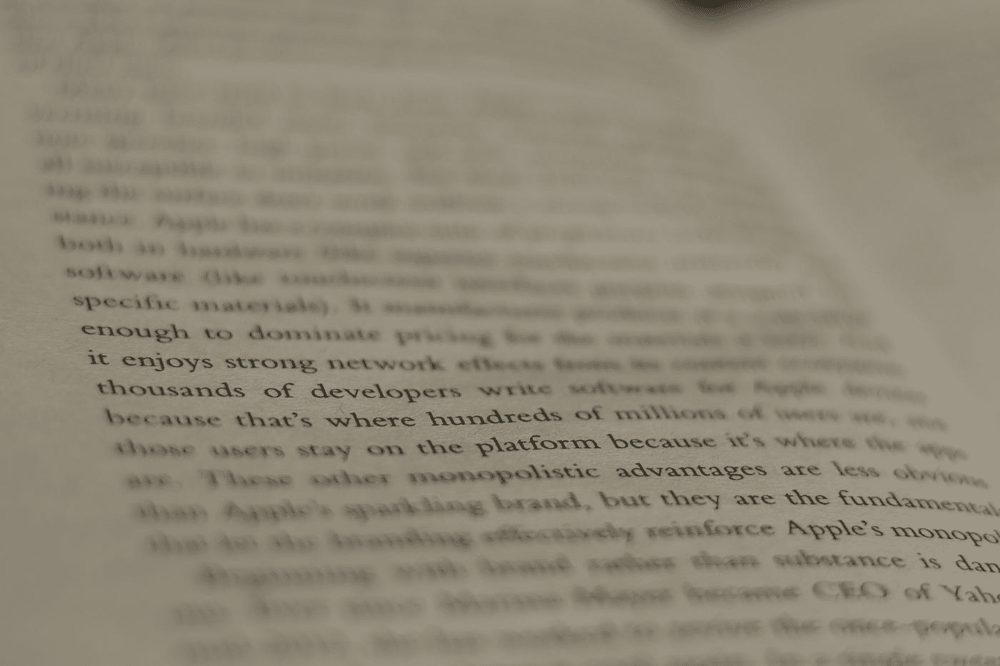
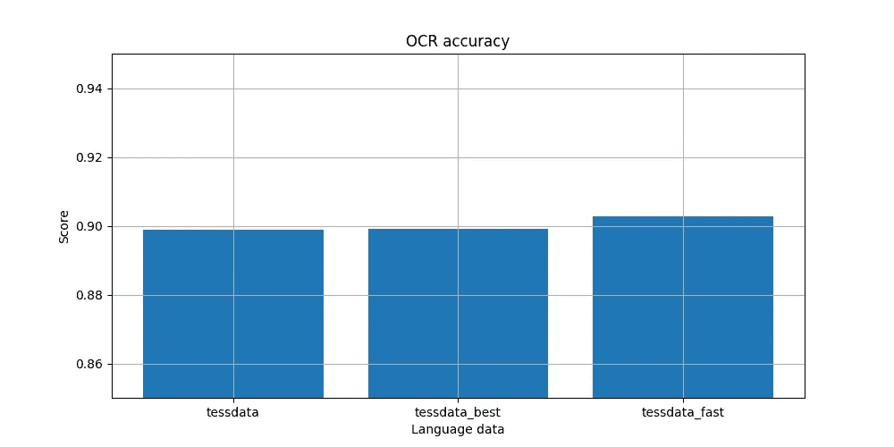
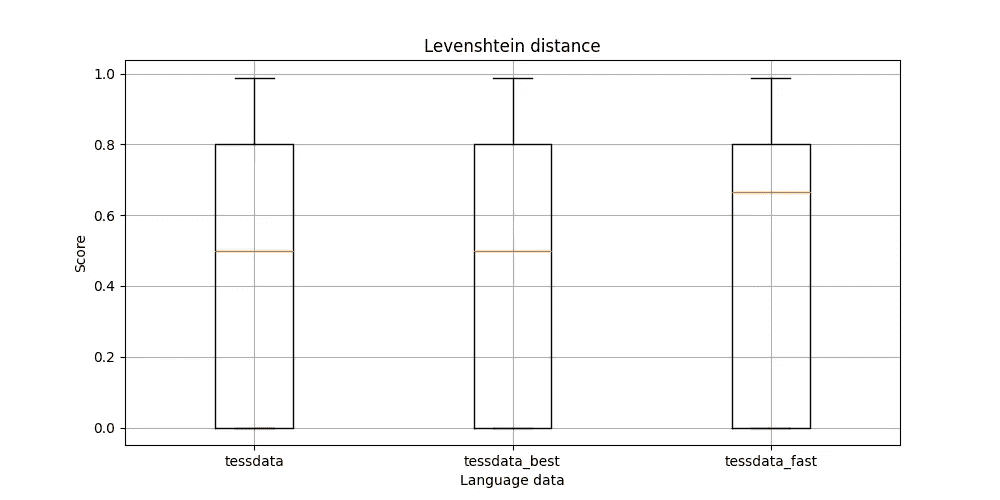
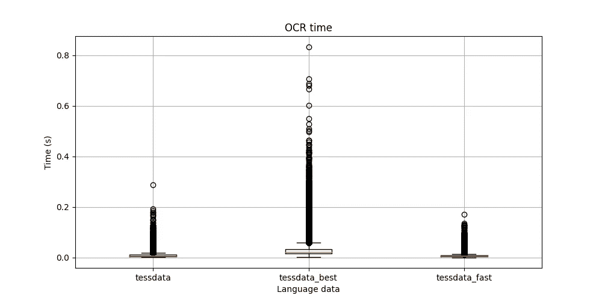

# Google 的 Tesseract OCR:它在文档上有多好？

> 原文：<https://towardsdatascience.com/googles-tesseract-ocr-how-good-is-it-on-documents-d71d4bf7640?source=collection_archive---------23----------------------->

芬恩·蒙德在 [Unsplash](https://unsplash.com?utm_source=medium&utm_medium=referral) 上的照片

T 谷歌的光学字符识别(OCR)引擎可以说是最受欢迎的开箱即用的 OCR 解决方案。最近，我的任务是为文档开发一个 OCR 工具。我知道它的健壮性，但是出于好奇，我想研究它在文档上的性能。

一如既往，在考虑合成我自己的一个之前，出发点是寻找一个可靠的基础事实。幸运的是，我找到了一个:[来自莫斯科物理技术学院的机器智能团队的 DDI-100 数据集](https://github.com/machine-intelligence-laboratory/DDI-100)。它有 30GB 左右的数据，有字符级的地面真实数据，很甜！然而，请记住，有些书是俄文的。在这项研究中，只使用了第 33 和 34 本书。这些书加起来有 300 多页，加上增刊，精确到 5145 页。

写这篇文章的时候是周五晚上，所以我会尽可能地保持讨论的简洁。生成结果的代码可以在我的 repo [这里](https://github.com/arvindrajan92/tessdata)找到。

# 实验设计

**语言数据。** Tesseract 4.0.0 自带三个语言模型，分别是: *tessdata* 、 *tessdata_best* 和 *tessdata_fast。*所有三种模型都将用于本研究。

**预处理**。来自数据集中的每个文本都经过预处理步骤，该步骤依次执行以下操作:
1 .文本周围有 5 个像素的填充。
2。调整到 30 像素的目标高度。
3。执行 Otsu 二进制化。
4。如果背景是暗的，则反转图像(按位)。Tesseract 为深色前景和浅色背景的文本提供了最佳效果。

**绩效指标**。所有上述模型将根据以下标准进行评估:
1。直接匹配(小写)。
2。莱文斯坦距离。
3。处理时间。

**硬件**。我的笔记本电脑运行的是英特尔酷睿 i7–7500 u CPU，主频为 2.70GHz，内存为 16 GB。我在两个内核上运行 Linux (WSL)上的代码(以防万一，以避免任何节流)。

**其他信息**。这些是关于 tesseract 和 leptonica 版本的附加信息:tessera CT 4 . 0 . 0-beta 1 和 leptonica-1.75.3。

# 结果和讨论

基于直接匹配的精确度

如果识别每个文本对您的用例至关重要，您可能会对上面的结果感兴趣。令我惊讶的是，我分不清他们。实际上， *tessdata_fast* 显得更准确。

这与宇宙魔方的文档[中给出的关于他们模型的描述不一致。这让我想到，或许， *tessdata_best* 在 Levenshtein 距离方面可能表现更好。](https://github.com/tesseract-ocr/tessdoc/blob/master/Data-Files.md#data-files-for-version-400-november-29-2016)

删除得分为 1.0 的文本后的 Levenshtein 距离

上面的结果是 Levenshtein 距离的箱线图，没有所有得分为 1.0 的文本和异常值。这样做是为了验证我的假设 *tessdata_best* 在基于可编辑距离进行评估时表现更好；然而，事实也并非如此。

每个文本的处理时间

上图显示 *tessdata_best* 比 Linux 上的 Tess data*Tess data*慢 4 倍。 *tessdata_fast* ，顾名思义，比 *tessdata 和 tessdata_best 都要快。*

# 结论

Google 广泛使用的 OCR 引擎在开源社区中非常受欢迎。这里，我做了一个快速实验来评估它在文档上的性能。他们的三种语言模型都进行了比较。

在识别准确性方面，tessdata 和 tessdata_best 似乎表现出不相上下的性能。 *tessdata_fast，*另一方面*，*略好于前两款。而且不出所料，这款也是最快的。

考虑到所有三种宇宙魔方模型的性能，下一个自然的问题是:“优越的”模型值得使用吗？基于以上结果，是一个 ***不*** 来自我*。然而，我必须强调，这个决定只适用于我的用例。对于其他语言和/或其他图像类型，结果可能会有很大不同。*