# 有 App 吗？有数据吗？下面是如何在 Node / Express 应用程序中将数据存储到 MongoDB 中

> 原文：<https://towardsdatascience.com/got-app-got-data-heres-how-to-store-data-to-mongodb-in-a-node-express-app-d4a46388cc55?source=collection_archive---------27----------------------->


由[凯利·西克玛](https://unsplash.com/@kellysikkema?utm_source=medium&utm_medium=referral)在 [Unsplash](https://unsplash.com?utm_source=medium&utm_medium=referral) 上拍摄的照片

每个应用程序都有数据。让我向您展示如何从一个用 Node.js 和 Express.js 编写的应用程序中将数据存储在 MongoDB 数据库中。

# 什么是污垢

CRUD 是创建、读取、更新和删除的缩写。CRUD 是用于以下目的的操作:

*   在数据库中创建数据
*   读取数据库中的数据
*   更新数据库中的数据
*   删除数据库中的数据

# 我们将创造什么

我们将创建一个简单的应用程序，您可以在 MongoDB 数据库中存储用户的名字和姓氏。它看起来是这样的:

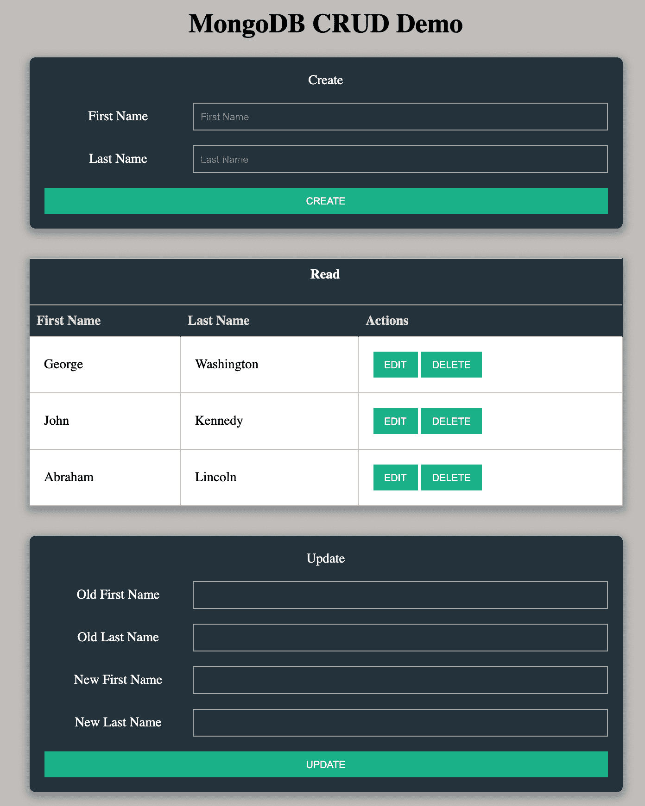

作者图片

# 先决条件

在本文中，我假设您已经在计算机上安装并运行了以下项目:

*   结节
*   npm

如果您还没有安装它们，那么您需要在继续本教程之前安装它们。

# 入门指南

我们需要为我们将要创建的项目创建一个文件夹。创建一个名为`node-crud-demo`的新文件夹。转到这个新文件夹，运行这个命令来启动我们的项目:

```
npm init
```

您只需按 enter 键并接受提示的所有默认值。

该命令创建一个`package.json`文件。这个文件将包含我们将在应用程序中使用的所有包。

# 创建服务器文件

我们的应用程序将有一个服务器。在您的目录中为服务器创建一个新文件。使用以下命令创建文件:

```
touch server.js
```

在编辑器中打开该文件，并添加以下行:

```
console.log('Hello World')
```

我们将使用 Node.js 运行我们的服务器。您可以通过在终端中运行以下命令来测试它是否正常工作:

```
node server.js
```

现在在你的终端中运行`node server.js`，你应该会看到这个:

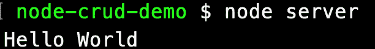

作者图片

接下来，我们需要为我们的服务器安装软件。

# 安装 Express 和其他依赖项

我们将使用 Express.js 作为我们的服务器。根据他们的网站:

> *Express 是一个最小且灵活的 Node.js web 应用程序框架，为 web 和移动应用程序提供了一组强大的功能。*

您可以通过在终端中运行以下命令来安装 express:

```
npm install express
```

您可以通过打开`package.json`文件来验证它是否已安装。您将看到它安装在依赖项中，如下所示:

```
"dependencies": { 
  "express": "^4.17.1" 
}
```

当我们第一次运行我们的服务器时，我们使用 Node 来启动服务器。如果您对服务器文件进行了更改，您将需要停止 node 的运行，并在中再次启动它，以使它反映您的更改。

有一个名为`nodemon`的包提供了与 node 相同的功能。最大的不同是，它会识别你什么时候修改了代码，并自动为你重启服务器。这将使生活更容易，所以让我们用这个命令安装它:

```
npm install nodemon
```

为了使我们的生活更容易，我们可以创建一个脚本来为我们启动服务器。打开`package.json`文件。

目前，该文件的脚本部分有一个条目:

```
"scripts": { 
  "test": "echo \"Error: no test specified\" && exit 1" 
},
```

将以下内容添加到脚本部分，如下所示:

```
"scripts": { 
  "test": "echo \"Error: no test specified\" && exit 1", 
  "start": "nodemon server" 
},
```

有了这个脚本，我们现在可以使用以下命令启动我们的服务器:

```
npm start
```

要安装的另一个包叫做 **ejs** 。EJS 是嵌入式 JavaScript 模板。我们将使用它向浏览器显示内容，并将数据从数据库传递到浏览器。您可以使用以下命令安装它:

```
npm install ejs
```

我们将在下一节配置 ejs。

# 配置我们的 Express 服务器

打开`server.js`文件。您可以删除 console.log 行。要使用 express，我们需要导入它并使用它来启动我们的应用程序。将这些行添加到文件中:

```
const express = require('express'); 
const app = express();
```

接下来，我们需要启动我们的服务器，并告诉它监听哪个端口。对于这个演示，我将在端口 3000 上运行应用程序。如果需要，您可以使用不同的端口。

在导入 express 后，添加以下行以指定我们将使用的端口:

```
const port = 3000;
```

在文件底部添加以下几行来启动我们的服务器:

```
app.listen(port, () => { 
  console.log(`Server listening on port ${port}`); 
});
```

我们可以通过在终端使用脚本`npm start`启动服务器来测试它。然后打开浏览器，导航到`localhost:3000`。您应该会看到以下消息:

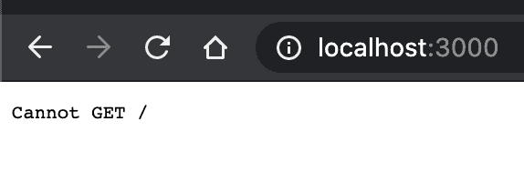

作者图片

没关系。这表明浏览器正在与我们的服务器对话。接下来，我们需要将一些有价值的东西发送回浏览器。

# 向浏览器发送文件

当用户导航到`localhost:3000`时，我们希望向浏览器显示一个文件。我们将使用 ejs 来显示文件。我们需要配置我们的应用程序，让它知道我们正在使用 **ejs** 。创建应用程序后，添加以下代码行:

```
app.set('view engine', 'ejs');
```

默认情况下，ejs 在名为 **views** 的目录中查找文件。使用以下命令创建此文件夹:

```
mkdir views
```

在该文件夹中，您需要创建一个文件，我们将显示给浏览器。通常这个文件叫做 **index.ejs** 。由于我们使用的是 **ejs** ，它希望所有文件的扩展名都是`.ejs`。用这个命令在视图目录中创建一个`index.ejs`文件:

```
touch views/index.ejs
```

打开`index.ejs`文件并添加以下代码:

```
<!DOCTYPE html>
<html lang="en">
    <head>
        <meta charset="UTF-8" />
        <meta name="viewport" content="width=device-width, initial-scale=1.0" />
        <title>Mongo CRUD Demo</title>
    </head>
    <body>
        <h1>MongoDB CRUD Demo</h1>
    </body>
</html>
```

接下来，我们需要更新我们的服务器来显示这个文件。打开`server.js`文件。在`app.listen`代码上方插入以下代码，以向浏览器显示 index.ejs 文件:

```
app.get('/', (req, res) => { 
  res.render('index.ejs'); 
});
```

在这段代码中，我们告诉服务器监听来自由`'/'`代表的应用程序主页的调用。当它收到请求时，它会返回`index.ejs`文件。

打开您的浏览器，导航到`localhost:3000`，您将在浏览器中看到该文件的输出:

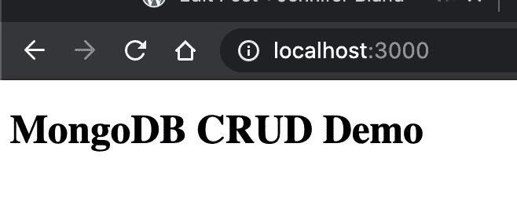

作者图片

太棒了。我们让服务器响应来自浏览器的请求。

# HTTP 动词

您可能想知道服务器是如何知道将`index.ejs`文件发送给浏览器的。它知道是因为我们告诉服务器用`app.get`代码响应来自浏览器的`GET`请求。

**GET** 是 HTTP 动词之一。动词告诉浏览器做什么。对于 CRUD 应用程序， **GET** 动词是如何完成 CRUD 的 **READ** 部分。以下是其他 HTTP 动词及其对应的内容:

*   创建—发布
*   阅读—获取
*   更新—上传
*   删除—删除

让我们仔细检查并实现 CRUD 的**创建**部分。

# 创造

如果浏览器向服务器发送一个 **POST** 请求，它们只能执行一个**创建**操作。这个 **POST** 请求可以通过一个`form`元素触发。

打开`index.ejs`文件。我们将在文件中添加一个表单。该表单将允许用户输入名和姓。将以下内容添加到文件中:

```
<div class="container form">
  <div>Create</div>
  <form action="/users" method="POST">
    <div class="entry">
      <label for="fname">First Name</label>
      <input type="text" placeholder="First Name" name="fname" />
    </div>
    <div class="entry">
      <label for="lname">Last Name</label>
      <input type="text" placeholder="Last Name" name="lname" />
    </div>
    <button class="button button-block" type="submit">
      Create
    </button>
  </form>
</div>
```

在上面的代码中，您会看到它将使用路由 **/users** 向服务器发送一个 **POST** 请求。

为了响应这个 **POST** 请求，我们需要创建一个路由。打开`server.js`文件。在当前路线的下方为`app.get`添加以下代码:

```
app.post('/users', (req, res) => { 
  console.log('POST called'); 
});
```

如果你刷新你的浏览器，你会看到我们的表单，用户可以输入他们的名字和姓氏。点击`create`按钮。如果您的终端一切正常，您应该会看到 console.log 的输出，如下所示:

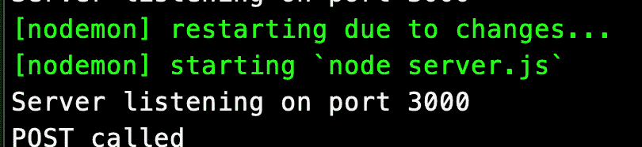

作者图片

如果您看到 console.log，那么这意味着服务器正在响应您的浏览器的 **POST** 请求。

下一步是获取用户输入的名和姓的值。默认情况下，Express.js 不会解析发送给它的数据。为了获得这些值，我们需要安装一个名为 **body-parser** 的包。

Body-parser 是一个中间件。它将解析在 **POST** 请求中发送给服务器的值。

您可以在终端中使用以下命令安装它:

```
npm install body-parser
```

打开`server.js`文件。我们需要告诉我们的应用程序使用主体解析器包。在文件的顶部添加这个新包的导入。

```
cost bodyParser = require('body-parser');
```

在创建应用程序的那一行之后，添加以下配置代码:

```
app.use(bodyParser.urlencoded({ extended: true }));
```

body-parser 中的`urlencoded`方法将从`form`元素中提取数据，并将它们添加到`request`对象的`body`属性中。

更改 console.log 以打印出`req.body`。

您的`server.js`文件应该是这样的。注意:我添加了一些标题来分解文件的每个部分。

```
const express = require('express'); 
const bodyParser = require('body-parser'); 
const port = 3000; 
const app = express(); /* -------------------------------- 
*   APP CONFIG 
* -------------------------------- */ app.use(bodyParser.urlencoded({ extended: true })); /* -------------------------------- 
*    ROUTES 
* -------------------------------- */ 
app.get('/', (req, res) => { 
  res.render('index.ejs'); 
}); app.post('/users', (req, res) => { 
  console.log(req.body); 
}); /* -------------------------------- 
* START SERVER 
* -------------------------------- */ 
app.listen(port, () => { 
  console.log(`Server listening on port ${port}`); 
});
```

如果您返回浏览器并刷新，您可以输入您的名字和姓氏。当您单击 submit 按钮时，它应该在终端中打印出如下所示的值:

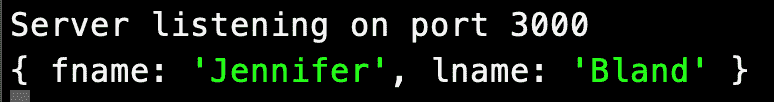

作者图片

# 向我们的应用程序添加样式

我们的形式看起来相当原始。在本教程的开始，我给出了我完成的应用程序的截图。它看起来相当精致。我们需要为我们的应用程序添加样式，以获得这种精致的外观。

所有的 CSS 都在一个名为`styles.css`的文件中。但是我们如何告诉浏览器使用这个文件中的样式呢？我们创建一个名为`public`的文件夹，并将文件放入其中。然后我们告诉我们的应用程序使用这个目录为浏览器提供文件。

使用以下命令创建公共目录:

```
mkdir public
```

接下来，使用以下命令在该文件夹中创建一个名为 styles.css 的文件:

```
touch public/styles.css
```

我们需要做的最后一件事是配置我们的应用程序使用公共文件夹。打开`server.js`文件，在我们的 ejs 配置之后添加这一行:

```
app.use(express.static('public'));
```

这告诉我们的应用程序，如果它找不到文件，那么就在公共目录中查找它。我们将更新我们的`index.ejs`文件，以包含一个到样式表的链接。

打开`index.ejs`文件。在标题后的`head`部分包含以下行:

```
<link rel="stylesheet" href="/styles.css" />
```

我们需要做的最后一件事是在 styles.css 文件中编写我们的 css。本教程不是教你如何写 CSS，所以我将提供 CSS 代码，这将使我们的应用程序看起来很好。打开`styles.css`文件并插入以下代码:

```
body {
  background-color: #c1bdba;
  font-size: 20px;
  margin: 0;
  display: flex;
  flex-direction: column;
  justify-content: center;
  align-items: center;
}
.container {
  max-width: 800px;
  width: 90vw;
  margin-bottom: 40px;
  /* margin: 40px auto; */
  box-shadow: 0 4px 10px 4px rgba(19, 35, 47, 0.3);
  box-sizing: border-box;
}
.form {
  background: rgba(19, 35, 47, 0.9);
  padding: 20px;
  border-radius: 8px;
}
.container div {
  text-align: center;
  color: #fff;
  margin-bottom: 20px;
}
.entry {
  display: flex;
  align-items: center;
  margin-bottom: 40px;
}
.entry label {
  flex: none;
  display: block;
  width: 200px;
  color: #fff;
}
input {
  display: block;
  flex: 1 1 auto;
  height: 100%;
  padding: 10px;
  background: none;
  border: 1px solid #a0b3b0;
  color: #ffffff;
  border-radius: 0;
}
table {
  width: 100%;
  padding: 5px;
  margin: auto;
  border-collapse: collapse;
}
tr {
  border-top: 1px solid #c1c3d1;
  border-bottom: 1px solid #c1c3d1;
}
th {
  text-align: left;
  border-right: 1px solid #343a45;
  padding: 10px;
  background: rgba(19, 35, 47, 0.9);
  color: #d5dde5;
}
td {
  background: #fff;
  padding: 20px;
  vertical-align: middle;
  border-right: 1px solid #c1c3d1;
}
.button {
  border: 0;
  outline: none;
  padding: 10px 15px;
  text-transform: uppercase;
  background: #1ab188;
  color: #ffffff;
}
.button-block {
  display: block;
  width: 100%;
}
.form-group {
  display: flex;
}
```

# MongoDB

对于本教程，我将使用 MongoDB 作为我的数据库。我们需要在我们的应用程序中安装它。在终端中，使用以下命令安装 MongoDB:

```
npm install mongodb
```

接下来，我们需要创建一个 MongoDB 数据库供我们使用。我不打算通过这些步骤向您展示如何在您的笔记本电脑上安装 MongoDB。相反，我们将使用名为 **MongoDB Atlas** 的免费服务。

# MongoDB 地图集

你需要[在 MongoDB Atlas](https://www.mongodb.com/cloud/atlas) 上创建一个账户。

创建帐户后，您需要创建一个组织。一个组织就像一个公司的名字，但是因为我们没有公司，所以我们可以给我们的组织起任何我们想要的名字。我将命名我的 **CRUD 教程**。

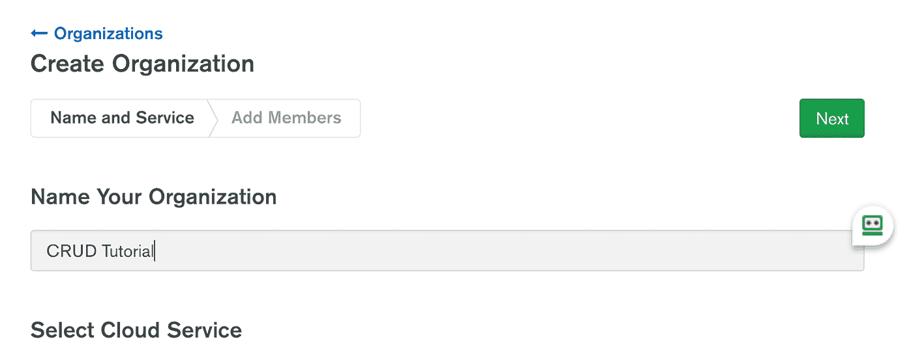

作者图片

接下来，您将被要求选择一个云服务。默认选项是 **MongoDB Atlas** ，这就是我们将要使用的。

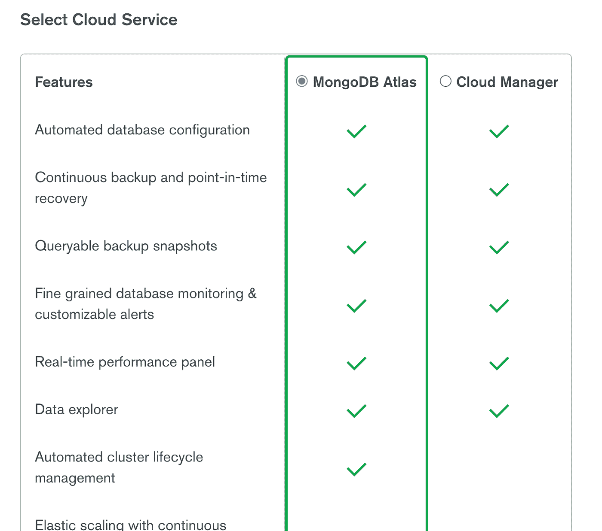

作者图片

接下来，您需要设置权限。MongoDB Atlas 将自动插入您创建帐户时使用的电子邮件地址，并将权限设置为**组织所有者**。我们不需要在此屏幕上进行任何更改，只需单击按钮即可创建您的组织。

创建您的组织后，您将在您的控制面板中看到以下内容:

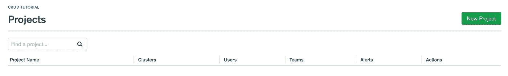

作者图片

下一步是创建数据库。您需要首先创建一个项目，因此单击**新建项目**按钮。您将被要求命名您的项目。我给我的**用户**打电话。

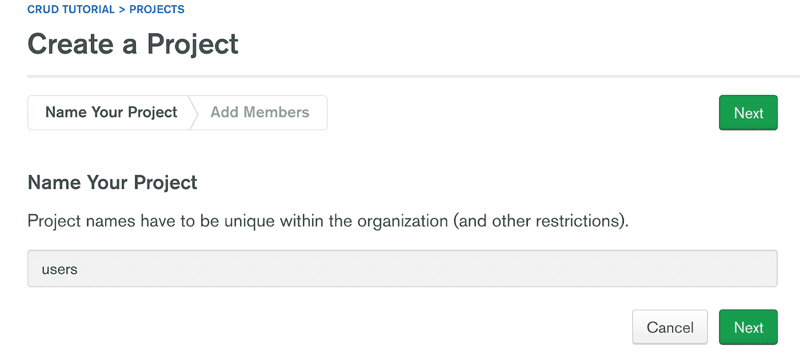

作者图片

就像我们创建组织时一样，它接下来会要求您设置权限。它会自动添加您创建帐户时使用的电子邮件地址。我们不需要做任何更改，因此单击**创建项目**按钮。

您将看到此屏幕，要求您创建一个新的集群:


作者图片

点击**构建集群**按钮。将会询问您想要使用哪个计划。选择自由群集选项。

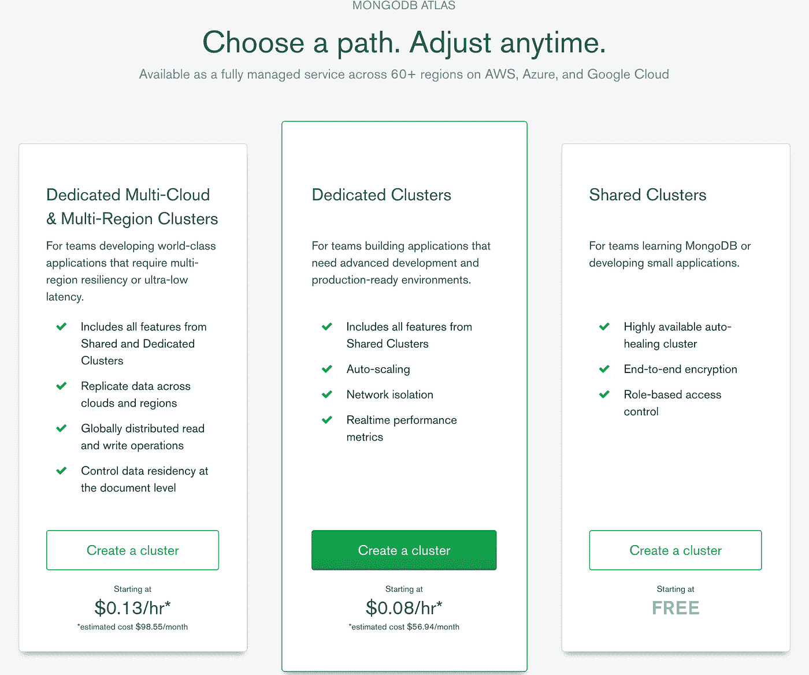

作者图片

然后，您将被要求选择一个云提供商和地区。它将默认为离您最近的一个。点击**创建集群**按钮。MongoDB Atlas 将创建您的数据库。这可能需要几分钟才能完成。

# 连接到数据库

一旦 MongoDB Atlas 创建了您的集群，您将需要获得它们提供的信息来连接到数据库。我们将使用这个连接字符串连接到数据库，并将用户的名字和姓氏保存在数据库中。

点击**连接**按钮。

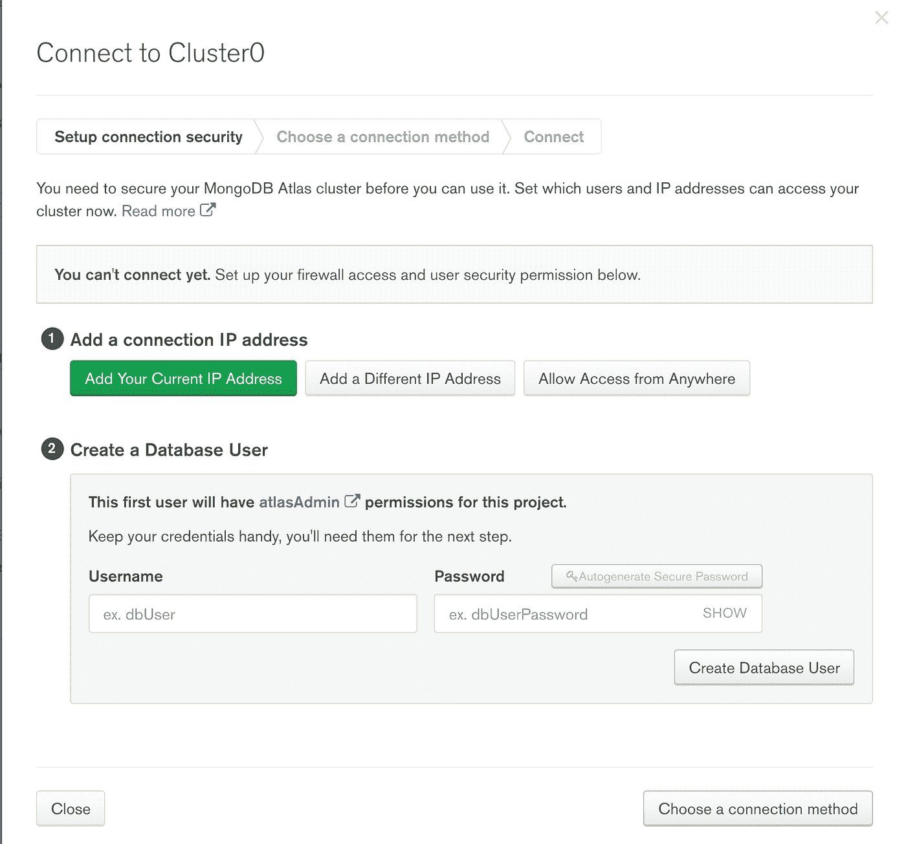

作者图片

MongoDB Atlas 将要求您在连接到数据库之前将您的 IP 地址列入白名单。点击**添加您当前的 IP 地址**按钮。

接下来，您需要创建一个用户来管理您的数据库。创建用户名和密码。请务必记住这一点，因为我们将需要它来连接到数据库。点击**创建数据库用户**按钮。最后，点击**选择一种连接方式**按钮。

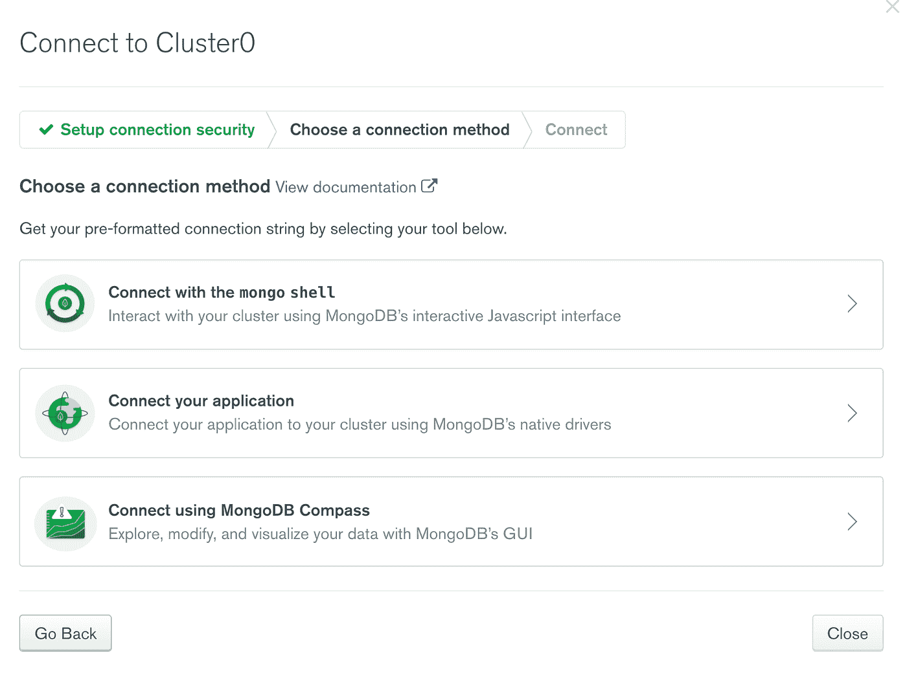

作者图片

从列表中点击**连接您的应用**。您将看到连接字符串。点击**复制**按钮复制连接字符串。

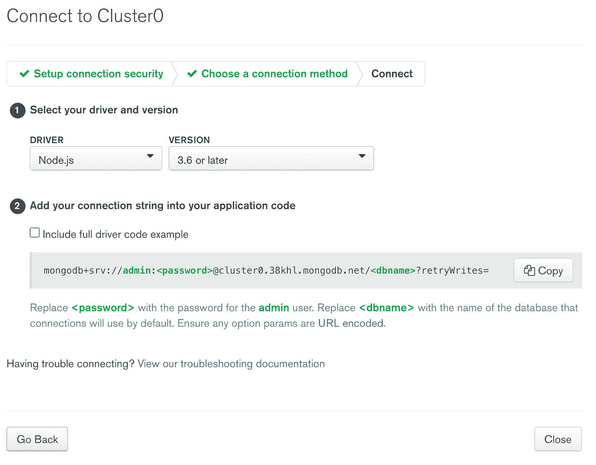

作者图片

打开您的`server.js`文件。在文件的顶部，您需要使用以下代码导入 MongoDB:

```
const MongoClient = require('mongodb').MongoClient;
```

在那一行下面，为 dbUrl 添加一个新的 const，它包含到 MongoDB Atlas 数据库的连接。在从 Atlas 连接字符串中复制的代码中，您需要更改两件事情。替换为您的密码，并更改为您的数据库的名称。您的连接字符串应该是这样的:

```
const dbUrl = 'mongodb+srv://admin:@cluster0.38khl.mongodb.net/?retryWrites=true&w=majority';
```

# 创造

现在我们已经在 MongoDB Atlas 上创建了我们的帐户，并在我们的应用程序中安装了 mongo，我们需要将数据写入数据库。拆下`app.post`中的`console.log`,换成:

```
app.post('/users', (req, res) => {
  MongoClient.connect(dbUrl, { useUnifiedTopology: true }, (err, client) => {
    if (err) return console.error(err);
    const db = client.db('node-demo');
    const collection = db.collection('users');
    collection
      .insertOne(req.body)
      .then(() => {
        res.redirect('/');
      })
      .catch(() => {
        res.redirect('/');
      });
  });
});
```

让我解释一下这段代码在做什么。它使用我们的连接字符串连接到 MongoDB Atlas。在 Mongo 的最新版本中，他们要求您为 useUnifiedTopology 传递一个选项，以便这是下一个。

下一行检查在我们到 MongoDB Atlas 的连接中是否出现了错误。如果有错误，那么它返回错误。

然后我们连接到我们的数据库，在本教程中称为 **node-demo** 。我们还没有创建这个数据库，所以这段代码第一次运行时会自动创建数据库。

下一行是获取数据库中集合的句柄。在本教程中，我将我的集合命名为 **users** 。就像数据库一样，这段代码第一次运行时会自动创建集合。

下一行将用户在表单中输入的数据插入到集合中。插入数据后，它会将用户返回到应用程序的主页。

继续尝试，输入你的名字和姓氏，然后点击提交按钮。

进入你的 MongoDB Atlas 账户，点击**收藏**按钮。它会显示您的收藏内容。这里你可以看到我的数据库中的第一个条目:

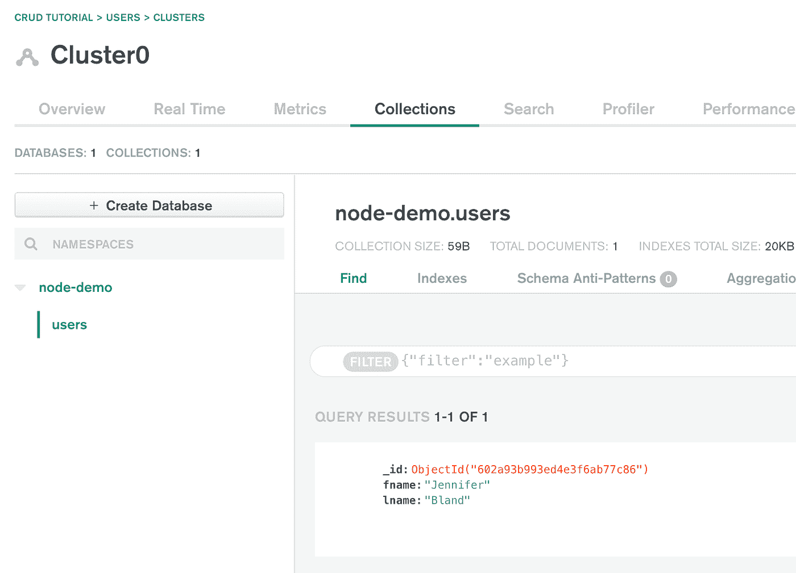

作者图片

# 阅读

现在我们在数据库中有了一个条目，我们想读取所有的用户并显示给用户。CRUD 的这一部分是读操作。读取部分由两部分组成:

1.  从数据库中获取所有用户
2.  显示用户

我们使用 ejs 向用户的浏览器显示一个文件。EJS 允许我们传递来自服务器的数据。我们将使用该功能来显示数据库中的用户。

打开`server.js`文件。当前对`'/'`路径的 **GET** 调用呈现了`index.ejs`文件。让我们修改它，调用数据库并获取用户列表。将路线更新为:

```
app.get('/', (req, res) => {
  MongoClient.connect(dbUrl, { useUnifiedTopology: true }, (err, client) => {
    if (err) return console.error(err);
    const db = client.db('node-demo');
    const collection = db.collection('users');
    collection
      .find()
      .toArray()
      .then((results) => {
        res.render('index.ejs', { users: results });
      })
      .catch((error) => {
        res.redirect('/');
      });
  });
});
```

我来解释一下这段代码。我们连接到 MongoDB 并获得数据库和集合的句柄。`find()`命令将返回数据库中的所有条目。我们将列表转换为数组，然后呈现 index.ejs 文件并向其传递一个对象。该对象将包含数据库中所有用户的数组。

现在我们有了用户列表，我们需要在浏览器中向用户显示它。打开`index.ejs`文件。在文件末尾添加以下几行:

```
<div class="container">
    <table>
        <thead>
        <tr>
            <th colspan="3"><div>Read</div></th>
        </tr>
            <tr>
                <th>First Name</th>
                <th>Last Name</th>
                <th>Actions</th>
            </tr>
        </thead>
        <tbody>
            <% for(var i = 0; i < users.length; i++) { %>
            <tr>
                <td><%= users[i].fname %></td>
                <td><%= users[i].lname %></td>
                <td>
                    <button
                        class="button editButton"
                        data-fname="<%=  users[i].fname %>"
                        data-lname="<%= users[i].lname %>"
                    >
                        Edit
                    </button>
                    <button
                        class="button deleteButton"
                        data-fname="<%=  users[i].fname %>"
                        data-lname="<%= users[i].lname %>"
                    >
                        Delete
                    </button>
                </td>
            </tr>
            <% } %>
        </tbody>
    </table>
</div>
```

在这段代码中，我们创建了一个显示用户名字和姓氏的表。您会注意到在 html 代码中有一个 for 循环。这将遍历用户数组并显示数据库中的每个条目。

返回浏览器并刷新。现在，您将看到数据库中所有用户的列表，如下所示:

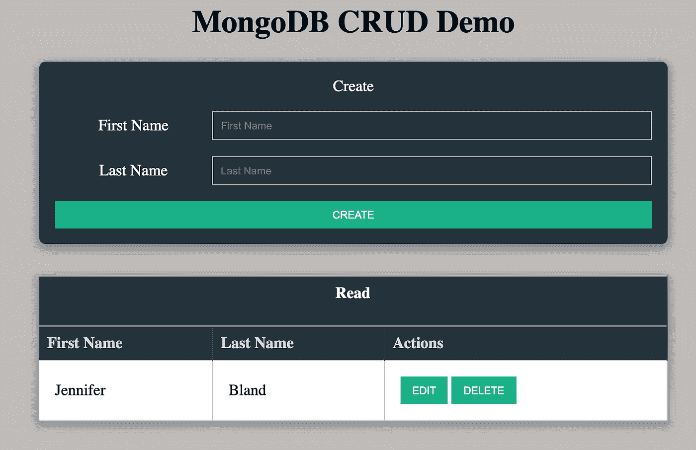

作者图片

# 删除

我们将实现的 CRUD 的下一部分是**删除**。每个用户旁边都有一个删除按钮。如果用户单击该按钮，它应该从数据库中删除该条目，然后从数据库中读取所有条目，并将更新后的列表发送给浏览器。

为了捕捉到有人点击了按钮，我们将使用 JavaScript。我们必须将所有的 JavaScript 代码放在一个文件中，就像我们处理 CSS 样式一样。用这个命令在**公共**文件夹中创建一个文件`main.js`:

```
touch public/main.js
```

首先，让我们告诉我们的`index.ejs`文件关于我们的新 JavaScript 文件。打开`index.ejs`文件，并将其添加到文件底部，就在结束 body 标签的上方:

```
<script src="/main.js"></script>
```

回到`main.js`文件。我们需要添加一个事件侦听器来跟踪用户何时单击删除按钮。在显示用户列表的 html 代码中，每个用户都有一个删除按钮。那个按钮有一个`deleteButton`类。我们可以用它来添加一个事件监听器。首先，通过将这行代码添加到文件中来获得所有删除按钮的句柄:

```
const deleteBtn = document.querySelectorAll('.deleteButton');
```

接下来，通过执行以下操作来添加事件侦听器:

```
for (const button of deleteBtn) { 
  button.addEventListener('click', (e) => {   
    console.log(e.target.dataset); 
  }); 
}
```

当用户点击任何按钮时，变量`e`包含被点击按钮的句柄。在 html 代码中，每个按钮都有两个数据集条目。一个用于名，一个用于姓。

如果单击删除按钮，该按钮的数据集值将显示在控制台中。我们将使用这些数据集值在数据库中找到要删除的正确条目。

要删除一个条目，我们必须向服务器上的`'/users'`路由发送一个**删除**请求。我们将使用 Fetch API 进行调用。

在 console.log 之后添加以下代码:

```
for (const button of deleteBtn) {
  button.addEventListener('click', (e) => {
    console.log(e.target.dataset);
    fetch(`/users`, {
      method: 'delete',
      headers: { 'Content-Type': 'application/json' },
      body: JSON.stringify({
        fname: e.target.dataset.fname,
        lname: e.target.dataset.lname,
      }),
    })
      .then((res) => {
        if (res.ok) return res.json();
      })
      .then(() => {
        window.location.reload();
      });
  });
}
```

让我们回顾一下这段代码。我们使用 Fetch API 调用使用 **DELETE** 方法的**'/users’**路由。

我们将把用户的名字和姓氏作为一个 JSON 对象发送过来。我们必须告诉服务器内容是 JSON 格式的，我们通过将它添加到头中来做到这一点。然后，我们将主体中的数据作为 JSON 对象发送出去。

唯一的问题是 Express.js 本身不知道如何解析 JSON 数据。我们必须使用中间件来处理 JSON 对象。我们已经安装的主体解析器中间件将处理它。

打开`server.js`文件。在应用程序配置部分，将这一行添加到当前主体解析器配置的下面:

```
app.use(bodyParser.json());
```

接下来，我们需要创建一个路由来处理删除请求。在最后一个路由下面添加以下代码来处理删除请求:

```
app.delete('/users', (req, res) => {
    MongoClient.connect(dbUrl, { useUnifiedTopology: true }, (err, client) => {
        if (err) return console.error(err);
        const db = client.db('node-demo');
        const collection = db.collection('users');
        collection
            .deleteOne(req.body)
            .then(() => {
                res.json(`Deleted user`);
            })
            .catch(() => {
                res.redirect('/');
            });
    });
});
```

让我们回顾一下这段代码。它像我们之前所做的那样连接到数据库。它调用 mongo 的`deleteOne`方法，并传递它想要删除的条目的细节。该条目包含我们发送的 e.target.dataset 中的值。

如果成功地从数据库中删除了条目，它将返回一个 JSON 字符串，表示用户已被删除。

在我们的`main.js`文件中，我们有一个`.then()`方法，当 fetch 调用返回时会调用这个方法。它验证调用是否成功，如果成功，则刷新浏览器。

浏览器的刷新将调用我们的 GET 方法，该方法将返回数据库中的所有条目。刚刚删除的用户将不再显示，因为它不再在数据库中。

试试看。删除用户，并验证该用户是否已从用户列表中删除。

# 更新

我们需要实现的 CRUD 的最后一部分是**更新**。在数据库中所有用户的列表旁边，我们有一个编辑按钮。就像 delete 一样，我们可以添加一个事件侦听器，当用户单击按钮时，它就会启动。

打开`main.js`文件。将这一行添加到文件的顶部，以获得所有具有类`editButton`的编辑按钮的句柄:

```
const editBtn = document.querySelectorAll('.editButton');
```

接下来，我们需要添加一个事件监听器。将此代码添加到文件的底部:

```
for (const button of editBtn) { 
  button.addEventListener('click', (e) => { 
    console.log(e.target.dataset); 
  }); 
}
```

让我们考虑一下如何处理条目的编辑。我们需要显示用户的名和姓的值。然后，用户可以对条目进行任何他们想要的更改。当他们完成后，他们应该能够点击一个更新按钮，该值在数据库中被更新。

显示用户的名字和姓氏与我们用来在数据库中创建新条目的表单完全一样。除此之外，在这种情况下，我们将自动填写用户的名字和姓氏。因此，让我们创建这个表单来编辑用户。

打开`index.ejs`文件。在显示用户列表的表格下方添加以下代码:

```
<div class="container form">
    <div>Update</div>
        <div class="entry">
            <label for="oldFname">Old First Name</label>
            <input type="text" name="oldFname" id="oldFname" readonly="true" />
        </div>
        <div class="entry">
            <label for="oldLname">Old Last Name</label>
            <input type="text" name="oldLname" id="oldLname" readonly="true" />
        </div>
        <div class="entry">
            <label for="newFname">New First Name</label>
            <input type="text" name="newFname" id="newFname" />
        </div>
        <div class="entry">
            <label for="newLname">New Last Name</label>
            <input type="text" name="newLname" id="newLname" />
        </div>
        <button class="button button-block updateButton"">
            Update
        </button>
</div>
```

该表单将包含用户不能编辑的名字和姓氏的当前用户值。下面是用户可以编辑的名和姓的值。

你可能会问为什么我既需要当前值又需要新值？答案很简单。我们需要当前值，以便在数据库中找到记录。一旦找到记录，我们就用新值更新它。

我们需要用他们想要编辑的用户的名和姓来填充字段的值。打开`main.js`文件。在事件监听器中添加代码来设置四个字段的值。您的事件侦听器现在应该如下所示:

```
for (const button of editBtn) { 
  button.addEventListener('click', (e) => {   
    document.getElementById('oldFname').value = e.target.dataset.fname; 
    document.getElementById('oldLname').value = e.target.dataset.lname; 
    document.getElementById('newFname').value = e.target.dataset.fname; 
    document.getElementById('newLname').value = e.target.dataset.lname; 
  }); 
}
```

当用户单击 update 按钮时，我们有两种选择来实现在数据库中更新用户的功能。我们的第一个选择是像创建新用户一样使用表单。我们的第二个选择是使用 JavaScript 调用服务器来更新用户。在本教程中，我将向你展示如何做第二个选择。

打开`main.js`文件。在文件顶部添加代码行，以获得更新按钮的句柄:

```
const updateBtn = document.querySelector('.updateButton');
```

接下来，我们希望在用户单击按钮时添加一个事件侦听器。让我给你代码，然后我们将通过它。

```
updateBtn.addEventListener('click', (e) => { 
  e.preventDefault(); 
  fetch('/users', { 
    method: 'PUT', 
    headers: { 'Content-Type': 'application/json' }, 
    body: JSON.stringify({ 
      fname: document.querySelector('#newFname').value, 
      lname: document.querySelector('#newLname').value, 
      oldFname: document.querySelector('#oldFname').value, 
      oldLname: document.querySelector('#oldLname').value, 
    }), 
  }) 
  .then((res) => { 
    if (res.ok) return res.json(); 
  }) 
  .then(() => { 
    window.location.reload(); 
  }); 
});
```

就像 delete 一样，我们将使用 fetch API 来调用服务器上的路由。更新条目的 HTTP 动词是 **PUT** 。我们设置我们的方法然后把。我们添加头来告诉服务器我们发送的内容是 JSON 格式的。然后，我们发送包含旧值和新值的正文内容。

我们需要在服务器上创建一个路由来处理更新数据库条目的 PUT 请求。打开`server.js`文件。在最后一条路线下添加以下代码:

```
app.put('/users', (req, res) => {
    MongoClient.connect(dbUrl, { useUnifiedTopology: true }, (err, client) => {
        if (err) return console.error(err);
        const db = client.db('node-demo');
        const collection = db.collection('users');
        collection
            .findOneAndUpdate(
                { fname: req.body.oldFname, lname: req.body.oldLname },
                {
                    $set: {
                        fname: req.body.fname,
                        lname: req.body.lname
                    }
                },
                {
                    upsert: true
                }
            )
            .then(() => {
                res.json('Success');
            })
            .catch(() => {
                res.redirect('/');
            });
    });
});
```

让我们浏览一下这段代码。它与数据库建立连接。然后，它使用 mongo `findOneAndUpdate`方法，通过使用名字和姓氏的先前值，在数据库中找到正确的记录。

找到正确的记录后，它使用 mongo `$set`方法用新值更新条目。如果找不到当前条目，`upsert`选项将在数据库中用新值创建一个条目。

一旦更新了记录，它就返回 JSON 字符串“Success”。在我们的 main.js 文件中，它接收这个 JSON 字符串。如果一切正常，就会刷新浏览器。这个刷新将点击 GET 路由，它将发送数据库中的所有条目，从而显示我们新更新的记录。

# 全部完成！

这是一个非常长的教程，教您如何创建一个简单的 Node 和 Express.js 应用程序来将数据存储在 MongoDB 数据库中。

本教程提供了对 CRUD 应用程序的理解。使用 CRUD，您已经学会了如何:

*   在 MongoDB 数据库中创建数据
*   读取 MongoDB 数据库中的数据
*   更新 MongoDB 数据库中的数据
*   删除 MongoDB 数据库中的数据

您知道如何在 Node 和 ExpressJS 应用程序中添加 CRUD 功能。

# 获取源代码

这个应用程序的完成版本可以在我的 GitHub repo 中找到。你可以在这里找到[。](https://github.com/ratracegrad/node-crud-demo)

*原载于 2021 年 2 月 15 日 https://www.jenniferbland.com*<https://www.jenniferbland.com/got-app-got-data-heres-how-to-store-data-to-mongodb-in-a-node-express-app/>**。**